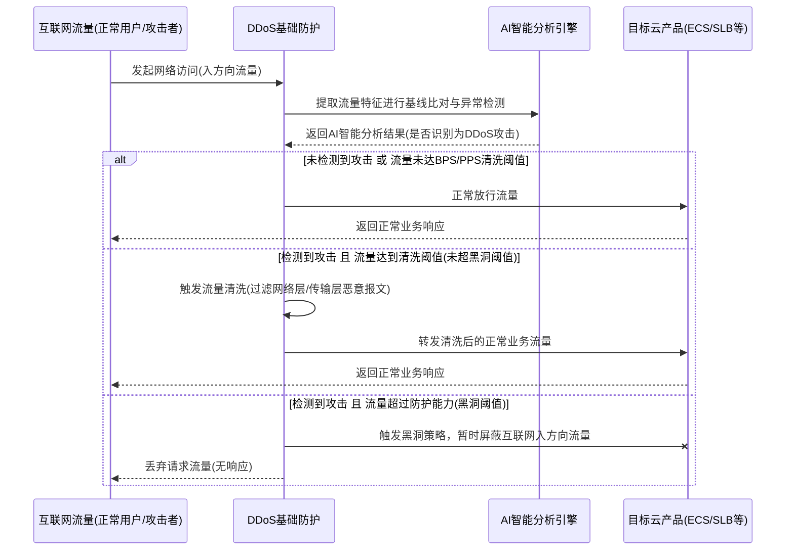

# 业务逻辑时序图

DDoS基础防护的核心业务逻辑主要围绕流量检测、AI智能分析、清洗判定以及黑洞触发机制展开。当互联网流量访问受保护的云产品时，系统会结合用户设置的BPS/PPS清洗阈值与AI智能分析引擎的结果进行综合判定，以决定是正常放行、触发流量清洗还是执行黑洞策略，从而在保障正常业务访问的同时有效抵御网络层和传输层DDoS攻击。

**流程说明：**
1. **流量接入与检测**：所有来自互联网的入方向流量首先经过DDoS基础防护模块，系统默认或手动设置的BPS/PPS清洗阈值作为基础判定标准。
2. **AI智能分析**：为了避免正常业务波动导致的误清洗，系统引入AI智能分析引擎，自学习业务流量基线。只有当AI检测到异常攻击**且**流量达到清洗阈值时，才会触发清洗动作。
3. **流量清洗**：针对UDP反射、SYN/ACK Flood等网络层和传输层攻击进行过滤，清洗后的正常流量继续转发至目标云产品。
4. **黑洞触发**：当攻击流量过大，超过云产品的防护能力（即黑洞阈值）时，为保护平台整体稳定及其他资产安全，系统将触发黑洞策略，暂时屏蔽该云产品的所有互联网入方向流量。