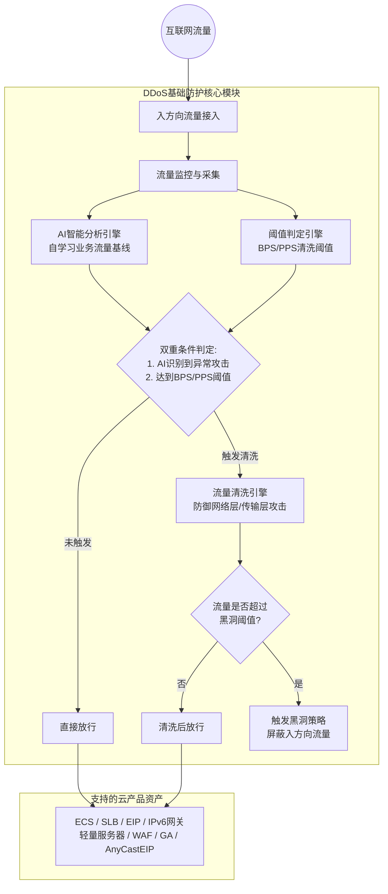

# 完整架构图

DDoS基础防护直接集成在阿里云底层网络中，默认开启且不支持关闭。其核心架构包含流量监控、AI智能分析、阈值判定、流量清洗及黑洞策略等模块。以下为系统完整架构及业务流转图：

**架构流转说明：**
1. **流量接入与监控**：互联网入方向流量到达后，DDoS基础防护系统实时进行流量监控与数据采集。
2. **智能分析与阈值判定**：系统采用双重判定机制。一方面通过AI智能分析自学习业务流量基线并识别异常攻击；另一方面检测流量是否达到设定的BPS/PPS清洗阈值（支持默认或手动设置）。
3. **流量清洗**：仅当AI检测到攻击且流量达到阈值时，才触发清洗引擎，过滤UDP反射、SYN/ACK Flood等网络层和传输层攻击报文，避免固定阈值导致的误清洗。
4. **黑洞策略**：若入方向流量超过云产品的防护能力（黑洞阈值），为避免DDoS攻击对云产品产生更大损害并保护平台整体稳定，将触发黑洞策略，暂时屏蔽该资产的互联网入方向流量。
5. **资产保护**：清洗后的正常流量或直接放行的流量最终到达受保护的云产品（如ECS、SLB、WAF等）。

**已知问题和注意事项：**
* **应用层攻击防护限制**：DDoS基础防护仅支持网络层和传输层攻击防御，**不支持**抵御应用层攻击（如HTTP Flood攻击、CC攻击和DNS Flood）。如需防护应用层攻击，请结合WAF或升级防护产品。
* **防护能力动态调整**：在遭受频繁攻击的情况下，平台会根据客户的历史攻击记录动态调整防护能力，以确保平台整体稳定性。
* **误清洗规避**：正常业务上涨波动若超出固定清洗阈值可能引起误清洗。系统已通过引入AI智能分析结合阈值的双重判定机制来最大程度避免此问题。
* **高级防护升级**：若DDoS基础防护（500 Mbps~5 Gbps）无法满足业务需求，建议升级至DDoS原生防护或DDoS高防等更高级别的防护产品。