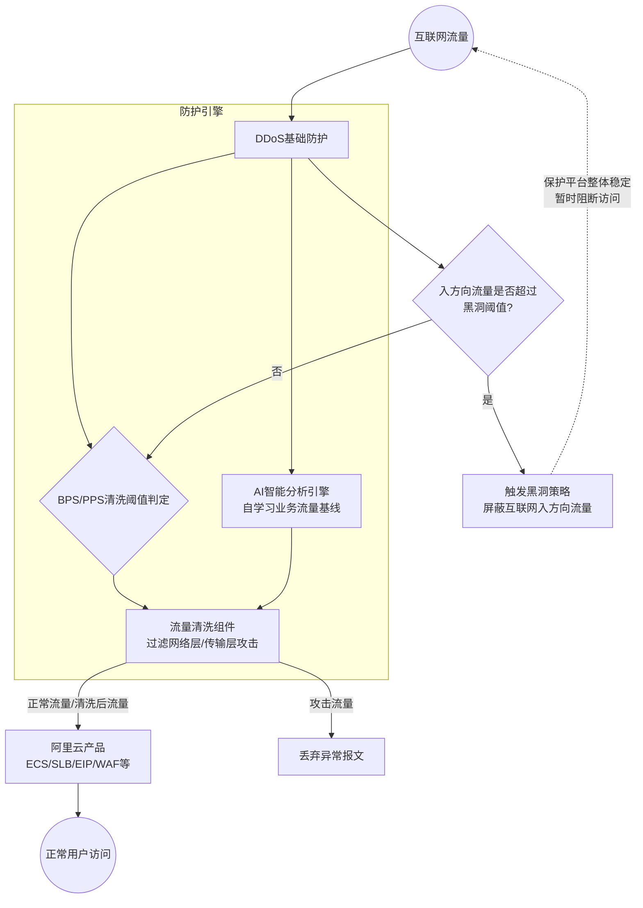

# 服务介绍

**产品定位**
DDoS基础防护是一款为部分阿里云产品免费提供网络层、传输层防御能力的基础安全产品。它直接集成到云产品中，默认开启且不支持关闭。该产品提供 500 Mbps~5 Gbps 的 DDoS 防护能力，主要用于抵御常见的网络层、传输层 DDoS 攻击（如 UDP 反射攻击、SYN/ACK Flood 攻击等），但不支持抵御应用层攻击（如 HTTP Flood 攻击和 CC 攻击）。在遭受频繁攻击的情况下，平台会根据客户的历史攻击记录调整防护能力，以确保平台整体稳定。如果基础防护无法满足需求，用户可选择 DDoS原生防护 或 DDoS高防 等更高级别的防护产品，详情可参考 如何选择DDoS防护产品。

**演进历程**
作为阿里云内置的基础免费安全能力，DDoS基础防护持续依托阿里云大数据能力演进，引入了 AI 智能分析引擎以自学习业务流量基线，不断优化清洗阈值判定机制，降低误清洗率，并完善了黑洞策略以保障平台整体稳定性。（注：源内容未提供具体版本号的新增功能说明）。

**涉及的云产品与组件**
DDoS基础防护能力直接集成于以下阿里云产品中：
*   计算与容器：ECS、轻量服务器
*   网络与负载均衡：SLB、EIP（包含绑定 NAT 网关的 EIP）、IPv6 网关、GA、AnyCastEIP
*   安全：WAF

## 对外介绍架构图

DDoS基础防护直接集成在阿里云各云产品的互联网入方向流量链路上，通过流量清洗和 AI 智能分析保障业务安全，并在极端情况下触发黑洞策略。

## 各核心组件能力详细说明

*   **流量清洗组件**：默认或手动设置清洗阈值，当触发流量清洗条件时，对所有来自互联网的流量进行过滤清洗，防御 UDP 反射攻击、SYN/ACK Flood 攻击等常见的网络层、传输层攻击。
*   **AI 智能分析引擎**：在清洗判定中，除了基于设置的 BPS/PPS 清洗阈值外，采用 AI 智能分析方法。基于阿里云的大数据能力，自学习用户的业务流量基线，并结合算法识别异常攻击。只有当 AI 检测到 DDoS 攻击且请求流量达到清洗阈值时，才会触发流量清洗，有效避免因正常业务上涨波动超出固定清洗阈值而引起的误清洗。
*   **黑洞触发机制**：当入方向流量超过防护能力（即黑洞阈值，具体参见 DDoS基础防护黑洞阈值）时，为避免 DDoS 攻击对云产品产生更大损害，同时避免单个云产品被攻击而影响其他资产正常运行，系统会触发黑洞策略，暂时屏蔽该云产品的互联网入方向流量。详细介绍请参见 阿里云黑洞策略。

## 与阿里云其他产品的关系

**与 ECS、SLB、EIP 等产品的交互方式及影响**
*   **交互方式**：DDoS 基础防护直接集成在 ECS、SLB、EIP（包含绑定 NAT 网关的 EIP）、IPv6 网关、轻量服务器、WAF、GA、AnyCastEIP 等云产品中，默认开启且不支持关闭。各云产品所支持设置的最大清洗阈值取决于各云产品实例的规格，具体介绍请参见 云产品规格与清洗阈值。用户也可以根据需求手动 设置流量清洗阈值。

**支持防护的地域**
DDoS基础防护支持的地域请参见下表。

| **区域** | **地域** |
| --- | --- |
| 亚太 | 泰国（曼谷）、菲律宾（马尼拉）、日本（东京）、印度尼西亚（雅加达）、马来西亚（吉隆坡）、韩国（首尔）、新加坡、中国香港、西南1（成都）、华南3（广州）、华南2（河源）、华南1（深圳）、华北6（乌兰察布）、华北5（呼和浩特）、华北3（张家口）、华北2（北京）、华北1（青岛）、华东6（福州-本地地域）、华东5（南京-本地地域）、华东2（上海）、华东1（杭州）、华东1（网商云） 、郑州（联通云）、华北 2（金融云） |
| 欧洲与美洲 | 英国（伦敦）、德国（法兰福克）、美国（弗吉尼亚）、美国（硅谷） |
| 中东 | 沙特（利雅得）、阿联酋（迪拜） |

**产品异常可能造成的影响**
*   **可能造成的影响**：在遭受频繁攻击、触发流量清洗或进入黑洞状态时，可能会对用户的正常访问造成影响。例如，攻击手段（如 HTTP_Flood、SYN_Flood、ACK_Flood 等）或用户自身业务场景超过平台/产品规格时，可能导致访问受限；若触发黑洞，云产品的互联网入方向流量将被暂时屏蔽，导致外部无法访问该云产品。
*   **不会造成的影响**：在正常情况下，DDoS 基础防护一般不会影响用户的正常访问。此外，DDoS 基础防护不支持抵御应用层攻击（如 HTTP Flood 攻击和 CC 攻击），因此不会干预或影响应用层的正常业务逻辑与流量处理。