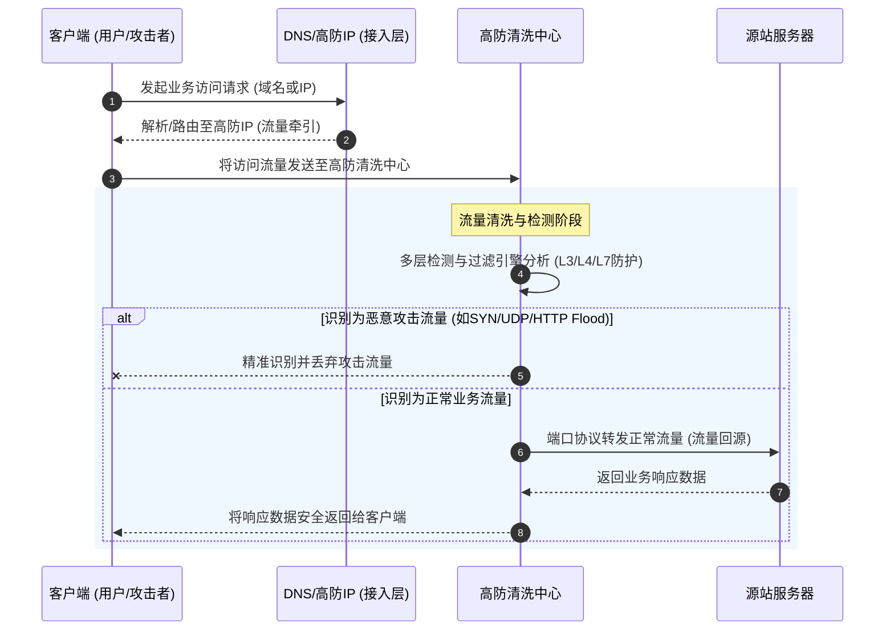

# 业务逻辑时序图

DDoS高防的核心业务逻辑通过代理防护机制实现，主要包含**流量牵引**、**流量清洗**和**流量回源**三个关键阶段。以下时序图展示了访问请求从发起至最终响应的完整流转过程：

**核心流程说明：**

*   **流量牵引**：客户端发起请求时，系统通过修改DNS解析（CNAME记录）或IP直接指向的方式，将来自公网的访问流量全部牵引至高防清洗中心。此过程无需安装软硬件，即可快速隐藏真实源站IP，保护源站安全。
*   **流量清洗**：高防清洗中心接收流量后，利用多层检测与过滤引擎进行分析。结合AI引擎自动学习业务模型、IP信誉库与深度包检测（DPI）技术，精准识别并阻断L3/L4流量型攻击（如SYN Flood、UDP Flood）及L7应用层CC攻击（如HTTP Flood），恶意攻击流量在此被直接丢弃。
*   **流量回源**：经过清洗后的合法正常访问流量，通过端口协议转发的方式安全、稳定地返回给源站服务器。源站处理完毕后，响应数据再次经由高防中心返回给客户端，确保业务在攻击下的稳定性和可用性。
*   **智能流量调度（联动场景）**：在与云上其他产品联动的场景下，平时高防不介入业务流量以兼顾成本；当检测到攻击发生时，系统会自动将流量调度至DDoS高防进行清洗，实现安全与成本的最优平衡。