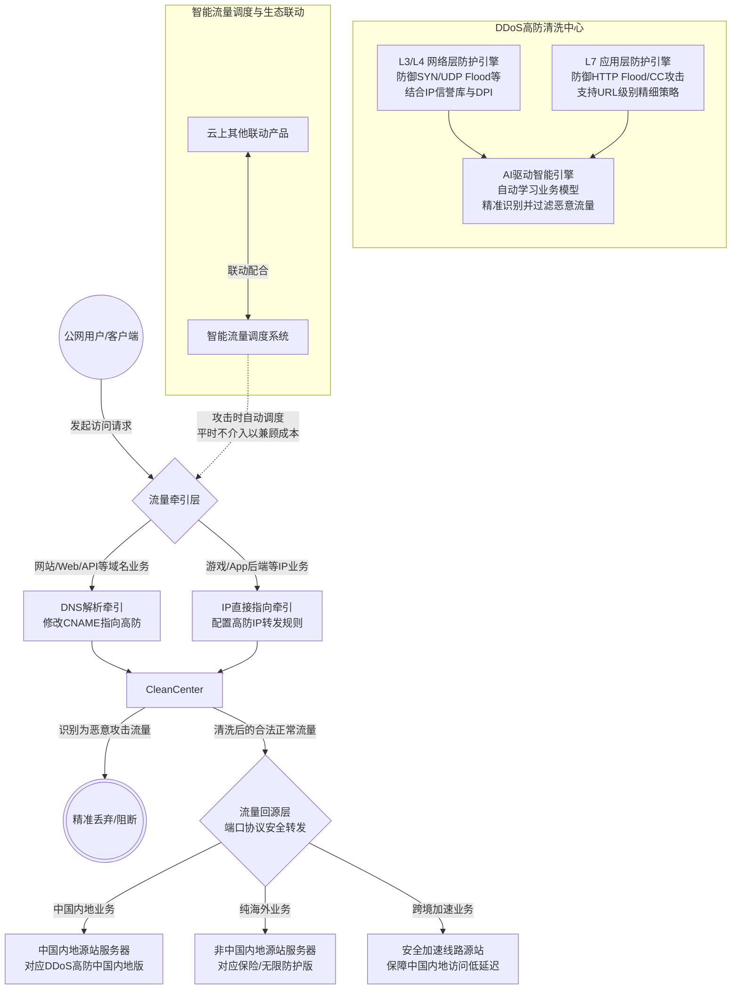

# 完整架构图

DDoS高防系统架构主要分为流量牵引、流量清洗、流量回源以及智能调度四个核心模块。系统通过DNS解析或IP直接指向将公网流量引入全球分布的高防清洗中心，利用多层检测与AI引擎过滤L3/L4网络层及L7应用层攻击流量，最终将合法流量通过端口协议安全回源至部署在中国内地或非中国内地的源站服务器。

**已知问题和注意事项**

* **牵引方式选择与局限性**：DNS解析方式配置简单且生效快，便于攻击时快速切换，但无法防护直接针对源站IP的攻击；IP直接指向方式可直接防护IP并隐藏源站，但切换IP可能会影响部分已有客户端的连接状态。
* **源站真实IP保护**：接入DDoS高防后，必须确保源站真实IP不被泄露（例如避免通过未代理的子域名、邮件头信息等暴露），否则攻击者可绕过高防清洗中心直接打击源站，导致防护失效。
* **跨境访问延迟优化**：当源站部署在非中国内地，且业务需要服务中国内地用户时，单纯使用常规的海外高防实例可能会导致跨境访问延迟较高。此种场景下，强烈建议搭配或选用**安全加速线路2.0**，以保障中国内地用户的低延迟和稳定性体验。
* **弹性后付费触发风险**：弹性防护带宽、弹性业务带宽及弹性QPS均为后付费模式。当遭遇突发超大DDoS攻击或正常业务流量/QPS突增超过保底规格时，会按天或按95峰值产生额外费用。建议日常密切关注流量监控，合理设置保底规格与弹性阈值。