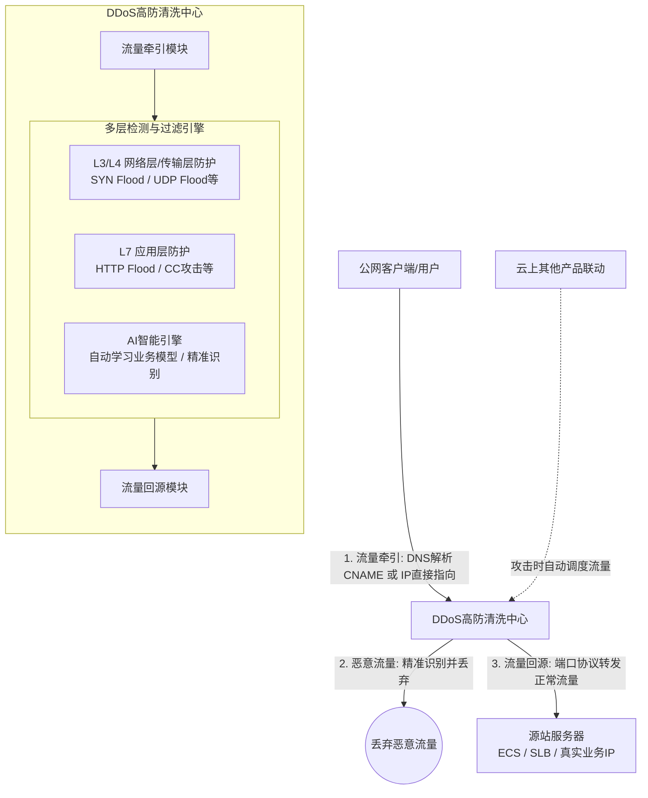

# 服务介绍

**产品定位**
DDoS高防是一项代理防护服务，用于保护业务免受大规模分布式拒绝服务（DDoS）攻击。它通过将业务流量重定向至遍布全球的高防清洗中心，过滤恶意攻击流量，仅将合法的业务流量转发回源站服务器，从而确保业务在攻击下的稳定性和可用性。

**各版本新增功能与特点说明**
DDoS高防根据业务服务器所在地域分为中国内地和非中国内地两大类，各版本功能演进与特点如下：
*   **DDoS高防（中国内地）**：
    *   **专业版**：提供独享IP和多线BGP防护，支持保底与弹性防护，满足通用DDoS防护需求。
    *   **高级版**：在专业版基础上，每月提供2次高级防护能力（每月重置）。
*   **DDoS高防（非中国内地）**：
    *   **保险防护 / 无限防护**：适用于纯海外业务，提供基础与无限制的高级防护次数，满足非中国内地业务的DDoS防护。
    *   **安全加速线路2.0**：新增中国内地访问加速与应用层DDoS防护能力，具备电信、联通、移动线路的大流量DDoS攻击防护能力，解决跨境访问延迟问题。
    *   **安全加速线路2.0（保险版/无限版）**：支持禁用95弹性业务带宽模式和95弹性QPS模式（存量实例，不推荐新购）。
    *   **加速线路 / 安全加速线路1.0**：旧版本，不支持移动线路（存量实例，建议升级至2.0）。

**涉及的产品与组件**
核心能力涉及流量牵引组件（DNS解析、IP指向）、流量清洗组件（多层检测与过滤引擎、AI智能引擎）以及流量回源组件。

## 对外介绍架构图

DDoS高防通过流量牵引、流量清洗和流量回源三个核心步骤保障业务稳定运行。以下为产品架构与数据流向图：

## 各核心组件能力详细说明

*   **流量牵引组件**
    负责将公网访问流量引导至高防IP进行清洗。支持两种引流方式：
    *   **DNS解析**：将业务域名的DNS记录修改为DDoS高防提供的CNAME地址。适用于网站、Web应用、API等通过域名访问的业务，配置简单且生效快。
    *   **IP直接指向**：在高防实例中配置转发规则，将高防IP作为业务入口，客户端直接访问高防IP。适用于游戏、App后端服务等通过IP直接访问的非网站业务，可直接防护IP并隐藏源站。
*   **流量清洗组件**
    高防清洗中心的核心防御引擎，负责精准识别并丢弃恶意攻击流量：
    *   **网络层/传输层防护**：结合IP信誉库与深度包检测（DPI），有效防御SYN Flood、UDP Flood等L3/L4流量型攻击。
    *   **应用层防护**：利用AI引擎自动学习业务模型，精准识别并过滤HTTP Flood等L7应用层CC攻击流量，支持精细至URL级别的防护策略。
*   **流量回源组件**
    负责将清洗后的正常访问流量，通过端口协议转发的方式，安全、稳定地返回给用户的源站服务器，保障业务正常响应。

## 与阿里云其他产品的关系

**与 VPC、ECS、SLB 等产品的交互方式及影响**
*   **ECS / SLB（作为源站服务器）**：DDoS高防通过端口协议转发，将清洗后的正常流量回源至后端的 ECS 或 SLB 实例。**影响**：有效隐藏了 ECS/SLB 的真实公网 IP，防止源站被直接攻击；源站 ECS/SLB 无需安装任何软硬件或调整系统路由，只需在安全组或白名单中放行高防回源 IP 即可。
*   **VPC（专有网络）**：DDoS高防部署在公网清洗中心，与用户 VPC 内的资源通过公网进行回源通信。**影响**：不改变 VPC 内部的网络拓扑和私网互通逻辑，仅在 VPC 的公网出入口提供安全防护。
*   **云解析 DNS**：通过修改域名的 DNS 解析记录（CNAME），将网站类业务流量牵引至高防 IP。**影响**：实现流量的快速切换与调度。
*   **云上其他联动产品**：支持与云上其他产品联动，实现攻击发生时自动将流量调度至 DDoS 高防，平时不介入，兼顾成本与安全。

**产品异常可能造成的影响与不会造成的影响**
*   **可能造成的影响**：若 DDoS 高防服务出现极端异常，可能导致已牵引至高防的公网流量无法正常回源，造成对外业务访问中断。但产品采用全冗余架构，具备完善的自动故障切换和恢复机制，保障 99.95% 的服务可用性，将此类影响降至最低。
*   **不会造成的影响（边界清晰）**：DDoS 高防作为纯网络层的代理防护服务，**不会**影响源站服务器（ECS）内部的操作系统运行、应用逻辑及数据存储安全；**不会**干扰 VPC 内部的私网通信与微服务调用；**不会**导致源站 IP 被泄露（在正确配置隐藏源站的前提下）。