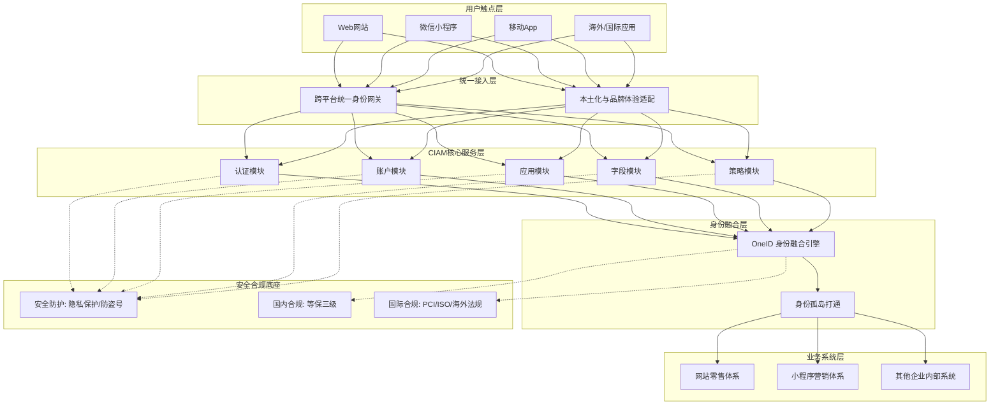

# 完整架构图

基于阿里云 IDaaS [[IDaaS/CIAM/index|CIAM]] 的核心价值与功能描述，系统完整架构涵盖了从多端用户触点接入、核心身份管理服务、OneID 身份融合到企业各业务系统的全链路，并以安全合规为底层支撑。以下为 CIAM 系统的业务与功能架构图：

**架构模块说明**
* **用户触点层**：支持跨终端、跨平台的各类顾客触点，为用户提供无摩擦的统一体验。
* **统一接入层**：提供开放性的身份接入网关，支持本土化使用习惯与品牌面貌的统一适配，解决国内外体验不兼容问题。
* **CIAM 核心服务层**：作为账号管理中枢，提供界面化配置的“统一身份工具箱”，包含认证、账户、应用、字段、策略等核心模块，实现即开即用与高扩展性。
* **身份融合层**：基于 OneID 理念，打破企业内部的“身份孤岛”，实现消费者账号、会员账号、营销体系与零售体系的身份数据融合。
* **安全合规底座**：提供防盗号、隐私保护等丰富灵活的安全能力，并满足国内等保三级以及国际 PCI、ISO 和海外当地法规的合规要求。

**已知问题和注意事项**
* 源内容中未明确列出具体的系统已知技术问题。
* **注意事项**：
  1. 在接入国际客户或出海业务时，需特别注意中国用户使用体验与国际体验的兼容性设计，以及海外当地信息安全合规法律的差异化要求。
  2. 在进行 OneID 身份融合时，需妥善处理历史遗留的“身份孤岛”数据打通问题（如消费者账号与会员账号未打通、小程序营销体系与网站零售体系不通用等），避免整合过程中的数据冲突。
  3. 账号系统是所有用户访问业务的中枢，企业在初期设计时容易低估其复杂程度，建议直接依托 CIAM 的成熟体系，避免因自研导致系统臃肿、割裂及性能瓶颈。