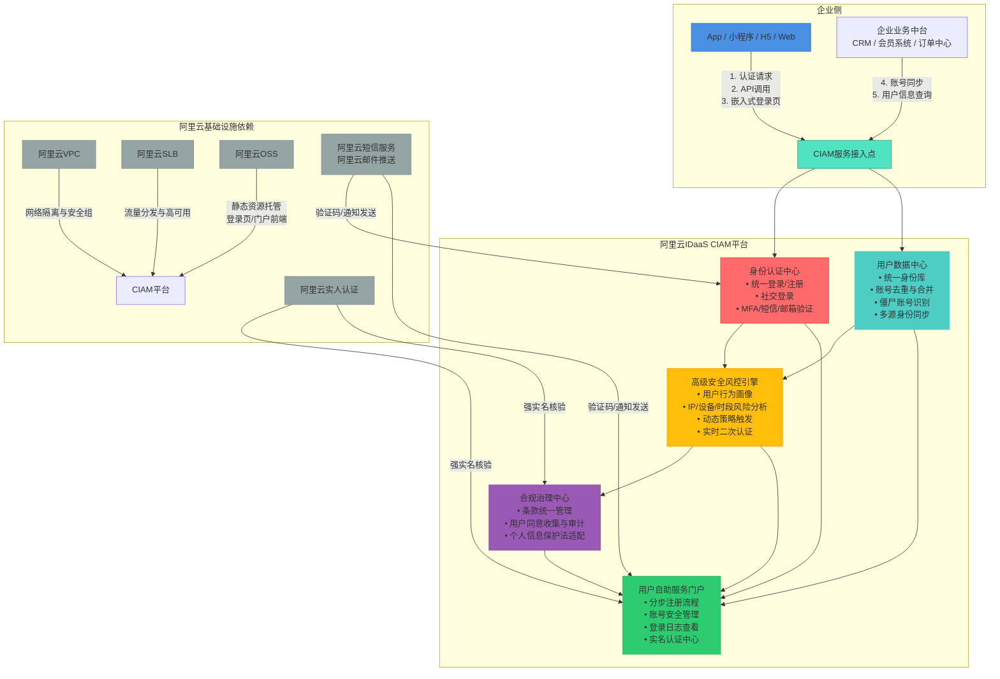
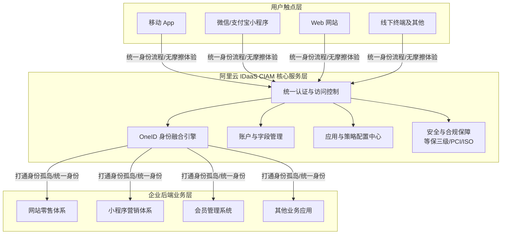

# 服务介绍

阿里云 IDaaS [[IDaaS/CIAM/index|CIAM]]（Customer Identity and Access Management）是面向消费者、会员等外部用户（C端用户）的客户身份与访问管理解决方案。其核心使命是**帮助企业构建统一、安全、流畅、合规的顾客身份体系**，贯穿消费者在企业内的整个旅程。通过 **OneID 理念**统一品牌内的顾客身份，打破“身份孤岛”，支撑跨 App、小程序、H5、Web、线下终端等多触点的一致化品牌体验与无摩擦用户体验。

它并非仅提供基础登录注册功能，而是聚焦于解决身份孤岛整合、用户体验优化、账号安全风控、隐私合规治理等企业级 CIAM 核心挑战，赋能企业提升用户留存、转化与信任。产品提供即开即用的成熟账号体系，帮助企业大幅节省开发成本，并具备应对高并发流量的高扩展性以及满足国内外法规的安全合规保障。能力覆盖产品整体及核心能力组件，包括统一认证服务、账号自助服务系统、私有化部署套件、管理控制台、API 网关、用户行为分析模块等；不涉及 EIAM 或内部员工身份管理相关组件。

公有云 CIAM 持续获得**最新漏洞补丁、最新功能更新与最新安全合规能力**（如对《个人信息保护法》《数据安全法》的原生支持），体现其“始终最新”的演进特性。关键能力演进方向体现在：  
→ 从基础认证集成  
→ 统一身份整合（账号去重、僵尸清理、多源同步）  
→ 用户自助体验深化（分步注册、多因素认证、社交登录）  
→ 高级安全风控（用户行为分析、动态策略）  
→ 合规能力内建（条款统一管理、同意收集）

## 对外介绍架构图

基于 CIAM 的核心价值与业务场景，以下从技术基础设施与业务逻辑流向两个维度展示 CIAM 的架构设计。

### 技术架构与基础设施依赖图
阿里云 IDaaS CIAM 采用云原生、高可用、弹性可扩展的分层架构设计。企业各类前端应用作为**服务调用方**，通过标准协议或 API/SDK 与 CIAM 平台交互；CIAM 平台内部由核心组件协同工作，并与阿里云生态基础设施深度集成。

> 注：源内容中未提供中心端与端侧的部署架构图、容器组在物理机上的部署关系图、各组件之间的数据流向图，亦未说明与 Tianji、OpsApi 等上下游系统的依赖关系。

### 业务逻辑与数据流向图
展示用户触点、CIAM 核心能力与企业后端业务系统之间的交互关系：

## 各核心组件能力详细说明

- **身份认证中心（统一认证模块）**：  
  支持所有顾客触点的集成，提供跨终端、跨平台统一的品牌面貌和身份流程。支持多协议（OIDC/OAuth2/SAML）、多因素认证（MFA）、社交登录（微信、支付宝等）、手机号一键登录等，保障高并发下稳定认证体验；内置灵活的认证策略编排能力。针对国际客户，可兼顾品牌理念与中国本土化使用习惯，提供无摩擦的用户体验。

- **用户数据中心（OneID 身份融合引擎）**：  
  构建企业级统一身份主数据，提供整套“统一身份工具箱”，解决消费者账号与会员账号未打通、不同营销与零售体系用户不通用等“身份孤岛”问题。支持基于规则（如手机号、身份证号、邮箱）的**账号智能匹配与人工确认合并**；提供**僵尸账号自动识别模型**；通过**懒加载同步机制**逐步收敛分散身份，实现品牌内顾客身份的全面统一。

- **应用与策略配置中心**：  
  支持对认证、账户、应用、字段、策略等模块进行界面化配置，开通即用。能够快速响应新应用接入、新认证方式实现、新数据收集和新安全策略应用，大幅提高业务接入与迭代效率。

- **高级安全风控引擎**：  
  收束分散的身份体系，提供防隐私泄露、防账号批量被盗等丰富的安全能力。基于机器学习对每位用户建立个性化行为基线，实时分析登录/敏感操作请求风险；支持**千人千面的风险响应策略**（如低风险记录、中风险弹窗、高风险拦截）；所有风险事件与处置动作可透传至企业业务系统联动决策。

- **合规治理中心（安全与合规模块）**：  
  提供可视化的**条款全生命周期管理**，完整记录用户每一次条款阅读、勾选、撤回操作，生成符合监管要求的**可审计同意日志**。系统符合**等保三级**要求，通过 **PCI、ISO 系列评审**，内置《个人信息保护法》《数据安全法》关键条款模板，并具备服务海外客户的当地安全合规保障经验。

- **用户自助服务门户（账号自助服务系统）**：  
  提供白标化、可定制的 Web 门户，支持**分步式注册流程**（登录即注册、下单补地址等），显著降低首屏放弃率；集成完整的账号安全管理能力（密码重置、MFA 绑定/解绑、登录设备管理、账号注销等）；支持多语言界面与深度白标定制。

- **高性能与弹性引擎**：  
  针对 C 端用户流量存在巨大周期性变化的特点，提供经过充分调优和严格测试的高性能账号系统，保障服务稳定性，支撑业务高速增长。

- **CIAM API 网关**：  
  对外暴露标准化 RESTful API（如 注册登录API、账号管理API），支持应用快速集成，具备限流、鉴权、监控等生产级能力。

- **私有化部署套件**：  
  提供 Kubernetes Helm Chart 与离线安装包，支持全栈国产化环境适配（麒麟 OS、统信 UOS、海光/鲲鹏芯片），满足金融、政务等强合规场景需求。

- **专属版资源池**：  
  在公共云中为客户提供独享计算与存储资源、独立网络隔离、定制化 SLA 及专家驻场服务支持。

## 与阿里云其他产品的关系

- **与 VPC**：  
  CIAM 私有化及专属版均需部署于客户指定 VPC 内，依赖 VPC 网络连通性实现与业务应用通信；CIAM 不主动修改 VPC 路由或安全组规则，但建议开放必要端口（如 HTTPS 443）供应用调用。CIAM 服务默认部署于阿里云公共云环境，企业可通过**云企业网 CEN 或高速通道**将 CIAM 服务接入企业自有 VPC，实现内网安全调用；也可通过公网 Endpoint 访问，此时需依赖安全组与 WAF 进行访问控制。VPC 隔离保障了企业网络与 CIAM 服务间通信的安全边界。

- **与 ECS**：  
  CIAM 容器化组件运行于客户自有 ECS 或 ACK 集群中（私有化/专属版场景）；CIAM 为全托管 SaaS 服务（公有云场景），**不直接依赖客户 ECS 资源**；但企业若需自建前置网关、定制化代理或对接本地遗留系统，可将相关中间件部署于 ECS，并通过 ECS 访问 CIAM API。此时 ECS 的稳定性、安全组配置、网络连通性直接影响集成链路质量。CIAM 异常不会导致 ECS 实例宕机或系统盘损坏，仅影响其承载的身份服务可用性。

- **与 SLB**：  
  在高可用部署场景中，CIAM 前端通常通过 SLB 做流量分发；CIAM 自身不提供负载均衡能力，SLB 异常将导致 CIAM 服务不可达，但 CIAM 不反向影响 SLB 的其他后端服务。CIAM 服务后端由阿里云 SLB 统一进行流量负载均衡与健康检查，确保高并发场景下的服务可用性与弹性伸缩能力；企业无需自行维护负载均衡器，SLB 故障会自动切换，对上层业务无感。

- **与其他关键依赖产品**：  
  - **OSS**：托管登录页、门户前端等静态资源，保障全球 CDN 加速访问体验；  
  - **短信服务 & 邮件推送**：完成验证码与通知下发，是认证与自助服务的关键依赖；  
  - **实人认证**：提供国家权威的生物特征核验能力，支撑实名认证中心与合规治理中心的强实名核验需求。

## 产品异常可能造成的影响

- 外部用户无法完成注册、登录、密码找回等关键操作；  
- 管理控制台无法查看用户数据或配置策略；  
- API 调用失败，导致依赖 CIAM 的业务应用出现身份相关功能中断；  
- CIAM 服务不可用将导致**所有依赖其认证的前端应用（App/小程序/H5）无法完成新用户注册、老用户登录、密码找回等核心身份操作**，直接影响用户访问与业务转化；  
- 风控引擎异常可能导致**安全策略失效**，如高风险登录未被拦截、MFA 未被触发，增加账号盗用与欺诈风险；  
- 同意管理模块异常可能导致**用户条款授权状态不一致或日志缺失**，引发合规审计风险。

## 产品异常不会造成的影响（边界清晰）

- 不影响企业内部员工身份认证（由 EIAM 负责）；  
- 不接管或修改客户现有数据库、业务逻辑层代码；  
- 不采集或存储用户业务数据（仅存储必要身份属性与操作日志）；  
- 不替代客户应用自身的业务权限模型（CIAM 提供身份层，授权决策仍由业务方自主实现）；  
- CIAM 异常**不会影响企业已登录用户的会话持续性**（会话 Token 在客户端或业务系统侧缓存，有效期独立于 CIAM 在线状态）；  
- CIAM 异常**不会导致企业自有数据库中的用户数据丢失或损坏**（CIAM 仅作为身份服务层，不替代企业业务系统的用户主数据存储）；  
- CIAM 异常**不会影响企业非身份相关的核心业务功能运行**（如订单创建、商品浏览、支付网关调用等，只要不涉及身份校验环节）；  
- CIAM 异常**不会波及其他阿里云产品（如 RDS、OSS 等）的正常运行**，其故障域严格限定于 IDaaS 服务自身。