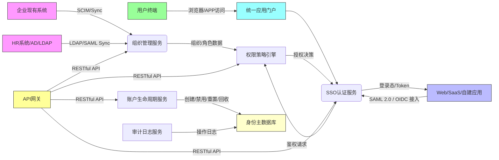

# 服务介绍

*   产品定位与演进历程
    
    *   IDaaS EIAM 是阿里云提供的云原生身份及权限管理服务（Identity-as-a-Service Enterprise Identity Access Management），面向企业用户提供组织架构管理、账户全生命周期管控、单点登录（SSO）和细粒度权限控制等一站式能力，适用于企业内部身份统一治理及多账号体系桥接场景。
        
    *   源内容中未提供各版本新增功能的简要说明。
        
    *   能力涉及产品：IDaaS EIAM；核心组件包括组织管理服务、账户生命周期管理服务、SSO认证服务、权限策略引擎、应用接入网关、用户门户等（依据核心能力推导）。

*   对外介绍架构图

    IDaaS EIAM 采用云原生分层架构，以租户隔离为前提，通过标准化协议（SAML 2.0 / OIDC / SCIM）对接企业现有系统（如AD/LDAP、HR系统）及SaaS/自建应用。其对外服务层提供统一登录门户与API网关，控制面负责策略配置与组织同步，数据面承载身份凭证、权限策略与审计日志。所有组件部署于阿里云高可用Region内，依赖底层云基础设施（如VPC网络隔离、KMS密钥管理、SLB负载均衡）保障安全与稳定性。

*   各核心组件能力详细说明
    
    *   **组织管理服务**：支持多层级组织树、部门/岗位/角色建模，可与HR系统或LDAP双向同步，实现组织架构动态更新。
    *   **账户生命周期服务**：覆盖账号创建、激活、密码策略、MFA绑定、自助解锁、离职停用、自动回收等全阶段自动化管控。
    *   **SSO认证服务**：提供标准SAML 2.0/OIDC协议支持，兼容主流SaaS（如钉钉、飞书、Salesforce）及自建Web/API应用，支持会话管理、登出广播、风险登录识别。
    *   **权限策略引擎**：基于RBAC+ABAC模型，支持按组织、属性、时间、IP等维度定义细粒度访问策略，策略可关联至应用、功能模块或API接口。
    *   **应用接入网关**：提供可视化应用注册、元数据配置、证书管理、协议调试能力，降低第三方应用集成门槛。
    *   **统一应用门户**：面向终端用户的聚合访问入口，支持个性化应用展示、快捷搜索、待办提醒与自助服务（如密码修改、MFA设置、账号信息查看）。
    *   **审计日志服务**：记录所有管理员操作、用户登录行为、策略变更事件，日志支持导出与对接阿里云SLS进行分析。

*   与阿里云其他产品的关系
    
    *   与 VPC、ECS、SLB 等Top30产品的交互方式，有什么影响：
        *   IDaaS EIAM 作为SaaS服务，**不直接依赖用户侧VPC/ECS部署**，其服务实例运行在阿里云托管环境中，通过公网或云企业网（CEN）与用户VPC内应用通信；当用户应用部署于ECS且需接入SSO时，需确保ECS安全组放行HTTPS（443）端口访问IDaaS服务域名；SLB通常用于用户自建应用集群前的流量分发，IDaaS通过标准协议与其解耦，无直接集成依赖。
        *   与阿里云RAM（资源访问管理）存在能力边界互补：RAM聚焦云上资源（如ECS、OSS）的API级权限管控，而EIAM聚焦企业应用（含非阿里云SaaS）的身份认证与应用级访问控制；二者可通过IDaaS与RAM集成实现联合身份治理。
        
    *   产品异常可能造成的影响，不会造成的影响（边界清晰）：
        *   **可能造成的影响**：IDaaS服务不可用将导致依赖其SSO登录的企业应用无法完成统一身份认证（用户需回退至本地账号登录，若未配置则无法访问）；组织同步中断将影响新员工入职账号自动开通与离职人员权限及时回收。
        *   **不会造成的影响**：IDaaS异常**不会影响**用户已登录会话的持续使用（会话有效期由Token签发策略决定）；**不会影响**ECS、RDS等云资源本身的运行状态与底层访问（这些资源权限由RAM独立管控）；**不会导致**用户VPC网络中断或ECS实例宕机。