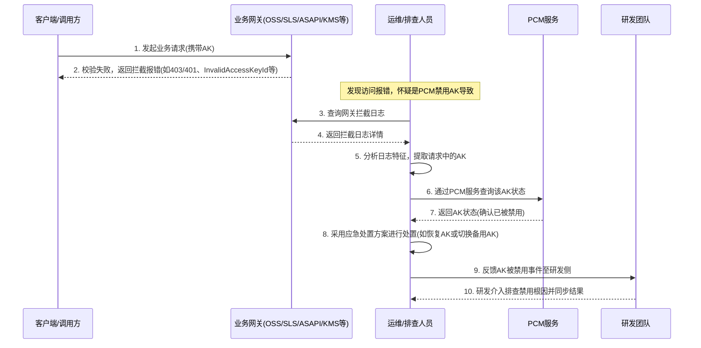

# 业务逻辑时序图

当遇到访问报错且怀疑是PCM禁用AK导致时，核心的排查与应急处置业务流程如下：

```mermaid
sequenceDiagram
    participant Client as 客户端/调用方
    participant Gateway as 业务网关(OSS/SLS/ASAPI/KMS等)
    participant Ops as 运维/排查人员
    participant PCM as PCM服务
    participant Dev as 研发团队

    Client->>Gateway: 1. 发起业务请求(携带AK)
    Gateway-->>Client: 2. 校验失败，返回拦截报错(如403/401、InvalidAccessKeyId等)
    
    Note over Ops: 发现访问报错，怀疑是PCM禁用AK导致
    Ops->>Gateway: 3. 查询网关拦截日志
    Gateway-->>Ops: 4. 返回拦截日志详情
    Ops->>Ops: 5. 分析日志特征，提取请求中的AK
    
    Ops->>PCM: 6. 通过PCM服务查询该AK状态
    PCM-->>Ops: 7. 返回AK状态(确认已被禁用)
    
    Ops->>Ops: 8. 采用应急处置方案进行处置(如恢复AK或切换备用AK)
    Ops->>Dev: 9. 反馈AK被禁用事件至研发侧
    Dev-->>Ops: 10. 研发介入排查禁用根因并同步结果
```

该时序图展示了从客户端请求被网关拦截，到排查人员通过日志提取AK、在PCM服务确认状态，并最终执行应急处置和反馈研发的完整闭环流转过程。