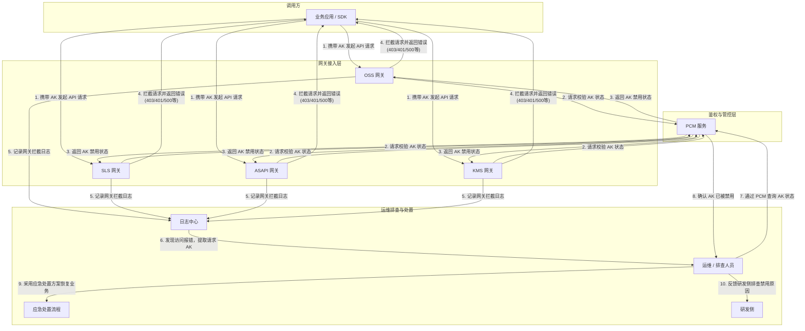

# 完整架构图

**架构与业务流说明**

当 PCM 禁用某个 AK 时，所有依赖该 AK 进行鉴权的网关（如 OSS、SLS、ASAPI、KMS 等）均会拦截相关请求。完整的业务与排查流转如下：
1. **请求拦截**：调用方携带被禁用的 AK 发起请求，网关层向 PCM 服务校验 AK 状态，获取到禁用状态后拒绝请求，并向调用方返回特定的错误码（如 403、401 或 500）。
2. **日志记录**：网关将拦截详情写入各自的访问日志或审计日志中。
3. **故障发现与提取**：运维或排查人员发现业务报错后，通过日志中心检索拦截日志，并根据不同网关的日志结构提取出请求中的 AK。
4. **状态确认与处置**：排查人员通过 PCM 服务确认该 AK 确实处于禁用状态后，优先触发应急处置流程以恢复业务，随后将问题反馈给研发侧排查 AK 被禁用的根本原因。

**已知问题和注意事项**

*   **日志字段与大小写差异**：不同网关记录 AK 的字段名及大小写存在差异，提取时需使用正确的字段。例如 OSS 使用 `access_id`，SLS 使用 `AccessKeyId`，ASAPI 使用 `accessKeyId`。
*   **错误码与状态码差异**：各网关拦截时返回的 HTTP 状态码和错误特征不同，排查时需结合具体网关的特征进行过滤：

| 网关类型 | HTTP 状态码 | 错误码/核心特征信息 | AK 提取字段 |
| :--- | :--- | :--- | :--- |
| **OSS** | 403 | `InvalidAccessKeyId` | `access_id` |
| **SLS** (INNER/PUB) | 401 | `Unauthorized` / `AccessKeyId is disabled` | `AccessKeyId` |
| **ASAPI** | 500 (业务失败) | `asapi.server.request.parameter.accesskeyid.error` / `The Access Key is disabled.` | `accessKeyId` |

*   **ASAPI 状态码误导**：ASAPI 网关在 AK 禁用时，外层 HTTP 状态码可能返回 500，但实际业务状态为 `failed`。排查时不能仅依赖 HTTP 状态码，必须深入解析 `errorCode` 和 `errorMessage` 字段。
*   **处置优先级**：确认 AK 被禁用导致业务受损时，必须**优先执行应急处置方案**（如临时启用 AK 或切换备用 AK）以恢复业务，事后再反馈研发侧排查禁用原因，严禁因等待根因排查而导致业务长时间中断。