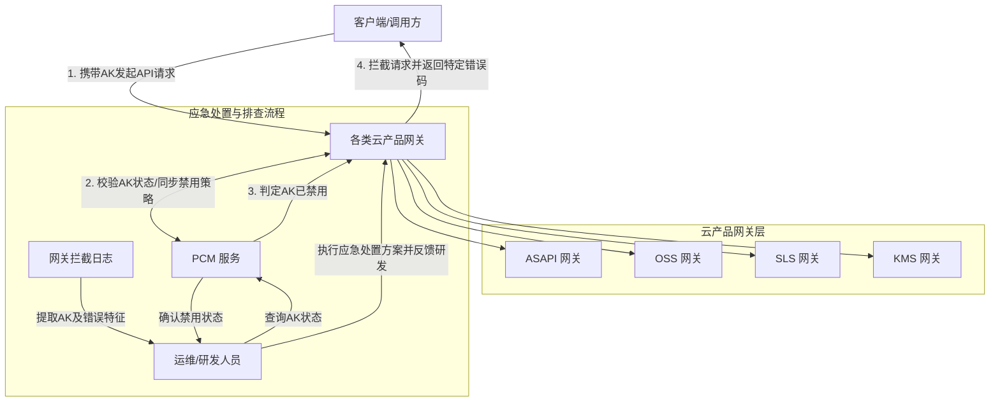

# 服务介绍

**产品定位**
PCM 服务主要用于管理和控制访问密钥（AccessKey，简称 AK）的状态。当 AK 在 PCM 中被禁用时，会触发下游各类云产品网关的鉴权拦截机制，从而实现对异常或违规 AK 的访问控制与熔断。在遇到访问报错时，可通过提取网关拦截日志中的请求 AK，并通过 PCM 服务查询 AK 状态来进行应急处置。

**演进历程**
（当前源内容主要聚焦于 AK 状态管控与网关联动拦截能力，暂无各版本新增功能的详细说明。）

**能力涉及的产品与组件**
PCM 的 AK 状态管控能力深度联动以下云产品网关及组件：
*   **ASAPI (Apsara Stack API)**：处理内部 API 请求，拦截禁用 AK 时返回 `asapi.server.request.parameter.accesskeyid.error` 及 `The Access Key is disabled` 错误信息。
*   **OSS (Object Storage Service)**：对象存储网关，拦截禁用 AK 时返回 `InvalidAccessKeyId` 错误码及 403 状态码。
*   **SLS (Simple Log Service)**：日志服务网关（包含 SLS_INNER 和 SLSPUB），拦截禁用 AK 时返回 401 状态码及 `Unauthorized` / `AccessKeyId is disabled` 错误。
*   **KMS (Key Management Service)**：密钥管理服务网关。

## 对外介绍架构图

根据 PCM 服务与各类网关的交互逻辑，当客户端发起请求时，网关会校验 AK 状态，若 AK 被 PCM 禁用，则网关直接拦截并返回特定错误。同时，运维人员可通过拦截日志提取 AK 并在 PCM 中进行状态查询与应急处置。

## 各核心组件能力详细说明

*   **PCM 服务**：核心管控组件，负责 AK 生命周期与状态管理。提供 AK 状态查询能力，供运维人员在排查访问报错时确认 AK 是否被禁用，并作为应急处置流程的核心判定依据。
*   **网关拦截组件（ASAPI/OSS/SLS/KMS等）**：负责在请求入口层进行身份鉴权。当识别到请求携带的 AK 已被 PCM 禁用时，立即阻断请求并返回标准化的拦截日志与错误码。例如：
    *   **ASAPI**：记录详细的请求参数、TraceId 及 `asapi.server.request.parameter.accesskeyid.error` 错误。
    *   **OSS**：在 `access_log` 中记录 `InvalidAccessKeyId` 及 403 状态。
    *   **SLS**：在操作日志中记录 401 状态及 `AccessKeyId is disabled` 错误信息。

## 与阿里云其他产品的关系

**与 Top30 产品的交互方式及影响**
PCM 主要与提供 API 访问入口的网关类产品（如 ASAPI、OSS、SLS、KMS 等）进行交互。
*   **交互方式**：PCM 负责管理 AK 的禁用状态，各产品网关在接收到用户请求时，基于 PCM 的状态进行鉴权拦截。
*   **影响**：当 PCM 禁用某个 AK 时，会导致该 AK 在 OSS、SLS、ASAPI 等所有关联网关处的访问请求被直接拒绝（返回 401 或 403 等错误），从而切断该 AK 对相关云资源的访问权限。

**产品异常可能造成的影响与边界**
*   **可能造成的影响**：若 PCM 服务异常导致状态误判或同步延迟，可能会造成正常 AK 被网关误拦截（导致业务 API 访问中断），或已禁用的异常 AK 仍能通过网关访问（造成安全合规风险）。
*   **不会造成的影响（边界清晰）**：PCM 仅控制 API 请求层面的 AK 鉴权拦截，不会影响云产品底层的数据存储、计算运行或网络连通性。例如，VPC 网络互通、ECS 实例内部进程运行、SLB 底层流量转发等不受 PCM 状态直接影响（除非这些组件的管理面 API 调用了被禁用的 AK）。