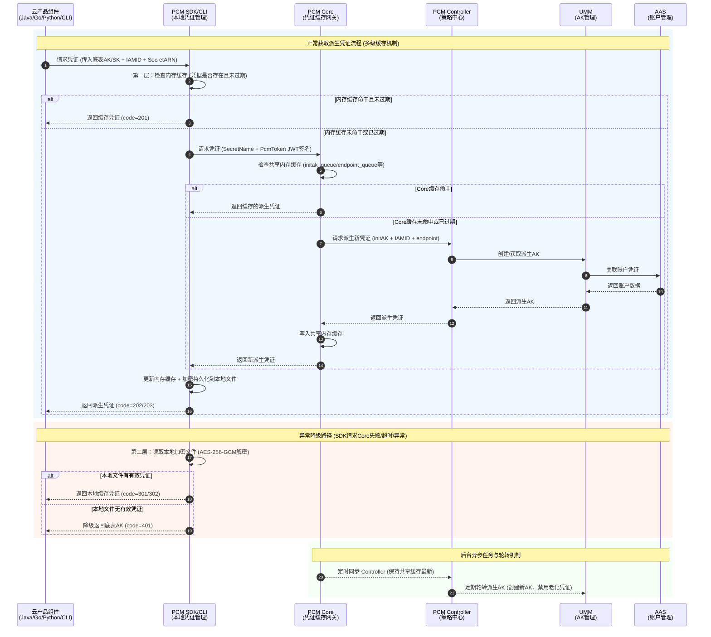
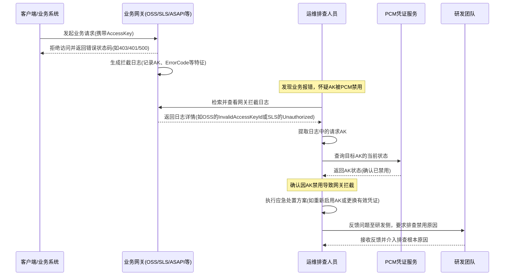

# 业务逻辑时序图

[[PCM/平台凭证管理服务/index|平台凭证管理服务]]（PCM）的核心机制主要围绕**凭证获取与多级缓存**、**异常容错降级**以及**后台凭证轮转**三个维度展开。同时，针对业务运行中可能出现的 AK 被禁用等异常情况，PCM 也制定了标准的排查与处置闭环流程。

## 核心业务逻辑时序图

以下为完整的[[DDoS/DDoS基础防护/产品对内文档/业务逻辑时序图|业务逻辑时序图]]：

**时序图核心流程说明：**

*   **正常获取凭证流程（多级缓存机制）**
    *   **L1 内存缓存**：云产品组件通过 PCM SDK/CLI 请求凭证时，SDK 优先检查本地内存缓存。若命中且未过期，直接返回（Code 201），实现最低延迟。
    *   **L2 共享缓存**：若本地未命中，SDK 携带 JWT 签名向 PCM Core 发起请求。Core 检查共享内存缓存，若命中则返回，SDK 更新本地缓存并加密持久化到磁盘。
    *   **L3 策略与底层创建**：若 Core 缓存也未命中或已过期，Core 将请求转发至 PCM Controller。Controller 调用 UMM 和 AAS 创建或获取新的派生 AK，逐层返回并更新各级缓存（Code 202/203）。
*   **异常降级路径（高可用容错）**
    *   当 SDK 请求 PCM Core 失败（如网络不通、超时或 Core 宕机）时，自动触发降级逻辑。
    *   SDK 读取本地磁盘的加密文件，若存在有效凭证则返回本地缓存（Code 301/302）。
    *   若本地文件也无有效凭证（如首次启动且 Core 不可用），则最终降级返回原始底表 AK（Code 401），确保业务不中断。
*   **后台异步流转（定时同步与轮转）**
    *   **缓存同步**：PCM Core 定时与 PCM Controller 同步，保持共享缓存数据最新，避免所有 SDK 请求直接击穿 Controller。
    *   **凭证轮转**：PCM Controller 定期执行派生 AK 队列轮转，创建新 AK 并禁用老化凭证。轮转过程受“最新派生 AK 保护”和“平台 AK 访问日志保护”等机制约束，确保正在使用中的凭证不会被误禁用。

## AK禁用排查与处置时序流程

当业务系统出现访问报错时，若怀疑是 PCM 禁用 AK 导致，需按照以下标准排查与处置时序流程进行操作。该流程涵盖了从网关日志分析、PCM 状态确认到应急处置及研发反馈的完整闭环。

**流程说明：**

1.  **日志判定**：不同网关的拦截日志特征不同（例如 OSS 返回 `403 InvalidAccessKeyId`，SLS 返回 `401 Unauthorized`，ASAPI 返回 `AccessKey is disabled` 等），排查时需优先通过对应网关的日志提取请求 AK。
2.  **状态核实**：提取 AK 后，必须通过 PCM 服务二次确认该 AK 的真实状态，避免误判。
3.  **闭环处置**：确认禁用后，先执行应急处置恢复业务，随后务必反馈研发侧排查 AK 被禁用的根本原因，防止问题复发。