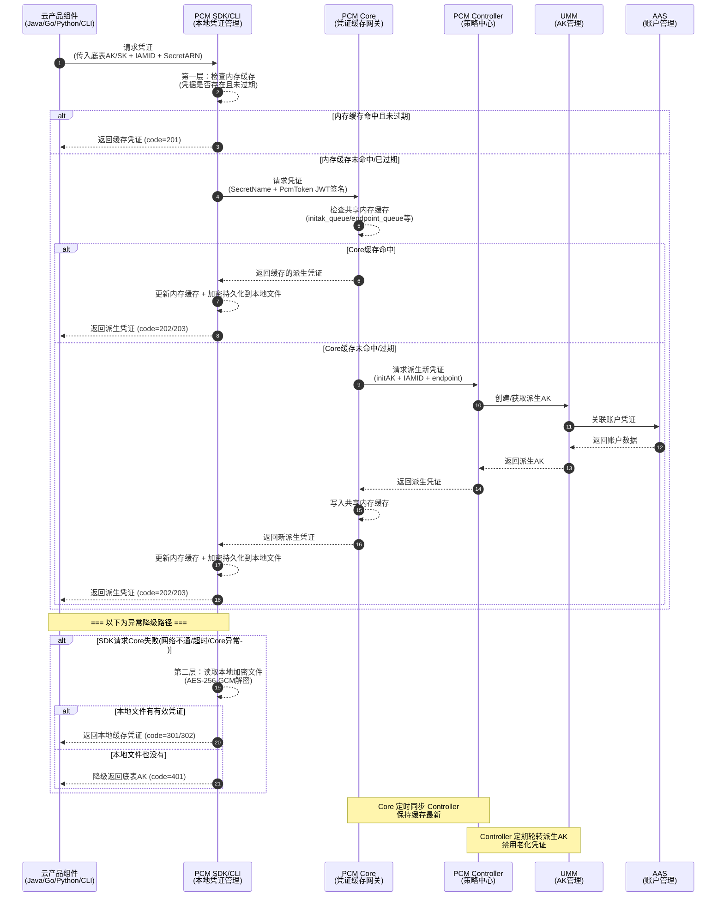
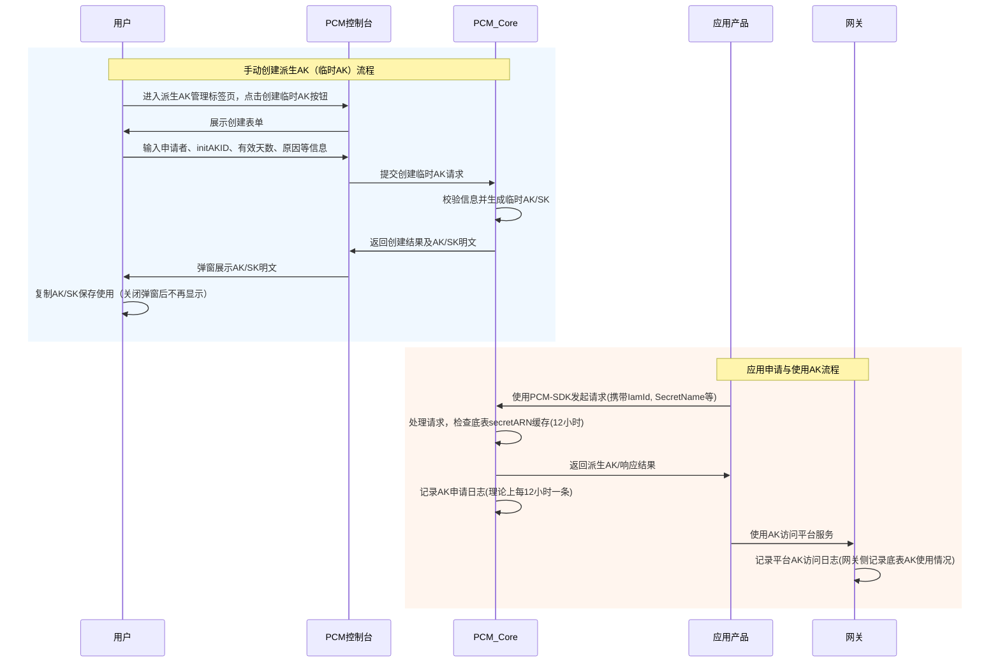

# 业务逻辑时序图

本节展示了 PCM 凭证管理的核心交互时序，包含底层 SDK/CLI 自动获取凭证的详细逻辑，以及控制台手动创建与应用使用 AK 的宏观流程。

### SDK/CLI 自动获取凭证流程

调用时序图展示了云产品应用通过 PCM SDK/CLI 获取凭证的完整业务流程，包含多级缓存命中逻辑、凭证派生交互以及异常降级路径。



### 控制台手动创建与应用使用AK流程

以下时序图展示了用户在控制台手动创建派生AK（临时AK）的流程，以及应用产品申请与使用 AK 的宏观交互流程。



## 核心业务流程说明

### PCM控制台入口

路径：ASO —> 安全管理 —> 账户安全 —> 平台凭据管理PCM


### 底表AK管理

1. 可查询底表AK禁用状态
2. 启用底表AK

> **注意**：未提供白屏底表AK禁用能力，底表AK禁用请详见变更文档。


### 派生AK管理（手动创建临时AK）

**适用场景**：当某个应用需要使用临时AK登录，或者使用的 initAK 被禁用时，可以创建临时AK使用。

* **步骤一**：进入派生AK管理标签页，点击“创建临时AK”按钮。


* **步骤二**：输入申请者、initAKID、有效天数、申请派生AK原因等相关信息创建临时AK。

**参数填写注意事项**：
1. `initAKID` 是托管到 PCM 的基线或底表AK（要与所使用账号的原始AK对应）。
2. `申请者ID` 即为 IAMID，是服务的身份标识（常规为 `集群 + : + sr` 拼接而成，如：`StandardCloudCluster-A-20250906-00bf:PcmController`。如果系统中提示已经存在，可以在后面拼接任意字符串）。
3. AK类型默认使用“临时”类型。
4. 有效天数范围限制在 1~365 天。
5. 申请者类型分为：`ApsaraStackProduct`、`Other`。
6. `CloudID`、`ProductName`、`ClusterName`、`ServiceName` 分别为使用该AK的应用归属的 CloudID、产品名称、集群名称、Service名称（虽然不是必填，但能准确填写请尽量准确填写，以便于更准确地判断该临时AK使用方）。


**示例**：


* **步骤三**：复制 AK、SK 保存使用。

> **注意**：该AK对应的 SK 明文只会在创建成功后弹窗内展示，关闭弹窗后系统内不再显示。创建成功后请立即复制保存，如果不慎关闭弹窗，则需要重新创建临时AK，系统不对外提供 SK 明文信息能力。


**返回结果示例**：
```json
{
  "accessKeyId": "ZbuIneIC04TElIFW",
  "accessKeySecret": "cnyDzeHzmZWTGcs7ZLbZEHzagQj9jn"
}
```
*注：`accessKeyId` 对应 AK，`accessKeySecret` 对应 SK。*

### AK申请详情与状态

**适用场景**：用于查看派生AK申请记录。

* **认证状态失败**：仅表示 IAMID 不规范，但不会对申请结果有任何影响。


* **轮转状态已停止**：


**常见停止原因**：
1. IAMID 中有 `CLOSE_AUTO_ROTATE` 状态，表示该队列默认不轮转。
2. 使用该产品的队列，有产品未及时更新 [《[[PCM/平台凭证管理服务/index|平台凭证管理服务]]（PCM）介绍》](https://alidocs.dingtalk.com/i/nodes/r1R7q3QmWew5lo02fZRn00oKJxkXOEP2?utm_scene=team_space&iframeQuery=anchorId%3Duu_mo8et3bkdnbpoxrkv3)。
3. 使用该队列的产品中，有产品仍在第7把AK [《平台凭证管理服务（PCM）介绍》](https://alidocs.dingtalk.com/i/nodes/r1R7q3QmWew5lo02fZRn00oKJxkXOEP2?utm_scene=team_space&iframeQuery=anchorId%3Duu_mo8et3bliy39hgdhkpq)。

### AK申请与访问日志逻辑

#### AK申请日志

**说明**：记录每个 IAMID 申请派生AK的记录，通过 `pcm-core` 获取。`pcm-core` 中针对每个 IAMID 的底表 `secretARN` 的缓存时间为 12 小时，对于一直在用派生AK的产品，理论上每 12 小时会有一条记录。


#### 平台AK访问日志

> **提示**：当前不完整，可作为辅助查询手段。

**说明**：在网关侧记录使用底表AK的使用情况。

例如：底表AK `Khz7a1kmKMZDCBXj`


