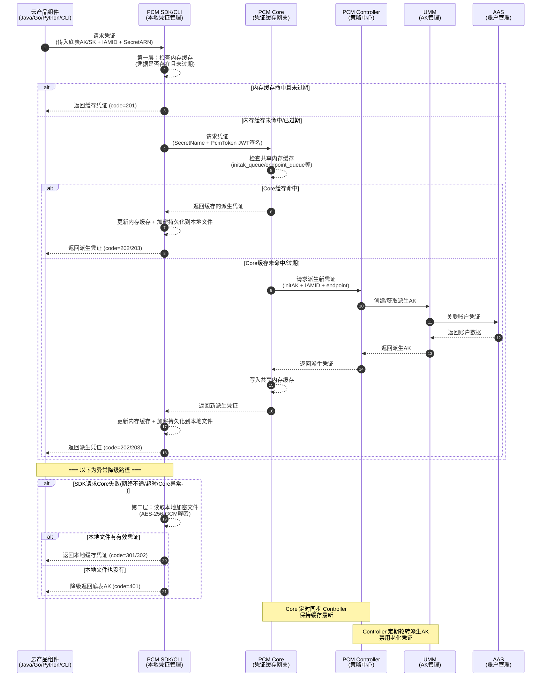
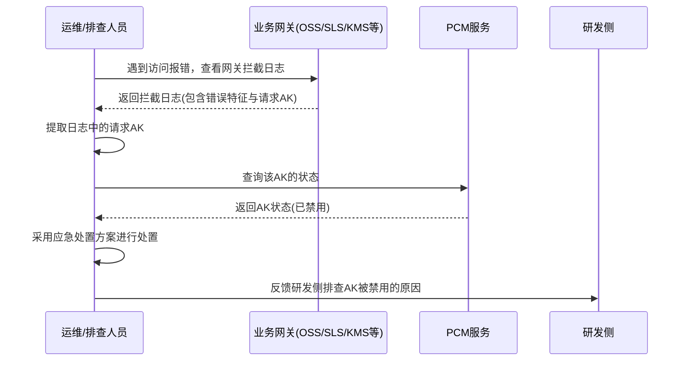

# 业务逻辑时序图

当遇到访问报错，怀疑是[[PCM/PCM/index|PCM]]禁用AK导致的，优先通过拦截日志判定，提取日志中的请求AK，并通过PCM服务查询AK状态，如果已经禁用，采用应急处置方案进行处置，并反馈研发侧排查原因。

## 凭证获取与缓存降级时序图

```mermaid
sequenceDiagram
    autonumber
    participant App as 云产品组件<br/>(Java/Go/Python/CLI)
    participant SDK as PCM SDK/CLI<br/>(本地凭证管理)
    participant Core as PCM Core<br/>(凭证缓存网关)
    participant Ctrl as PCM Controller<br/>(策略中心)
    participant UMM as UMM<br/>(AK管理)
    participant AAS as AAS<br/>(账户管理)

    App->>SDK: 请求凭证<br/>(传入底表AK/SK + IAMID + SecretARN)

    SDK-->>SDK: 第一层：检查内存缓存<br/>(凭据是否存在且未过期)

    alt 内存缓存命中且未过期
        SDK-->>App: 返回缓存凭证 (code=201)
    else 内存缓存未命中/已过期
        SDK->>Core: 请求凭证<br/>(SecretName + PcmToken JWT签名)
        Core-->>Core: 检查共享内存缓存<br/>(initak_queue/endpoint_queue等)

        alt Core缓存命中
            Core-->>SDK: 返回缓存的派生凭证
            SDK-->>SDK: 更新内存缓存 + 加密持久化到本地文件
            SDK-->>App: 返回派生凭证 (code=202/203)
        else Core缓存未命中/过期
            Core->>Ctrl: 请求派生新凭证<br/>(initAK + IAMID + endpoint)
            Ctrl->>UMM: 创建/获取派生AK
            UMM->>AAS: 关联账户凭证
            AAS-->>UMM: 返回账户数据
            UMM-->>Ctrl: 返回派生AK
            Ctrl-->>Core: 返回派生凭证
            Core-->>Core: 写入共享内存缓存
            Core-->>SDK: 返回新派生凭证
            SDK-->>SDK: 更新内存缓存 + 加密持久化到本地文件
            SDK-->>App: 返回派生凭证 (code=202/203)
        end
    end

    Note over App,SDK: === 以下为异常降级路径 ===

    alt SDK请求Core失败(网络不通/超时/Core异常)
        SDK-->>SDK: 第二层：读取本地加密文件<br/>(AES-256-GCM解密)
        alt 本地文件有有效凭证
            SDK-->>App: 返回本地缓存凭证 (code=301/302)
        else 本地文件也没有
            SDK-->>App: 降级返回底表AK (code=401)
        end
    end

    Note over Core,Ctrl: Core 定时同步 Controller<br/>保持缓存最新
    Note over Ctrl,UMM: Controller 定期轮转派生AK<br/>禁用老化凭证
```

## 异常排查与应急处置时序图

```mermaid
sequenceDiagram
    participant User as 运维/排查人员
    participant Gateway as 业务网关(OSS/SLS/KMS等)
    participant PCM as PCM服务
    participant Dev as 研发侧

    User->>Gateway: 遇到访问报错，查看网关拦截日志
    Gateway-->>User: 返回拦截日志(包含错误特征与请求AK)
    User->>User: 提取日志中的请求AK
    User->>PCM: 查询该AK的状态
    PCM-->>User: 返回AK状态(已禁用)
    User->>User: 采用应急处置方案进行处置
    User->>Dev: 反馈研发侧排查AK被禁用的原因
```