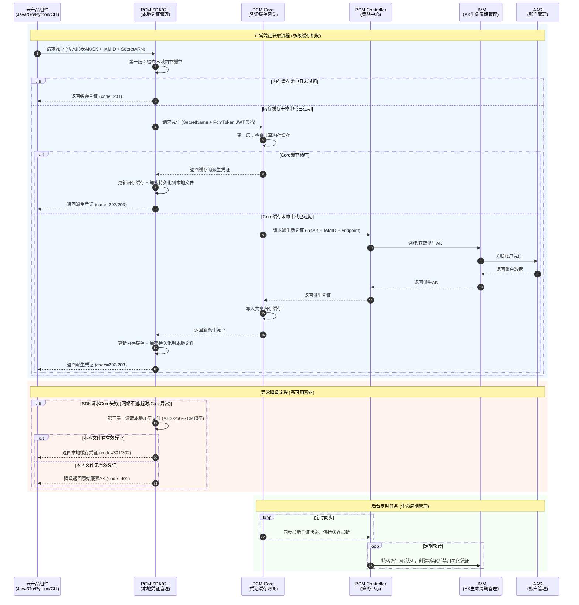

# 业务逻辑时序图

平台凭证管理服务（PCM）的业务逻辑主要围绕**凭证获取**、**多级缓存**、**异常降级**以及**后台生命周期管理**展开。以下时序图详细展示了云产品组件通过 PCM 获取派生 AK 的完整交互过程。

**核心业务流程说明**

**1. 多级缓存与正常获取机制**
为了降低底层服务压力并提升响应速度，PCM 设计了三级缓存机制：
*   **第一层（SDK 内存缓存）**：SDK 优先检查本地内存，若凭证存在且未过期，直接返回（code=201）。
*   **第二层（Core 共享缓存）**：若 SDK 内存未命中，SDK 携带 JWT 签名向 PCM Core 发起请求。Core 检查共享内存缓存，若命中则返回，SDK 更新本地内存并加密持久化到磁盘（code=202/203）。
*   **第三层（Controller 策略中心）**：若 Core 缓存也未命中，Core 向 Controller 请求派生新凭证。Controller 调用 UMM 和 AAS 完成底层 AK 的创建与账户关联，最终将新凭证逐层返回并写入各级缓存。

**2. 高可用与异常降级机制**
在 PCM 服务异常或网络不可用时，SDK 具备完善的容错降级能力，确保业务不中断：
*   **本地文件降级**：当 SDK 无法连接 Core 时，会读取本地磁盘的加密文件（AES-256-GCM 解密）。若文件中有有效凭证，则返回本地缓存凭证（code=301/302）。
*   **底表 AK 兜底**：若本地文件也无有效凭证（如首次启动且服务不可用），SDK 将降级返回原始的底表 AK（code=401），保障应用基础可用性。

**3. 后台轮转与生命周期管理**
*   **定时同步**：PCM Core 会定时与 Controller 同步，确保缓存网关中的凭证状态保持最新，缓解 Controller 访问压力。
*   **队列轮转**：PCM Controller 定期执行派生 AK 队列的轮转操作，调用 UMM 创建新的派生 AK，并根据保护机制（如最新派生 AK 保护、平台 AK 访问日志保护）安全地禁用老化凭证，实现凭证的动态轮换与安全管控。