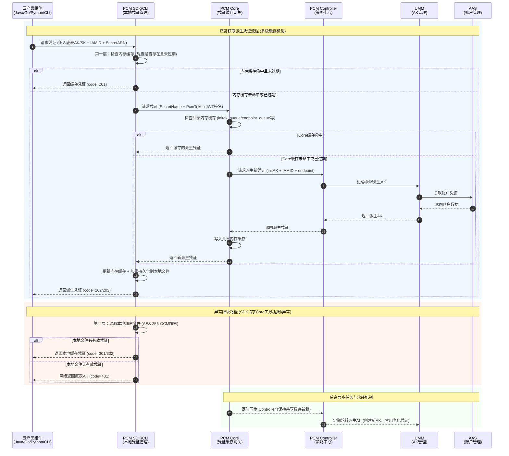
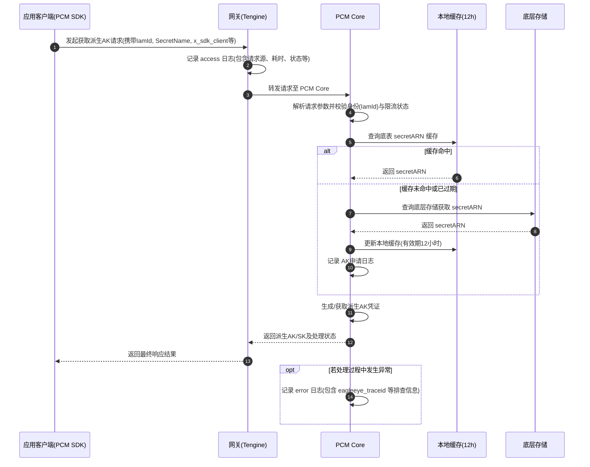
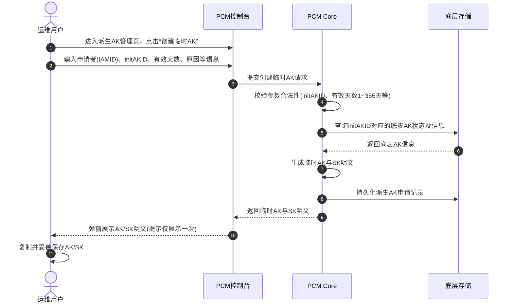
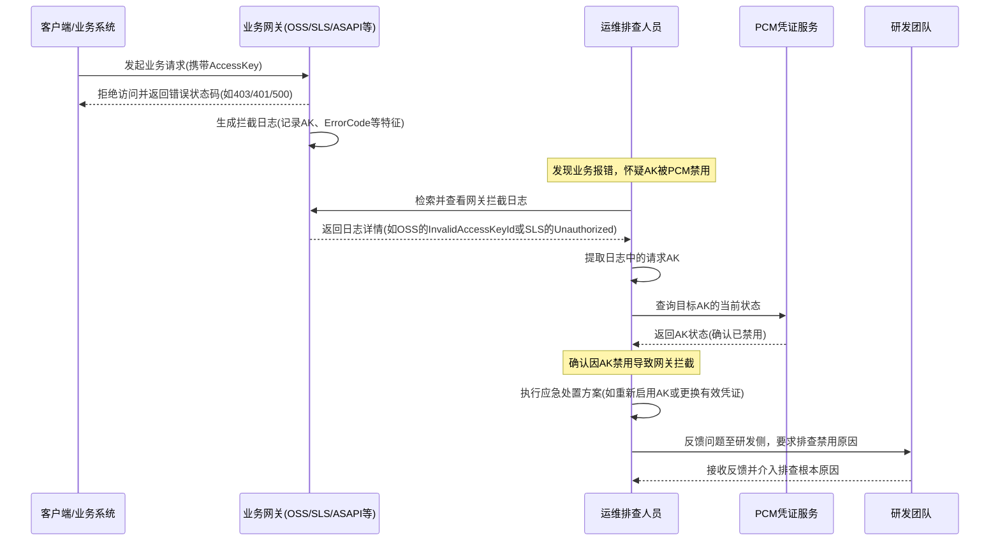
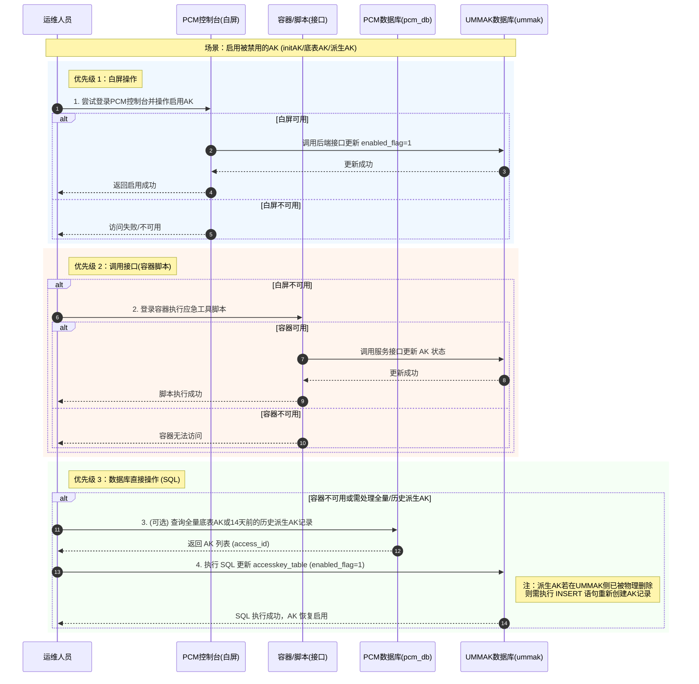
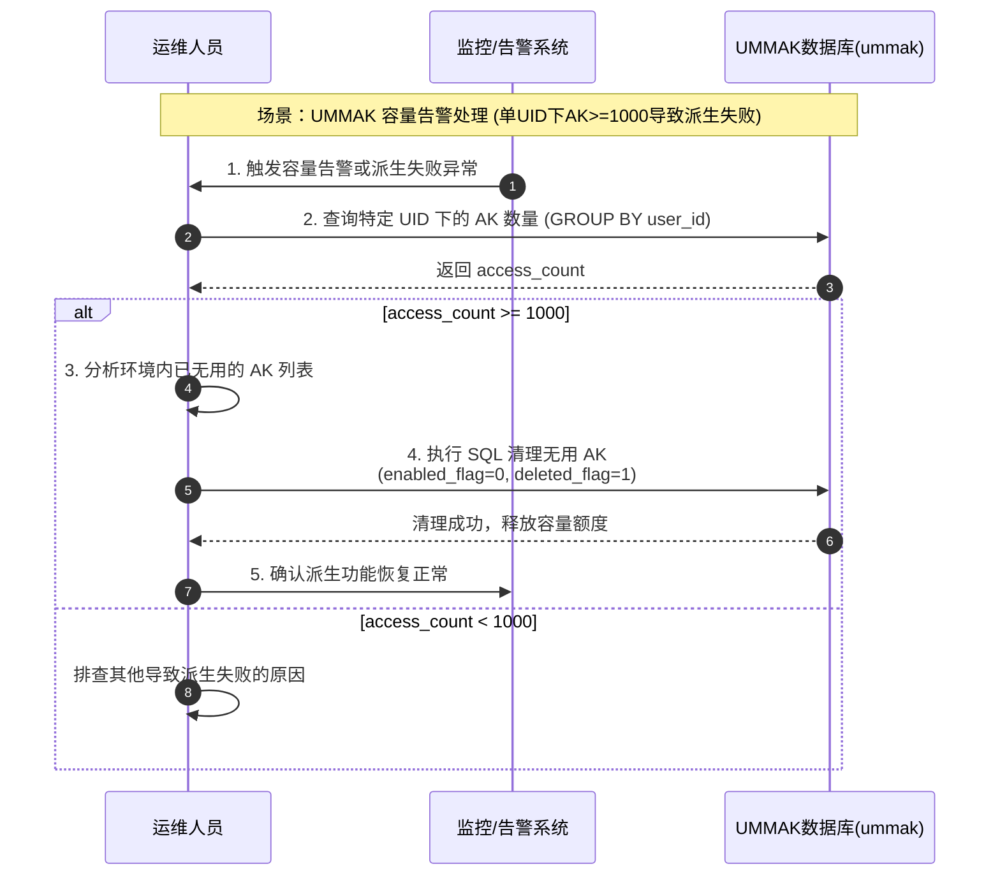
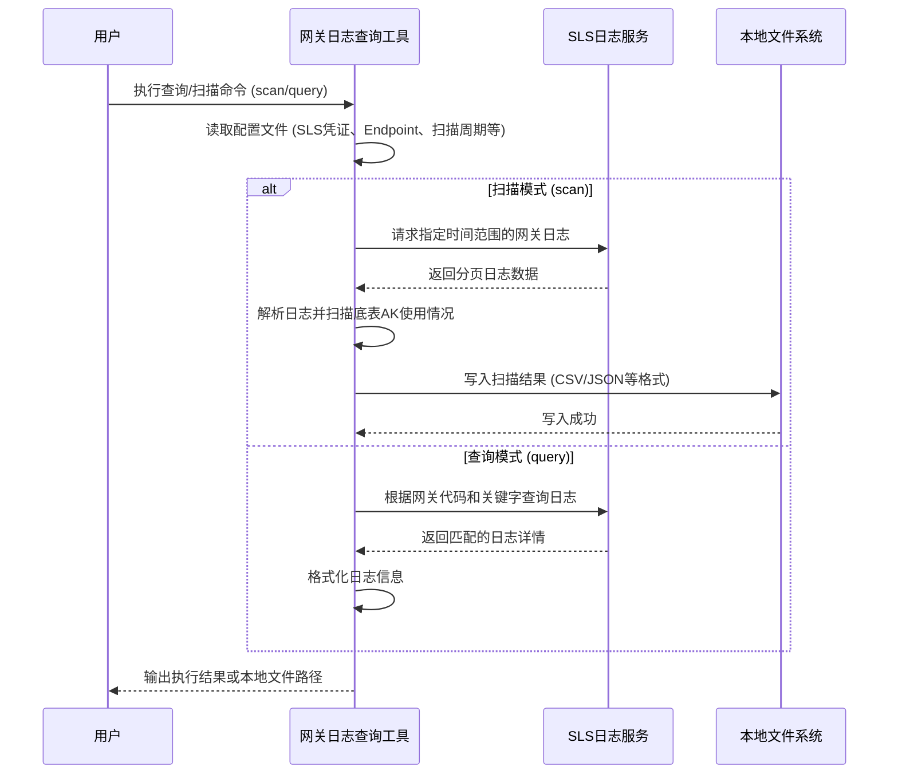
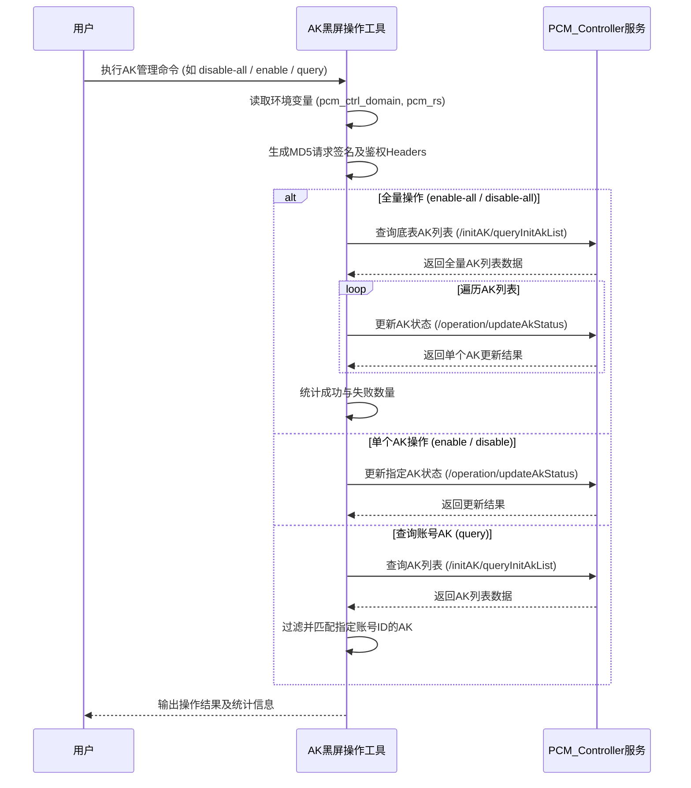

# 业务逻辑时序图

[[PCM/平台凭证管理服务/index|平台凭证管理服务]]（PCM）的核心机制主要围绕**凭证获取与多级缓存**、**异常容错降级**以及**后台凭证轮转**三个维度展开。其核心业务逻辑涵盖了**应用侧通过 SDK 获取派生 AK 流程**、**运维管理侧的手动创建临时 AK 流程**。同时，针对业务运行中可能出现的 AK 被禁用、UMMAK 容量告警等异常情况，PCM 制定了标准的排查与处置闭环流程（包含严格的启用降级策略），并配套提供了**网关日志查询**与**底表 AK 黑屏操作**等运维工具，以支持日常管理与应急处置。

## 核心凭证获取与轮转全局时序

以下为完整的[[DDoS/DDoS基础防护/产品对内文档/业务逻辑时序图|业务逻辑时序图]]，展示了凭证获取的多级缓存机制、异常降级路径以及后台异步流转过程：

**时序图核心流程说明：**

*   **正常获取凭证流程（多级缓存机制）**
    *   **L1 内存缓存**：云产品组件通过 PCM SDK/CLI 请求凭证时，SDK 优先检查本地内存缓存。若命中且未过期，直接返回（Code 201），实现最低延迟。
    *   **L2 共享缓存**：若本地未命中，SDK 携带 JWT 签名向 PCM Core 发起请求。Core 检查共享内存缓存，若命中则返回，SDK 更新本地缓存并加密持久化到磁盘。
    *   **L3 策略与底层创建**：若 Core 缓存也未命中或已过期，Core 将请求转发至 PCM Controller。Controller 调用 UMM 和 AAS 创建或获取新的派生 AK，逐层返回并更新各级缓存（Code 202/203）。
*   **异常降级路径（高可用容错）**
    *   当 SDK 请求 PCM Core 失败（如网络不通、超过默认 1s 超时时间、同 IP 高频请求触发限流返回 502、签名或时钟校验失败返回 403、参数错误 400 或 Core 宕机）时，自动触发降级逻辑。此过程会产生大量 WARN 级别日志。
    *   SDK 读取本地磁盘的加密文件，若存在有效凭证则返回本地缓存（Code 301/302）。
    *   若本地文件也无有效凭证（如首次启动且 Core 不可用），则最终降级返回原始底表 AK（Code 401），确保业务不中断。
*   **后台异步流转（定时同步与轮转）**
    *   **缓存同步**：PCM Core 定时与 PCM Controller 同步，保持共享缓存数据最新，避免所有 SDK 请求直接击穿 Controller。
    *   **凭证轮转**：标准模式下，SDK 会在后台定时向 Core 请求刷新派生 AK，确保凭证持续有效。PCM Controller 定期执行派生 AK 队列轮转，创建新 AK 并禁用老化凭证。轮转过程受“最新派生 AK 保护”和“平台 AK 访问日志保护”等机制约束，确保正在使用中的凭证不会被误禁用。
    *   **半轮转模式风险提示**：对于部分采用“半轮转模式”的产品（仅在启动时获取一次凭证），若首次获取恰好失败（如网络抖动、Core 限流），将导致后续持续使用底表 AK 或无有效凭据运行，且不会自动恢复，存在潜在的业务中断风险。

## SDK经网关获取派生AK详细时序

本章节是对全局时序中 SDK 到 Core 链路的细化，补充了网关（Tengine）转发以及 PCM Core 针对 `secretARN` 的 12 小时缓存机制细节。对于持续使用派生 AK 的产品，理论上每 12 小时会触发一次底层查询并记录一条 AK 申请日志。

## 控制台手动创建临时AK流程

适用于某个应用需要使用临时 AK 登录，或使用的 initAK 被禁用时的应急/临时处理场景。该流程展示了运维用户通过 PCM 控制台与系统交互创建临时凭证的过程。需要注意的是，SK 明文仅在创建成功后的弹窗中展示一次，系统不对外提供 SK 明文信息的二次查询能力。

## AK禁用排查与处置流程

当业务系统出现访问报错时，若怀疑是 PCM 禁用 AK 导致，需按照以下标准排查与处置时序流程进行操作。该流程涵盖了从网关日志分析、PCM 状态确认到应急处置及研发反馈的完整闭环。

**流程说明：**

1.  **日志判定与拦截分析**：不同网关的拦截日志特征不同（例如 OSS 返回 `403 InvalidAccessKeyId`，SLS 返回 `401 Unauthorized`，ASAPI 返回 `AccessKey is disabled` 等），排查时需优先通过对应网关的日志提取请求 AK。当发生拦截时，需区分 AK 类型进行针对性排查：
    *   **底表 AK 被拦截**：说明 SDK 未能成功获取派生 AK 从而走了降级逻辑，或产品未适配 PCM。需优先在控制台启用底表 AK 恢复业务，再通过 SDK 日志错误码排查降级原因。
    *   **派生 AK 被拦截**：说明产品已使用派生 AK，但该 AK 已被轮转禁用。通常是因为产品未持续轮转（如半轮转模式仅获取一次），或轮转刷新失败。需重启服务刷新 AK 或手动启用 AK 进行应急恢复。
2.  **状态核实**：提取 AK 后，必须通过 PCM 服务二次确认该 AK 的真实状态，避免误判。
3.  **闭环处置**：确认禁用后，先执行应急处置恢复业务（具体的 AK 启用降级操作策略详见下文 **AK启用应急处置降级时序**），随后务必反馈研发侧排查 AK 被禁用的根本原因，防止问题复发。

## AK启用应急处置降级时序

平台凭证管理服务(PCM)在进行AK（initAK、底表AK、派生AK）启用等应急操作时，遵循严格的降级策略：**控制台白屏 > 调用接口（容器脚本） > 数据库执行SQL**。以下为核心应急处置业务的时序流转图：

## 容量告警处理时序

当UMMAK侧单个UID下有效AK数量达到上限（最大1000把）时，会导致派生AK失败并可能触发容量告警。以下为容量告警场景的数据排查与清理时序图：

## 网关日志查询工具业务时序

网关日志查询工具主要通过与 SLS（日志服务）交互，完成网关日志的拉取、底表 AK 使用情况的扫描解析以及结果的本地持久化。

## 底表AK黑屏操作工具业务时序

底表 AK 黑屏操作工具主要通过与 PCM Controller 服务交互，完成 AK 状态的查询与变更。所有 API 请求均需携带基于环境变量动态生成的 MD5 签名 Headers 以通过服务端的安全校验。

