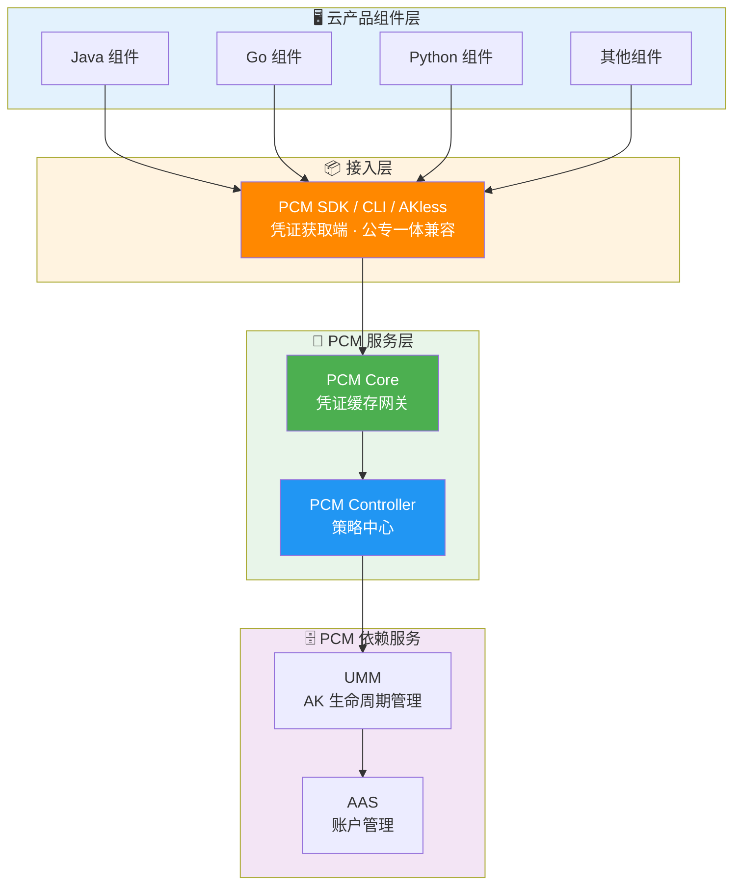
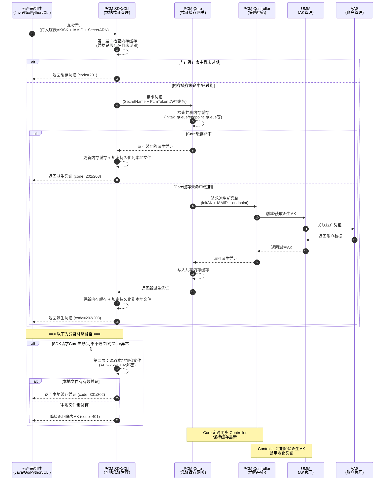

# 完整架构图

以下为 [[PCM/平台凭证管理服务/index|平台凭证管理服务]]（PCM）的系统CIAM/产品对内文档/完整架构图|完整架构图]]|完整架构图]]|完整架构图]]|完整架构图]]|完整架构图]]|完整架构图]]，展示了云产品组件层、接入层、PCM 服务层以及底层依赖服务之间的模块划分与调用关系：

**接入后对比示意图**：

## 核心调用时序图

以下为云产品组件通过 PCM SDK 获取派生 AK 的完整业务流与调用时序图（包含正常获取路径与异常降级路径）：

## 已知问题和注意事项

### 架构容错与降级机制
- **多级容错与降级机制**：架构调用中内置了严格的异常降级路径。当 SDK 请求 Core 失败（如网络不通、超时或 Core 宕机）时，SDK 会自动读取本地加密文件进行降级；若本地也无有效凭证，则最终降级返回底表 AK，以保障业务连续性。
- **Core 宕机保护**：当 PCM Core 宕机后，末期过期老凭证的禁用行为会暂停，SDK 会返回上次获得的老凭证（未在窗口期末尾），应用依然可以正常使用。
- **多实例部署与排查**：PCM Core 服务部署在两个 Docker 容器上。在排查架构链路或分析日志时，必须同时查询两个 Docker 容器的日志，以避免遗漏请求或错误信息。

### 缓存与凭证轮转机制
- **缓存同步与轮转依赖**：PCM Core 作为缓存中间网关，必须定时同步 PCM Controller 以保持缓存数据最新；同时 PCM Controller 需定期轮转派生 AK 并禁用老化凭证，确保凭证生命周期管理的正常流转。
- **底表 SecretARN 缓存时效**：PCM Core 中针对每个 IAMID 的底表 secretARN 的缓存时间设定为 12 小时。对于持续使用派生 AK 的产品，理论上每 12 小时会触发一次凭证申请并产生一条记录。
- **特定队列的轮转控制**：若 IAMID 中包含 `CLOSE_AUTO_ROTATE` 状态标识，则表示该队列默认关闭自动轮转功能。
- **半轮转模式的首次获取失败风险**：部分产品采用半自动轮转模式（仅在启动时获取一次派生 AK，后续不再主动刷新）。如果该唯一一次获取请求恰好失败（如 Core 限流、网络抖动、服务未就绪），产品将持续使用底表 AK 或无有效凭据运行，且不会自动恢复。
- **底表禁用后的可用性联动风险**：底表 AK 被 PCM 禁用后，产品的凭据供给完全依赖 PCM 链路（Core + Controller）。对于本地有缓存的运行中服务暂时无影响，但重启的服务如果此时 PCM 不可用，将拿不到任何有效凭据（底表已禁、派生获取失败、本地无缓存），导致业务直接中断。

### 性能与限流注意事项
- **Core 限流基于 IP 的误伤风险**：PCM Core 的限流策略基于客户端 IP。当同一台机器上运行多个产品组件时，一个高频产品的请求可能耗尽该 IP 的限流配额，导致同 IP 下其他产品被连带返回 502。
- **限流状态观测**：在 PCM Core 的 access 日志中，可通过 `limit_req_status` 字段确认限流状态（未限流显示 "PASSED"，触发限流显示 "-"），便于快速定位因限流导致的请求失败。
- **链路延迟对时间敏感业务的影响**：接入 PCM 后链路增加，可能导致部分时间敏感服务延迟加大。针对此类服务，SDK 增加了超时策略（支持通过 `PCM_TASK_DELAY` 环境变量设置访问 PCM 的最大超时时间，单位为 ms，默认 1000ms）。

### 客户端行为注意事项
- **无服务端时的 SDK 频繁调用**：当环境中 PCM 服务（Core）未部署或不可达时，SDK 无法生成缓存，仍然会按配置的间隔持续尝试连接，每次失败产生 WARN 级别日志，可能导致日志量过大。
- **部分 SDK 关键日志缺失导致排查困难**：Java SDK 在异常时可能产生过多 WARN 日志，导致部分产品侧选择屏蔽报错日志。这会使得日志中缺失请求 PCM 的 `requestid` 等关键信息，增加架构链路问题的排查难度。