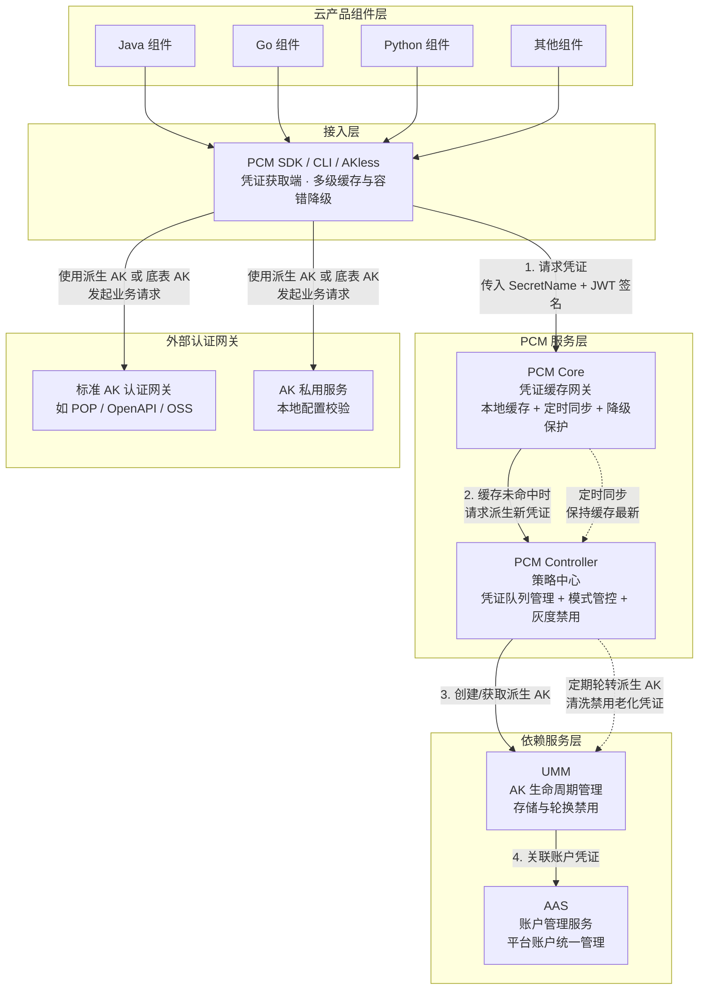

# 完整架构图

平台凭证管理服务（PCM）的完整架构涵盖了从云产品组件接入、凭证缓存与策略管控，到底层账户与 AK 生命周期管理的完整链路。以下为系统[[DDoS/DDoS基础防护/产品对内文档/完整架构图|完整架构图]]，展示了各模块的划分、核心调用关系以及业务数据流向。

**架构核心业务流说明**

1. **凭证获取流**：云产品组件通过 PCM SDK 发起凭证请求。SDK 优先检查本地内存和磁盘缓存；若未命中，则向 PCM Core 请求；Core 若缓存未命中，则向 PCM Controller 申请派生新凭证，Controller 最终调用 UMM 和 AAS 完成凭证的创建与关联。
2. **凭证轮转流**：PCM Controller 作为策略大脑，定期为托管凭证创建主动过期的派生 AK 队列，并调用 UMM 清洗和禁用老化的派生凭证。PCM Core 通过定时同步机制保持缓存数据的最新状态。
3. **业务认证流**：云产品组件获取到派生 AK 后，向外部网关发起业务请求。标准 AK 认证网关通过对接 UMM 进行签名校验；AK 私用服务则通过本地配置进行校验。

**已知问题和注意事项**

* **队列级别选择风险**：强烈不推荐使用 `ClusterName` 级别划分派生 AK 队列。多集群会为同一个底表 AK 创建多个独立队列，叠加后极易打满 UMM 账户的 AK 数量上限，导致无法创建新的派生 AK。默认且推荐的配置为 `initAK` 级别。
* **高可用与缓存丢失风险**：在极端场景下（PCM 和应用均宕机需重拉，且 SDK 本地缓存丢失），会导致**业务中断**。此时必须先恢复 PCM 服务或使用老凭证应急脚本进行兜底。
* **热升级与模式变更限制**：
  * 热升级项目中，原始凭证的通用能力不会被自动禁用，如需禁用老凭证，必须通过观测日志在运维控制台（PKM）灰度进行，严禁一刀切。
  * 管控模式从松到紧（如兼容模式到严格模式）变更时不会自动生效，需在 ASO 页面人工确认处理，以防止误操作引发故障。
* **轮转保护机制触发**：当平台 AK 访问日志不可行时，PCM 无法确认即将禁用的派生 AK 是否仍在被调用，系统会在第一把队列即将禁用时自动停止轮转以保护凭证。此外，若某把 AK 是某个产品获取的“最新派生 AK”，队列也会暂停轮转，直到该产品获取了更新的 AK。
* **AK 私用场景适配进度**：当前访问 AK 私用服务的云产品尚未强制要求适配 PCM。已适配的产品可通过 PCM 服务兑换出原始底表 AK，未适配的产品需关注后续的强制改造要求。