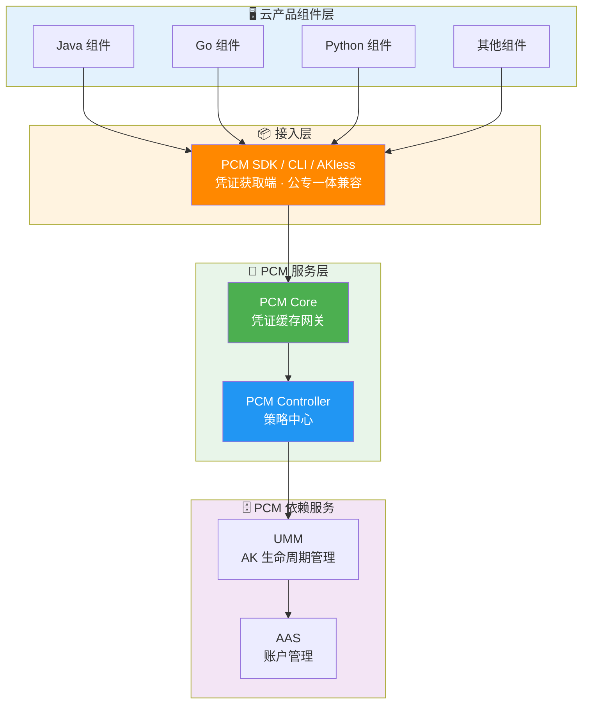
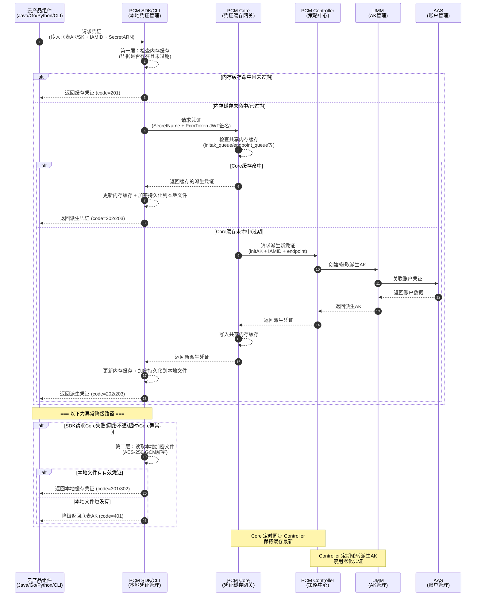

# 完整架构图

以下为 [[PCM/平台凭证管理服务/index|平台凭证管理服务]]（PCM）的系统CIAM/产品对内文档/完整架构图|完整架构图]]|完整架构图]]|完整架构图]]|完整架构图]]|完整架构图]]|完整架构图]]，展示了云产品组件层、接入层、PCM 服务层以及底层依赖服务之间的模块划分与调用关系：

**接入后对比示意图**：

## 核心调用时序图

以下为云产品组件通过 PCM SDK 获取派生 AK 的完整业务流与调用时序图（包含正常获取路径与异常降级路径）：

## 已知问题和注意事项

- **多级容错与降级机制**：架构调用中内置了严格的异常降级路径。当 SDK 请求 Core 失败（如网络不通、超时或 Core 宕机）时，SDK 会自动读取本地加密文件进行降级；若本地也无有效凭证，则最终降级返回底表 AK，以保障业务连续性。
- **缓存同步与轮转依赖**：PCM Core 作为缓存中间网关，必须定时同步 PCM Controller 以保持缓存数据最新；同时 PCM Controller 需定期轮转派生 AK 并禁用老化凭证，确保凭证生命周期管理的正常流转。
- **Core 宕机保护**：当 PCM Core 宕机后，末期过期老凭证的禁用行为会暂停，SDK 会返回上次获得的老凭证（未在窗口期末尾），应用依然可以正常使用。