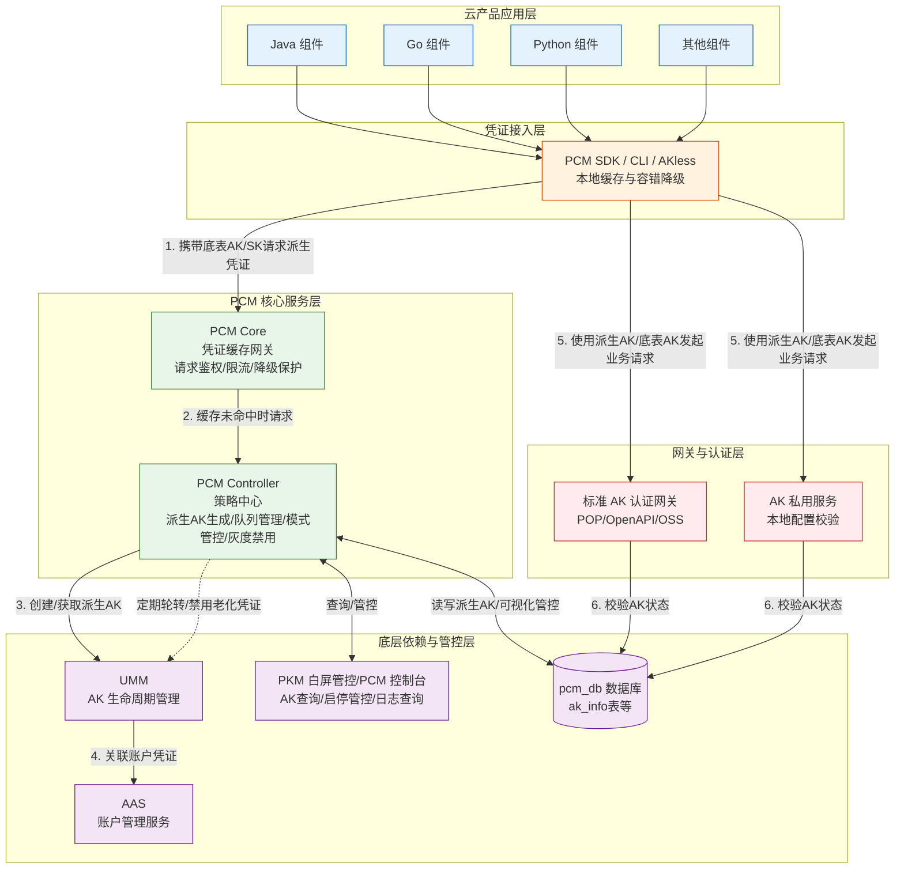
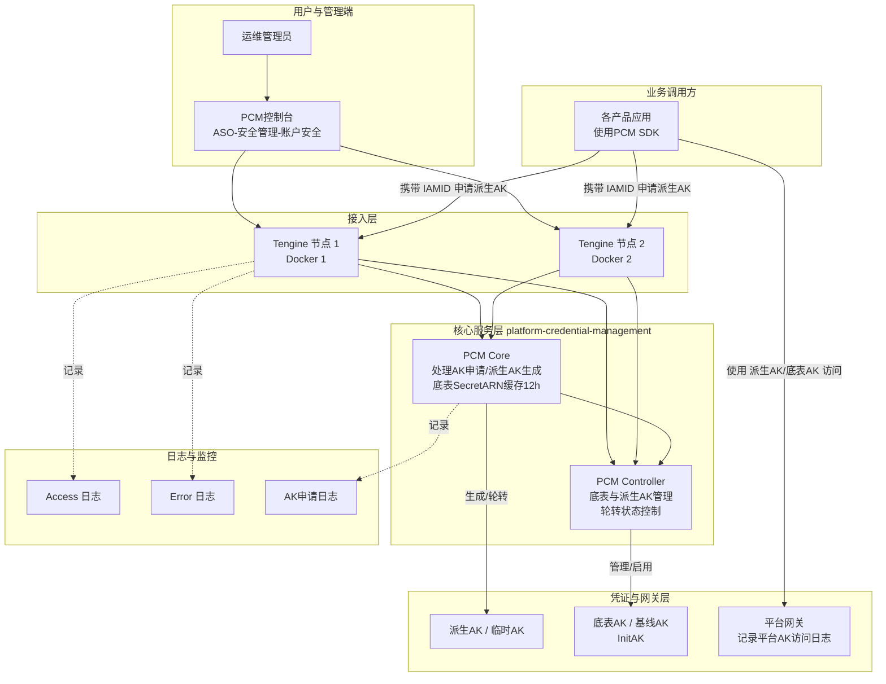
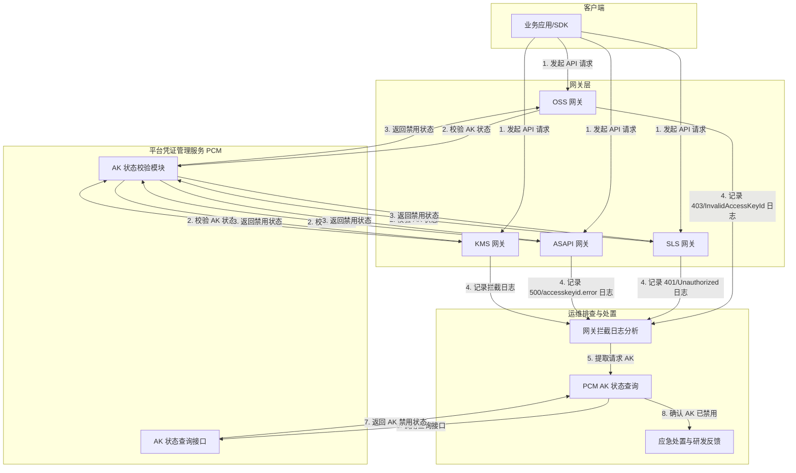
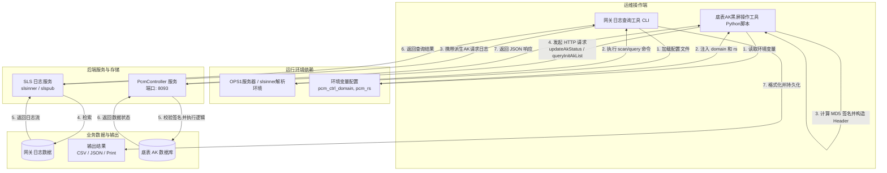
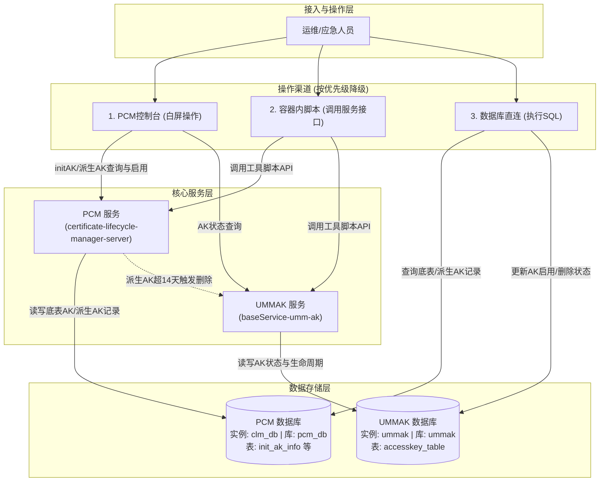

# 完整架构图

系统[[DDoS/DDoS基础防护/产品对内文档/完整架构图|完整架构图]]

[[PCM/平台凭证管理服务/index|平台凭证管理服务]]（PCM）的核心架构涵盖了从业务组件接入、凭证缓存与策略管控，到底层账户管理、网关认证、禁用 AK 拦截排查，以及核心运维工具与应急管控的全链路调用关系与业务流。系统包含控制台管理、接入代理（Tengine）、核心处理组件（Core/Controller）以及底层凭证与网关交互。

## 全链路业务架构

PCM 的全链路业务架构分为五个核心层次，展示了从应用层到网关层的完整调用关系与业务流：

### 架构模块与业务流说明

*   **云产品应用层**：各类云产品业务组件（Java/Go/Python等），通过集成 PCM SDK/CLI 获取和使用凭证。
*   **凭证接入层**：PCM SDK/CLI 提供多级缓存（内存/磁盘）和容错降级能力，保障凭证获取的高可用。若获取派生 AK 失败，SDK 会降级使用底表 AK。
*   **PCM 核心服务层**：
    *   **PCM Core**：缓存中间网关，负责请求鉴权、限流与凭证分发，缓解 Controller 压力并提供降级保护。
    *   **PCM Controller**：策略中心，负责派生 AK 的生成、凭证队列管理、模式管控及定期轮转。
*   **底层依赖与管控层**：依赖 UMM 进行 AK 生命周期管理，依赖 AAS 进行账户管理；包含数据面（如 `pcm_db` 数据库存储 `ak_info` 等表）和管控面（通过 PKM/PCM 控制台提供白屏化运维管控、AK 查询与启停管控）。
*   **网关与认证层**：业务组件最终使用获取到的凭证（派生 AK 或底表 AK）访问标准 AK 认证网关或 AK 私用服务，网关通过查询数据库校验 AK 的有效性与状态。

## 服务部署与接入架构

以下架构图展示了 PCM 核心组件的物理部署、Tengine 接入层代理以及日志监控体系：

### 部署模块说明

*   **接入层**：流量通过 Tengine 节点（Docker 容器）进行代理转发，支持多节点高可用。
*   **核心服务层**：PCM Core 负责处理 AK 申请与派生 AK 生成，并对底表 `secretARN` 进行 12 小时缓存；PCM Controller 负责底表与派生 AK 的管理及轮转状态控制。
*   **日志与监控**：Tengine 记录 Access/Error 日志，PCM Core 记录 AK 申请日志，便于问题排查与审计。

## 禁用 AK 场景业务流架构

在禁用 AK 场景下，PCM 展示了客户端请求经过不同网关（如 OSS、SLS、ASAPI、KMS 等）时的拦截调用关系，以及运维人员基于拦截日志进行排查和处置的完整业务流。

### 场景模块说明

*   **客户端与网关层**：业务应用或 SDK 发起 API 请求，流量经过 OSS、SLS、ASAPI、KMS 等各类业务网关。
*   **PCM 校验层**：网关调用 PCM 的 AK 状态校验模块，若 AK 处于禁用状态，PCM 返回禁用标识，网关据此拦截请求并记录特定的错误日志。
*   **运维排查与处置**：运维人员通过分析网关拦截日志提取请求 AK，调用 PCM 状态查询接口确认 AK 状态，随后进行应急处置并反馈研发侧排查根因。

## 核心运维工具架构

以下架构图展示了 PCM 中两大核心运维工具（网关日志查询工具、底表AK黑屏操作工具）的模块划分、运行环境依赖，以及与后端服务（SLS日志服务、PcmController服务）的调用关系和业务数据流。

### 运维工具模块说明

*   **网关日志查询工具**：依赖 OPS1 服务器或特定网络环境，通过 SLS 内部 Endpoint 检索网关日志数据，并将结果格式化输出为 CSV/JSON 等格式。
*   **底表AK黑屏操作工具**：依赖特定的环境变量（域名与签名盐值），通过计算 MD5 签名向 PcmController 发起 HTTP 请求，实现对底表 AK 数据库的状态查询与更新。

## 应急操作与管控架构

该架构展示了运维与应急人员在进行 AK 管控与应急处置时的操作渠道降级策略，以及核心服务层（PCM 服务与 UMMAK 服务）和数据存储层（PCM 数据库与 UMMAK 数据库）之间的交互与数据流转关系。

## 已知问题与注意事项

### 架构与服务端运行风险

| 风险点 | 详细说明 | 应对建议 |
| --- | --- | --- |
| **双容器日志排查遗漏** | PCM Core 部署在两个 Docker 容器上，排查 `error.log` 和 `access.log` 时若只查一个可能遗漏关键信息。 | 进行日志排查时，**必须同时查询两个 Docker 容器**的日志。 |
| **日志记录频率与缓存机制** | PCM Core 针对每个 IAMID 的底表 `secretARN` 缓存时间为 12 小时。 | 对于持续使用派生 AK 的产品，理论上每 12 小时会产生一条 AK 申请日志记录，排查时需结合此时间窗口分析。 |
| **队列级别配置风险** | 不推荐使用 `ClusterName` 级别划分派生 AK 队列。多集群叠加可能打满 UMM 账户的 AK 上限，导致无法创建新派生 AK。 | 推荐默认使用 `initAK` 级别。 |
| **轮转保护机制触发** | 在“产品最新派生 AK 保护”或“平台 AK 访问日志不可行/仍有调用”的情况下，队列会暂停轮转。 | 需关注日志，确保老凭证能被正常替换，避免队列堆积。 |
| **热升级兼容与灰度禁用** | 热升级项目中，原始凭证的通用能力不会被自动禁用。 | 如需禁用老凭证，必须通过观测日志在运维控制台（PKM）进行灰度操作，严禁一刀切。 |
| **极端故障下的中断风险** | 当 PCM 和应用同时宕机且 SDK 本地缓存丢失时，会导致业务中断。 | 此时需优先恢复 PCM 服务或使用老凭证应急脚本进行兜底。 |
| **底表禁用后 PCM 可用性联动风险** | 底表 AK 被 PCM 禁用后，凭据供给完全依赖 PCM 链路。若此时 PCM 不可用且本地无缓存，重启的服务将拿不到任何有效凭据，导致业务直接中断。 | 禁用底表 AK 前，务必确保 PCM 链路（Core + Controller）高可用，且客户端已成功缓存派生 AK。 |
| **模式变更不自动生效** | 管控模式从松到紧（如兼容模式到严格模式）变更时不会自动生效。 | 需在 ASO 页面人工确认处理，以防止误操作导致业务异常。 |
| **AK 私用场景适配进度** | 当前访问 AK 私用服务的云产品尚未强制要求适配。已适配产品通过 PCM 服务兑换原始底表 AK，未适配产品仍直接使用底表 AK。 | 需逐步推进改造以收口安全风险。 |
| **Core 限流基于 IP 存在误伤** | PCM Core 的限流策略基于客户端 IP。同一台机器运行多个产品组件时，高频产品可能耗尽 IP 限流配额，导致同 IP 下其他产品被连带返回 502。 | 检查 `access.log` 中 `limit_req_status`，使用 `tsar` 查看 QPS，必要时调整 `pcm_core.json` 中的限流配置。 |
| **半轮转模式首次获取失败** | 部分产品采用半自动轮转模式（仅启动时获取一次派生 AK）。若首次获取失败，产品将持续使用底表 AK 或无有效凭据运行，不会自动恢复。 | 确保首次启动时网络与 PCM 服务稳定；若失败需重启服务重新触发获取，或参考应急处置手册处理。 |
| **派生 AK 白屏查询限制** | 每个派生队列中，通过白屏仅可查询最近 14 把派生 AK。超期后 UMMAK 侧会执行删除操作，但 PCM 数据库会保留记录。 | 若白屏未查到目标 AK，可能是 14 天前派生的，需直连 PCM 数据库（`pcm_db`）进行查询和恢复。 |
| **UMMAK 容量上限限制** | UMMAK 侧每个 UID 下最大支持 1000 把有效 AK。达到上限后会导致派生失败。 | 定期通过 SQL 查询 `accesskey_table` 中 `access_count >= 1000` 的 UID，将环境内无用 AK 置为删除状态以释放容量。 |

### 客户端与 SDK 运行风险

| 风险点 | 详细说明 | 应对建议 |
| --- | --- | --- |
| **轮转状态异常显示** | 若 IAMID 包含 `CLOSE_AUTO_ROTATE` 标识则默认关闭自动轮转；若产品未更新 SDK 或仍在使用第 7 把 AK，会导致轮转状态显示为“已停止”。 | 检查 IAMID 标识，确保产品使用最新 PCM SDK，并排查是否有应用残留使用旧 AK。 |
| **链路增加延迟影响时间敏感业务** | 接入 PCM 后凭证获取链路增加，可能导致部分时间敏感服务延迟加大。 | SDK 增加了 1s 超时策略，支持通过 `PCM_TASK_DELAY` 环境变量设置访问 PCM 最大超时时间（默认 1000ms）。 |
| **无服务端时 SDK 频繁调用产生大量日志** | 环境中 PCM 服务（Core）未部署或不可达时，SDK 无法生成缓存，仍按配置间隔持续尝试连接，每次失败产生 WARN 级别日志，可能导致磁盘打满。 | 确认环境是否已部署 PCM Core；若未部署，需关注日志轮转配置或临时截断日志文件（不要 rm 正在写入的文件）。 |
| **存量旧版本 SDK 已知缺陷** | 部分环境存在旧版本 SDK，存在 CLI 不降级、Java 线程阻塞（`/dev/random` 熵值问题）、Go 日志不轮转等问题。 | 升级 Java SDK 至 `credprovider.plugin >= 1.0.8`，Go SDK 至 `>= 2512` 版本，CLI 更新至 2025-12-23 及以上版本。 |

### 控制台与日常管理注意事项

| 风险点 | 详细说明 | 应对建议 |
| --- | --- | --- |
| **底表 AK 禁用限制** | 当前控制台未提供白屏化的底表 AK 禁用能力。 | 若需禁用底表 AK，请严格参照相关变更文档进行操作，或通过黑屏工具/数据库处理。 |
| **派生 AK 密钥保存** | 手动创建派生 AK（临时 AK）时，对应的 SK 明文**仅在创建成功后的弹窗内展示一次**。 | 关闭弹窗后系统不再显示且不提供找回能力，务必在创建成功后立即复制并妥善保存。 |
| **认证状态失败提示** | 在 AK 申请详情中，若提示“认证状态失败”，仅表示填写的 IAMID 格式不规范。 | 此提示**不会对实际的 AK 申请和生成结果产生任何影响**，可忽略或修正 IAMID 格式。 |

### 运维工具与操作风险

| 风险点 | 详细说明 | 应对建议 |
| --- | --- | --- |
| **应急操作优先级规范** | 应急处置时需严格遵循降级顺序，避免越级操作带来不可控风险。 | 严格遵循：**控制台白屏 > 调用接口（容器脚本） > 数据库执行 SQL**。优先白屏，不可用时用脚本，最后直连数据库。 |
| **全量底表 AK 解禁限制** | 当前系统暂不支持通过白屏解禁全量底表 AK。 | 若需启用全量底表 AK，必须通过容器内执行脚本或直接操作数据库（先查 PCM 库获取禁用的 initAK，再更新 UMMAK 库状态）。 |
| **SLS 凭证轮转未自动适配** | 网关日志查询工具配置文件中的 SLS 访问凭证目前未自动适配 PCM 轮转机制。 | 配置时，必须通过 PCM 控制台手动获取对应的派生 AK 并填入配置文件中。 |
| **运行环境网络限制** | 网关日志查询工具必须上传至 **OPS1 服务器**运行，或者部署在能够解析 `slsinner` 内部域名的特定网络环境中。 | 否则无法访问 SLS 内部 Endpoint。 |
| **环境变量强依赖** | 底表AK黑屏操作工具强依赖环境变量 `pcm_ctrl_domain`（PcmController 域名）和 `pcm_rs`（签名盐值）。 | 运行脚本前必须确保这两个环境变量已正确注入，否则工具将直接报错退出。 |
| **签名时间戳校验风险** | 底表AK黑屏操作工具通过 `pcm_rs` 与当前毫秒时间戳拼接计算 MD5 签名（放入 `X-ASO-Inner-Request-Signature` 请求头）。 | 请确保运行脚本的机器**时间同步（NTP）**，避免因时间偏差过大导致 PcmController 服务端签名校验失败。 |
| **全量操作高危预警** | 在使用底表AK黑屏操作工具的 `enable-all` 或 `disable-all` 命令时，会遍历并修改所有底表 AK 的状态。此操作影响面广。 | 执行前请务必确认业务影响并做好评估。 |

### 禁用 AK 排查与处置规范

*   **优先日志判定**：当遇到访问报错且怀疑是 PCM 禁用 AK 导致时，必须优先通过网关拦截日志进行判定，提取日志中的请求 AK。
*   **状态确认与处置**：提取 AK 后，需通过 PCM 服务查询 AK 状态。如果确认已经禁用，需立即采用应急处置方案进行处置，并反馈研发侧排查原因。
*   **网关拦截日志特征差异**：不同网关在拦截禁用 AK 时的日志特征和错误码存在差异，排查时需准确识别：
    *   **OSS**：状态码 `403`，错误码 `InvalidAccessKeyId`。
    *   **SLS**：状态码 `401`（Unauthorized），错误信息包含 `AccessKeyId is disabled`。
    *   **ASAPI**：状态码 `500`，错误码 `asapi.server.request.parameter.accesskeyid.error`，提示 `The Access Key is disabled`。
    *   **KMS**：记录相应的拦截日志（具体错误码与状态码参考 KMS 网关规范）。