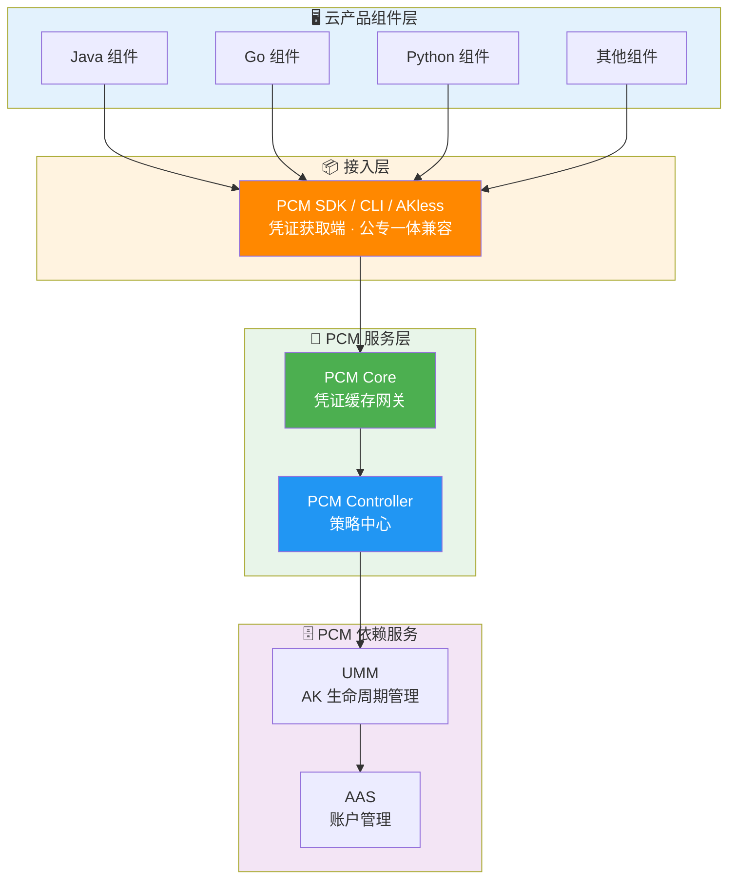
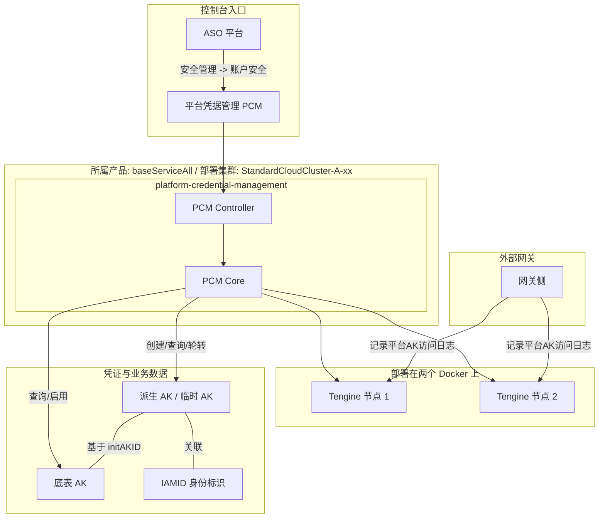
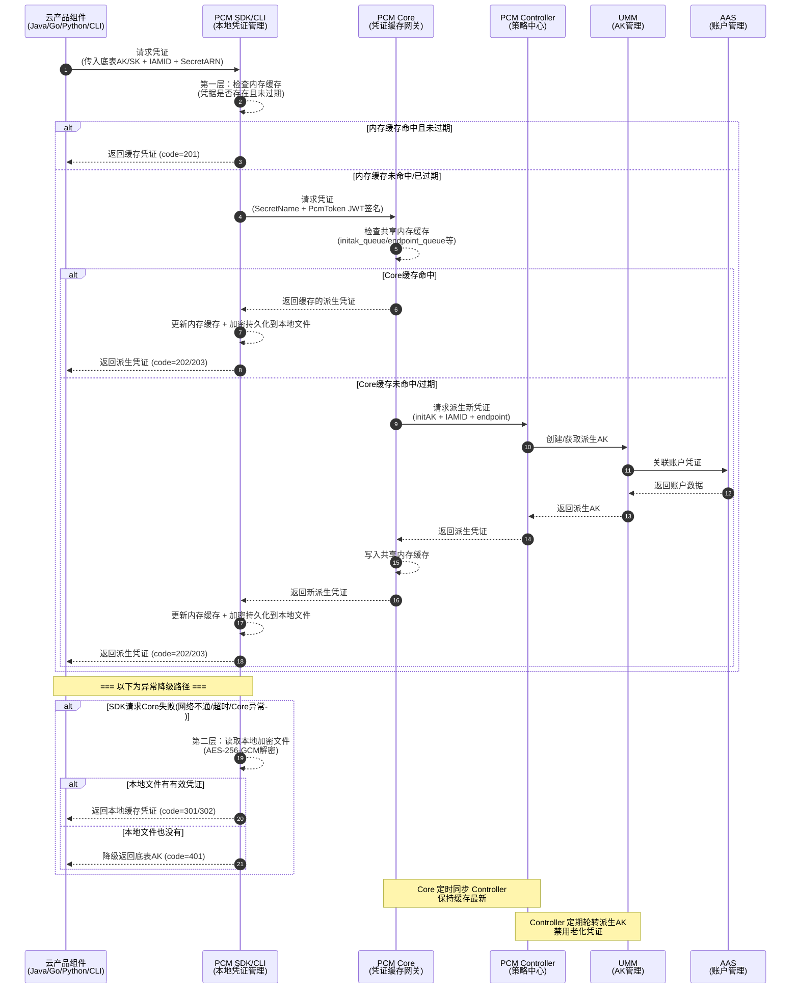

# 完整架构图

以下为 [[PCM/平台凭证管理服务/index|平台凭证管理服务]]（PCM）的系统CIAM/产品对内文档/完整架构图|完整架构图]]|完整架构图]]|完整架构图]]|完整架构图]]|完整架构图]]|完整架构图]]，展示了云产品组件层、接入层、PCM 服务层以及底层依赖服务之间的模块划分与调用关系：

以下为 [[PCM/PCM/index|PCM]] 的部署与数据流转架构图，展示了控制台入口、核心服务层、接入与代理层、外部网关以及凭证数据之间的关联关系：

## 业务调用时序图

以下为应用通过 PCM SDK 获取派生 AK 的完整业务流与调用时序，包含正常获取路径与异常降级路径：

## 架构组件与模块说明

### PCM SDK / CLI（凭证获取端）
**职责**：为云产品应用提供接入能力，直接与 PCM 服务交互获取新凭证，支持多种容错策略。
**核心特性**：
*   **多级缓存**：在本地内存、磁盘均有缓存。
*   **容错降级**：PCM 初始化服务异常或报错时，将入参作为凭证返回；如果有缓存，将返回最近一次从服务端获取的凭证。

### PCM Core（缓存中间网关）
**职责**：SDK 与 Controller 之间的访问中间网关，缓存 Controller 最新凭证数据，为 SDK 提供 API 获取最新凭证，缓解 Controller 访问压力，提高 SDK 访问响应速度。
**核心特性**：
*   **本地缓存 + 定时同步**：本地缓存并定时同步 PCM Controller 的最新凭证信息，减少直接访问 Controller 的频率。
*   **缓存隔离**：缓存数据仅服务于已认证的 SDK 请求，不对外暴露。
*   **降级保护**：Core 宕机后，末期过期老凭证行为暂停，SDK 返回上次获得的老凭证（未在窗口期末尾），依然可以使用。
*   **压力缓解**：作为中间层，避免所有 SDK 请求直接打到 Controller，防止策略大脑被击穿。

### PCM Controller（策略中心）
**职责**：PCM 凭证管控核心，执行凭证生命周期管理，提供 PKM 白屏管控、日志查询关联、状态管理能力，支持热升级后以运维变更方式将老凭证进行禁用。
**核心特性**：
*   **凭证队列管理**：为每个被托管凭证创建主动过期的凭证队列，定期清洗禁用老化派生凭证。
*   **模式管控**：根据 `controlByPcm` 配置执行不同模式（CompatibilityMode / StrictMode / initStrictMode）。
*   **松→紧变更不自动生效**：模式从松到紧变更时不自动生效，需 ASO 页面提示人工处理，防止误操作。
*   **灰度禁用**：支持热升级后以运维变更方式逐步禁用老凭证，而非一刀切。
*   **白屏管控（PKM）**：提供可视化的凭证管理界面，降低运维门槛。
*   **日志查询关联**：提供日志查询能力，关联 AK 使用记录，判断是否可以安全禁用。
*   **状态管理**：管理每个凭证的当前状态（轮换中/已禁用/正常等）。

### UMM（AK 生命周期管理）
**职责**：PCM 依赖服务，负责 AK 的存储与生命周期管理，接收 Controller 指令执行凭证轮换和禁用操作。

### AAS（账户管理服务）
**职责**：PCM 依赖服务，负责平台账户统一管理，与 UMM 联动形成账户-凭证关联关系。

## 已知问题与注意事项

### 高可用与容错降级逻辑

在架构调用过程中，针对不同异常场景的 SDK 行为及业务影响如下：

| 场景 | SDK 行为 | 业务影响 |
| --- | --- | --- |
| 新部署时 PCM Core 还未 ready | 将入参作为返回 | 无影响（Core 未禁用老 AK） |
| 运行时 PCM Core 挂了 | 返回上次获取的老凭证（未在窗口期末尾） | 无影响 |
| 产品独立升级，PCM 未 ready | 将入参作为返回 | 无影响 |
| PCM 和应用都挂了需重拉（SDK 缓存未丢失） | 返回上次获取的老凭证 | 无影响 |
| PCM 和应用都挂了需重拉（SDK 缓存丢失） | **需先恢复 PCM 或使用老凭证应急脚本** | **业务中断** |

### 热升级与兼容策略

*   **新部署项目**：根据 `restrict` 取值禁用原始通用能力，应用使用凭证进入定时轮换状态。
*   **热升级项目**：原始凭证**不禁用**其通用能力，进入定时轮换状态；如需禁用老凭证，通过观测日志在运维控制台灰度进行。
*   **非 PCM 托管凭证**：一切照旧；若使用了 PCM SDK/CLI 但未被托管，将入参 initAK 返回让应用接着使用。

### 派生 AK 管理与配置规范

*   **派生 AK 队列级别风险**：不推荐使用 `ClusterName` 级别划分派生 AK 队列。多集群会为同一个底表 AK 创建多个独立队列，叠加后可能打满 UMM 账户的 AK 上限，导致无法创建新的派生 AK。推荐默认使用 `initAK` 级别（全局共享）。
*   **派生 AK 密钥保存**：创建派生 AK（临时 AK）后，对应的 SK 明文**只会在创建成功后的弹窗内展示**，关闭弹窗后系统内不再显示。如果不慎关闭弹窗，需要重新创建临时 AK，系统不对外提供 SK 明文信息能力。
*   **派生 AK 创建规范**：
    *   `initAKID` 必须是托管到 PCM 的基线或底表 AK（要与所使用账号的原始 AK 对应）。
    *   `申请者ID`（IAMID）是服务的身份标识，常规为“集群 + `:` + sr”拼接而成（如：`StandardCloudCluster-A-20250906-00bf:PcmController`）。若系统提示已存在，可在后面拼接任意字符串。
    *   有效天数范围严格限制在 1~365 天。
*   **AK 申请状态说明**：在 AK 申请详情中，若“认证状态”显示失败，仅表示 IAMID 不规范，**不会对申请结果有任何影响**。

### 轮转状态与日志排查

*   **平台 AK 访问日志状态限制**：当前平台 AK 访问日志处于“不可行”状态，PCM 无法确认即将禁用的派生 AK 是否仍有产品在调用。为保护正在使用中的凭证，系统会在第一把队列即将禁用时停止轮转。
*   **轮转状态停止排查**：若发现轮转状态已停止，除了上述日志限制导致的保护性停止外，还可能包括以下原因：
    1.  IAMID 中有 `CLOSE_AUTO_ROTATE` 状态，表示该队列默认不轮转。
    2.  使用该产品的队列中，有产品未及时更新。
    3.  使用该队列的产品中，有产品仍在第 7 把 AK。
*   **部署与日志排查**：PCM Core 部署在两个 Docker 上，排查 error 日志和 access 日志时，**必须两个 Docker 都去查询**。
*   **日志记录与缓存机制**：PCM Core 中针对每个 IAMID 的底表 secretARN 的缓存时间为 12 小时。对于一直在用派生 AK 的产品，理论上每 12 小时会有一条 AK 申请日志记录。

### 其他限制说明

*   **底表 AK 管理限制**：系统未提供白屏底表 AK 禁用能力，底表 AK 禁用操作请详见相关变更文档。

## 源码仓库

*   **PCM-core**：[https://code.alibaba-inc.com/aliyunas_sectech/pcm-core](https://code.alibaba-inc.com/aliyunas_sectech/pcm-core)
*   **PCM-controller**：[https://code.alibaba-inc.com/aliyunas_sectech/pcm-controller](https://code.alibaba-inc.com/aliyunas_sectech/pcm-controller)