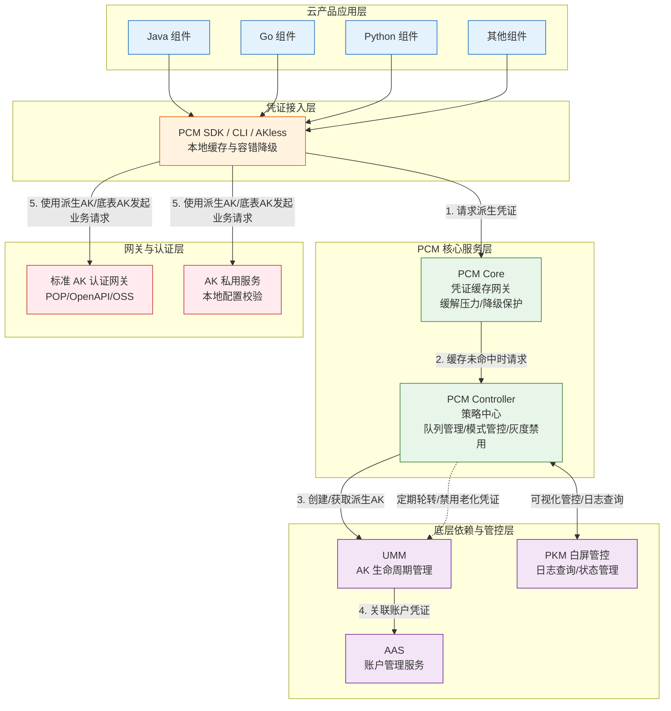

# 完整架构图

**系统[[DDoS/DDoS基础防护/产品对内文档/完整架构图|完整架构图]]**

平台凭证管理服务（PCM）的完整架构分为五个核心层次，涵盖了从业务组件接入、凭证缓存与策略管控，到底层账户管理及网关认证的全链路调用关系与业务流：

**架构模块与业务流说明**

*   **云产品应用层**：各类云产品业务组件（Java/Go/Python等），通过集成 PCM SDK/CLI 获取和使用凭证。
*   **凭证接入层**：PCM SDK/CLI 提供多级缓存（内存/磁盘）和容错降级能力，保障凭证获取的高可用。
*   **PCM 核心服务层**：包含 PCM Core（缓存中间网关，缓解 Controller 压力并提供降级保护）和 PCM Controller（策略中心，负责凭证队列管理、模式管控及定期轮转）。
*   **底层依赖与管控层**：依赖 UMM 进行 AK 生命周期管理，依赖 AAS 进行账户管理，并通过 PKM 提供白屏化运维管控与日志查询。
*   **网关与认证层**：业务组件最终使用获取到的凭证（派生 AK 或底表 AK）访问标准 AK 认证网关或 AK 私用服务。

**已知问题和注意事项**

| 关注点 | 详细说明与应对建议 |
| --- | --- |
| **队列级别配置风险** | 不推荐使用 `ClusterName` 级别划分派生 AK 队列。多集群叠加可能打满 UMM 账户的 AK 上限，导致无法创建新派生 AK。推荐默认使用 `initAK` 级别。 |
| **轮转保护机制触发** | 在“产品最新派生 AK 保护”或“平台 AK 访问日志不可行/仍有调用”的情况下，队列会暂停轮转。需关注日志，确保老凭证能被正常替换，避免队列堆积。 |
| **热升级兼容与灰度禁用** | 热升级项目中，原始凭证的通用能力不会被自动禁用。如需禁用老凭证，必须通过观测日志在运维控制台（PKM）进行灰度操作，严禁一刀切。 |
| **极端故障下的中断风险** | 当 PCM 和应用同时宕机且 SDK 本地缓存丢失时，会导致业务中断。此时需优先恢复 PCM 服务或使用老凭证应急脚本进行兜底。 |
| **AK 私用场景适配进度** | 当前访问 AK 私用服务的云产品尚未强制要求适配。已适配产品通过 PCM 服务兑换原始底表 AK，未适配产品仍直接使用底表 AK，需逐步推进改造以收口安全风险。 |
| **模式变更不自动生效** | 管控模式从松到紧（如兼容模式到严格模式）变更时不会自动生效，需在 ASO 页面人工确认处理，以防止误操作导致业务异常。 |