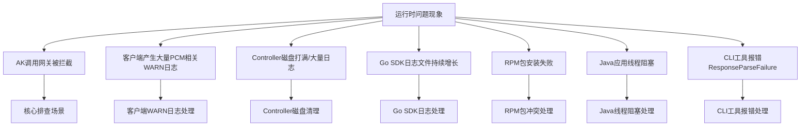

# QA（高频问答）

应急操作优先建议控制台白屏操作，当白屏无法访问时，采用在容器中执行脚本（调用服务接口），当容器无法访问时，直接在数据库中执行 SQL。

**优先级：控制台白屏 > 调用接口（容器脚本） > 数据库执行 SQL**

## 常见问题排查总览



## 如何启用某个已经禁用的 initAK？

**适用场景**：确认因为某把 AK 被禁用而影响业务。

### 白屏操作

通过 PCM 控制台的 initAK 管理功能查询特定 AK，并在操作中启用该 AK。


### 调用接口（容器中执行脚本）

当白屏不可用时，采用此方案。通过底表 AK 黑屏操作工具调用接口实现。

- **运行位置**：进入 PcmController 容器（Product: baseServiceAll → sn: platform-credential-management → sr：PcmController#），在任意一台容器操作即可。
- **执行命令**：
  ```bash
  # 启用单个 AK
  python3 manage_ak_status.py enable --ak <AK_ID>
  ```

> 工具源码及详细说明参考：[《工具》](https://alidocs.dingtalk.com/i/nodes/7NkDwLng8Za7QYkeHxdzN0A7JKMEvZBY?utm_scene=team_space&iframeQuery=anchorId%3Duu_mocpgly2iwborsrkk7e)

### 数据库操作

当白屏、容器均不可用时，采用此方案。

1. AK 状态存储在 UMMAK 数据库中，进入 UMMAK 数据库：
   - service：baseService-umm-ak
   - db实例：ummak
   - 数据库：ummak
2. 执行 SQL：
```sql
update accesskey_table set enabled_flag=1 where access_id = {akid};
```

## 如何启用全量底表 AK？

**适用场景**：环境内存在被底表 AK 禁用而影响业务，涉及多把底表 AK 或无法确认某把底表 AK，可采用启用全量底表 AK。

**注意**：暂不支持通过白屏解禁全量 AK。

### 调用接口（容器中执行脚本）

当白屏不可用时，采用此方案。通过底表 AK 黑屏操作工具调用接口实现。

- **运行位置**：进入 PcmController 容器（Product: baseServiceAll → sn: platform-credential-management → sr：PcmController#），在任意一台容器操作即可。
- **执行命令**：
  ```bash
  # 启用全部底表 AK
  python3 manage_ak_status.py enable-all
  ```

> 工具源码及详细说明参考：[《工具》](https://alidocs.dingtalk.com/i/nodes/7NkDwLng8Za7QYkeHxdzN0A7JKMEvZBY?utm_scene=team_space&iframeQuery=anchorId%3Duu_mocpgly2iwborsrkk7e)

### 数据库操作

当容器不可访问时，采用此方案。

1. 先获取全量底表 AK，PCM 托管的底表 AK 存储在 clm_db 实例的 pcm 数据库中：
   - service：certificate-lifecycle-manager-server
   - db实例：clm_db
   - 数据库：pcm_db
   - 进入 clm_db 实例数据库后切换到 pcm_db：
     ```sql
     use pcm_db;
     ```
   - 检索已经禁用的 initAK：
     ```sql
     select access_key_id from init_ak_info where umm_ak_status = 0;
     ```
2. 在 UMMAK 中启用全量底表 AK：
   - service：baseService-umm-ak
   - db实例：ummak
   - 数据库：ummak
   - 执行 SQL（执行前，将 `access_id` 字段参数改成步骤一中检索到的底表 AK 信息）：
     ```sql
     update accesskey_table set enabled_flag=1 where access_id in ('qNNm2yFXF70Zy6Hx','qNNm2yFXF70Zy6Hx2','qNNm2yFXF70Zy6Hx3');
     ```

## 如何启用派生 AK？

**适用场景**：确认某把派生 AK 被禁用影响业务。

### 白屏操作

白屏支持查询派生 AK，查询后可通过启用操作恢复。


> **注意事项**：
> 每个派生队列中通过白屏仅可以查询最近 14 把派生 AK，如果超过 14 把 AK 后，会在 ummak 侧执行删除操作，但 pcm 数据库会保留派生 AK 记录。当通过白屏未查询到该 AK，有可能是 14 天前派生的 AK，可通过 pcm 数据库进行查询。

### 数据库操作

1. 查询派生 AK：
   - service：certificate-lifecycle-manager-server
   - db实例：clm_db
   - 数据库：pcm_db
   - 进入 clm_db 实例数据库后切换到 pcm_db：
     ```sql
     use pcm_db;
     ```
2. 在 UMMAK 中启用：
   - 如果存在，直接更新启用状态：
     ```sql
     update accesskey_table set enabled_flag=1,hidden_flag=0,deleted_flag=0 where access_id='qNNm2yFXF70Zy6Hx';
     ```
   - 如果已经删除，创建 AK（说明：`access_id` 为 akid，`access_key` 为 sk，`user_id` 为账号）：
     ```sql
     INSERT INTO `ummak`.`accesskey_table` (`access_id`, `access_key`, `user_id`) VALUES ('000cFXr3DBPZHxML11', 'XE5sP5dF6asjJsCkxL4QYifS7rRU11', '999999999');
     ```

## 如何处理容量告警场景？

**适用场景**：UMMAK 侧每个 uid 下最大 1000 把有效 AK，当达到 1000 把以后会出现派生失败的情况（家里测试环境出现过，现场暂未出现）。

参考：[《容量问题数据处理》](https://alidocs.dingtalk.com/i/nodes/QG53mjyd800agdlKHbek2aXQ86zbX04v)

### 查询

1. 检查特定 uid 下（如 1000000047）的 AK 数量：
   ```sql
   SELECT user_id, COUNT(access_id) AS access_count FROM accesskey_table where user_id = '1000000047' GROUP BY user_id;
   ```
2. 查询是否有 uid 下的 AK 超过 1000：
   ```sql
   SELECT user_id, COUNT(access_id) AS access_count FROM accesskey_table GROUP BY user_id HAVING access_count >= 1000;
   ```

### 清理

分析出环境内已经无用的 AK，在 ummak 中置成删除状态：

```sql
update accesskey_table set enabled_flag = 0, deleted_flag = 1 , modified_time = UNIX_TIMESTAMP() where access_id in (xxxxx);
```

## 如何查询网关日志中的 AK 使用情况？

**适用场景**：需要通过网关和事件 ID 查询日志详细信息，或者在网关日志中扫描底表 AK 的使用情况。

### 工具配置

将配置文件与 CLI 工具放在相同目录下。配置示例如下：

```yaml
# 服务端简化配置
sls:
  # 访问凭证（此处未自动适配pcm轮转，直接填 PCM 轮转后的 AK，通过pcm控制台手动获取派生AK）
  credentials:
    sls:   # test1000000004@aliyun.com 对应的派生AK                  
      access_key_id: "RONVzQyJJR2kRoLP" 
      access_key_secret: "hvZ8oi0vWJXjWERK9VVe3j3qm2IYwK" 
    defaultUser:  # aliyuntest 对应的派生ak           
      access_key_id: "beF7AyHhnIjY3eGy"  
      access_key_secret: "2R838QLvk0wjkGxL9mTPMlL1xWFX4q"

  # Endpoint 配置
  inner_endpoint: "data.cn-wulan-env17e-d01.sls.inter.env17e.shuguang.com"        # slsinner
  pub_endpoint: "data.cn-wulan-env17e-d01.sls-pub.inter.env17e.shuguang.com"      # slspub

scan:
  hours_back: 10       # 扫描周期
  page_size: 1000      # 默认 可不修改
  max_workers: 20      # 默认 可不修改 
  auto_create_index: false  # 发现无索引时是否自动创建（true=自动创建，false=跳过）

output:
  path: "./output"
  format: "all"  # 可选: print, json, csv, all
```

### 上传与运行

将工具上传到 OPS1 服务运行（或可以解析 slsinner 的环境）。

### 使用指南

1. **根据事件 ID 查询使用 AK**
   ```bash
   ./main query --gateway <网关代码> --keyword "<事件ID或关键字>"
   ```
   *示例：`./main query --gateway OSS --keyword "tzRzgmefjFjXBC4C"`*

2. **遍历网关中底表 AK 调用记录**
   ```bash
   ./main scan
   ```
   扫描记录将自动存储在相对路径的 `output/scan_result_{时间戳}.csv`（或 json 等配置格式）中。

## 接入 PCM 后出现大量报错日志，是否有影响？

**现象**：接入 PCM 后出现大量报错日志。
**解答**：
- 2507 版本 PCM 服务端尚未部署时，部分适配了 PCM 的产品可能访问 PCM 报错，但因降级返回了原始底表 AK，**不影响业务调用**。如果调用非常频繁，可能产生大量错误日志。
- 部分产品升级至 3186-2510 及以上版本，但 baseServiceAll 未升级，可能同样出现以上问题。

## 如何判断底表 AK 是否禁用？

**解答**：可通过运维手册 [《PCM运维手册》](https://alidocs.dingtalk.com/i/nodes/amweZ92PV6DbOdgzUK4on0qD8xEKBD6p?utm_scene=team_space&iframeQuery=anchorId%3Duu_mo8cms9ciyzk8jo83x) 中的方法进行查询。

## 如何判断派生 AK 是否禁用？

**解答**：当前输出版本（3186、320）默认均不禁用派生 AK。

## 时间敏感服务接入 PCM 后延迟加大如何处理？

**现象**：接入 PCM 后可能导致部分时间敏感服务延迟加大，且网络可能出现延迟。
**解答**：
对于时间敏感服务，增加了 1s 超时策略。支持通过 `PCM_TASK_DELAY` 环境变量设置访问 PCM 的最大超时时间（单位：ms）。
- **默认值**：1000ms（即 1s）。
- **适用版本**：1.13-SNAPSHOT (20250908) 及以上。

## AK 调用网关被拦截如何排查？

**现象**：产品调用网关时报 AK 被禁用/AK 无效/AK 不存在。这是 PCM 接入后最核心的排查场景。
**排查步骤**：
1. **判断 AK 类型**：从网关日志中取出被拦截的 AK ID，在控制台查询是底表 AK 还是派生 AK。
   - **底表 AK**：直接通过控制台查询。
     
   - **派生 AK**：控制台仅可查询每个队列最近 14 把派生 AK。
     
     若未查到，可进入 `clm_db` 实例的 `pcm_db` 数据库查询：
     ```sql
     use pcm_db;
     select * from ak_info where access_key_id='****';
     ```
2. **分支一：底表 AK 被拦截**
   - **原因**：产品在使用底表 AK，说明 SDK 没有成功获取派生 AK，走了降级逻辑，或使用底表 AK 未适配。
   - **处理**：先在 PCM 控制台启用该底表 AK 恢复业务；然后查 SDK 日志 code 确认降级场景（参考下方 Core 错误码）。
3. **分支二：派生 AK 被拦截**
   - **原因**：产品已使用派生 AK，但该 AK 已被轮转禁用。最可能原因为仅获取一次，未持续轮转。
   - **处理**：通常重启服务会刷新 AK 导致可用，然后停止该队列的轮转。
     
     若无法重启，需手动启用 AK（参考 [《PCM应急处置》](https://alidocs.dingtalk.com/i/nodes/MNDoBb60VLYDGNPytBomBqkPJlemrZQ3?utm_scene=team_space&iframeQuery=anchorId%3Duu_mo)）。

## 常见网关 AK 拦截日志特征及示例

当遇到访问报错，怀疑是 PCM 禁用 AK 导致的，优先通过拦截日志判定。提取日志中的请求 AK，并通过 PCM 服务查询 AK 状态，如果已经禁用，采用应急处置方案进行处置，并反馈研发侧排查原因。

下面是常见网关 AK 被禁用示例，可做参考：

### OSS

**拦截特征**：
- `"error_code": "InvalidAccessKeyId"`
- `"status": "403"`

**日志示例**：
```json
{"__tag__:__hostname__": "c25g07018.cloud.g07.amtest17", "__tag__:__pack_id__": "B06A0AF67C8DC2DB-1EF", "__tag__:__path__": "/apsara/module_logs/oss_tengine/access_log.2026042415", "__topic__": "", "acc_src_oms_region": "-", "access_id": "5hN1RkUhRn43iNfw", "bucket_enable": "-", "bucket_storage_type": "standard", "bucket_version": "1774332774", "bucketname": "cn-wulan-env17e-d01-as-console-cdn", "content_length_in": "-", "content_length_out": "476", "delta": "-", "error_code": "InvalidAccessKeyId", "host": "cn-wulan-env17e-d01-as-console-cdn.oss-cn-wulan-env17e-d01-a.intra.env17e.shuguang.com", "http_referer": "-", "in_length": "335", "ip": "10.17.46.36", "length": "476", "method": "GET", "objectname": "-", "objectsize": "-", "operation": "GetBucketAcl", "oss_acc_linetype": "-", "oss_data_location": "-", "oss_location": "oss-cn-wulan-env17e-d01-a", "oss_request_type": "-", "owner": "999999999", "process_type": "-", "ref_url": "aliyun-sdk-java/3.8.0(Linux/4.19.91-007.ali4000.alios7.x86_64/amd64;1.8.0_172)", "remote_port": "58066", "remote_user": "-", "request_id": "69EB1A0A3E6DA93539F3A4CE", "request_payer_account": "-", "requester": "-", "response_time": "0", "scheme": "http", "select_real_ip": "-", "sign_type": "-", "status": "403", "sync_direction": "-", "sync_source_bucket": "-", "sync_transfer_type": "-", "target_object_storage_class": "-", "time": "24/Apr/2026:15:21:46", "turn_around_time": "0", "url": "/?acl", "vpcaddr": "978325770", "vpcid": "0"}
```

### SLS_INNER

**日志示例**：
```json
{"APIVersion": "0.6.0", "AccessKeyId": "cmchJQg057pBelHD", "Acl": "0", "AliUid": "", "CallerType": "Parent", "ClientIP": "10.17.160.103", "ConsumerGroup": "suspicous_group", "ExOutFlow": "0", "InFlow": "0", "Latency": "292", "Lines": "0", "LogStore": "big_data_event", "Method": "GetConsumerGroupCheckPoint", "NetFlow": "0", "OutFlow": "88", "ProjectId": "136", "ProjectName": "k8sblink", "RequestId": "69EB0C444B76F491098A2F35", "Source": "10.17.160.103", "Status": "401", "TunnelId": "0", "UserAgent": "aliyun-log-sdk-java-0.6.64/1.8.0_412", "UserId": "-2", "__THREAD__": "2418", "__tag__:__hostname__": "c25h05123.cloud.h06.amtest17", "__tag__:__pack_id__": "8ADDDFFBE647F7C-5", "__tag__:__path__": "/apsara/fcgi_agent/ols_operation_2.LOG", "__topic__": "", "microtime": "1777011780130296"}
```

### SLS_PUB

**日志示例**：
```json
{"__THREAD__": "80679", "Method": "ListShards", "Status": "401", "ClientIP": "10.17.31.30", "Latency": "70", "TunnelId": "", "NetFlow": "0", "UserId": "-2", "AliUid": "", "Acl": "0", "AccessKeyId": "Khz7a1kmKMZDCBXj", "Owner": "1000000004", "CallerType": "Parent", "ProjectName": "ali-cdsslshybridcluster-a-20260323-015f-sls-admin", "ProjectId": "2", "UserAgent": "aliyun-log-sdk-java-0.6.64/1.8.0_352", "APIVersion": "0.6.0", "RequestId": "69D6169B34510383396636E7", "Source": "10.17.31.30", "OutFlow": "87", "ExOutFlow": "0", "NetworkType": "intranet", "InFlow": "0", "LogStore": "sls_operation_agg_log", "RequestType": "unknown", "ErrorCode": "Unauthorized", "ErrorMsg": "AccessKeyId is disabled: Khz7a1kmKMZDCBXj", "microtime": "1775638171568514", "__topic__": "", "__tag__:__hostname__": "c25g09017.cloud.g09.amtest17", "__tag__:__path__": "/apsara/sls/fcgi_agent/ols_operation.LOG", "__tag__:__pack_id__": "6C68CE91F5F727CA-12A"}
```

### ASAPI

**日志示例**：
```json
{"EagleeyeRpcId": "0.1.1", "EagleeyeTraceId": "0a11243f17770122001463084d0062", "LocalIp": "10.17.36.63", "__tag__:__hostname__": "vm010017036063", "__tag__:__pack_id__": "890EE1DC2FE689D1-774", "__tag__:__path__": "/apsara/cloud/data/asapi/ApiServer#/api-server/logs/asapi-logger/audit.log", "__topic__": "", "accessKeyId": "VidKjhddRaas4tMA", "apiId": "", "apiName": "ListAllLevel1Orgs", "apiVersion": "2019-05-10", "app": "api-server", "asapiHandleTime": "2026-04-24T06:30:00Z", "callerIp": "10.17.32.38", "callerRequestTime": "2026-04-24T06:30:00Z", "callerSource": "aso-ecsops", "category": "PassThrough", "cost": "148ms", "costMs": "148", "doForward": "", "domain": "internal.asapi.cn-wulan-env17e-d01.intra.env17e.shuguang.com", "endTime": "1777012200296", "errorCode": "asapi.server.request.parameter.accesskeyid.error", "errorMessage": "The specified AccessKey ID (VidKjhddRaas4tMA) is invalid. Details: (The Access Key is disabled.).", "errorSuggestion": "Check whether the AccessKey pair exists and is enabled.", "errorTitle": "The AccessKey pair in the request is invalid.", "errorType": "Business", "headers": "{\"x-acs-caller-sdk-language\":\"java\",\"x-acs-caller-sdk-version\":\"1.0.7.3-RELEASE\",\"User-Agent\":\"AlibabaCloud (Linux; amd64) Java/1.8.0_412-b0 Core/1.0.7.3-RELEASE\",\"Host\":\"internal.asapi.cn-wulan-env17e-d01.intra.env17e.shuguang.com\",\"Accept-Encoding\":\"gzip,deflate\",\"X-Tunnel-Id\":\"0\",\"x-acs-caller-sdk-source\":\"aso-ecsops\",\"x-acs-caller-ip\":\"10.17.32.38\",\"Version\":\"2019-05-10\",\"Signature\":\"yYR8ABsJ0HdFvrIP+cR+3aMhh2pIgA3Pdxjt1kTrBYU=\",\"X-Forwarded-For\":\"10.17.32.38\",\"request-source-domain\":\"internal.asapi.cn-wulan-env17e-d01.intra.env17e.shuguang.com\",\"request-source-type\":\"internal\",\"Content-Length\":\"284\",\"x-acs-content-sha256\":\"9f65af4562de665feb8671613e202f7657ed96edcdc13ca89bba634602a467a6\",\"eagleeye-rpcid\":\"0.1\",\"X-Real-IP\":\"10.17.32.38\",\"Content-Type\":\"application/json; charset=UTF-8\"}", "httpCode": "0", "httpMethod": "POST", "isPublic": "true", "language": "-", "message": "Failed to invoke ListAllLevel1Orgs/2019-05-10/ascm ", "organizationId": "1", "organizationTreeParse": "0.1.", "parameters": "{\"SignatureVersion\":\"2.1\",\"Action\":\"ListAllLevel1Orgs\",\"SignatureNonce\":\"9ad7af25-91d9-4bbd-af00-b49a1b715fc9\",\"Version\":\"2019-05-10\",\"AccessKeyId\":\"VidKjhddRaas4tMA\",\"Product\":\"ascm\",\"SignatureMethod\":\"HMAC-SHA256\",\"RegionId\":\"cn-wulan-env17e-d01\",\"Timestamp\":\"2026-04-24T06:30:00Z\"}", "passthroughMode": "", "productName": "ascm", "realIp": "10.17.32.38", "regionId": "cn-wulan-env17e-d01", "requestId": "0a11243f17770122001463084d0062", "requestSourceDomain": "internal.asapi.cn-wulan-env17e-d01.intra.env17e.shuguang.com", "response": "{\"openapiFullResult\":{\"data\":{\"eagleEyeTraceId\":\"0a11243f17770122001463084d0062\",\"asapiSuccess\":false,\"product\":\"ascm\",\"code\":\"asapi.server.request.parameter.accesskeyid.error\",\"cost\":0,\"errorType\":\"Business\",\"dynamicMessages\":[\"VidKjhddRaas4tMA\",\"The Access Key is disabled.\"],\"suggestion\":\"Check whether the AccessKey pair exists and is enabled.\",\"errorCode\":\"asapi.server.request.parameter.accesskeyid.error\",\"asapiVersion\":\"v4\",\"message\":\"The specified AccessKey ID (VidKjhddRaas4tMA) is invalid. Details: (The Access Key is disabled.).\",\"extInfo\":{\"exArgs\":[\"VidKjhddRaas4tMA\",\"The Access Key is disabled.\"]},\"serverRole\":\"asapi.ApiServer#\",\"asapiRequestId\":\"0a11243f17770122001463084d0062\",\"innerCall\":true,\"success\":false,\"domain\":\"internal.asapi.cn-wulan-env17e-d01.intra.env17e.shuguang.com\",\"asapiErrorMessage\":\"The AccessKey pair in the request is invalid.\",\"diagnose\":\"\",\"api\":\"ascm:ListAllLevel1Orgs:2019-05-10\",\"asapiErrorCode\":\"asapi.server.request.parameter.accesskeyid.error\"},\"success\":false,\"host\":\"internal.asapi.cn-wulan-env17e-d01.intra.env17e.shuguang.com\",\"asapiRequestId\":\"0a11243f17770122001463084d0062\",\"status\":500}}", "roleId": "", "serverRole": "asapi.ApiServer#", "sourceIp": "10.17.32.38", "starTime": "1777012200148", "status": "failed", "time": "2026-04-24 14:30:00:296", "userName": "NotAscmUser"}
```

### KMS

**日志示例**：
```json
{"URL": "ListKeys", "__FILE__": "logger.(*LoggerWrapper).Infof.func1", "__LEVEL__": "INFO", "__tag__:__hostname__": "c25h09107.cloud.h10.amtest17", "__tag__:__pack_id__": "328CDB3A9762DD42-BD9F", "__tag__:__path__": "/cloud/log/kms/KmsHost#/kms_host/audit.log", "__topic__": "", "accessroot": "1000000056", "accessuid": "1000000056", "action_trail": "{\"event_source\":\"kms-intranet.cn-wulan-env17e-d01.intra.env17e.shuguang.com\",\"useragent\":\"Python-urllib/3.6\",\"accesskeyid\":\"bpzC7chEgkHAFlsn\",\"callertype\":\"customer\",\"calleruid\":\"1000000056\",\"ip\":\"10.17.4.31\"}", "alias_name": "", "api_name": "ListKeys", "api_version": "2016-01-20", "cluster": "KmsCluster-A-20260323-018b", "cmkid": "", "cost": "7", "dest_alias_name": "", "dest_cmkid": "", "dest_encrypt_context": "", "dest_key_state": "", "dest_keyowner": "", "domain_id": "", "domain_type": "Intranet", "duration": "7678", "encrypt_context": "", "error_code": "Forbidden.AccessKey", "error_message": "This AccessKey is not enabled.", "expected_code": "403", "failed_status_code": "4XX", "host": "c25h09107.cloud.h10.amtest17", "host_0": "c25h09107.cloud.h10.amtest17", "initiatior_ip": "10.17.1.1", "ip": "10.17.4.31", "key_state": "", "keyowner": "", "log_type": "opr_log", "microtime": "1777017038585372", "protocol_version": "Ipv4", "protocol_vpc_id": "", "region_id": "cn-wulan-env17e-d01", "request": "{\"PageNumber\":\"1\",\"PageSize\":\"100\"}", "request_id": "0efdb6f6-ae55-445e-b1e9-f514351d287b", "response": "", "role": "customer", "server_type": "Nginx", "serverrole": "kms.KmsHost#", "status_code": "403", "tengine_conn_id": "681701", "tengine_tunnel_id": "0", "tls_cipher_suite": "ECDHE-RSA-AES128-GCM-SHA256", "tls_version": "TLSv1.2", "user_bid": "26842", "user_player": "", "user_type": "customer", "utc_time": "2026-04-24T07:50:38Z"}
```

### ODPS

**日志示例**：
```json
{"__tag__:__hostname__": "vm010017037223", "__tag__:__pack_id__": "C36006E9E9CCCA0B-26F", "__tag__:__path__": "/cloud/log/odps-service-frontend/FrontendServer#/frontend_server/tengine/logs/aggregated_log.log", "__topic__": "", "count": "2", "execution_end_time": "2026-04-24T06:37:03.348203", "execution_start_time": "2026-04-24T06:37:01.586769", "log_earliest_time": "2026-04-24T06:35:00+08:00", "log_latest_time": "2026-04-24T06:35:00+08:00", "metadata": "{\"access_id\":\"fXWvhmRkMeER5QI6\",\"network_client_ip\":\"10.17.37.83\",\"vpc_id\":\"0\"}", "requests": "{\"url\":[\"/api/logview/host?curr_project=admin_task_project\",\"/api/projects?expectmarker=true&curr_project=admin_task_project\"]}"}
```