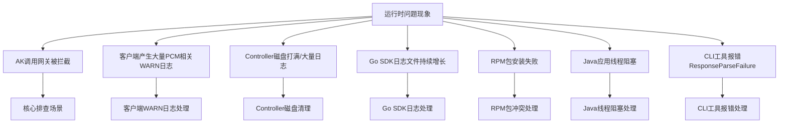

# QA（高频问答）

应急操作优先建议控制台白屏操作，当白屏无法访问时，采用在容器中执行脚本（调用服务接口），当容器无法访问时，直接在数据库中执行 SQL。

**优先级：控制台白屏 > 调用接口（容器脚本） > 数据库执行 SQL**

## 常见问题排查总览



## 如何启用某个已经禁用的 initAK？

**适用场景**：确认因为某把 AK 被禁用而影响业务。

### 白屏操作

通过 PCM 控制台的 initAK 管理功能查询特定 AK，并在操作中启用该 AK。


### 调用接口（容器中执行脚本）

当白屏不可用时，采用此方案。通过底表 AK 黑屏操作工具调用接口实现。

- **运行位置**：进入 PcmController 容器（Product: baseServiceAll → sn: platform-credential-management → sr：PcmController#），在任意一台容器操作即可。
- **执行命令**：
  ```bash
  # 启用单个 AK
  python3 manage_ak_status.py enable --ak <AK_ID>
  ```

> 工具源码及详细说明参考：[《工具》](https://alidocs.dingtalk.com/i/nodes/7NkDwLng8Za7QYkeHxdzN0A7JKMEvZBY?utm_scene=team_space&iframeQuery=anchorId%3Duu_mocpgly2iwborsrkk7e)

### 数据库操作

当白屏、容器均不可用时，采用此方案。

1. AK 状态存储在 UMMAK 数据库中，进入 UMMAK 数据库：
   - service：baseService-umm-ak
   - db实例：ummak
   - 数据库：ummak
2. 执行 SQL：
```sql
update accesskey_table set enabled_flag=1 where access_id = {akid};
```

## 如何启用全量底表 AK？

**适用场景**：环境内存在被底表 AK 禁用而影响业务，涉及多把底表 AK 或无法确认某把底表 AK，可采用启用全量底表 AK。

**注意**：暂不支持通过白屏解禁全量 AK。

### 调用接口（容器中执行脚本）

当白屏不可用时，采用此方案。通过底表 AK 黑屏操作工具调用接口实现。

- **运行位置**：进入 PcmController 容器（Product: baseServiceAll → sn: platform-credential-management → sr：PcmController#），在任意一台容器操作即可。
- **执行命令**：
  ```bash
  # 启用全部底表 AK
  python3 manage_ak_status.py enable-all
  ```

> 工具源码及详细说明参考：[《工具》](https://alidocs.dingtalk.com/i/nodes/7NkDwLng8Za7QYkeHxdzN0A7JKMEvZBY?utm_scene=team_space&iframeQuery=anchorId%3Duu_mocpgly2iwborsrkk7e)

### 数据库操作

当容器不可访问时，采用此方案。

1. 先获取全量底表 AK，PCM 托管的底表 AK 存储在 clm_db 实例的 pcm 数据库中：
   - service：certificate-lifecycle-manager-server
   - db实例：clm_db
   - 数据库：pcm_db
   - 进入 clm_db 实例数据库后切换到 pcm_db：
     ```sql
     use pcm_db;
     ```
   - 检索已经禁用的 initAK：
     ```sql
     select access_key_id from init_ak_info where umm_ak_status = 0;
     ```
2. 在 UMMAK 中启用全量底表 AK：
   - service：baseService-umm-ak
   - db实例：ummak
   - 数据库：ummak
   - 执行 SQL（执行前，将 `access_id` 字段参数改成步骤一中检索到的底表 AK 信息）：
     ```sql
     update accesskey_table set enabled_flag=1 where access_id in ('qNNm2yFXF70Zy6Hx','qNNm2yFXF70Zy6Hx2','qNNm2yFXF70Zy6Hx3');
     ```

## 如何启用派生 AK？

**适用场景**：确认某把派生 AK 被禁用影响业务。

### 白屏操作

白屏支持查询派生 AK，查询后可通过启用操作恢复。


> **注意事项**：
> 每个派生队列中通过白屏仅可以查询最近 14 把派生 AK，如果超过 14 把 AK 后，会在 ummak 侧执行删除操作，但 pcm 数据库会保留派生 AK 记录。当通过白屏未查询到该 AK，有可能是 14 天前派生的 AK，可通过 pcm 数据库进行查询。

### 数据库操作

1. 查询派生 AK：
   - service：certificate-lifecycle-manager-server
   - db实例：clm_db
   - 数据库：pcm_db
   - 进入 clm_db 实例数据库后切换到 pcm_db：
     ```sql
     use pcm_db;
     ```
2. 在 UMMAK 中启用：
   - 如果存在，直接更新启用状态：
     ```sql
     update accesskey_table set enabled_flag=1,hidden_flag=0,deleted_flag=0 where access_id='qNNm2yFXF70Zy6Hx';
     ```
   - 如果已经删除，创建 AK（说明：`access_id` 为 akid，`access_key` 为 sk，`user_id` 为账号）：
     ```sql
     INSERT INTO `ummak`.`accesskey_table` (`access_id`, `access_key`, `user_id`) VALUES ('000cFXr3DBPZHxML11', 'XE5sP5dF6asjJsCkxL4QYifS7rRU11', '999999999');
     ```

## 如何处理容量告警场景？

**适用场景**：UMMAK 侧每个 uid 下最大 1000 把有效 AK，当达到 1000 把以后会出现派生失败的情况（家里测试环境出现过，现场暂未出现）。

参考：[《容量问题数据处理》](https://alidocs.dingtalk.com/i/nodes/QG53mjyd800agdlKHbek2aXQ86zbX04v)

### 查询

1. 检查特定 uid 下（如 1000000047）的 AK 数量：
   ```sql
   SELECT user_id, COUNT(access_id) AS access_count FROM accesskey_table where user_id = '1000000047' GROUP BY user_id;
   ```
2. 查询是否有 uid 下的 AK 超过 1000：
   ```sql
   SELECT user_id, COUNT(access_id) AS access_count FROM accesskey_table GROUP BY user_id HAVING access_count >= 1000;
   ```

### 清理

分析出环境内已经无用的 AK，在 ummak 中置成删除状态：

```sql
update accesskey_table set enabled_flag = 0, deleted_flag = 1 , modified_time = UNIX_TIMESTAMP() where access_id in (xxxxx);
```

## 如何查询网关日志中的 AK 使用情况？

**适用场景**：需要通过网关和事件 ID 查询日志详细信息，或者在网关日志中扫描底表 AK 的使用情况。

### 工具配置

将配置文件与 CLI 工具放在相同目录下。配置示例如下：

```yaml
# 服务端简化配置
sls:
  # 访问凭证（此处未自动适配pcm轮转，直接填 PCM 轮转后的 AK，通过pcm控制台手动获取派生AK）
  credentials:
    sls:   # test1000000004@aliyun.com 对应的派生AK                  
      access_key_id: "RONVzQyJJR2kRoLP" 
      access_key_secret: "hvZ8oi0vWJXjWERK9VVe3j3qm2IYwK" 
    defaultUser:  # aliyuntest 对应的派生ak           
      access_key_id: "beF7AyHhnIjY3eGy"  
      access_key_secret: "2R838QLvk0wjkGxL9mTPMlL1xWFX4q"

  # Endpoint 配置
  inner_endpoint: "data.cn-wulan-env17e-d01.sls.inter.env17e.shuguang.com"        # slsinner
  pub_endpoint: "data.cn-wulan-env17e-d01.sls-pub.inter.env17e.shuguang.com"      # slspub

scan:
  hours_back: 10       # 扫描周期
  page_size: 1000      # 默认 可不修改
  max_workers: 20      # 默认 可不修改 
  auto_create_index: false  # 发现无索引时是否自动创建（true=自动创建，false=跳过）

output:
  path: "./output"
  format: "all"  # 可选: print, json, csv, all
```

### 上传与运行

将工具上传到 OPS1 服务运行（或可以解析 slsinner 的环境）。

### 使用指南

1. **根据事件 ID 查询使用 AK**
   ```bash
   ./main query --gateway <网关代码> --keyword "<事件ID或关键字>"
   ```
   *示例：`./main query --gateway OSS --keyword "tzRzgmefjFjXBC4C"`*

2. **遍历网关中底表 AK 调用记录**
   ```bash
   ./main scan
   ```
   扫描记录将自动存储在相对路径的 `output/scan_result_{时间戳}.csv`（或 json 等配置格式）中。

## 接入 PCM 后出现大量报错日志，是否有影响？

**现象**：接入 PCM 后出现大量报错日志。
**解答**：
- 2507 版本 PCM 服务端尚未部署时，部分适配了 PCM 的产品可能访问 PCM 报错，但因降级返回了原始底表 AK，**不影响业务调用**。如果调用非常频繁，可能产生大量错误日志。
- 部分产品升级至 3186-2510 及以上版本，但 baseServiceAll 未升级，可能同样出现以上问题。

## 如何判断底表 AK 是否禁用？

**解答**：可通过运维手册 [《PCM运维手册》](https://alidocs.dingtalk.com/i/nodes/amweZ92PV6DbOdgzUK4on0qD8xEKBD6p?utm_scene=team_space&iframeQuery=anchorId%3Duu_mo8cms9ciyzk8jo83x) 中的方法进行查询。

## 如何判断派生 AK 是否禁用？

**解答**：当前输出版本（3186、320）默认均不禁用派生 AK。

## 时间敏感服务接入 PCM 后延迟加大如何处理？

**现象**：接入 PCM 后可能导致部分时间敏感服务延迟加大，且网络可能出现延迟。
**解答**：
对于时间敏感服务，增加了 1s 超时策略。支持通过 `PCM_TASK_DELAY` 环境变量设置访问 PCM 的最大超时时间（单位：ms）。
- **默认值**：1000ms（即 1s）。
- **适用版本**：1.13-SNAPSHOT (20250908) 及以上。

## AK 调用网关被拦截如何排查？

**现象**：产品调用网关时报 AK 被禁用/AK 无效/AK 不存在。这是 PCM 接入后最核心的排查场景。
**排查步骤**：
1. **判断 AK 类型**：从网关日志中取出被拦截的 AK ID，在控制台查询是底表 AK 还是派生 AK。
   - **底表 AK**：直接通过控制台查询。
     
   - **派生 AK**：控制台仅可查询每个队列最近 14 把派生 AK。
     
     若未查到，可进入 `clm_db` 实例的 `pcm_db` 数据库查询：
     ```sql
     use pcm_db;
     select * from ak_info where access_key_id='****';
     ```
2. **分支一：底表 AK 被拦截**
   - **原因**：产品在使用底表 AK，说明 SDK 没有成功获取派生 AK，走了降级逻辑，或使用底表 AK 未适配。
   - **处理**：先在 PCM 控制台启用该底表 AK 恢复业务；然后查 SDK 日志 code 确认降级场景（参考下方 Core 错误码）。
3. **分支二：派生 AK 被拦截**
   - **原因**：产品已使用派生 AK，但该 AK 已被轮转禁用。最可能原因为仅获取一次，未持续轮转。
   - **处理**：通常重启服务会刷新 AK 导致可用，然后停止该队列的轮转。
     
     若无法重启，需手动启用 AK（参考 [《PCM应急处置》](https://alidocs.dingtalk.com/i/nodes/MNDoBb60VLYDGNPytBomBqkPJlemrZQ3?utm_scene=team_space&iframeQuery=anchorId%3Duu_mo8cms9ciyzk8jo83x)）。

## 如何手动创建临时派生 AK？

**适用场景**：当某个应用需要使用临时 AK 登录或者使用的 initAK 被禁用时，可以创建临时 AK 使用。

### 操作步骤

1. 进入派生 AK 管理标签页，点击**创建临时 AK** 按钮。
   
2. 输入申请者、initAKID、有效天数、申请派生 AK 原因等相关信息创建临时 AK。
   
   **注意事项**：
   - initAKID 是托管到 PCM 的基线或底表 AK（要与所使用账号的原始 AK 对应）。
   - 申请者 ID 即为 IAMID，是服务的身份标识（常规为 `集群 + : + sr` 拼接而成，如 `StandardCloudCluster-A-20250906-00bf:PcmController`。如果系统中提示已存在，可在后面拼接任意字符串）。
   - AK 类型默认使用临时类型。
   - 有效天数范围限制在 1~365 天。
   - 申请者类型分为：ApsaraStackProduct、Other。
   - CloudID、ProductName、ClusterName、ServiceName 分别为使用该 AK 的应用归属的信息（非必填，但建议准确填写以便判断使用方）。
3. 复制 AK、SK 保存使用。
   
   **注意**：该 AK 对应的 SK 明文只会在创建成功后弹窗内展示，关闭弹窗后系统内不再显示。如果不慎关闭弹窗，需重新创建，系统不对外提供 SK 明文信息能力。

## 派生 AK 轮转状态显示“已停止”是什么原因？

**适用场景**：在 AK 申请详情中查看派生 AK 申请记录时，发现轮转状态为“已停止”。（注：认证状态失败仅表示 IAMID 不规范，不影响申请结果）。

### 原因排查

1. IAMID 中有 `CLOSE_AUTO_ROTATE` 状态，表示该队列默认不轮转。
2. 使用该产品的队列，有产品未及时更新《[[PCM/平台凭证管理服务/index|平台凭证管理服务]]（PCM）介绍》。
3. 使用该队列的产品中，有产品仍在第 7 把 AK（参考《平台凭证管理服务（PCM）介绍》）。

## 如何排查和查看 PCM Core 日志？

**注意事项**：PCM 部署在两个 Docker 上，日志排查需两个 Docker 都去查询。

### 排查 error 日志（确定是否 pcm-core 报错返回）

- 如果有具体 requestid，可直接查询对应日期的 error 日志：
  ```bash
  grep -rn "0ae6084f17767043979091019e659c" /opt/tengine/logs/error.2026-04-20.log
  ```
- 如果没有具体 requestid，可根据 akid、iamid 和时间段进行复合筛选，查询对应日期的 error 日志：
  ```bash
  grep "eMG9sv4bKvToGKKR" /opt/tengine/logs/error.2026-04-20.log | grep "yundun-oem" | awk '$1 >= "2026/04/20" && $2 >= "23:59:57" && $2 <= "23:59:58"'
  ```

### 排查 access 日志（确定是否 pcm-core 接收到请求）

- 如果有具体 requestid，可直接查询对应日期的 access 日志：
  ```bash
  grep -rn "0ae6084f17767043992011025e659c" /opt/tengine/logs/access.2026-04-20.log
  ```
- 如果没有具体 requestid，可根据 akid、iamid 和时间段进行复合筛选：
  ```bash
  grep -E '"time_local": "(20/Apr/2026:22:59|20/Apr/2026:03:0[0-1])' /opt/tengine/logs/access.2026-04-20.log | grep "UFskQ84ZitYgBacU"
  grep "UFskQ84ZitYgBacU" /opt/tengine/logs/access.2026-04-20.log | grep -E '"time_local": "20/Apr/2026:23:59:5[8-9]'
  ```

### access 日志参数说明

| 参数名称 | 参数含义 |
| --- | --- |
| remote_addr | 请求源地址 |
| Gateway-POP-Tunnel-ID | tunnel-id |
| X-Aliyun-Vpc-Id | vpc-id |
| remote_port | 请求端口 |
| time_local | 请求完成的时间 |
| request_uri | 请求的uri，包含imaid、secretname、endpoint等信息 |
| request_method | 请求方法 |
| status | http返回码 |
| http_user_agent | 请求代理客户端信息 |
| request_time | tengine 收到请求到发完响应的总耗时 |
| SecretName | secretname，包含initakid和pcm_endpoint信息 |
| IamId | 表示请求服务身份，对应sdk填写的appname，当http报错时可能会为空 |
| x_acs_bearer_token | 请求发送jwt |
| x_sdk_client | pcm-sdk版本 |
| limit_req_status | 限流状态，未限流显示"PASSED"，限流显示"-" |
| eagleeye_traceid | 即requestid，可根据此查询对应error_log是否有错误日志 |

## 如何查看 AK 申请日志和平台 AK 访问日志？

### AK 申请日志

记录每个 IAMID 申请派生 AK 记录，通过 pcm-core 获取。pcm-core 中针对每个 IAMID 的底表 secretARN 的缓存时间为 12 小时，对于一直在用派生 AK 的产品，理论上每 12 小时会有一条记录。

### 平台 AK 访问日志

在网关侧记录使用底表 AK 的使用情况（当前不完整，可作为辅助查询手段）。