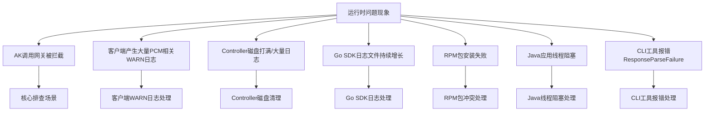
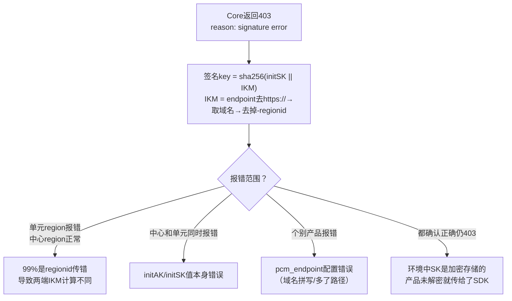

# QA（高频问答）

应急操作优先建议控制台白屏操作，当白屏无法访问时，采用在容器中执行脚本（调用服务接口），当容器无法访问时，直接在数据库中执行 SQL。

**优先级：控制台白屏 > 调用接口（容器脚本） > 数据库执行 SQL**

## 常见问题排查总览



## AK 调用网关被拦截如何排查？

**现象**：产品调用网关时报 AK 被禁用/AK 无效/AK 不存在。这是 PCM 接入后最核心的排查场景。

**排查步骤**：

1. **判断 AK 类型**：从网关日志中取出被拦截的 AK ID，在控制台查询是底表 AK 还是派生 AK。
   - **底表 AK**：直接通过控制台查询。
     
   - **派生 AK**：控制台仅可查询每个队列最近 14 把派生 AK。
     
     若未查到，可进入数据库查询：
     ```sql
     -- service：certificate-lifecycle-manager-server
     -- db实例：clm_db
     -- 数据库：pcm_db
     use pcm_db;
     select * from ak_info where access_key_id='****';
     ```
2. **分支一：底表 AK 被拦截**
   - **核心判断**：产品在使用底表 AK，说明 SDK 没有成功获取派生 AK，走了降级逻辑，或使用底表 AK 未适配。排查方向是**为什么 SDK 没拿到派生 AK**。
   - **处理步骤**：
     - **先恢复**：在 PCM 控制台启用该底表 AK 恢复业务。
     - **查 SDK 日志 code**：确认是哪种降级场景（参考下方“Core 错误码如何快速定位？”）。
3. **分支二：派生 AK 被拦截**
   - **核心判断**：产品已使用派生 AK，但该 AK 已被轮转禁用。最可能原因为仅获取一次，未持续轮转。排查方向是**为什么产品没有及时更新到最新的派生 AK**。
   - **处理步骤**：
     - 通常重启服务会刷新 AK 导致可用，然后停止该队列的轮转。
       
     - 若无法重启，需手动启用 AK（参考 [《PCM应急处置》](https://alidocs.dingtalk.com/i/nodes/MNDoBb60VLYDGNPytBomBqkPJlemrZQ3?utm_scene=team_space&iframeQuery=anchorId%3Duu_mogmd4kosy5jbbqysjf)）。如果有 SDK 报错，参见“Core 错误码如何快速定位？”。

## 客户端产生大量 PCM 相关 WARN 日志是否有影响？

**现象**：产品日志中大量 `Failed to refresh credential, pcm server is xxx`。

**解答**：
这类 WARN 日志**不影响业务**（SDK 已降级返回原始凭证），主要影响是客户端告警监控被触发。当环境中 PCM 服务（Core）未部署或不可达时，SDK 无法生成缓存，仍会按配置的间隔持续尝试连接，每次失败产生 WARN 级别日志。

## PCM Controller 磁盘打满或产生大量日志如何处理？

**现象**：Controller 日志目录 `/home/admin/pcm_controller/logs/api/logs/` 下出现超大文件，磁盘空间不足。

**EOCC 参考**：https://eocc.aliyun-inc.com/kbscene/emergencyDetail/EC9EE9AE20?Jump=2

**处理步骤**：
1. 确认磁盘使用情况：`df -h`
2. 查看日志目录大小：`du -sh /home/admin/pcm_controller/logs/api/logs/`
3. 清理历史日志文件（保留最近日志）。
4. 排查产生大量日志的原因：
   - 是否有大量异常请求持续打到 Controller。
   - 是否有定时任务异常导致循环报错。
5. 确认日志轮转配置是否正常。

## Go SDK 日志文件持续增长如何处理？

**现象**：Go SDK 产生的日志文件不断增大，未按预期轮转。

**原因**：Go SDK 在 2512 之前版本存在日志轮转 Bug。

**解决方案**：
- **彻底解决**：升级 Go SDK 至 2512 及以上版本。
- **临时处理**：`> logfile` 截断日志文件（注意：不要 `rm` 正在写入的文件）。

## Python SDK RPM 包安装失败如何处理？

**现象**：安装 `pcm-python2-sdk-rpm-with-no-six` 报错，关键字包含 `pytz/zoneinfo`、`cpio: File from package already exists as a directory`。

**原因**：系统已有 `/home/tops/lib/python2.7/site-packages/pytz/` 目录，与 RPM 包冲突。

**解决方式**：
```bash
mv /home/tops/lib/python2.7/site-packages/pytz /home/tops/lib/python2.7/site-packages/pytz_bak
sudo yum install pcm-python2-sdk-rpm-with-no-six -y
```

## Java 应用线程阻塞如何处理？

**现象**：线程 dump 中出现阻塞堆栈：
```plaintext
java.lang.Thread.State: BLOCKED (on object monitor)
  at sun.security.provider.NativePRNG$RandomIO.implNextBytes(NativePRNG.java:543)
  at ...PcmSecretCredentialManager.persistCredentials(...)
```

**原因**：SDK 默认使用 `/dev/random` 阻塞模式获取随机数，系统熵值低（< 100）时线程被卡住。

**解决方案**：
- **彻底解决**：升级 SDK 至 `credprovider.plugin >= 1.0.8`。
- **临时规避**：JVM 参数添加 `-Djava.security.egd=file:/dev/./urandom`。

## CLI 工具报错 ResponseParseFailure 如何处理？

**现象**：返回 `{"code": "ResponseParseFailure", "data": "", "message": "xxxxxxx"}`。

**原因**：`pcm_endpoint` 地址不对，该地址响应 200 但格式非预期，CLI 解析失败且未走降级。

**排查与解决**：确认 CLI 的 `pcm_endpoint` 指向正确的 PCM Core 地址，手动 curl 确认返回格式。后续版本已优化解析异常的降级处理。

## Core 错误码如何快速定位？

当排查过程中从 SDK 报错信息中拿到了具体错误码，可按以下说明辅助定位：

### HTTP 400 — 请求参数错误

| 返回 Msg | 报错原因 | 排查方向 |
| --- | --- | --- |
| `SecretName or x_acs_bearer_token is nil` | SecretName 或 token 为空 | SDK 侧 initakid 和 pcm_endpoint 是否正确 |
| `SecretName parse fail, SecretName:xxxx` | SecretName 格式错误 | appName 是否正确以 `:` 分隔 |
| `The access key (AK) is not administered by the PCM service, AK:xxxx` | akid 非底表 AK | initakid 是否填写正确的底表 akid |
| `genJwtKey fail` | 计算 token_key 失败 | Core 内部问题，与 SDK 无关 |
| `Error in AK rotation led to unsuccessful request to the controller...` | 请求 Controller 派生失败 | 1. 派生 AK 容量达上限<br>2. IAMID 非法且关闭了非标开关 |

### HTTP 403 — 认证失败

| 返回 Msg | 报错原因 | 排查方向 |
| --- | --- | --- |
| `reason: signature error` | 签名验证失败 | 见下方 signature error 排查 |
| `reason: "nbf" claim not valid until` | 时钟不同步 | 见下方 nbf 时钟偏差 |
| `token_arn not same with arn...` | ARN 不一致 | SDK 内部问题，基本不出现 |

### signature error 排查



- **nbf 时钟偏差**：SDK 生成 JWT 的 `nbf` 使用客户端 `time.Now()`。版本 3186-2605 / 320-2607 后已增加 5 分钟容错。仍出现则检查 SDK 所在机器 NTP 同步状态。
- **SK 加密未解密导致 403**：部分环境中底表 SK 是加密存储的。产品未解密就传给 SDK → 签名 key 两端不一致 → 必然 403。确认产品侧调用 SDK 前已解密 SK。

### HTTP 502 — 限流触发

大概率限流触发。
**限流排查**：
1. 检查 access.log 中 `limit_req_status` 字段。
2. `tsar -l -i 1 --nginx` 查看 QPS。
3. 调整限流配置：`/services/platform-credential-management/user/pcm_conf/pcm_core.json`。
4. 阈值参考（单核）：x86=200r/s, aarch64=189r/s, sw64=80r/s。

## 接入 PCM 后出现大量报错日志，是否有影响？

**现象**：接入 PCM 后出现大量报错日志。

**解答**：
- 2507 版本 PCM 服务端尚未部署时，部分适配了 PCM 的产品可能访问 PCM 报错，但因降级返回了原始底表 AK，**不影响业务调用**。如果调用非常频繁，可能产生大量错误日志。
- 部分产品升级至 3186-2510 及以上版本，但 baseServiceAll 未升级，可能同样出现以上问题。

## SDK 超时日志中毫秒数显示为 null 是否有影响？

**现象**：SDK 超时日志中毫秒数字段显示为 null。

**解答**：
未设置 `PCM_TASK_DELAY` 时默认 1s 超时，日志字段显示 null。这是已知的日志格式问题，**不影响实际功能**。

## 如何判断底表 AK 是否禁用？

**解答**：可通过运维手册 [《PCM运维手册》](https://alidocs.dingtalk.com/i/nodes/amweZ92PV6DbOdgzUK4on0qD8xEKBD6p?utm_scene=team_space&iframeQuery=anchorId%3Duu_mo8cms9ciyzk8jo83x) 中的方法进行查询。

## 如何判断派生 AK 是否禁用？

**解答**：当前输出版本（3186、320）默认均不禁用派生 AK。

## 时间敏感服务接入 PCM 后延迟加大如何处理？

**现象**：接入 PCM 后可能导致部分时间敏感服务延迟加大，且网络可能出现延迟。

**解答**：
对于时间敏感服务，增加了 1s 超时策略。支持通过 `PCM_TASK_DELAY` 环境变量设置访问 PCM 的最大超时时间（单位：ms）。
- **默认值**：1000ms（即 1s）。
- **适用版本**：1.13-SNAPSHOT (20250908) 及以上。

## 如何启用某个已经禁用的 initAK？

**适用场景**：确认因为某把 AK 被禁用而影响业务。

### 白屏操作

通过 PCM 控制台的 initAK 管理功能查询特定 AK，并在操作中启用该 AK。


### 调用接口（容器中执行脚本）

当白屏不可用时，采用此方案。通过底表 AK 黑屏操作工具调用接口实现。

- **运行位置**：进入 PcmController 容器（Product: baseServiceAll → sn: platform-credential-management → sr：PcmController#），在任意一台容器操作即可。
- **执行命令**：
  ```bash
  # 启用单个 AK
  python3 manage_ak_status.py enable --ak <AK_ID>
  ```

> 工具源码及详细说明参考：[《工具》](https://alidocs.dingtalk.com/i/nodes/7NkDwLng8Za7QYkeHxdzN0A7JKMEvZBY?utm_scene=team_space&iframeQuery=anchorId%3Duu_mocpgly2iwborsrkk7e)

### 数据库操作

当白屏、容器均不可用时，采用此方案。

1. AK 状态存储在 UMMAK 数据库中，进入 UMMAK 数据库：
   - service：baseService-umm-ak
   - db实例：ummak
   - 数据库：ummak
2. 执行 SQL：
```sql
update accesskey_table set enabled_flag=1 where access_id = {akid};
```

## 如何启用全量底表 AK？

**适用场景**：环境内存在被底表 AK 禁用而影响业务，涉及多把底表 AK 或无法确认某把底表 AK，可采用启用全量底表 AK。

**注意**：暂不支持通过白屏解禁全量 AK。

### 调用接口（容器中执行脚本）

当白屏不可用时，采用此方案。通过底表 AK 黑屏操作工具调用接口实现。

- **运行位置**：进入 PcmController 容器（Product: baseServiceAll → sn: platform-credential-management → sr：PcmController#），在任意一台容器操作即可。
- **执行命令**：
  ```bash
  # 启用全部底表 AK
  python3 manage_ak_status.py enable --all
  ```

## PCM 接入存在哪些潜在风险与注意事项？

**解答**：
1. **Core 限流基于 IP，存在误伤可能**：PCM Core 的限流策略基于客户端 IP。当同一台机器上运行多个产品组件时，一个高频产品的请求可能耗尽该 IP 的限流配额，导致同 IP 下其他产品被连带返回 502。
2. **部分 SDK 未打印关键日志，排查困难**：Java WARN 日志过多，部分产品屏蔽了报错日志，导致无请求 PCM 的 RequestID 等关键信息，增加排查难度。
3. **半轮转模式首次获取失败导致后续持续异常**：部分产品采用半自动轮转模式（仅在启动时获取一次派生 AK，后续不再主动刷新）。如果该唯一一次获取请求恰好失败（如 Core 限流、网络抖动、服务未就绪），产品将持续使用底表 AK 或无有效凭据运行，且不会自动恢复。
4. **底表禁用后 PCM 可用性和禁用状态联动**：底表 AK 被 PCM 禁用后，产品的凭据供给完全依赖 PCM 链路（Core + Controller）。对于本地有缓存的运行中服务暂时无影响，但重启的服务如果此时 PCM 不可用，将拿不到任何有效凭据（底表已禁、派生获取失败、本地无缓存），导致业务直接中断。
5. **已知问题已修复但环境中存量版本旧**：
   - CLI 服务端返回异常不降级（ResponseParseFailure）：修复版本 2025-12-23 更新，风险为 CLI 直接不可用。
   - Java SDK 线程阻塞（/dev/random 熵值问题）：修复版本 `credprovider.plugin >= 1.0.8`，风险为应用线程卡死。
   - Go SDK 日志文件不轮转：修复版本 `SDK >= 2512`，风险为磁盘打满。