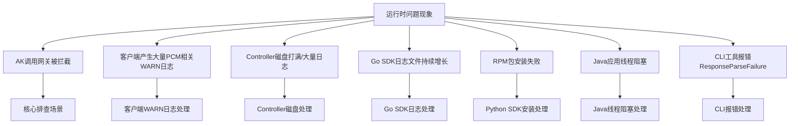
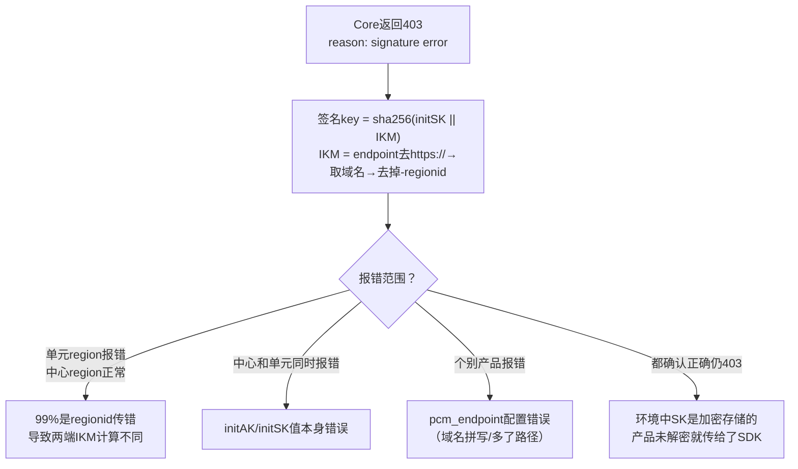

# 告警-风险-异常汇总表

1. **应急操作优先级**：**控制台白屏 > 调用接口（容器脚本） > 数据库执行SQL**。优先建议控制台白屏操作，当白屏无法访问时，采用在容器中执行脚本（调用服务接口），当容器无法访问时，直接在数据库中执行SQL。
2. **PCM 服务及缓存丢失导致业务中断**：需先恢复 PCM 服务，或使用**老凭证应急脚本**恢复底表 AK 能力。
3. **UMM 账户 AK 上限打满**：需将派生 AK 队列级别配置修改为 **initAK 级别**（全局共享）。
4. **服务降级与轮转暂停**：需排查 PCM Core 服务状态、网络连通性，或检查平台 AK 访问日志状态及产品 AK 获取记录。

## 告警/风险/异常汇总表

| 告警名 | 级别 | 识别方式 | 所属组件 | 触发条件 | 含义 | 应急手册链接 | 是否有EOCC/KB |
| --- | --- | --- | --- | --- | --- | --- | --- |
| PCM与应用双挂且SDK缓存丢失 | 致命 | 业务中断报错、凭证获取失败日志 | PCM SDK / 业务应用 | PCM 服务和应用同时宕机需重拉，且 SDK 本地加密缓存丢失 | SDK 无法读取本地缓存且无法连接 PCM，若底表 AK 已被禁用将直接导致业务中断 | 优先恢复 PCM 服务，或使用老凭证应急脚本恢复底表 AK 能力 | 否 |
| 底表禁用后 PCM 不可用导致业务中断 | 致命 | 重启的服务无法获取凭据，业务中断 | PCM Core / 业务应用 | 底表 AK 被禁用，且此时 PCM 服务不可用，本地无缓存 | 底表已禁、派生获取失败、本地无缓存，重启服务拿不到任何有效凭据，业务直接中断 | 优先恢复 PCM 服务，或使用老凭证应急脚本恢复底表 AK 能力 | 否 |
| UMM账户AK上限打满 | 高 | UMM 账户 AK 数量监控、创建派生 AK 失败日志 | PCM Controller / UMM | 派生 AK 队列配置为 ClusterName 级别且存在多集群 | 多集群为同一底表 AK 创建多个独立队列，叠加打满 UMM 账户 AK 上限，导致无法创建新派生 AK | 将派生 AK 队列级别修改为 initAK 级别（全局共享） | 否 |
| UMMAK单UID下AK容量达到上限 | 高 | 派生 AK 失败日志、UMMAK 容量监控 | PCM Controller / UMM | UMMAK 侧单个 uid 下有效 AK 数量达到 1000 把 | 达到上限后无法继续创建新的派生 AK，导致派生失败 | 清理环境内无用 AK，或参考[《容量问题数据处理》](https://alidocs.dingtalk.com/i/nodes/QG53mjyd800agdlKHbek2aXQ86zbX04v) | 否 |
| PCM Core服务异常/宕机 | 高 | PCM Core 监控告警、SDK 降级日志 (code=301/302) | PCM Core / PCM SDK | 网络不通、请求超时或 PCM Core 进程异常/宕机 | SDK 无法从 Core 获取最新凭证，触发本地缓存降级；末期过期老凭证行为暂停 | 排查 PCM Core 服务状态及网络连通性，恢复 Core 服务 | 否 |
| CLI 服务端返回异常不降级 | 高 | CLI 报错 `{"code": "ResponseParseFailure"...}` | PCM CLI | pcm_endpoint 地址不对，响应 200 但格式非预期 | CLI 解析失败且未走降级，导致 CLI 直接不可用 | 确认 pcm_endpoint 指向正确地址；升级至修复版本（2025-12-23更新） | 否 |
| Java SDK 线程阻塞 | 高 | 线程 dump 出现 `BLOCKED` 在 `NativePRNG$RandomIO` | PCM Java SDK | 系统熵值低（< 100），SDK 默认使用 `/dev/random` 阻塞模式 | 应用线程卡死 | 升级 SDK 至 `credprovider.plugin >= 1.0.8`；临时加 JVM 参数 `-Djava.security.egd=file:/dev/./urandom` | 否 |
| PCM Controller 磁盘打满 | 高 | 日志目录出现超大文件，磁盘空间不足 | PCM Controller | 大量异常请求持续打到 Controller 或定时任务异常导致循环报错 | 磁盘打满导致服务异常 | 清理历史日志，排查异常请求/定时任务，确认日志轮转配置 | 是 ([EOCC](https://eocc.aliyun-inc.com/kbscene/emergencyDetail/EC9EE9AE20?Jump=2)) |
| Core 返回 502 (限流触发) | 高 | 客户端收到 HTTP 502，access.log 中 `limit_req_status` 异常 | PCM Core | QPS 超过单核阈值，或同 IP 下其他高频产品耗尽配额 | 请求被限流，可能导致凭证获取失败。基于 IP 限流存在误伤同 IP 下其他产品的可能 | 检查 QPS，调整限流配置 `pcm_core.json` | 否 |
| 半轮转模式首次获取失败 | 高 | 产品持续使用底表 AK 或无有效凭据，SDK 无刷新日志 | 业务应用 / PCM SDK | 半自动轮转模式下，启动时唯一一次获取请求失败（限流/网络抖动等） | 产品不会自动恢复，持续异常 | 重启应用服务以重新触发获取，或排查 Core 状态及网络 | 否 |
| 派生AK队列轮转暂停 | 中 | PCM Controller 日志、凭证状态监控 | PCM Controller | 1. 触发产品最新派生 AK 保护；<br>2. 平台 AK 访问日志不可行；<br>3. 访问日志显示 AK 仍在使用 | 为保护正在使用中的凭证，系统暂停队列轮转，不再禁用老 AK | 检查产品是否已获取新 AK，或排查平台 AK 访问日志状态及调用记录 | 否 |
| PCM初始化服务异常 | 中 | SDK 初始化报错日志 | PCM SDK | PCM 初始化服务异常或报错 | SDK 初始化失败，触发容错降级，将入参（底表 AK）作为凭证返回 | 检查 PCM 初始化服务状态及配置 | 否 |
| Go SDK 日志文件不轮转 | 中 | Go SDK 日志文件不断增大 | PCM Go SDK | Go SDK 版本 < 2512 | 磁盘打满 | 升级 Go SDK 至 2512 及以上版本；临时处理 `> logfile` 截断日志 | 否 |
| 时间敏感服务延迟加大 | 中 | 时间敏感服务响应延迟增加 | PCM SDK | 接入 PCM 后链路增加延迟，网络波动 | 影响时间敏感业务的 SLA | 设置 `PCM_TASK_DELAY` 环境变量调整超时时间（默认 1000ms） | 否 |
| 客户端产生大量 WARN 日志 | 中 | 产品日志大量 `Failed to refresh credential...` | PCM SDK | PCM 服务未部署/不可达（如2507版本），或版本不匹配（升级了SDK但未升级baseServiceAll） | SDK 降级返回原始凭证，不影响业务但触发告警监控 | 确认 PCM 服务端状态，升级 baseServiceAll，或调整日志级别 | 否 |
| Python SDK RPM 包安装失败 | 低 | 安装报错 `cpio: File from package already exists...` | PCM Python SDK | 系统已有 `pytz` 目录，与 RPM 包冲突 | SDK 安装失败 | 备份并移除冲突目录（如 `pytz_bak`）后重新安装 | 否 |
| SDK 超时日志毫秒数为 null | 低 | 超时日志字段显示 null | PCM SDK | 未设置 `PCM_TASK_DELAY` 时默认 1s 超时 | 已知日志格式问题，不影响功能 | 无需处理，属已知日志格式问题 | 否 |
| 部分 SDK 未打印关键日志 | 低 | 排查问题时缺少 requestid 等关键信息 | PCM Java SDK | Java WARN 过多，部分产品屏蔽了报错日志 | 增加排查难度 | 联系 SDK 团队升级或调整日志配置 | 否 |

## 应急手册（应急处置方案）

### 排查总览



### AK 调用网关被拦截排查与恢复

这是 PCM 接入后最核心的排查场景，产品调用网关时可能报 AK 被禁用/AK 无效/AK 不存在。

**第一步：从网关日志中取出被拦截的 AK ID，在控制台查询是底表 AK 还是派生 AK。**
- **底表AK判定**：可以直接通过控制台查询。
- **派生AK判定**：控制台仅可以查询每个队列最近14把派生AK。若未查到，可通过数据库查询（service：`certificate-lifecycle-manager-server`，db实例：`clm_db`，数据库：`pcm_db`）：
  ```sql
  use pcm_db;
  select * from ak_info where access_key_id='****';
  ```

#### 分支一：底表 AK 被拦截
1. **核心判断**：产品在使用底表 AK，说明 SDK 没有成功获取派生 AK，走了降级逻辑，或未适配使用底表AK。
2. **排查与恢复步骤**：
   - **先恢复**：在 PCM 控制台启用该底表 AK，恢复业务（参见下文“启用某个已经禁用的 initAK”）。
   - **查 SDK 日志 code**：确认是哪种降级场景，参见下方 **Core 错误码快速定位**。

#### 分支二：派生 AK 被拦截
1. **核心判断**：产品已经在使用派生 AK，但这把派生 AK 已被轮转禁用。最可能原因为仅获取一次，未持续轮转。
2. **排查与恢复步骤**：
   - 通常重启服务会刷新 AK 导致可用，然后停止该队列的轮转。
   - 若无法重启服务，需要手动启用 AK，参见 [《PCM应急处置》](https://alidocs.dingtalk.com/i/nodes/MNDoBb60VLYDGNPytBomBqkPJlemrZQ3?utm_scene=team_space&iframeQuery=anchorId%3Duu_mogmd4kosy5jbbqysjf)。

#### 常见网关拦截日志特征及示例
当遇到访问报错，怀疑是 PCM 禁用 AK 导致的，优先通过拦截日志判定，提取日志中的请求 AK，并通过 PCM 服务查询 AK 状态。如果已经禁用，采用应急处置方案进行处置，并反馈研发侧排查原因。

- **OSS 拦截**
  - **特征**：`"error_code": "InvalidAccessKeyId"`，`"status": "403"`
- **SLS_INNER 拦截**
  - **特征**：`"Status": "401"`
- **SLSPUB 拦截**
  - **特征**：`"Status": "401"`，`"ErrorCode": "Unauthorized"`，`"ErrorMsg": "AccessKeyId is disabled: ..."`

### PCM Controller 磁盘打满处理

**现象**：Controller 日志目录 `/home/admin/pcm_controller/logs/api/logs/` 下出现超大文件，磁盘空间不足。
**EOCC 参考**：[EC9EE9AE20](https://eocc.aliyun-inc.com/kbscene/emergencyDetail/EC9EE9AE20?Jump=2)

**处理方式**：
1. 确认磁盘使用情况：`df -h`
2. 查看日志目录大小：`du -sh /home/admin/pcm_controller/logs/api/logs/`
3. 清理历史日志文件（保留最近日志）
4. 排查产生大量日志的原因：
   - 是否有大量异常请求持续打到 Controller
   - 是否有定时任务异常导致循环报错
5. 确认日志轮转配置是否正常

### 客户端 SDK 异常排查

#### Go SDK 日志文件持续增长
- **现象**：Go SDK 产生的日志文件不断增大，未按预期轮转。
- **原因**：Go SDK 在 2512 之前版本存在日志轮转 Bug。
- **解决方案**：升级 Go SDK 至 2512 及以上版本。
- **临时处理**：`> logfile` 截断日志文件（不要 rm 正在写入的文件）。

#### Python SDK RPM 包安装失败
- **现象**：安装 `pcm-python2-sdk-rpm-with-no-six` 报错 `cpio: File from package already exists as a directory`。
- **原因**：系统已有 `/home/tops/lib/python2.7/site-packages/pytz/` 目录，与 RPM 包冲突。
- **解决方式**：
  ```bash
  mv /home/tops/lib/python2.7/site-packages/pytz /home/tops/lib/python2.7/site-packages/pytz_bak
  sudo yum install pcm-python2-sdk-rpm-with-no-six -y
  ```

#### Java 应用线程阻塞
- **现象**：线程 dump 中出现阻塞堆栈 `BLOCKED (on object monitor) at sun.security.provider.NativePRNG$RandomIO...`。
- **原因**：SDK 默认使用 `/dev/random` 阻塞模式获取随机数，系统熵值低（< 100）时线程被卡住。
- **解决方案**：
  - 升级 SDK 至 `credprovider.plugin >= 1.0.8`
  - 临时规避：JVM 参数 `-Djava.security.egd=file:/dev/./urandom`

#### CLI 工具报错 ResponseParseFailure
- **现象**：CLI 报错 `{"code": "ResponseParseFailure", "data": "", "message": "xxxxxxx"}`。
- **原因**：pcm_endpoint 地址不对，该地址响应 200 但格式非预期，CLI 解析失败且未走降级。
- **排查**：确认 CLI 的 pcm_endpoint 指向正确的 PCM Core 地址，手动 curl 确认返回格式（后续版本已优化解析异常的降级处理）。

### Core 错误码快速定位

当排查过程中从 SDK 报错信息中拿到了具体错误码，按此表辅助定位：

#### HTTP 400 — 请求参数错误

| 返回 Msg | 报错原因 | 排查方向 |
| --- | --- | --- |
| `SecretName or x_acs_bearer_token is nil` | SecretName 或 token 为空 | SDK 侧 initakid 和 pcm_endpoint 是否正确 |
| `SecretName parse fail, SecretName:xxxx` | SecretName 格式错误 | appName 是否正确以 `:` 分隔 |
| `The access key (AK) is not administered by the PCM service, AK:xxxx` | akid 非底表 AK | initakid 是否填写正确的底表 akid |
| `genJwtKey fail` | 计算 token_key 失败 | Core 内部问题，与 SDK 无关 |
| `Error in AK rotation led to unsuccessful request to the controller...` | 请求 Controller 派生失败 | 1. 派生 AK 容量达上限<br>2. IAMID 非法且关闭了非标开关 |

#### HTTP 403 — 认证失败

| 返回 Msg | 报错原因 | 排查方向 |
| --- | --- | --- |
| `reason: signature error` | 签名验证失败 | 见下方 signature error 排查 |
| `reason: "nbf" claim not valid until` | 时钟不同步 | 见下方 nbf 时钟偏差 |
| `token_arn not same with arn...` | ARN 不一致 | SDK 内部问题，基本不出现 |

#### signature error 排查



#### nbf 时钟偏差
- SDK 生成 JWT 的 `nbf` 使用客户端 `time.Now()`。
- 版本 3186-2605 / 320-2607 后已增加 5 分钟容错。
- 仍出现则检查 SDK 所在机器 NTP 同步状态。

#### SK 加密未解密导致 403
部分环境中底表 SK 是加密存储的。产品未解密就传给 SDK → 签名 key 两端不一致 → 必然 403。确认产品侧调用 SDK 前已解密 SK。

#### HTTP 502 限流排查
大概率限流触发。PCM Core 的限流策略基于客户端 IP，当同一台机器上运行多个产品组件，一个高频产品的请求可能耗尽该 IP 的限流配额，导致同 IP 下其他产品被连带返回 502。
1. 检查 access.log 中 `limit_req_status` 字段
2. `tsar -l -i 1 --nginx` 查看 QPS
3. 调整限流配置：`/services/platform-credential-management/user/pcm_conf/pcm_core.json`
4. 阈值参考（单核）：x86=200r/s, aarch64=189r/s, sw64=80r/s