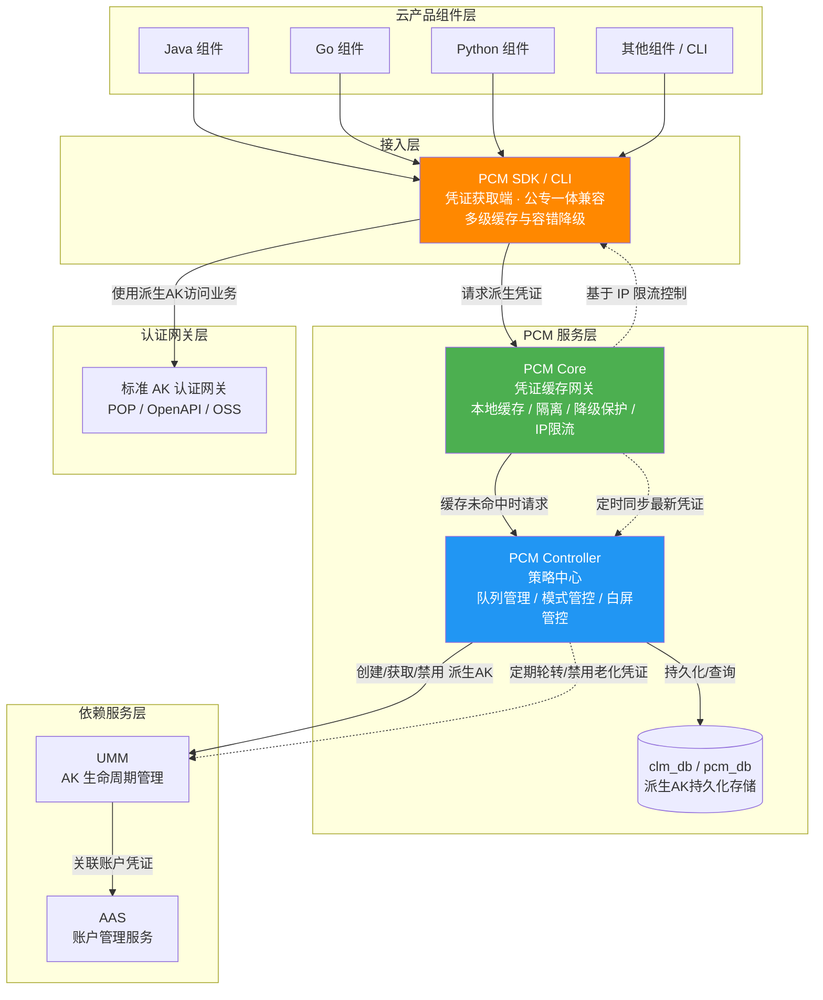
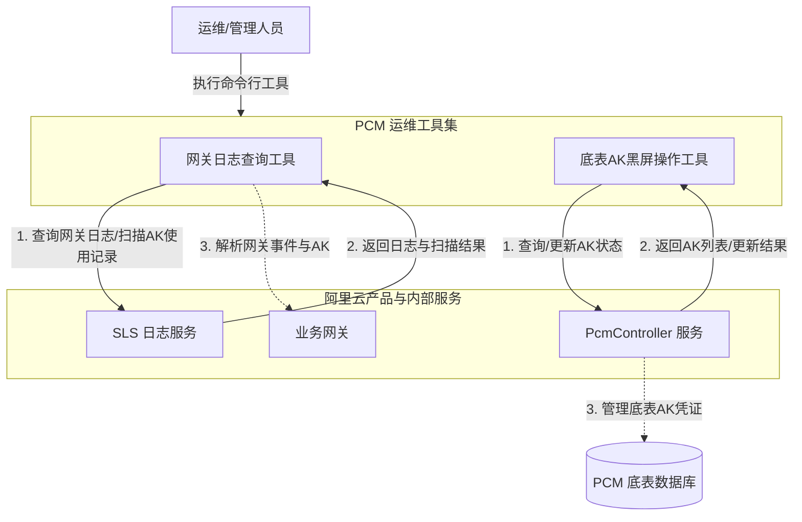

# 服务介绍

PCM（Platform Credential Management）是 `baseServiceAll` 中的基础服务。其核心目标是接管平台底表 AK，实现凭证（底表 AK 与派生 AK）的动态轮换、安全校验与安全管控；同时提供平台级凭证的运维审计能力（如网关日志查询与底表 AK 黑屏操作），帮助运维人员追踪凭证使用情况、排查网关事件，并对底表 AK 进行快速的启停与查询管理，从而全面提升系统整体安全性、高可用性与运维效率。

## 各版本新增功能与演进历程

### 管控模式演进
*   **v3182-2510**：引入 CompatibilityMode（兼容模式），提供凭证轮换能力，但不对旧 AK 进行禁用，适用于改造中的过渡态。
*   **v3182-2515 及以后**：引入 StrictMode（严格模式），新部署项目严格托管，热升级/扩容等场景自动降级为兼容模式，作为存量改造完成后的目标终态。
*   **v320**：引入 initStrictMode（初始严格模式），针对新增收口凭证，新建凭证即完成改造，任何场景均开启严格处理。
*   **当前版本（运维工具链演进）**：主要聚焦于运维工具链的建设，新增了网关日志查询工具以及底表 AK 黑屏操作工具。

### 版本更新与修复记录

| 版本/时间 | 新增功能与修复说明 |
| --- | --- |
| 1.13-SNAPSHOT (20250908) | 支持 `PCM_TASK_DELAY` 环境变量，用于设置访问 PCM 最大超时时间（默认 1000ms），优化时间敏感服务延迟。 |
| 2512 版本 | 修复 Go SDK 日志文件不轮转导致磁盘打满的问题。 |
| 3186-2605 / 320-2607 | JWT 的 `nbf` 声明增加 5 分钟时钟容错机制。 |
| credprovider.plugin >= 1.0.8 | 修复 Java SDK 因 `/dev/random` 熵值低导致的线程阻塞问题。 |
| 2025-12-23 更新 | 修复 CLI 工具服务端返回异常时不降级（ResponseParseFailure）的问题。 |

## 能力涉及的产品与组件

*   **接入端**：云产品组件（Java、Go、Python 等）、PCM SDK / CLI。
*   **服务端**：PCM Core（凭证缓存网关）、PCM Controller（策略中心）。
*   **底层存储**：clm_db / pcm_db 数据库。
*   **运维工具**：网关日志查询工具、底表 AK 黑屏操作工具。
*   **依赖服务**：UMM（AK 生命周期管理）、AAS（账户管理）、SLS（日志服务）。
*   **认证网关**：标准 AK 认证网关（如 POP、OpenAPI、OSS、API 网关）。
*   **运行环境**：OPS1 运维环境、特定 VPC/ECS 实例。

## 对外介绍架构图

### 核心服务与数据流向架构
以下为[[PCM/平台凭证管理服务/index|平台凭证管理服务]]的整体架构与数据流向图，展示了从云产品组件接入到凭证生命周期管理的完整链路：

### 运维工具链架构
以下为 PCM 运维工具集的整体架构，展示了运维人员如何通过工具与日志服务及控制面进行交互：

## 各核心组件能力详细说明

**PCM SDK / CLI（凭证获取端）**
*   **职责**：为云产品应用提供接入能力，直接与 PCM 服务交互获取新凭证，支持多种容错策略。
*   **多级缓存**：在本地内存、磁盘均设有缓存机制，提升获取效率并持续轮转。
*   **容错降级**：当 PCM 初始化服务异常、不可达或超时时，自动降级使用底表 AK（将入参作为凭证返回）；若存在缓存，则返回最近一次从服务端获取的凭证，保障业务连续性。
*   **轮转模式**：支持全量轮转与半自动轮转模式（仅启动时获取一次）。

**PCM Core（缓存中间网关）**
*   **职责**：作为 SDK 与 Controller 之间的访问中间网关，缓存 Controller 最新凭证数据，缓解 Controller 访问压力并提高响应速度。
*   **安全与校验**：负责请求参数校验、签名验证（基于 initSK 和 IKM）、时钟校验（nbf）。
*   **限流控制**：具备基于客户端 IP 的限流控制能力，防止策略大脑被击穿。
*   **降级保护**：Core 宕机后，末期过期老凭证行为暂停，SDK 返回上次获得的老凭证（未在窗口期末尾），保障业务依然可用。

**PCM Controller（策略中心）**
*   **职责**：PCM 凭证管控核心，执行凭证生命周期管理，提供 PKM 白屏管控、日志查询关联、状态管理能力。
*   **凭证队列管理**：为每个被托管凭证创建主动过期的凭证队列（默认维持 7 把有效派生 AK，每把有效期 24 小时），定期清洗禁用老化派生凭证，并具备最新派生 AK 保护等轮转保护机制。
*   **底层 API 与安全**：提供底表 AK 列表查询和状态更新等底层 API，通过请求签名保障内部调用安全，与底层数据库交互生成并存储派生 AK。

**数据库 (clm_db/pcm_db)**
*   **职责**：持久化存储派生 AK 信息（如 `ak_info` 表），供 Controller 管理和查询，同时支持运维人员通过控制台或数据库直接排查 AK 状态。

**UMM（AK 生命周期管理）与 AAS（账户管理服务）**
*   **职责**：PCM 依赖服务。UMM 负责 AK 的存储与生命周期管理，接收 Controller 指令执行凭证轮换和禁用操作；AAS 负责平台账户统一管理，与 UMM 联动形成账户-凭证关联关系。

**PCM 运维工具集**
*   **网关日志查询工具**：支持通过“网关代码+事件ID”精准查询网关日志；支持在网关日志中全量扫描底表 AK 的使用情况，扫描结果支持输出为 print、json、csv 等格式。
*   **底表 AK 黑屏操作工具**：支持对指定的单个或全量底表 AK 进行启用/禁用操作；支持通过账号 ID 查询对应的底表 AK 信息。

## 与阿里云其他产品的关系及异常影响

### 与相关产品的交互方式及影响

*   **标准 AK 认证网关（POP、OpenAPI、OSS、API 网关等）**：云产品组件通过 PCM SDK 获取派生 AK 后访问网关。若 AK 被 PCM 禁用或轮转未及时更新，网关会拦截请求并返回 AK 无效/禁用等错误。排查时需结合 PCM运维手册 确认底表或派生 AK 的禁用状态。
*   **UMM 与 AAS**：若 UMM/AAS 异常，将影响新派生 AK 的生成，但得益于 PCM 的多级缓存与降级机制，短期内不会影响现有业务的凭证使用。
*   **SLS（日志服务）**：网关日志查询工具强依赖 SLS 的可用性与网络连通性（如 `slsinner` 域名解析），若 SLS 异常将导致日志查询和 AK 扫描功能不可用。
*   **ECS 与基础网络（VPC等）**：
    *   SDK 运行在 ECS 等计算节点上。若机器系统熵值过低（<100），旧版 Java SDK 会因 `/dev/random` 阻塞导致线程卡死。
    *   若机器 NTP 时钟不同步，会导致 JWT 签名 `nbf` 校验失败。
    *   若同 ECS 上运行多个组件，Core 基于 IP 的限流可能误伤同 IP 下的其他产品。

### 产品异常可能造成的影响与边界

| 异常场景 | 造成的影响（业务表现） | 不会造成的影响（边界清晰） |
| --- | --- | --- |
| **新部署/升级时 PCM 未 ready** | 无影响。SDK 将入参（底表 AK）作为返回，Core 未禁用老 AK。 | 不会导致应用启动失败、升级流程中断或鉴权失败。 |
| **运行时 PCM Core 宕机 (缓存未丢失)** | 无影响。SDK 返回上次获取的老凭证（未在窗口期末尾）。 | 不会导致正在运行的业务中断或请求被网关拒绝。 |
| **底表 AK 已禁用且 PCM 链路不可用 (缓存丢失)** | **业务中断**。新启动或重启的服务无法获取任何有效凭据，需先恢复 PCM 或使用老凭证应急脚本。 | 不会导致底层数据损坏或 UMM/AAS 中的账户数据异常。 |
| **PCM Core 触发 IP 限流** | **连带限流误伤**。若某高频产品耗尽 IP 限流配额，会导致同 IP（同 ECS）下其他产品请求被连带返回 502。 | 不会影响不同 IP 节点上的其他产品请求。 |
| **时间敏感服务接入 PCM** | **延迟增加**。链路增加可能导致延迟加大（可通过 `PCM_TASK_DELAY` 调整超时策略规避）。 | 不会导致业务逻辑错误或数据丢失。 |
| **半轮转模式首次获取失败** | **持续异常**。若首次获取因限流或网络抖动失败，产品将持续使用底表 AK 或无有效凭据运行，且不会自动恢复。 | 不会影响全量轮转模式（持续轮转）的自动恢复能力。 |
| **PCM 服务端未部署或不可达 (降级场景)** | 客户端产生大量 WARN 级别日志，可能触发告警监控。SDK 触发降级返回原始底表 AK。 | **不会**影响业务正常调用网关，**不会**导致业务中断。 |
| **PCM 运维工具异常** | 运维人员无法查询网关日志、无法通过黑屏工具启停底表 AK，影响审计与应急阻断效率。 | **不会**影响线上业务网关的正常流量转发和已下发 AK 的正常鉴权。 |
| **AK 私用场景（未接 UMM 的服务）** | 尚未强制要求适配，已适配产品通过 PCM 兑换原始底表 AK。 | 不会直接影响未改造的 AK 私用服务的原有鉴权逻辑。 |