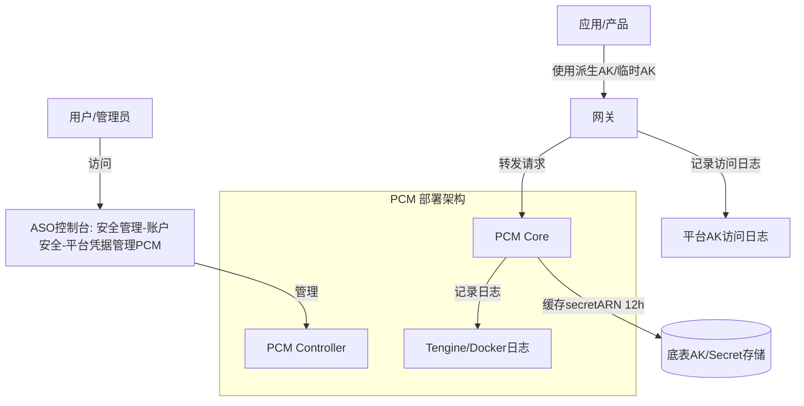
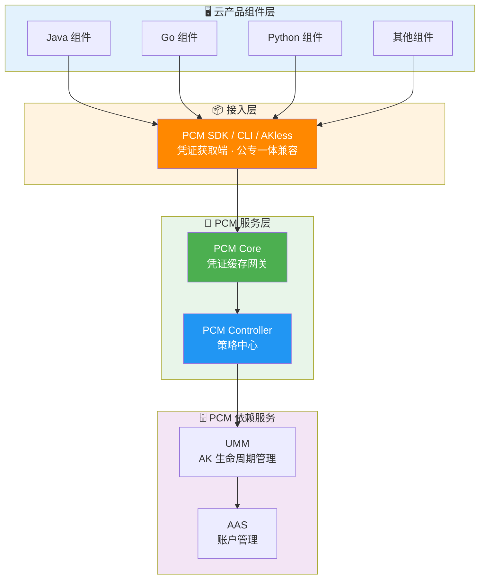
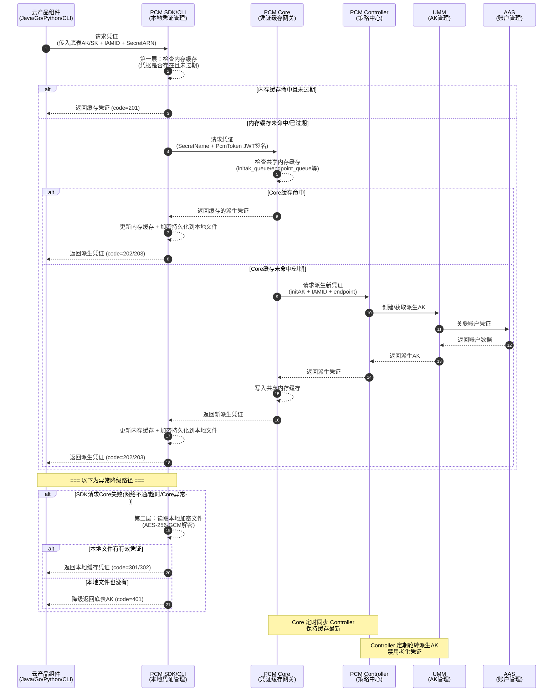

# 服务介绍

**产品定位**
[[PCM/平台凭证管理服务/index|平台凭证管理服务]]（PCM）提供运维操作、AK 管理、日志排查及应急处置等核心功能与运维指南。

**产品是做什么的**
PCM（Platform Credential Management）是 `baseServiceAll` 中的基础服务，核心目标是**接管平台底表 AK，实现凭证的动态轮换与安全管控**，提升安全性。

**服务位置与涉及组件**
*   **所属产品**：`baseServiceAll`
*   **所属 service**：`platform-credential-management`
*   **部署集群**：`StandardCloudCluster-A-xx`
*   **核心组件**：`PCM Core`、`PCM Controller`、`PCM SDK / CLI`、`UMM`、`AAS`

## 基本概念介绍

| 概念 | 说明 |
| --- | --- |
| **底表 AK** | 通过全局变量方式声明、云平台初始化时自动创建的 AK |
| **IAMID** | 产品申请派生时身份标识：格式为 `${CLUSTERNAME}:<serverrole名称>`，PaaS 格式为 `{{ .Values.productName }}:{{ .Release.Name }}`<br>当前未强校验格式 |
| **secretARN** | 凭证目标资源标识，格式为 `apsara:pcm:akid:<accessKeyId>:dst_endpoint:<GatewayCode>:sk:<accessKeySecret>` |
| **GatewayCode** | 服务的认证网关 code，用于区分 AK 私用网关和标准 AK 认证网关<br>当前版本仅标准 AK 认证网关支持使用底表 AK |
| **initAK** | 原始底表 AK，PCM 改造前应用直接使用的凭证 |

## PCM 核心能力

*   **凭证生命周期管理**：PCM 接管底层分配的凭证，为对应凭证创建**主动过期的凭证队列**，并定期清洗禁用老化的派生凭证。
*   **派生 AK 队列机制**：
    *   **队列基本概念**：底表在生成派生 AK 时每个派生 AK 会关联一个派生 AK 队列，队列默认维持 7 把有效派生 AK，每把派生 AK 有效期 24 小时。因此，一把派生 AK 从创建到默认过期需要 7 天。
    *   **队列级别**：派生 AK 队列有两种划分级别：

| 级别 | 划分方式 | 说明 | 推荐程度 |
| --- | --- | --- | --- |
| initAK 级别（默认） | 一个底表 AK 对应一个派生 AK 队列，全局共享 | 默认配置，也是推荐的选择 | ✅ 推荐 |
| ClusterName 级别 | 按集群划分，同一集群内一个底表 AK 对应一个派生 AK 队列 | 多集群会为同一个底表 AK 创建多个队列，叠加后可能把 UMM 账户的 AK 上限打满 | ⚠️ 有风险，不推荐 |

> _为什么不推荐 ClusterName 级别？ UMM AK 管理中，每个账户对应的 AK 数量有上限。按 ClusterName 级别，每个集群都会为同一个底表 AK 创建独立的派生 AK 队列，多集群叠加可能把账户的 AK 上限打满，导致无法创建新的派生 AK。因此默认和推荐的配置都是 initAK 级别。_

*   **队列轮转保护机制**：派生 AK 队列会持续轮转（定期创建新 AK、禁用老 AK），但在以下情况下会暂停轮转，以保护正在使用中的凭证：
    *   **保护一：产品最新派生 AK 保护**：当要禁用队列里最早的那把 AK 时，系统会检查这把 AK 是否是某个产品获取的最新派生 AK。如果产品 A 拿到这把 AK 后就没再获取过新 AK，那这把就是产品 A 的"最新"，队列就会停止轮转，保持当前状态。直到后续其他产品都获取了更新的派生 AK，队列才会继续轮转。这样保证不会因为轮转把某个产品正在用的 AK 给禁掉。
    *   **保护二：平台 AK 访问日志不可行（当前状态）**：当不可行时，PCM 无法确认即将禁用的派生 AK 是否仍有产品在调用，将在第一把队列即将禁用时停止轮转。
    *   **保护三：平台 AK 访问日志可信时**：平台 AK 访问日志用于检查底表 AK 和派生 AK 是否在网关中有调用记录。在准备禁用某把派生 AK 前，系统会检查平台 AK 访问日志，确认这把 AK 当前是否还在被使用。如果日志显示还有产品在用这把 AK，也会停止轮转。

**各版本新增功能说明**

| 模式 | 含义 | 行为 | 适用场景 | 版本 |
| --- | --- | --- | --- | --- |
| **None（默认）** | 不受 PCM 管理 | AK 正常使用，PCM 不介入 | 尚未改造的存量凭证 | / |
| **CompatibilityMode（兼容模式）** | 部分完成改造 | 提供轮换能力，但不对旧 AK 禁用 | 改造中的过渡态 | v3182-2510 |
| **StrictMode（严格模式）** | 使用方改造完成 | 新部署严格托管；热升级/扩等场景自动降级为兼容模式 | 存量改造完成后的目标终态 | v3182-2515以后 |
| **initStrictMode（初始严格模式）** | 新建凭证即完成改造 | 任何场景都开启严格处理 | 新增收口凭证 | v320 |

**热升级兼容策略**
*   **新部署项目**：根据 `restrict` 取值禁用原始通用能力，应用使用凭证进入定时轮换状态。
*   **热升级项目**：原始凭证**不禁用**其通用能力，进入定时轮换状态；如需禁用老凭证，通过观测日志在运维控制台灰度进行。
*   **非 PCM 托管凭证**：一切照旧；若使用了 PCM SDK/CLI 但未被托管，将入参 initAK 返回让应用接着使用。

## 架构与调用流程

**部署与控制台架构图**



**调用 PCM 服务（获取派生AK）示意图**



**调用时序图**



**接入后对比示意图**


## 核心组件能力详细说明

**PCM SDK / CLI — 凭证获取端**
*   **职责**：为云产品应用提供接入能力，直接与 PCM 服务交互获取新凭证，支持多种容错策略。
*   **安全特性**：
    *   **多级缓存**：在本地内存、磁盘均有缓存。
    *   **容错降级**：PCM 初始化服务异常或报错时，将入参作为凭证返回；如果有缓存，将返回最近一次从服务端获取的凭证。

**PCM Core — 缓存中间网关**
*   **职责**：SDK 与 Controller 之间的访问中间网关，缓存 Controller 最新凭证数据（针对每个 IAMID 的底表 secretARN 缓存时间为 12 小时），为 SDK 提供 API 获取最新凭证，缓解 Controller 访问压力。
*   **安全特性**：
    *   **本地缓存 + 定时同步**：减少直接访问 Controller 的频率。
    *   **缓存隔离**：缓存数据仅服务于已认证的 SDK 请求，不对外暴露。
    *   **降级保护**：Core 宕机后，末期过期老凭证行为暂停，SDK 返回上次获得的老凭证（未在窗口期末尾），依然可以使用。
    *   **压力缓解**：作为中间层，防止策略大脑被击穿。

**PCM Controller — 策略中心**
*   **职责**：PCM 凭证管控核心，执行凭证生命周期管理，提供 PKM 白屏管控、日志查询关联、状态管理能力，支持热升级后以运维变更方式将老凭证进行禁用。
*   **安全特性**：
    *   **凭证队列管理**：定期清洗禁用老化派生凭证。
    *   **模式管控**：根据 `controlByPcm` 配置执行不同模式。
    *   **松→紧变更不自动生效**：需 ASO 页面提示人工处理，防止误操作。
    *   **灰度禁用**：支持逐步禁用老凭证，而非一刀切。

**UMM & AAS — 依赖服务**
*   **UMM（AK 生命周期管理）**：负责 AK 的存储与生命周期管理，接收 Controller 指令执行凭证轮换和禁用操作。
*   **AAS（账户管理服务）**：负责平台账户统一管理，与 UMM 联动形成账户-凭证关联关系。

**关键安全设计：标准 AK 认证 vs AK 私用**

| 类型 | 说明 |
| --- | --- |
| **标准 AK 认证** | AK 生命周期在 UMM 中保管，标准网关通过对接 UMM 进行 AK 签名校验（如 POP、OpenAPI、OSS），当前访问标准 AK 认证服务的云产品均已适配完成。 |
| **AK 私用场景** | 服务不接或无法接 UMM，直接把 AK 参数记录到本地配置文件/数据库中，请求过来时用本地配置校验；当前尚未强制要求适配，已适配的产品通过 PCM 服务兑换出原始底表 AK。 |

**源码地址**
*   PCM-core：[https://code.alibaba-inc.com/aliyunas_sectech/pcm-core](https://code.alibaba-inc.com/aliyunas_sectech/pcm-core)
*   PCM-controller：[https://code.alibaba-inc.com/aliyunas_sectech/pcm-controller](https://code.alibaba-inc.com/aliyunas_sectech/pcm-controller)

## 运维与控制台操作指南

**PCM 控制台入口**
路径：ASO —> 安全管理 —> 账户安全 —> 平台凭据管理 PCM


**底表 AK 管理**
1. 可查询底表 AK 禁用状态。
2. 可启用底表 AK。
> **注意**：未提供白屏底表 AK 禁用能力，底表 AK 禁用请详见相关变更文档。


**派生 AK 管理**

*   **手动创建派生 AK（临时 AK）**
    *   **适用场景**：当某个应用需要使用临时 AK 登录或者使用的 initAK 被禁用时，可以创建临时 AK 使用。
    *   **步骤一**：进入派生 AK 管理标签页，点击创建临时 AK 按钮。
        
    *   **步骤二**：输入申请者、initAKID、有效天数、申请派生 AK 原因等相关信息。
        *   **注意**：
            1. `initAKID` 是托管到 PCM 的基线或底表 AK（要与所使用账号的原始 AK 对应）。
            2. 申请者 ID 即为 `IAMID`，是服务的身份标识（常规为 `集群:SR` 拼接而成，如 `StandardCloudCluster-A-20250906-00bf:PcmController`。若提示已存在，可在后面拼接任意字符串）。
            3. AK 类型默认使用临时类型。
            4. 有效天数范围限制在 1~365 天。
            5. 申请者类型分为：`ApsaraStackProduct`、`Other`。
            6. `CloudID`、`ProductName`、`ClusterName`、`ServiceName` 分别为使用该 AK 的应用归属信息（非必填，但准确填写有助于判断使用方）。
        
    *   **步骤三**：复制 AK、SK 保存使用。
        > **注意**：该 AK 对应的 SK 明文只会在创建成功后弹窗内展示，关闭弹窗后系统内不再显示。如果不慎关闭弹窗，需重新创建，系统不对外提供 SK 明文查询能力。
        

*   **AK 申请详情**
    *   **适用场景**：用于查看派生 AK 申请记录。
    *   **状态说明**：
        *   **认证状态失败**：仅表示 IAMID 不规范，不会对申请结果有任何影响。
        *   **轮转状态已停止**：
            1. IAMID 中有 `CLOSE_AUTO_ROTATE` 状态，表示该队列默认不轮转。
            2. 使用该产品的队列，有产品未及时更新（参考 [《平台凭证管理服务（PCM）介绍》](https://alidocs.dingtalk.com/i/nodes/r1R7q3QmWew5lo02fZRn00oKJxkXOEP2?utm_scene=team_space&iframeQuery=anchorId%3Duu_mo8et3bkdnbpoxrkv3)）。
            3. 使用该队列的产品中，有产品仍在第 7 把 AK（参考 [《平台凭证管理服务（PCM）介绍》](https://alidocs.dingtalk.com/i/nodes/r1R7q3QmWew5lo02fZRn00oKJxkXOEP2?utm_scene=team_space&iframeQuery=anchorId%3Duu_mo8et3bliy39hgdhkpq)）。

## 日志排查与应急处置

**AK 申请日志**
记录每个 IAMID 申请派生 AK 记录，通过 PCM-Core 获取。由于 PCM-Core 中针对每个 IAMID 的底表 secretARN 的缓存时间为 12 小时，对于一直在用派生 AK 的产品，理论上每 12 小时会有一条记录。


**平台 AK 访问日志**
> **注意**：当前不完整，可作为辅助查询手段。

在网关侧记录使用底表 AK 的使用情况（例如底表 AK `Khz7a1kmKMZDCBXj`）。


**PCM Core 日志查看**
> **注意**：PCM 部署在两个 Docker 上，日志排查需两个 Docker 都去查询。


*   **排查 error 日志（确定是否 PCM-Core 报错返回）**
    *   如果有具体 requestid，可直接查询对应日期的 error 日志：
        ```bash
        grep -rn "0ae6084f17767043979091019e659c" /opt/tengine/logs/error.2026-04-20.log
        ```
    *   如果没有具体 requestid，可根据 akid、iamid 和时间段进行复合筛选：
        ```bash
        grep "eMG9sv4bKvToGKKR" /opt/tengine/logs/error.2026-04-20.log | grep "yundun-oem" | awk '$1 >= "2026/04/20" && $2 >= "23:59:57" && $2 <= "23:59:58"'
        ```

*   **排查 access 日志（确定是否 PCM-Core 接收到请求）**
    *   如果有具体 requestid：
        ```bash
        grep -rn "0ae6084f17767043992011025e659c" /opt/tengine/logs/access.2026-04-20.log
        ```
    *   如果没有具体 requestid，根据 akid、iamid 和时间段复合筛选：
        ```bash
        grep -E '"time_local": "(20/Apr/2026:22:59|20/Apr/2026:03:0[0-1])' /opt/tengine/logs/access.2026-04-20.log | grep "UFskQ84ZitYgBacU"
        # 或
        grep "UFskQ84ZitYgBacU" /opt/tengine/logs/access.2026-04-20.log | grep -E '"time_local": "20/Apr/2026:23:59:5[8-9]'
        ```

*   **access 日志参数说明**

| 参数名称 | 参数含义 |
| --- | --- |
| remote_addr | 请求源地址 |
| Gateway-POP-Tunnel-ID | tunnel-id |
| X-Aliyun-Vpc-Id | vpc-id |
| remote_port | 请求端口 |
| time_local | 请求完成的时间 |
| request_uri | 请求的 uri，包含 iamid、secretname、endpoint 等信息 |
| request_method | 请求方法 |
| status | http 返回码 |
| http_user_agent | 请求代理客户端信息 |
| request_time | tengine 收到请求到发完响应的总耗时 |
| SecretName | secretname，包含 initakid 和 pcm_endpoint 信息 |
| IamId | 表示请求服务身份，对应 sdk 填写的 appname，当 http 报错时可能会为空 |
| x_acs_bearer_token | 请求发送 jwt |
| x_sdk_client | pcm-sdk 版本 |
| limit_req_status | 限流状态，未限流显示 "PASSED"，限流显示 "-" |
| eagleeye_traceid | 即 requestid，可根据此查询对应 error_log 是否有错误日志 |

**常见问题排查与应急处置**
*   排查思路与常见问题：[《PCM排查思路&常见问题》](https://alidocs.dingtalk.com/i/nodes/m9bN7RYPWdyrPBREckdQ5joEVZd1wyK0)
*   应急处置指南：[《PCM应急处置》](https://alidocs.dingtalk.com/i/nodes/MNDoBb60VLYDGNPytBomBqkPJlemrZQ3)

## 与阿里云其他产品的关系及影响边界

**与相关产品的交互方式**
*   **云产品组件层**：支持 Java、Go、Python 及其他组件通过 PCM SDK / CLI / AKless 接入。
*   **标准网关**：标准网关（如 POP、OpenAPI、OSS）通过对接 UMM 进行 AK 签名校验。
*   **AK 私用服务**：直接把 AK 参数记录到本地，已适配的产品通过 PCM 服务兑换出原始底表 AK。
*   **ASO**：通过 ASO 控制台进行白屏访问和管理。
*   **网关日志与 VPC**：在网关侧记录平台 AK 访问日志（包含 `Gateway-POP-Tunnel-ID` 等），请求日志中包含 `X-Aliyun-Vpc-Id`，表明与 VPC 存在网络或身份层面的关联交互。

**产品异常可能造成的影响（边界清晰）**

| 场景 | SDK 行为 | 业务影响 |
| --- | --- | --- |
| 新部署时 PCM Core 还未 ready | 将入参作为返回 | 无影响（Core 未禁用老 AK） |
| 运行时 PCM Core 挂了 | 返回上次获取的老凭证（未在窗口期末尾） | 无影响 |
| 产品独立升级，PCM 未 ready | 将入参作为返回 | 无影响 |
| PCM 和应用都挂了需重拉（SDK 缓存未丢失） | 返回上次获取的老凭证 | 无影响 |
| PCM 和应用都挂了需重拉（SDK 缓存丢失） | **需先恢复 PCM 或使用老凭证应急脚本** | **业务中断** |