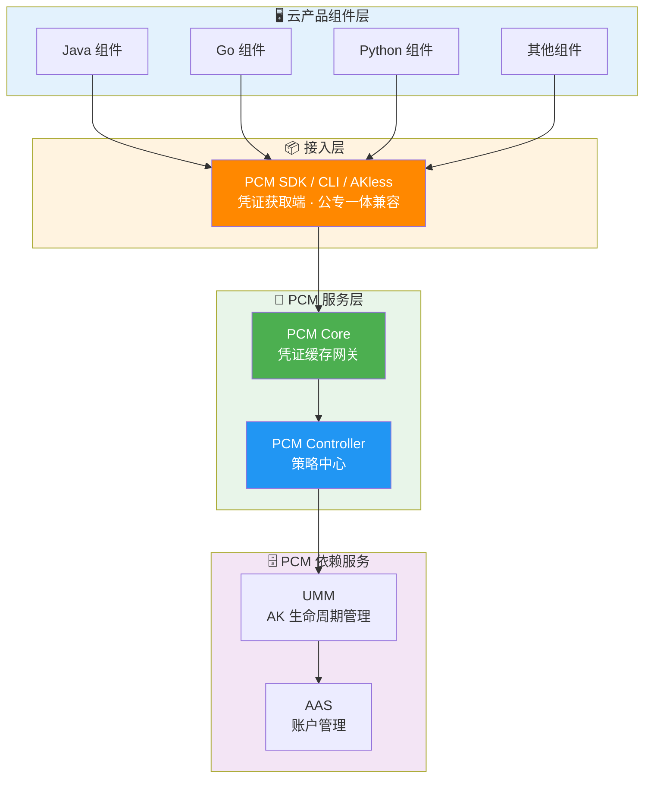
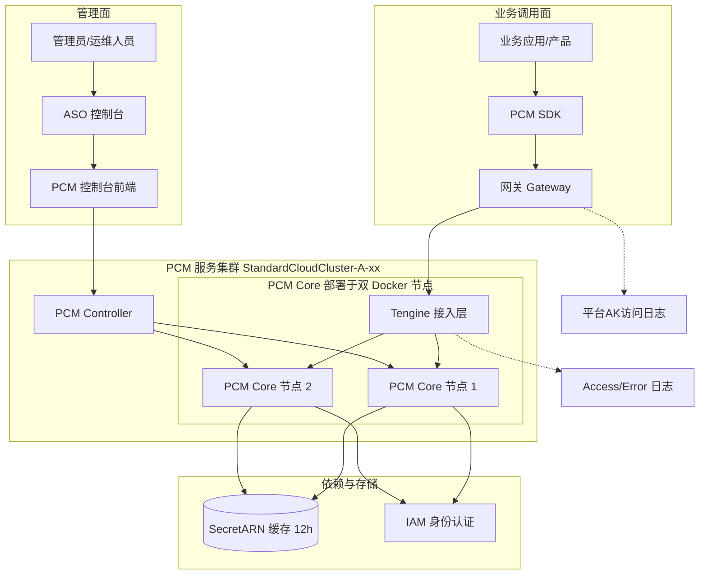
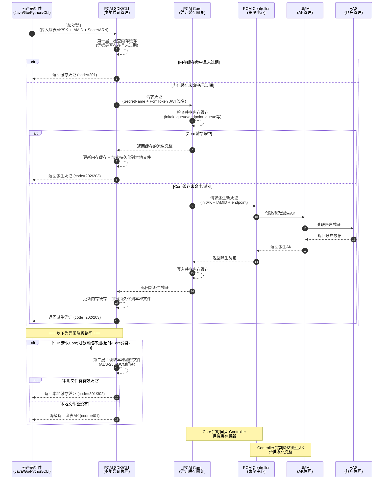
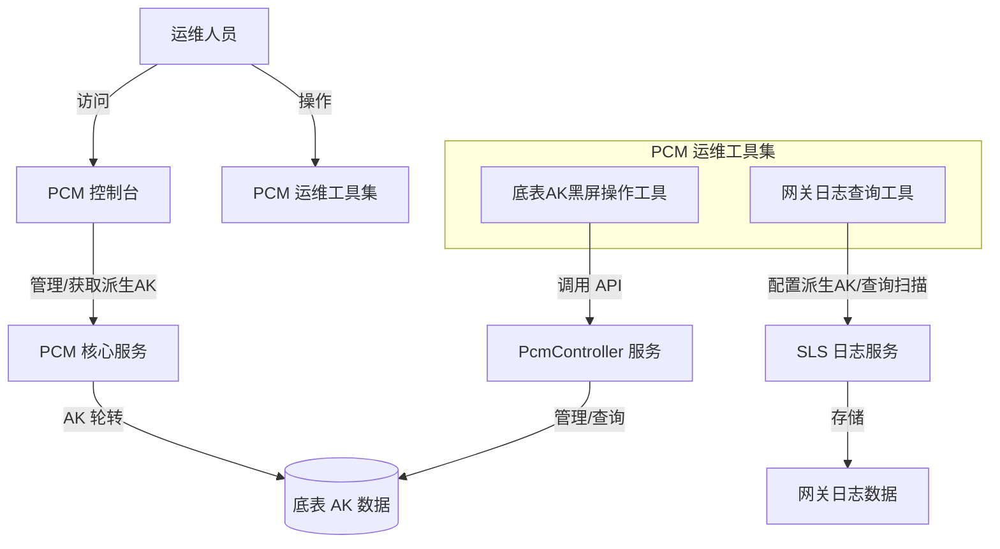

# 服务介绍

[[PCM/平台凭证管理服务/index|平台凭证管理服务]]（PCM，Platform Credential Management）是 `baseServiceAll` 中的基础服务（所属 Service：`platform-credential-management`，默认部署集群：`StandardCloudCluster-A-xx`）。其核心目标是**集中管理平台底表 AK 和派生 AK（临时 AK），接管平台底表 AK，实现凭证的动态轮换与安全管控**，提升平台服务间调用的身份认证与凭证安全性。PCM 提供 AK 轮转能力，并配备 PCM 控制台及配套运维工具集，支持底表 AK 的状态管理以及网关日志中 AK 使用情况的扫描与查询。

## 基本概念

| 概念 | 说明 |
| --- | --- |
| **底表 AK** | 通过全局变量方式声明、云平台初始化时自动创建的 AK |
| **IAMID** | 产品申请派生时身份标识：格式为 `${CLUSTERNAME}:<serverrole名称>`，PaaS 格式为 `{{ .Values.productName }}:{{ .Release.Name }}`（当前未强校验格式） |
| **secretARN** | 凭证目标资源标识，格式为 `apsara:pcm:akid:<accessKeyId>:dst_endpoint:<GatewayCode>:sk:<accessKeySecret>` |
| **GatewayCode** | 服务的认证网关 code，用于区分 AK 私用网关和标准 AK 认证网关（当前版本仅标准 AK 认证网关支持使用底表AK） |
| **initAK** | 原始底表 AK，[[PCM/PCM/index|PCM]] 改造前应用直接使用的凭证 |

## 版本演进与管控模式

### 版本演进
*   **v3182-2510**：新增 **CompatibilityMode（兼容模式）**，提供凭证轮换能力，但不对旧 AK 进行禁用，适用于改造中的过渡态。
*   **v3182-2515 及以后**：新增 **StrictMode（严格模式）**，新部署严格托管；热升级/扩等场景自动降级为兼容模式，作为存量改造完成后的目标终态。
*   **v320**：新增 **initStrictMode（初始严格模式）**，新建凭证即完成改造，任何场景都开启严格处理，适用于新增收口凭证。

### 管控模式
| 模式 | 含义 | 行为 | 适用场景 | 版本 |
| --- | --- | --- | --- | --- |
| **None（默认）** | 不受 PCM 管理 | AK 正常使用，PCM 不介入 | 尚未改造的存量凭证 | / |
| **CompatibilityMode** | 部分完成改造 | 提供轮换能力，但不对旧 AK 禁用 | 改造中的过渡态 | v3182-2510 |
| **StrictMode** | 使用方改造完成 | 新部署严格托管；热升级/扩等场景自动降级为兼容模式 | 存量改造完成后的目标终态 | v3182-2515以后 |
| **initStrictMode** | 新建凭证即完成改造 | 任何场景都开启严格处理 | 新增收口凭证 | v320 |

### 热升级兼容策略
*   **新部署项目**：根据 `restrict` 取值禁用原始通用能力，应用使用凭证进入定时轮换状态。
*   **热升级项目**：原始凭证**不禁用**其通用能力，进入定时轮换状态；如需禁用老凭证，通过观测日志在运维控制台灰度进行。
*   **非 PCM 托管凭证**：一切照旧；若使用了 PCM SDK/CLI 但未被托管，将入参 initAK 返回让应用接着使用。
*   **松→紧变更不自动生效**：模式从松到紧变更时不自动生效，需 ASO 页面提示人工处理，防止误操作。

## 架构设计

### 组件关系与数据流向架构图

### 对外介绍架构图

### 凭证获取调用时序图

### 运维与控制台架构图

## 核心组件与能力详细说明

### PCM SDK / CLI（凭证获取端）
*   **职责**：为云产品应用提供接入能力，直接与 PCM 服务交互获取新凭证，支持多种容错策略。
*   **安全与容错特性**：
    *   **多级缓存**：在本地内存、磁盘均有缓存，提高获取效率。
    *   **容错降级**：PCM 初始化服务异常或报错时，将入参作为凭证返回；如果有缓存，将返回最近一次从服务端获取的凭证。

### PCM Core（核心处理引擎与缓存网关）
*   **职责**：PCM 的核心处理引擎，部署在双 Docker 节点上，通过 Tengine 接入。作为 SDK 与 Controller 之间的访问中间网关，接收业务应用通过 SDK 发起的派生 AK 申请请求，基于托管的底表 AK（initAK）生成并返回临时 AK/SK。
*   **核心能力**：
    *   **状态缓存**：针对每个 IAMID 的底表 `secretARN` 提供 12 小时的共享内存缓存机制，优化频繁调用的性能，缓解 Controller 访问压力。
    *   **日志记录与审计**：记录每个 IAMID 申请派生 AK 的详细记录（持续使用的产品理论上每 12 小时产生一条）；通过 Tengine 记录详细的 Access 日志（含请求源地址、VPC-ID、IAMID、限流状态、耗时等）和 Error 日志。
*   **安全与高可用特性**：
    *   **缓存隔离**：缓存数据仅服务于已认证的 SDK 请求，不对外暴露。
    *   **降级保护**：Core 宕机后，末期过期老凭证行为暂停，SDK 返回上次获得的老凭证（未在窗口期末尾），依然可以使用。
    *   **压力缓解**：作为中间层，避免所有 SDK 请求直接打到 Controller，防止策略大脑被击穿。

### PCM Controller（策略中心）
*   **职责**：负责 PCM 服务的控制面逻辑与状态管理，处理 IAMID 身份标识管理、AK 轮转队列控制等核心调度任务。执行凭证生命周期管理，提供状态管理能力。
*   **核心 API 能力**：
    *   **AK 状态管理**：支持启用或禁用指定的单个 AK，以及启用或禁用全量底表 AK。
    *   **AK 列表查询**：支持获取全部底表 AK 列表，或通过指定的账号 ID（accountId）查询对应的 AK。
*   **安全与管控特性**：
    *   **凭证队列管理**：为每个被托管凭证创建主动过期的凭证队列，定期清洗禁用老化派生凭证。
    *   **模式管控**：根据 `controlByPcm` 配置执行不同模式（CompatibilityMode / StrictMode / initStrictMode）。
    *   **灰度禁用**：支持热升级后以运维变更方式逐步禁用老凭证，而非一刀切。
    *   **日志查询关联**：提供日志查询能力，关联 AK 使用记录，判断是否可以安全禁用。

### PCM 控制台（PKM 白屏管控）
提供可视化的凭证管理界面（入口：ASO -> 安全管理 -> 账户安全 -> 平台凭据管理PCM），降低运维门槛。
*   **底表 AK 管理**：支持查询底表 AK 的禁用状态以及启用底表 AK（注：未提供白屏禁用能力，底表 AK 禁用需通过变更流程操作）。
*   **派生 AK 管理**：支持派生 AK 状态查询，以及在特定场景下（如应用需临时 AK 登录或 initAK 被禁用时）手动创建临时派生 AK。
*   **AK 申请详情**：用于查看派生 AK 的申请记录、认证状态及轮转状态（如包含 `CLOSE_AUTO_ROTATE` 状态表示该队列默认不轮转）。

### 运维工具集
*   **网关日志查询工具**：用于网关日志的分析与 AK 使用情况排查。支持通过网关代码和事件 ID 查询日志详细信息；支持在网关日志中全量扫描底表 AK 的使用情况，结果可自动存储为 CSV、JSON 等格式。
*   **底表 AK 黑屏操作工具**：用于在 PcmController 容器内直接进行 AK 状态的黑屏运维操作，支持启用/禁用指定或全量 AK，以及通过账号 ID 查询 AK。

## 凭证生命周期管理与派生 AK 队列机制

PCM 接管底层分配的凭证，为对应凭证创建**主动过期的凭证队列**，并定期清洗禁用老化的派生凭证。

### 队列基本概念
底表在生成派生 AK 时，每个派生 AK 会关联一个派生 AK 队列。队列默认维持 7 把有效派生 AK，每把派生 AK 有效期 24 小时。因此，一把派生 AK 从创建到默认过期需要 7 天。

### 队列级别
| 级别 | 划分方式 | 说明 | 推荐程度 |
| --- | --- | --- | --- |
| **initAK 级别（默认）** | 一个底表 AK 对应一个派生 AK 队列，全局共享 | 默认配置，也是推荐的选择 | ✅ 推荐 |
| **ClusterName 级别** | 按集群划分，同一集群内一个底表 AK 对应一个派生 AK 队列 | 多集群会为同一个底表 AK 创建多个队列，叠加后可能把 UMM 账户的 AK 上限打满 | ⚠️ 有风险，不推荐 |

> *注：不推荐 ClusterName 级别是因为 UMM AK 管理中每个账户对应的 AK 数量有上限。按集群划分多集群叠加可能打满上限，导致无法创建新的派生 AK。因此默认和推荐的配置都是 initAK 级别。*

### 队列轮转保护机制
派生 AK 队列会持续轮转（定期创建新 AK、禁用老 AK），但在以下情况下会暂停轮转，以保护正在使用中的凭证：
1.  **保护一：产品最新派生 AK 保护**：当要禁用队列里最早的那把 AK 时，系统会检查这把 AK 是否是某个产品获取的最新派生 AK。如果产品 A 拿到这把 AK 后就没再获取过新 AK，那这把就是产品 A 的“最新”，队列就会停止轮转，保持当前状态。直到后续其他产品都获取了更新的派生 AK，队列才会继续轮转。这样保证不会因为轮转把某个产品正在用的 AK 给禁掉。
2.  **保护二：平台 AK 访问日志不可行保护（当前状态）**：当不可行时，PCM 无法确认即将禁用的派生 AK 是否仍有产品在调用，将在第一把队列即将禁用时停止轮转。
3.  **保护三：平台 AK 访问日志可信保护**：平台 AK 访问日志用于检查底表 AK 和派生 AK 是否在网关中有调用记录。在准备禁用某把派生 AK 前，系统会检查平台 AK 访问日志，确认这把 AK 当前是否还在被使用。如果日志显示还有产品在用这把 AK，也会停止轮转。

## 关键安全设计

### 标准 AK 认证 vs AK 私用
| 类型 | 说明 |
| --- | --- |
| **标准 AK 认证** | AK 生命周期在 UMM 中保管，标准网关通过对接 UMM 进行 AK 签名校验（如 POP、OpenAPI、OSS），当前访问标准 AK 认证服务的云产品均已适配完成。 |
| **AK 私用场景** | 服务不接或无法接 UMM，直接把 AK 参数记录到本地配置文件/数据库中，请求过来时用本地配置校验；当前访问 AK 私用服务的云产品尚未强制要求适配，已适配的产品通过 PCM 服务将兑换出原始底表 AK。 |

### 接入后对比示意图

## 与其他产品的关系及异常影响边界

### 依赖产品与交互方式
*   **UMM（AK 生命周期管理）**：作为 PCM 的核心依赖服务，负责 AK 的存储与生命周期管理。PCM Controller 向 UMM 发送指令，执行凭证的创建、轮换和禁用操作。
*   **AAS（账户管理服务）**：负责平台账户统一管理。UMM 在创建/获取派生 AK 时，会与 AAS 联动形成账户-凭证关联关系。
*   **ASO（Apsara Stack Operations）**：作为 PCM 控制台的统一入口，提供安全管理下的账户安全访问路径。
*   **网关（Gateway）**：业务应用调用 PCM 服务时，请求需经过网关侧，网关会记录使用底表 AK 的平台 AK 访问日志，并透传 `Gateway-POP-Tunnel-ID` 等信息。
*   **IAM（身份与访问管理）**：PCM 依赖 IAM 进行服务身份标识（IAMID）的认证与管理。IAMID 不规范会导致认证状态失败，但不会对 AK 申请结果产生实质影响。
*   **VPC（专有网络）**：PCM 在 Access 日志中会记录请求来源的 `X-Aliyun-Vpc-Id`，用于网络层面的访问追踪与安全审计。
*   **SLS（日志服务）**：网关日志查询工具依赖 SLS 进行日志数据的读取。通过配置 SLS 的 Endpoint 以及访问凭证，连接 SLS 服务进行日志扫描和关键字查询。

### 产品异常影响边界（高可用 / 容错逻辑）
PCM 在设计上具备完善的容错降级机制，明确界定了产品异常时可能造成的影响与不会造成的影响：

| 场景 | SDK / 工具行为 | 业务影响（边界说明） |
| --- | --- | --- |
| 新部署时 PCM Core 还未 ready | 将入参作为返回 | **不会造成影响**（Core 未禁用老 AK） |
| 运行时 PCM Core 挂了 | 返回上次获取的老凭证（未在窗口期末尾） | **不会造成影响** |
| 产品独立升级，PCM 未 ready | 将入参作为返回 | **不会造成影响** |
| PCM 和应用都挂了需重拉（SDK 缓存未丢失） | 返回上次获取的老凭证 | **不会造成影响** |
| PCM 和应用都挂了需重拉（SDK 缓存丢失） | **需先恢复 PCM 或使用老凭证应急脚本** | **可能造成影响（业务中断）** |
| SLS 服务异常 / Endpoint 不可达 / 凭证失效 | 网关日志查询工具无法工作 | **不会造成影响**（不影响 PCM 本身的 AK 轮转与底表 AK 状态管理等核心功能） |

### 源码仓库
*   PCM-core：[https://code.alibaba-inc.com/aliyunas_sectech/pcm-core](https://code.alibaba-inc.com/aliyunas_sectech/pcm-core)
*   PCM-controller：[https://code.alibaba-inc.com/aliyunas_sectech/pcm-controller](https://code.alibaba-inc.com/aliyunas_sectech/pcm-controller)