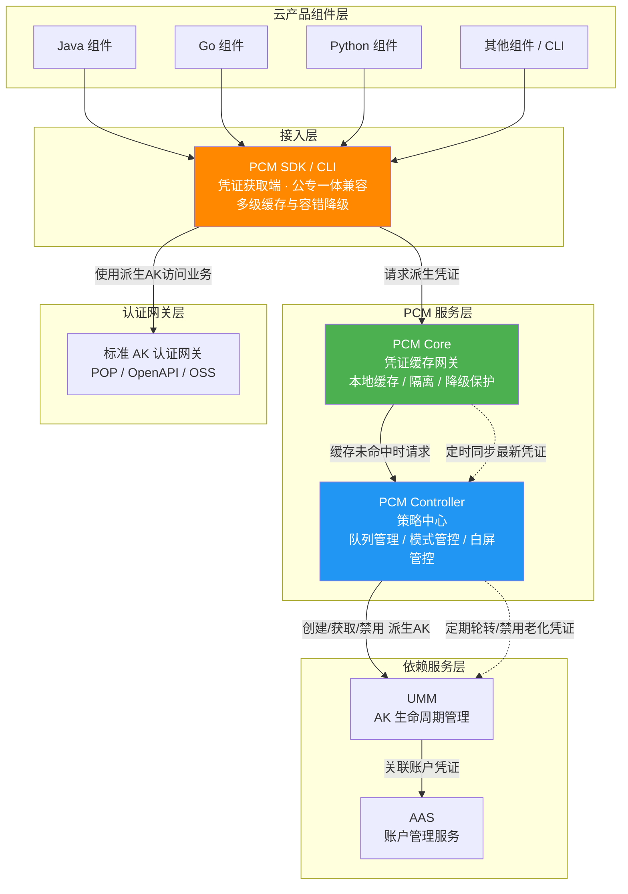
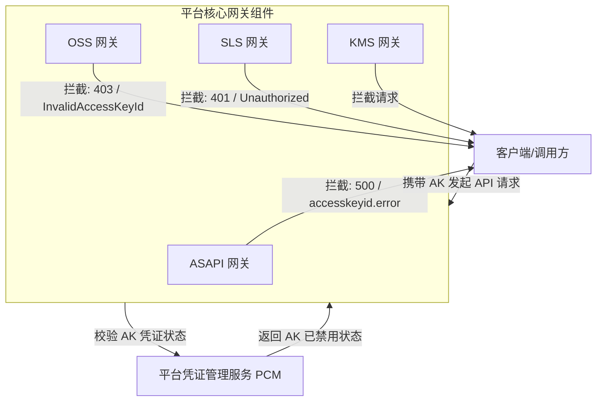

# 服务介绍

**产品定位**
PCM（Platform Credential Management）是 `baseServiceAll` 中的基础安全服务，核心目标是集中管理平台访问凭证（如 AccessKey）。它通过接管平台底表 AK，实现凭证的动态轮换与安全管控；同时负责凭证的状态管理（如禁用 AK），并与平台内各大网关联动，实现对非法或已禁用凭证的访问拦截，从而全面提升系统整体安全性。当遇到访问报错且怀疑是 PCM 禁用 AK 导致时，可通过提取拦截日志中的请求 AK，并通过 PCM 服务查询 AK 状态来进行排查和应急处置。

**各版本新增功能简要说明**
*   **v3182-2510**：引入 CompatibilityMode（兼容模式），提供凭证轮换能力，但不对旧 AK 进行禁用，适用于改造中的过渡态。
*   **v3182-2515 及以后**：引入 StrictMode（严格模式），新部署项目严格托管，热升级/扩容等场景自动降级为兼容模式，作为存量改造完成后的目标终态。
*   **v320**：引入 initStrictMode（初始严格模式），针对新增收口凭证，新建凭证即完成改造，任何场景均开启严格处理。

## 能力涉及的产品与组件

*   **接入端**：云产品组件（Java、Go、Python 等）、PCM SDK / CLI。
*   **服务端**：PCM Core（凭证缓存网关）、PCM Controller（策略中心）。
*   **依赖服务**：UMM（AK 生命周期管理）、AAS（账户管理）。
*   **联动认证网关**：标准 AK 认证网关（如 POP、OpenAPI）、ASAPI (API Server)、OSS (对象存储服务)、SLS (日志服务，包含 SLS_INNER 和 SLSPUB)、KMS (密钥管理服务)、OSS_OCM_INNER 等。

## 系统架构图

### 凭证获取与轮换架构
以下为[[PCM/平台凭证管理服务/index|平台凭证管理服务]]的整体架构与数据流向图，展示了从云产品组件接入到凭证生命周期管理的完整链路：

### 凭证拦截与校验架构
下图展示了 PCM 与各大网关组件的交互关系及数据流向。当客户端携带 AK 发起请求时，各网关会校验 AK 状态，若 PCM 中该 AK 已被禁用，网关将拦截请求并返回特定的错误特征。

## 各核心组件能力详细说明

### PCM 服务端与接入端组件

**PCM SDK / CLI（凭证获取端）**
*   **职责**：为云产品应用提供接入能力，直接与 PCM 服务交互获取新凭证，支持多种容错策略。
*   **多级缓存**：在本地内存、磁盘均设有缓存机制，提升获取效率。
*   **容错降级**：当 PCM 初始化服务异常或报错时，将入参作为凭证返回；若存在缓存，则返回最近一次从服务端获取的凭证，保障业务连续性。

**PCM Core（缓存中间网关）**
*   **职责**：作为 SDK 与 Controller 之间的访问中间网关，缓存 Controller 最新凭证数据，为 SDK 提供 API 获取最新凭证，缓解 Controller 访问压力并提高响应速度。
*   **本地缓存与定时同步**：本地缓存并定时同步 PCM Controller 的最新凭证信息，减少直接访问 Controller 的频率。
*   **缓存隔离**：缓存数据仅服务于已认证的 SDK 请求，不对外暴露。
*   **降级保护**：Core 宕机后，末期过期老凭证行为暂停，SDK 返回上次获得的老凭证（未在窗口期末尾），保障业务依然可用。
*   **压力缓解**：作为中间层避免所有 SDK 请求直接打到 Controller，防止策略大脑被击穿。

**PCM Controller（策略中心）**
*   **职责**：PCM 凭证管控核心，执行凭证生命周期管理，提供 PKM 白屏管控、日志查询关联、状态管理能力，支持热升级后以运维变更方式将老凭证进行禁用。
*   **凭证队列管理**：为每个被托管凭证创建主动过期的凭证队列（默认维持 7 把有效派生 AK，每把有效期 24 小时），定期清洗禁用老化派生凭证，并具备最新派生 AK 保护、平台 AK 访问日志保护等轮转保护机制。
*   **模式管控**：根据配置执行 None、CompatibilityMode、StrictMode 或 initStrictMode 等不同管控模式。
*   **安全变更与灰度禁用**：模式从松到紧变更时不自动生效，需 ASO 页面提示人工处理防止误操作；支持热升级后以运维变更方式逐步灰度禁用老凭证。
*   **白屏管控与日志关联**：提供可视化的 PKM 凭证管理界面，并提供日志查询能力关联 AK 使用记录，判断是否可安全禁用。

**UMM（AK 生命周期管理）与 AAS（账户管理服务）**
*   **UMM**：PCM 依赖服务，负责 AK 的存储与生命周期管理，接收 Controller 指令执行凭证轮换和禁用操作。
*   **AAS**：PCM 依赖服务，负责平台账户统一管理，与 UMM 联动形成账户-凭证关联关系。

### 联动网关拦截能力
各核心网关组件在联动 PCM 进行凭证拦截时，具备不同的日志特征与错误返回能力：

*   **ASAPI (API Server)**
    *   **拦截特征**：返回 HTTP 状态码 `500`（或 `0`），错误码为 `asapi.server.request.parameter.accesskeyid.error`。
    *   **错误信息**：`The specified AccessKey ID ({AK}) is invalid. Details: (The Access Key is disabled.).`
    *   **处置建议**：日志中会提供 `errorSuggestion`，如 `Check whether the AccessKey pair exists and is enabled.`。
*   **OSS (对象存储服务)**
    *   **拦截特征**：返回 HTTP 状态码 `403`。
    *   **错误信息**：错误码为 `InvalidAccessKeyId`。
*   **SLS (日志服务)**
    *   **SLS_INNER**：返回 HTTP 状态码 `401`。
    *   **SLSPUB**：返回 HTTP 状态码 `401`，错误码为 `Unauthorized`，错误信息明确提示 `AccessKeyId is disabled: {AK}`。
*   **KMS / OSS_OCM_INNER**
    *   具备对禁用 AK 的拦截能力，协同 PCM 完成凭证安全管控。

## 产品交互与异常影响边界

**与相关产品的交互方式及影响**
*   **UMM 与 AAS**：PCM Controller 依赖 UMM 进行 AK 生命周期管理（创建/获取/禁用派生 AK），UMM 依赖 AAS 进行账户管理与凭证关联。若 UMM/AAS 异常，将影响新派生 AK 的生成，但得益于 PCM 的多级缓存与降级机制，短期内不会影响现有业务的凭证使用。
*   **核心联动网关（ASAPI、OSS、SLS、KMS 等）**：PCM 作为凭证状态的权威数据源，当在 PCM 中禁用某个 AK 时，上述网关产品会依据 PCM 的状态对携带该 AK 的请求进行拦截。云产品组件通过 PCM SDK 获取派生 AK 后，使用这些 AK 访问标准认证网关，网关通过对接 UMM 进行 AK 签名校验。PCM 的凭证轮转机制对网关透明，网关仅需正常校验 AK 有效性。这种交互直接决定了用户或内部系统能否成功调用云产品 API。

**异常场景与影响边界**

| 异常场景 | 造成的影响（业务表现） | 不会造成的影响（边界清晰） |
| --- | --- | --- |
| **PCM 误禁用正常 AK** | 依赖该 AK 的 ASAPI、OSS、SLS、KMS 等网关请求被全面拦截，引发业务报错（如 401、403、500 等状态码）。需提取请求 AK 并通过 PCM 查询状态进行应急处置。 | 不会导致底层数据损坏，也不会影响 VPC、ECS、SLB 等基础网络与计算产品的正常运行。 |
| **新部署时 PCM Core 还未 ready** | 无影响。SDK 将入参（底表 AK）作为返回，Core 未禁用老 AK。 | 不会导致新部署的应用启动失败或鉴权失败。 |
| **运行时 PCM Core 宕机** | 无影响。SDK 返回上次获取的老凭证（未在窗口期末尾）。 | 不会导致正在运行的业务中断或请求被网关拒绝。 |
| **产品独立升级，PCM 未 ready** | 无影响。SDK 将入参作为返回。 | 不会影响产品自身的升级流程和升级后的基础运行。 |
| **PCM 和应用都挂了需重拉（SDK 缓存未丢失）** | 无影响。SDK 返回上次获取的老凭证。 | 不会导致应用重启后无法获取有效凭证。 |
| **PCM 和应用都挂了需重拉（SDK 缓存丢失）** | **业务中断**。需先恢复 PCM 或使用老凭证应急脚本。 | 不会导致底层数据损坏或 UMM/AAS 中的账户数据异常。 |
| **AK 私用场景（未接 UMM 的服务）** | 尚未强制要求适配，已适配产品通过 PCM 兑换原始底表 AK。 | 不会直接影响未改造的 AK 私用服务的原有鉴权逻辑。 |