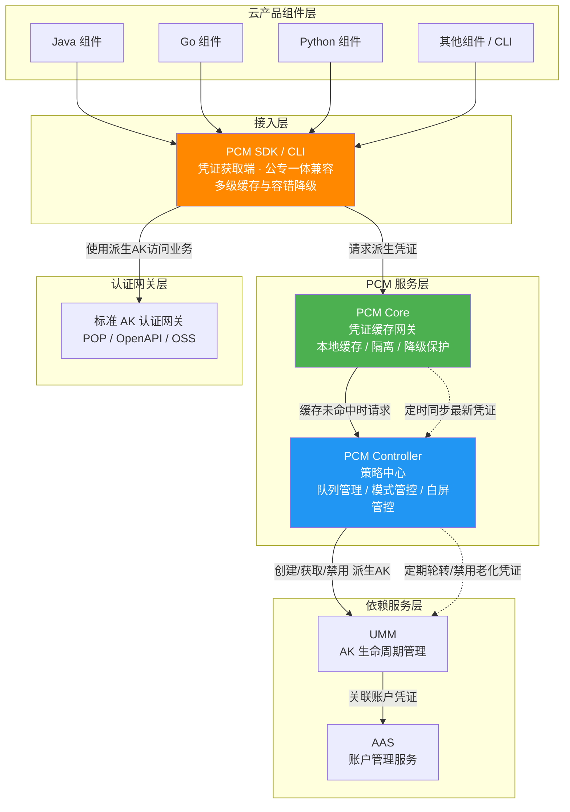
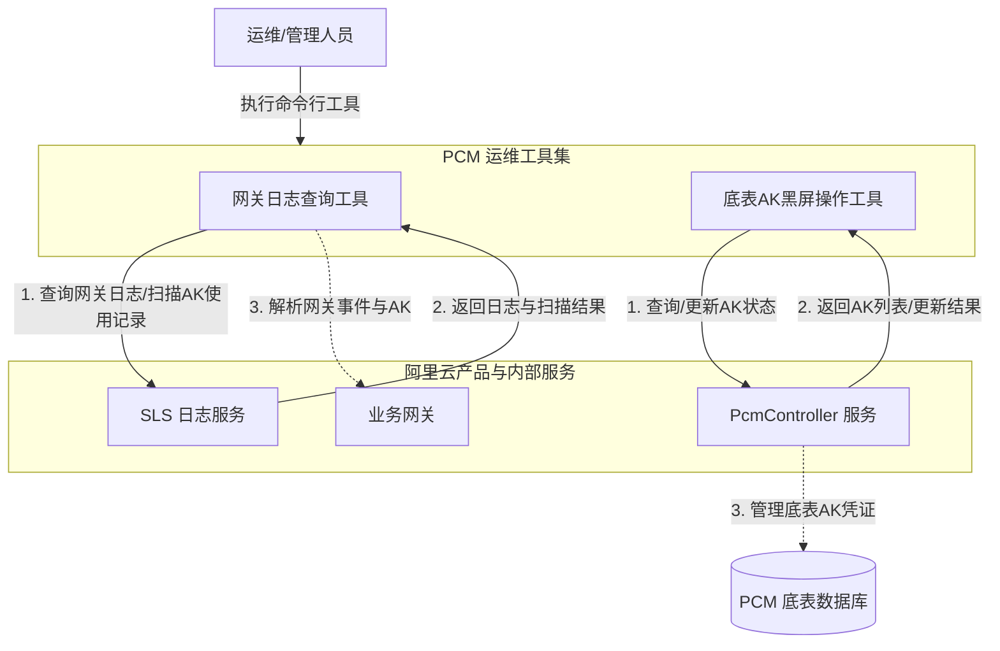
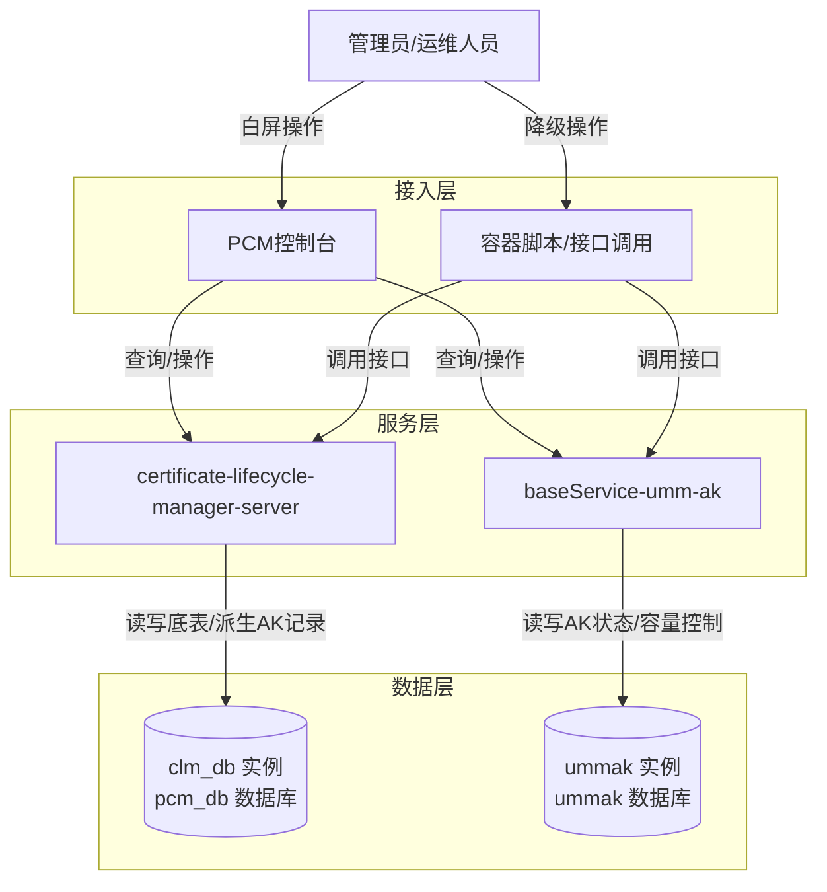

# 服务介绍

**产品定位**
PCM（Platform Credential Management）是 `baseServiceAll` 中的基础服务。其核心目标是接管平台底表 AK（如 initAK、底表AK、派生AK），实现凭证的动态轮换、安全管控、生命周期及容量管理。同时提供平台级凭证的运维审计与应急处置能力（如白屏控制台、网关日志查询与底表 AK 黑屏操作）。应急操作遵循“控制台白屏 > 调用接口（容器脚本） > 数据库执行SQL”的优先级降级原则，帮助运维人员追踪凭证使用情况、排查网关事件，并对底表 AK 进行快速的启停与查询管理，从而全面提升系统整体安全性与运维效率。

**各版本新增功能与演进历程**
*   **v3182-2510**：引入 CompatibilityMode（兼容模式），提供凭证轮换能力，但不对旧 AK 进行禁用，适用于改造中的过渡态。
*   **v3182-2515 及以后**：引入 StrictMode（严格模式），新部署项目严格托管，热升级/扩容等场景自动降级为兼容模式，作为存量改造完成后的目标终态。
*   **v320**：引入 initStrictMode（初始严格模式），针对新增收口凭证，新建凭证即完成改造，任何场景均开启严格处理。
*   **当前版本（运维工具链演进）**：主要聚焦于运维工具链的建设，新增了网关日志查询工具（支持事件 ID 查询与底表 AK 全量扫描）以及底表 AK 黑屏操作工具（支持单 AK 及全量 AK 的启停控制与账号维度查询）。

## 能力涉及的产品与组件

*   **接入与操作端**：云产品组件（Java、Go、Python 等）、PCM SDK / CLI、PCM 控制台（白屏）、容器脚本（接口调用工具）。
*   **服务端组件**：PCM Core（凭证缓存网关）、PCM Controller / certificate-lifecycle-manager-server（策略中心与生命周期管理服务）、baseService-umm-ak（UMM AK 基础服务）。
*   **运维工具**：网关日志查询工具、底表 AK 黑屏操作工具。
*   **依赖服务与数据库**：UMM（AK 生命周期管理）、AAS（账户管理）、SLS（日志服务）；数据库实例包括 clm_db（包含 pcm_db 数据库）、ummak（包含 ummak 数据库）。
*   **认证网关**：标准 AK 认证网关（如 POP、OpenAPI、OSS）。
*   **运行环境**：OPS1 运维环境、特定 VPC/ECS 实例。

## 对外介绍架构图

### 核心服务与数据流向架构
以下为[[PCM/平台凭证管理服务/index|平台凭证管理服务]]的整体架构与数据流向图，展示了从云产品组件接入到凭证生命周期管理的完整链路：

### 运维工具链架构
以下为 PCM 运维工具集的整体架构，展示了运维人员如何通过工具与日志服务及控制面进行交互：

### 控制台与底层数据架构
以下为 PCM 控制台、应急脚本与底层数据库的组件关系与数据流向架构图：

## 各核心组件能力详细说明

**PCM SDK / CLI（凭证获取端）**
*   **职责**：为云产品应用提供接入能力，直接与 PCM 服务交互获取新凭证，支持多种容错策略。
*   **多级缓存**：在本地内存、磁盘均设有缓存机制，提升获取效率。
*   **容错降级**：当 PCM 初始化服务异常或报错时，将入参作为凭证返回；若存在缓存，则返回最近一次从服务端获取的凭证，保障业务连续性。

**PCM 控制台（白屏）与 容器脚本**
*   **PCM控制台（白屏）**：提供可视化操作界面，支持 initAK 和派生AK 的查询与启用操作。对于派生AK，白屏仅支持查询最近 14 把派生AK（超过 14 把会在 ummak 侧执行删除，但 pcm 数据库会保留记录）。目前暂不支持通过白屏解禁全量底表AK。
*   **容器脚本（接口调用）**：作为白屏不可用时的降级应急方案，通过在容器中执行脚本调用服务接口，支持启用特定 initAK、全量底表AK 等操作。相关工具可参考 工具。

**PCM Core（缓存中间网关）**
*   **职责**：作为 SDK 与 Controller 之间的访问中间网关，缓存 Controller 最新凭证数据，为 SDK 提供 API 获取最新凭证，缓解 Controller 访问压力并提高响应速度。
*   **本地缓存与定时同步**：本地缓存并定时同步 PCM Controller 的最新凭证信息，减少直接访问 Controller 的频率。
*   **缓存隔离**：缓存数据仅服务于已认证的 SDK 请求，不对外暴露。
*   **降级保护**：Core 宕机后，末期过期老凭证行为暂停，SDK 返回上次获得的老凭证（未在窗口期末尾），保障业务依然可用。
*   **压力缓解**：作为中间层避免所有 SDK 请求直接打到 Controller，防止策略大脑被击穿。

**PCM Controller / certificate-lifecycle-manager-server（策略与生命周期中心）**
*   **职责**：PCM 凭证管控核心，执行凭证生命周期管理，管理底表AK和派生AK的生命周期记录。提供 PKM 白屏管控、日志查询关联、状态管理能力，支持热升级后以运维变更方式将老凭证进行禁用。
*   **底层 API 与数据存储**：提供底表 AK 列表查询（`queryInitAkList`）和 AK 状态更新（`updateAkStatus`）等底层 API。其数据存储在 clm_db 实例的 pcm_db 数据库中，记录包括底表AK的状态（`umm_ak_status`）以及派生AK的详细信息。通过请求签名（Timestamp + MD5）保障内部调用的安全性。
*   **凭证队列管理**：为每个被托管凭证创建主动过期的凭证队列（默认维持 7 把有效派生 AK，每把有效期 24 小时），定期清洗禁用老化派生凭证，并具备最新派生 AK 保护、平台 AK 访问日志保护等轮转保护机制。
*   **模式管控**：根据配置执行 None、CompatibilityMode、StrictMode 或 initStrictMode 等不同管控模式。
*   **安全变更与灰度禁用**：模式从松到紧变更时不自动生效，需 ASO 页面提示人工处理防止误操作；支持热升级后以运维变更方式逐步灰度禁用老凭证。

**baseService-umm-ak / UMM（AK 状态与生命周期管理）**
*   **职责**：负责底层 AK 的实际状态管理、容量控制和生命周期管理，接收 Controller 指令执行凭证轮换和禁用操作。
*   **数据存储与容量控制**：数据存储在 ummak 实例的 ummak 数据库的 `accesskey_table` 表中。控制 AK 的启用（`enabled_flag`）、隐藏（`hidden_flag`）、删除（`deleted_flag`）等状态。具备容量限制能力，每个 uid 下最大支持 1000 把有效 AK，达到上限后会导致派生失败。

**AAS（账户管理服务）**
*   **职责**：PCM 依赖服务，负责平台账户统一管理，与 UMM 联动形成账户-凭证关联关系。

**PCM 运维工具集**
*   **网关日志查询工具**：
    *   **日志查询**：支持通过“网关代码+事件ID”或关键字，精准查询网关日志详细信息，快速定位使用特定 AK 的网关事件。
    *   **AK 使用扫描**：支持在网关日志中全量扫描底表 AK 的使用情况。可配置扫描周期（如过去10小时）、分页大小及并发数，扫描结果支持输出为 print、json、csv 等格式，便于离线审计。
*   **底表 AK 黑屏操作工具**：
    *   **AK 状态管理**：支持对指定的单个 AK 或全量底表 AK 进行启用（enable）或禁用（disable）操作，通过调用 PcmController 接口实现状态的快速变更。
    *   **AK 信息查询**：支持通过账号 ID（Account ID）查询对应的底表 AK 信息，便于在复杂场景下快速定位凭证归属。

## 与阿里云其他产品的关系及异常影响

### 与相关产品的交互方式及影响
*   **UMM 与 AAS**：PCM Controller 依赖 UMM 进行 AK 生命周期管理（创建/获取/禁用派生 AK），UMM 依赖 AAS 进行账户管理与凭证关联。若 UMM/AAS 异常，将影响新派生 AK 的生成，但得益于 PCM 的多级缓存与降级机制，短期内不会影响现有业务的凭证使用。
*   **标准 AK 认证网关（POP、OpenAPI、OSS 等）**：云产品组件通过 PCM SDK 获取派生 AK 后，使用这些 AK 访问标准认证网关。网关通过对接 UMM 进行 AK 签名校验。PCM 的凭证轮转机制对网关透明，网关仅需正常校验 AK 有效性。
*   **SLS（日志服务）**：网关日志查询工具通过配置 SLS 的 Inner 和 Pub Endpoint（如 `slsinner`、`slspub`），使用派生 AK 访问 SLS 进行日志检索和数据扫描。强依赖 SLS 的可用性与网络连通性，若 SLS 异常或 Endpoint 无法解析，将导致网关日志查询和 AK 扫描功能不可用。
*   **VPC、ECS 等基础网络/计算产品**：网关日志查询工具通常部署在 OPS1 服务或能够解析 `slsinner` 域名的特定网络环境（如特定 VPC 内的 ECS 实例）中运行；底表 AK 黑屏操作工具依赖环境变量中的 `pcm_ctrl_domain` 访问 PcmController 服务。工具的运行依赖底层 ECS 的计算资源及 VPC 的网络路由策略。若网络策略变更导致无法访问 SLS Inner 网络或 PcmController 域名，工具将无法正常工作。

### 产品异常可能造成的影响与边界

| 异常场景 | 造成的影响（业务表现） | 不会造成的影响（边界清晰） |
| --- | --- | --- |
| **ummak 侧单 uid 有效 AK 达到 1000 把上限** | **派生失败**。直接影响依赖这些凭证进行鉴权和调用的下游业务，导致业务请求失败。 | 不会影响其他 uid 的凭证派生，不会导致底层数据库崩溃。 |
| **PCM 管理的凭证被异常禁用** | **业务中断**。直接影响依赖这些 initAK、底表AK 或派生AK 进行鉴权的下游业务，导致请求失败。 | 不会导致底层数据损坏或 UMM/AAS 中的账户数据异常。 |
| **新部署时 PCM Core 还未 ready** | 无影响。SDK 将入参（底表 AK）作为返回，Core 未禁用老 AK。 | 不会导致新部署的应用启动失败或鉴权失败。 |
| **运行时 PCM Core 宕机** | 无影响。SDK 返回上次获取的老凭证（未在窗口期末尾）。 | 不会导致正在运行的业务中断或请求被网关拒绝。 |
| **产品独立升级，PCM 未 ready** | 无影响。SDK 将入参作为返回。 | 不会影响产品自身的升级流程和升级后的基础运行。 |
| **PCM 和应用都挂了需重拉（SDK 缓存未丢失）** | 无影响。SDK 返回上次获取的老凭证。 | 不会导致应用重启后无法获取有效凭证。 |
| **PCM 和应用都挂了需重拉（SDK 缓存丢失）** | **业务中断**。需先恢复 PCM 或使用老凭证应急脚本。 | 不会导致底层数据损坏或 UMM/AAS 中的账户数据异常。 |
| **PCM 服务或运维工具异常** | 运维人员无法查询网关日志中的 AK 使用记录，无法通过黑屏工具快速启停底表 AK，影响凭证审计与应急阻断效率。 | **不会**影响线上业务网关的正常流量转发，**不会**影响已下发 AK 的正常鉴权与业务请求，**不会**导致现有业务中断。 |
| **AK 私用场景（未接 UMM 的服务）** | 尚未强制要求适配，已适配产品通过 PCM 兑换原始底表 AK。 | 不会直接影响未改造的 AK 私用服务的原有鉴权逻辑。 |