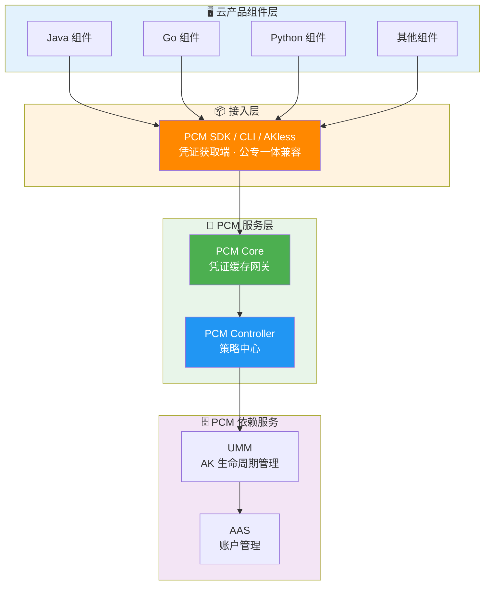
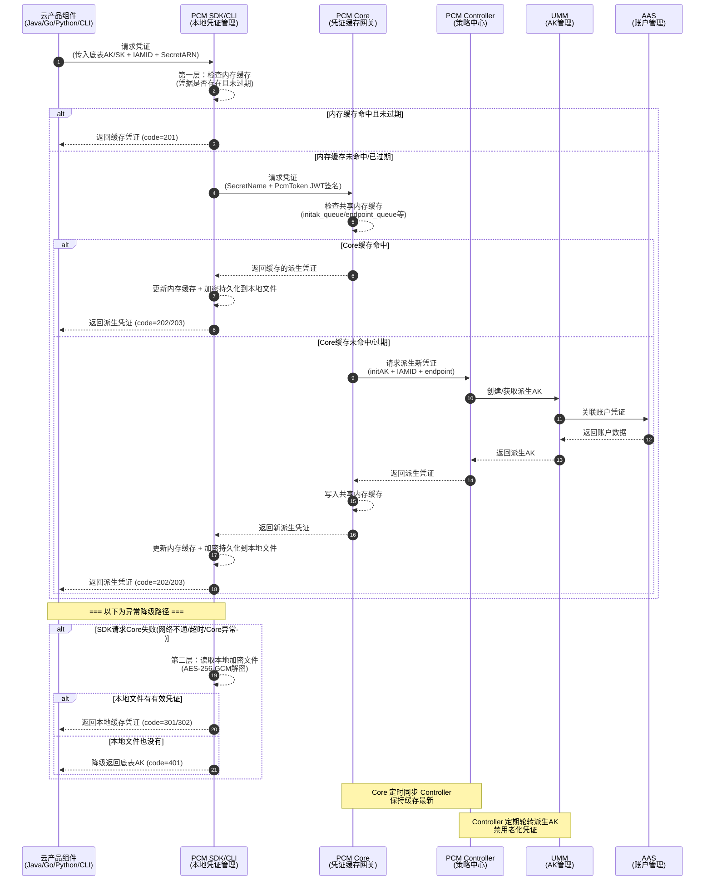

# 服务介绍

| 概念 | 说明 |
| --- | --- |
| **底表 AK** | 通过全局变量方式声明、云平台初始化时自动创建的 AK |
| **IAMID** | 产品申请派生时身份标识：格式为 `${CLUSTERNAME}:<serverrole名称>`，PaaS 格式为 `{{ .Values.productName }}:{{ .Release.Name }}`（当前未强校验格式） |
| **secretARN** | 凭证目标资源标识，格式为 `apsara:pcm:akid:<accessKeyId>:dst_endpoint:<GatewayCode>:sk:<accessKeySecret>` |
| **GatewayCode** | 服务的认证网关 code，用于区分 AK 私用网关和标准 AK 认证网关（当前版本仅标准 AK 认证网关支持使用底表 AK） |
| **initAK** | 原始底表 AK，PCM 改造前应用直接使用的凭证 |

## 服务部署信息

- **所属产品**：`baseServiceAll`
- **部署集群**：`StandardCloudCluster-A-xx`
- **所属 Service**：`platform-credential-management`

## 版本演进与管控模式

| 版本 | 新增功能/管控模式 | 说明 |
| --- | --- | --- |
| 早期版本 | None（默认模式） | 不受 PCM 管理，AK 正常使用，PCM 不介入，适用于尚未改造的存量凭证。 |
| v3182-2510 | CompatibilityMode（兼容模式） | 部分完成改造，提供轮换能力，但不对旧 AK 禁用，适用于改造中的过渡态。 |
| v3182-2515及以后 | StrictMode（严格模式） | 使用方改造完成，新部署严格托管；热升级/扩等场景自动降级为兼容模式，适用于存量改造完成后的目标终态。 |
| v320 | initStrictMode（初始严格模式） | 新建凭证即完成改造，任何场景都开启严格处理，适用于新增收口凭证。 |

## 涉及的产品与组件

能力涉及云产品应用组件（Java、Go、Python、CLI 等）、PCM SDK/CLI、PCM Core、PCM Controller，以及依赖的 UMM（AK 生命周期管理）和 AAS（账户管理服务）。

## 对外介绍架构图

### 部署架构与组件关系

### 数据流向与调用时序

## 各核心组件能力详细说明

### PCM SDK / CLI（凭证获取端）
**职责**：为云产品应用提供接入能力，直接与 PCM 服务交互获取新凭证，支持多种容错策略。
**核心能力与安全特性**：
- **多级缓存**：在本地内存、磁盘均有缓存。
- **容错降级**：PCM 初始化服务异常或报错时，将入参作为凭证返回；如果有缓存，将返回最近一次从服务端获取的凭证。
- **超时控制**：接入 PCM 后可能导致部分时间敏感服务延迟加大（包含网络延迟）。为此增加了超时控制策略，支持通过 `PCM_TASK_DELAY` 环境变量设置访问 PCM 的最大超时时间（默认 1000ms，即 1s），以优化时间敏感服务的延迟问题。
- **半轮转模式风险**：部分产品采用半自动轮转模式（仅在启动时获取一次派生 AK，后续不再主动刷新）。如果该唯一一次获取请求恰好失败（如 Core 限流、网络抖动、服务未就绪），产品将持续使用底表 AK 或无有效凭据运行，且不会自动恢复。
- **无服务端时的日志行为**：当环境中 PCM 服务（Core）未部署或不可达时，SDK 无法生成缓存，仍然会按配置的间隔持续尝试连接，每次失败产生 WARN 级别日志。

### PCM Core（缓存中间网关）
**职责**：SDK 与 Controller 之间的访问中间网关，缓存 Controller 最新凭证数据，为 SDK 提供 API 获取最新凭证，缓解 Controller 访问压力，提高 SDK 访问响应速度。
**核心能力与安全特性**：
- **本地缓存 + 定时同步**：本地缓存并定时同步 PCM Controller 的最新凭证信息，减少直接访问 Controller 的频率。
- **缓存隔离**：缓存数据仅服务于已认证的 SDK 请求，不对外暴露。
- **降级保护**：Core 宕机后，末期过期老凭证行为暂停，SDK 返回上次获得的老凭证（未在窗口期末尾），依然可以使用。
- **压力缓解**：作为中间层，避免所有 SDK 请求直接打到 Controller，防止策略大脑被击穿。
- **限流策略与误伤风险**：Core 的限流策略基于客户端 IP。当同一台机器上运行多个产品组件时，一个高频产品的请求可能耗尽该 IP 的限流配额，导致同 IP 下其他产品被连带限流（返回 502）。
- **日志记录与排查能力**：
  - **AK 申请日志**：记录每个 IAMID 申请派生 AK 的行为。Core 针对每个 IAMID 的底表 secretARN 缓存时间为 12 小时，对于持续使用派生 AK 的产品，理论上每 12 小时会生成一条申请日志。
  - **日志排查机制**：PCM Core 部署在两个 Docker 容器上，排查 error 和 access 日志时需同时查询两个容器。支持通过 `requestid`、`akid`、`iamid` 及时间段进行复合筛选定位问题。
  - **Access 日志核心参数**：包含 `remote_addr`（源地址）、`request_uri` / `SecretName`（含 iamid、secretname、endpoint 等信息）、`IamId`（请求服务身份，HTTP 报错时可能为空）、`status`（HTTP 返回码）、`request_time`（总耗时）、`limit_req_status`（限流状态，未限流为 "PASSED"）、`eagleeye_traceid`（即 requestid，用于关联 error_log）。

### PCM Controller（策略中心）
**职责**：PCM 凭证管控核心，执行凭证生命周期管理，提供 PKM 白屏管控、日志查询关联、状态管理能力，支持热升级后以运维变更方式将老凭证进行禁用。
**核心能力与安全特性**：
- **凭证生命周期管理**：接管底层分配的凭证，为对应凭证创建**主动过期的凭证队列**，并定期清洗禁用老化的派生凭证。
- **派生 AK 队列机制**：
  - **队列概念**：底表在生成派生 AK 时，每个派生 AK 会关联一个派生 AK 队列，队列默认维持 7 把有效派生 AK，每把有效期 24 小时（从创建到默认过期需 7 天）。
  - **队列级别**：支持 `initAK` 级别（默认推荐，一个底表 AK 对应一个队列全局共享）和 `ClusterName` 级别（按集群划分，不推荐，易打满 UMM 账户 AK 上限）。
  - **轮转保护机制**：在禁用最早 AK 前，系统会进行三重保护检查（产品最新派生 AK 保护、平台 AK 访问日志不可行时保护、平台 AK 访问日志可信时的调用记录保护），若仍在使用则暂停轮转。
- **模式管控**：根据 `controlByPcm` 配置执行不同模式（CompatibilityMode / StrictMode / initStrictMode）。
- **热升级兼容策略**：新部署项目根据 `restrict` 取值禁用原始通用能力并定时轮换；热升级项目原始凭证不禁用通用能力，进入定时轮换；非 PCM 托管凭证一切照旧。
- **松→紧变更不自动生效**：模式从松到紧变更时不自动生效，需 ASO 页面提示人工处理，防止误操作。
- **灰度禁用**：支持热升级后以运维变更方式逐步禁用老凭证，而非一刀切。
- **白屏管控（PCM 控制台）与日志关联**：
  - **控制台入口**：ASO -> 安全管理 -> 账户安全 -> 平台凭据管理 PCM。
  - **底表 AK 管理**：支持查询底表 AK 禁用状态、启用底表 AK（注：未提供白屏禁用能力，禁用需通过黑屏工具或变更流程）。
  - **派生 AK 管理**：支持状态查询；支持**手动创建临时 AK**（适用于应用需使用临时 AK 登录或 initAK 被禁用的应急场景，需输入 IAMID、initAKID、有效天数 1~365天等，SK 明文仅在创建成功弹窗展示，关闭后无法再次查看）。
  - **AK 申请详情与状态说明**：认证状态失败仅表示 IAMID 格式不规范，不影响申请结果；轮转状态已停止可能因为 IAMID 含 `CLOSE_AUTO_ROTATE` 标识、使用队列的产品未及时更新、或仍有产品在使用第 7 把 AK。
  - **日志关联**：提供可视化的凭证管理界面，结合网关侧的平台 AK 访问日志（记录底表 AK 使用情况）辅助判断是否可安全禁用。**查询限制**：白屏仅支持查询每个派生队列中最近 14 把派生 AK，超过 14 把的 AK 会在 UMM 侧执行删除操作，但 PCM 数据库会保留派生 AK 记录。
- **黑屏运维工具支持**：除白屏管控外，还提供**网关日志查询工具**（支持通过网关和事件 ID 查询日志详细信息、全量扫描底表 AK 使用情况）与**底表 AK 黑屏操作工具**（支持启用/禁用指定或全量底表 AK），以满足黑屏运维与应急处理场景的需求。
- **状态管理**：管理每个凭证的当前状态（轮换中/已禁用/正常等）。

### 依赖服务组件
- **UMM（AK 生命周期管理）**：PCM 依赖服务，负责 AK 的存储与生命周期管理，接收 Controller 指令执行凭证轮换和禁用操作。
- **AAS（账户管理服务）**：PCM 依赖服务，负责平台账户统一管理，与 UMM 联动形成账户-凭证关联关系。

### 关键安全设计：标准 AK 认证 vs AK 私用

| 类型 | 说明 |
| --- | --- |
| **标准 AK 认证** | AK 生命周期在 UMM 中保管，标准网关（如 POP、OpenAPI、OSS）通过对接 UMM 进行 AK 签名校验。当前访问标准 AK 认证服务的云产品均已适配完成。 |
| **AK 私用场景** | 服务不接或无法接 UMM，直接把 AK 参数记录到本地配置文件/数据库中，请求过来时用本地配置校验。当前访问 AK 私用服务的云产品尚未强制要求适配，已适配的产品通过 PCM 服务兑换出原始底表 AK。 |

### 接入后对比示意图

## 与阿里云其他产品的关系

### 与相关产品的交互方式及影响
- **UMM / AAS**：PCM Controller 依赖 UMM 进行 AK 的创建、获取、轮换和禁用，UMM 依赖 AAS 关联账户凭证。PCM 的指令直接影响 UMM 中 AK 的生命周期状态。**容量限制影响**：UMM 侧每个 UID 下最大支持 1000 把有效 AK，当达到上限时会导致 PCM 派生 AK 失败，需关注容量告警并及时清理无用 AK。
- **标准网关（POP、OpenAPI、OSS 等）**：标准网关通过对接 UMM 进行 AK 签名校验，并在网关侧记录平台 AK 访问日志（记录底表 AK 的使用情况）。PCM 派生的 AK 在这些网关中正常使用，PCM 的轮转和禁用操作会直接影响网关对这些 AK 的校验结果。
- **云产品应用（Java/Go/Python 等组件）**：云产品应用通过集成 PCM SDK/CLI 获取派生 AK。

### 产品异常可能造成的影响与边界

**可能造成的影响**：
- **底表禁用后 PCM 链路中断**：底表 AK 被 PCM 禁用后，产品的凭据供给将完全依赖 PCM 链路（Core + Controller）。对于本地有缓存的运行中服务暂时无影响；但如果服务重启且此时 PCM 不可用，将拿不到任何有效凭据（底表已禁、派生获取失败、本地无缓存），导致业务直接中断。
- **Core 限流误伤同机其他产品**：Core 的限流策略基于客户端 IP。当同一台机器上运行多个产品组件时，一个高频产品的请求可能耗尽该 IP 的限流配额，导致同 IP 下其他产品被连带限流（返回 502），影响同机其他产品的凭证获取。

**不会造成的影响（边界清晰）**：
- **客户端 WARN 日志不影响业务调用**：当环境中 PCM 服务（Core）未部署、不可达或初始化异常时，客户端可能产生大量 `Failed to refresh credential` 等 WARN 日志，但 SDK 会触发容错降级机制（返回原始底表 AK 或本地缓存凭证），不会导致实际业务调用失败。
- **IAMID 格式不规范不影响凭证使用**：控制台显示的“认证状态失败”仅表示 IAMID 格式不规范，不影响派生 AK 的实际申请结果和后续使用。