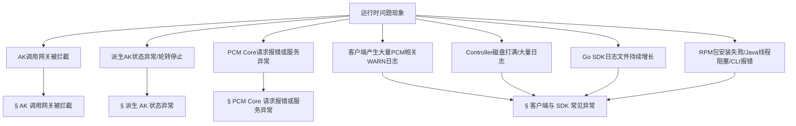
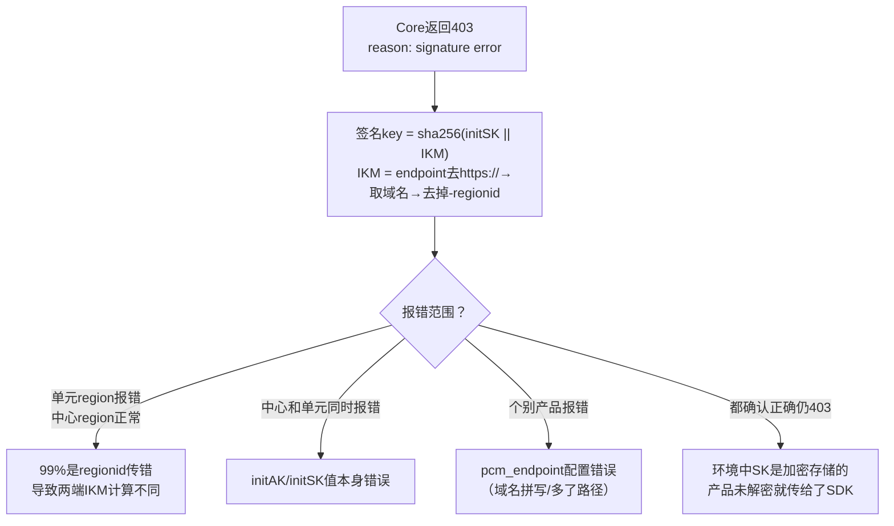

# 典型问题排查解决方案

应急操作优先建议控制台白屏操作，当白屏无法访问时，采用在容器中执行脚本（调用服务接口），当容器无法访问时，直接在数据库中执行 SQL。
操作优先级：**控制台白屏 > 调用接口（容器脚本） > 数据库执行 SQL**

## 运行时问题现象概览

本文档以**问题现象**作为入口，引导排查思路。



## AK 调用网关被拦截

### 一、问题描述
*   **问题现象**：PCM 接入后最核心的排查场景。用户或系统访问各云产品网关（如 OSS、SLS、ASAPI、KMS、ODPS 等）时出现访问报错、鉴权失败（如返回 401、403 状态码），怀疑是 PCM 禁用了 AccessKey（AK）导致的拦截。
*   **适用范围**：所有接入 PCM 的产品调用网关场景。

### 二、排查信息收集

#### 1. 必须收集的信息
*   请求使用的 AccessKeyId (AK)
*   报错发生的时间
*   请求的网关/产品名称
*   客户端 IP (ClientIP / Source IP)
*   RequestID (如 eagleeye_traceid)
*   对应网关的拦截/访问日志

#### 2. 排查问题步骤
1.  **获取拦截日志**：当遇到访问报错，怀疑是 PCM 禁用 AK 导致时，优先通过对应网关的拦截日志进行判定。
2.  **提取请求 AK**：从拦截日志中提取出发起请求的 `AccessKeyId`。
3.  **查询 AK 状态与终态判定**：通过 PCM 服务管理控制台或 PCM API 查询该 AK 的状态，确认其是否处于“已禁用”状态，并确认是底表 AK 还是派生 AK。
4.  **日志特征比对**：根据下方“各网关拦截日志特征与示例”比对日志关键字段，确认是否为 AK 禁用导致的拦截。

#### 3. 检查终态的方法（AK 类型判定）
*   **底表 AK 判定**：可以直接通过控制台查询。
    
*   **派生 AK 判定**：
    *   控制台仅可以查询每个队列最近 14 把派生 AK。
        
    *   **数据库查询**：
        *   service：`certificate-lifecycle-manager-server`
        *   db实例：`clm_db` -> 数据库：`pcm_db`
        *   进入 `clm_db` 实例数据库后切换到 `pcm_db`：`use pcm_db;`
        *   在派生 AK 数据库中检查是否存在：`select * from ak_info where access_key_id='****';`

#### 4. 关键排查结果日志特征与示例

**1. OSS 拦截**
*   **特征**：`"error_code": "InvalidAccessKeyId"`, `"status": "403"`
*   **日志示例**：
```json
{
  "__tag__:__hostname__": "c25g07018.cloud.g07.amtest17",
  "__tag__:__path__": "/apsara/module_logs/oss_tengine/access_log.2026042415",
  "access_id": "5hN1RkUhRn43iNfw",
  "bucketname": "cn-wulan-env17e-d01-as-console-cdn",
  "error_code": "InvalidAccessKeyId",
  "host": "cn-wulan-env17e-d01-as-console-cdn.oss-cn-wulan-env17e-d01-a.intra.env17e.shuguang.com",
  "ip": "10.17.46.36",
  "method": "GET",
  "operation": "GetBucketAcl",
  "request_id": "69EB1A0A3E6DA93539F3A4CE",
  "status": "403",
  "time": "24/Apr/2026:15:21:46",
  "url": "/?acl"
}
```

**2. SLS_INNER 拦截**
*   **特征**：`"Status": "401"`
*   **日志示例**：
```json
{
  "APIVersion": "0.6.0",
  "AccessKeyId": "cmchJQg057pBelHD",
  "ClientIP": "10.17.160.103",
  "Method": "GetConsumerGroupCheckPoint",
  "RequestId": "69EB0C444B76F491098A2F35",
  "Source": "10.17.160.103",
  "Status": "401",
  "UserAgent": "aliyun-log-sdk-java-0.6.64/1.8.0_412"
}
```

**3. SLSPUB 拦截**
*   **特征**：`"Status": "401"`, `"ErrorCode": "Unauthorized"`, `"ErrorMsg": "AccessKeyId is disabled: <AK>"`
*   **日志示例**：
```json
{
  "__tag__:__hostname__": "c25g09017.cloud.g09.amtest17",
  "__tag__:__path__": "/apsara/sls/fcgi_agent/ols_operation.LOG",
  "AccessKeyId": "Khz7a1kmKMZDCBXj",
  "ClientIP": "10.17.31.30",
  "ErrorCode": "Unauthorized",
  "ErrorMsg": "AccessKeyId is disabled: Khz7a1kmKMZDCBXj",
  "Method": "ListShards",
  "ProjectName": "ali-cdsslshybridcluster-a-20260323-015f-sls-admin",
  "RequestId": "69D6169B34510383396636E7",
  "Status": "401"
}
```

**4. ASAPI 拦截**
*   **特征**：`"errorCode": "asapi.server.request.parameter.accesskeyid.error"`, `"errorMessage": "The specified AccessKey ID (<AK>) is invalid. Details: (The Access Key is disabled.)."`
*   **日志示例**：
```json
{
  "__tag__:__hostname__": "vm010017036063",
  "__tag__:__path__": "/apsara/cloud/data/asapi/ApiServer#/api-server/logs/asapi-logger/audit.log",
  "accessKeyId": "VidKjhddRaas4tMA",
  "apiName": "ListAllLevel1Orgs",
  "callerIp": "10.17.32.38",
  "errorCode": "asapi.server.request.parameter.accesskeyid.error",
  "errorMessage": "The specified AccessKey ID (VidKjhddRaas4tMA) is invalid. Details: (The Access Key is disabled.).",
  "errorSuggestion": "Check whether the AccessKey pair exists and is enabled.",
  "requestId": "0a11243f17770122001463084d0062",
  "status": "failed"
}
```

**5. KMS 拦截**
*   **特征**：`"error_code": "Forbidden.AccessKey"`, `"error_message": "This AccessKey is not enabled."`, `"status_code": "403"`
*   **日志示例**：
```json
{
  "__tag__:__hostname__": "c25h09107.cloud.h10.amtest17",
  "__tag__:__path__": "/cloud/log/kms/KmsHost#/kms_host/audit.log",
  "accesskeyid": "bpzC7chEgkHAFlsn",
  "api_name": "ListKeys",
  "error_code": "Forbidden.AccessKey",
  "error_message": "This AccessKey is not enabled.",
  "expected_code": "403",
  "failed_status_code": "4XX",
  "ip": "10.17.4.31",
  "request_id": "0efdb6f6-ae55-445e-b1e9-f514351d287b",
  "status_code": "403"
}
```

**6. ODPS 拦截**
*   **特征**：结合请求 URL 及 metadata 中的 `access_id`，查看是否有相关鉴权失败上下文。
*   **日志示例**：
```json
{
  "__tag__:__hostname__": "vm010017037223",
  "__tag__:__path__": "/cloud/log/odps-service-frontend/FrontendServer#/frontend_server/tengine/logs/aggregated_log.log",
  "execution_end_time": "2026-04-24T06:37:03.348203",
  "execution_start_time": "2026-04-24T06:37:01.586769",
  "metadata": "{\"access_id\":\"fXWvhmRkMeER5QI6\",\"network_client_ip\":\"10.17.37.83\",\"vpc_id\":\"0\"}",
  "requests": "{\"url\":[\"/api/logview/host?curr_project=admin_task_project\",\"/api/projects?expectmarker=true&curr_project=admin_task_project\"]}"
}
```

### 三、解决步骤

#### 场景一：确认 AK 被 PCM 禁用（通用应急处理）
*   **适用条件**：通过 PCM 服务查询确认 AK 状态为“已禁用”，且网关日志特征符合上述 AK 禁用拦截特征。
*   **实施步骤**：
    1.  遵循“应急处置基本原则”，采用白屏、脚本或 SQL 方案临时解禁 AK（具体操作见下方场景二、三）。
    2.  将问题现象、AK 信息及拦截日志反馈至研发侧，排查 AK 被禁用的根本原因（如安全风控触发、人工误操作等）。
*   **结果验证**：处置完成后，重新发起业务请求，确认网关不再返回 401/403 等拦截报错。

#### 场景二：底表 AK (initAK) 被拦截
*   **适用条件**：产品在使用底表 AK，说明 SDK 没有成功获取派生 AK，走了降级逻辑或使用底表 AK 未适配。排查方向是**为什么 SDK 没拿到派生 AK**。
*   **实施步骤**：
    1.  **查 SDK 日志 code**：确认是哪种降级场景，参见下方“Core 错误码与 HTTP 状态码排查”。
    2.  **应急恢复（启用底表 AK）**：
        *   **方案1：白屏操作（优先，适用于单个 AK）**：PCM 控制台可正常访问时，通过 initAK 管理功能查询特定 AK，点击“启用”。
        *   **方案2：调用接口（适用于单个或全量 AK）**：白屏不可用但容器可访问时，在 `PcmController` 容器中执行黑屏操作工具脚本（见文末“底表AK黑屏操作工具”）。
        *   **方案3：数据库操作（适用于全量底表 AK 且白屏/容器均不可用）**：
            *   在 `clm_db` 实例的 `pcm_db` 数据库中检索已禁用的 initAK：
                ```sql
                use pcm_db;
                select access_key_id from init_ak_info where umm_ak_status = 0;
                ```
            *   在 `baseService-umm-ak` 服务的 `ummak` 实例的 `ummak` 数据库中执行启用 SQL（将 `access_id` 替换为上一步查出的 AK）：
                ```sql
                update accesskey_table set enabled_flag=1 where access_id in ('qNNm2yFXF70Zy6Hx','qNNm2yFXF70Zy6Hx2');
                ```

#### 场景三：派生 AK 被拦截
*   **适用条件**：产品已经在使用派生 AK，但这把派生 AK 已被轮转禁用。最可能原因为仅获取一次，未持续轮转。排查方向是**为什么产品没有及时更新到最新的派生 AK**。
*   **实施步骤**：
    1.  **重启服务**：通常重启服务会刷新 AK 导致可用，然后停止该队列的轮转。
        
    2.  **查 SDK 报错**：如果有 SDK 报错，参见下方“Core 错误码与 HTTP 状态码排查”。
    3.  **应急恢复（启用派生 AK）**：若无法重启服务，需手动启用 AK（参考 [《PCM应急处置》](https://alidocs.dingtalk.com/i/nodes/MNDoBb60VLYDGNPytBomBqkPJlemrZQ3?utm_scene=team_space&iframeQuery=anchorId%3Duu_mogmd4kosy5jbbqysjf)）：
        *   **方案1：白屏操作（优先，AK 在 14 天内）**：通过 PCM 控制台“派生 AK 管理”查询并启用。
        *   **方案2：数据库操作（白屏不可用或 AK 超过 14 天）**：
            *   若 AK 存在，在 `ummak` 数据库中直接更新启用状态：
                ```sql
                update accesskey_table set enabled_flag=1,hidden_flag=0,deleted_flag=0 where access_id='qNNm2yFXF70Zy6Hx';
                ```
            *   若 AK 已被删除（超过14天），重新创建 AK（`access_id` 为 akid，`access_key` 为 sk，`user_id` 为账号）：
                ```sql
                INSERT INTO `ummak`.`accesskey_table` (`access_id`, `access_key`, `user_id`) VALUES ('000cFXr3DBPZHxML11', 'XE5sP5dF6asjJsCkxL4QYifS7rRU11', '999999999');
                ```

#### 场景四：AK 状态正常但依然报错
*   **适用条件**：通过 PCM 服务查询 AK 状态为**正常（未禁用）**，且网关报错并非由于权限或网关内部策略引起，而是签名或配置问题。
*   **实施步骤**：
    1.  检查请求中的签名（Signature）是否正确，排查客户端 SDK 版本或时间戳（Timestamp）是否偏差过大。
    2.  检查 AK 对应的 SecretKey（SK）是否配置正确。
    3.  检查 RAM 权限策略，确认该 AK 对应的用户/角色是否具备访问该 API 的权限。
*   **结果验证**：修正签名、时间戳或权限后，请求恢复正常。

#### 场景五：非本产品排查
*   **适用条件**：通过 PCM 服务查询 AK 状态为**正常（未禁用）**，但网关依然报错拦截；或平台 AK 访问日志/网络链路排查发现请求未到达 PCM Core。
*   **实施步骤**：此情况**不属于** PCM 禁用 AK 导致的问题。
    1.  **网关内部拦截**：如果 PCM 侧确认 AK 状态正常，且签名、时间戳均无误，但特定产品依然拦截，需联系**对应网关产品组**协助排查其网关内部的鉴权缓存或特定拦截策略。
    2.  **权限策略拒绝**：如果报错信息明确为具体的业务权限不足（如 RAM Policy 拒绝），需联系 **RAM 产品组**协助排查。
    3.  **网络链路问题**：排查网络链路，确认请求是否到达网关或 PCM Core。

## 派生 AK 状态异常

### 一、问题描述
*   **问题现象**：
    *   **认证状态失败**：在AK申请详情中，显示认证状态失败。
    *   **轮转状态已停止**：在AK申请详情中，显示轮转状态已停止。
    *   **initAK被禁用**：应用使用的initAK被禁用，导致无法登录或调用。
    *   **容量告警**：UMMAK 侧 AK 数量达到上限，导致派生失败。
*   **适用范围**：PCM派生AK管理、AK申请记录。

### 二、排查信息收集
*   **必须收集的信息**：IAMID、initAKID、AK申请记录详情、特定 uid。
*   **检查终态的方法**：登录PCM控制台（路径：ASO -> 安全管理 -> 账户安全 -> 平台凭据管理PCM），进入“AK申请详情”和“派生AK管理”标签页查看具体状态；或登录 `ummak` 数据库查询容量。

### 三、解决步骤

#### 场景一：initAK被禁用或需要使用临时AK登录
*   **适用条件**：某个应用需要使用临时AK登录，或者使用的initAK被禁用时。
*   **实施步骤**：手动创建派生AK（临时AK）。
    1.  进入派生AK管理标签页，点击“创建临时AK”按钮。
    2.  输入申请者、initAKID、有效天数、申请派生AK原因等相关信息。
        *   **注意**：
            *   `initAKID`：托管到PCM的基线或底表AK（要与所使用账号的原始AK对应）。
            *   `申请者ID`：即IAMID，是服务的身份标识（常规为 `集群 + : + sr` 拼接而成，如 `StandardCloudCluster-A-20250906-00bf:PcmController`。若系统提示已存在，可在后面拼接任意字符串）。
            *   `AK类型`：默认使用临时类型。
            *   `有效天数`：范围限制在1~365天。
            *   `申请者类型`：分为 ApsaraStackProduct、Other。
            *   `CloudID、ProductName、ClusterName、ServiceName`：分别为使用该AK的应用归属信息（非必填，但准确填写有助于更准确地判断该临时AK使用方）。
    3.  复制AK、SK保存使用。
        *   **注意**：该AK对应的SK明文只会在创建成功后弹窗内展示，关闭弹窗后系统内不再显示。创建成功后请立即复制保存，若不慎关闭弹窗需重新创建，系统不对外提供SK明文信息能力。
*   **结果验证**：使用新创建的临时AK/SK进行登录或接口调用，验证是否恢复正常。

#### 场景二：AK轮转状态已停止
*   **适用条件**：AK申请详情中显示“轮转状态已停止”。
*   **实施步骤**：
    1.  检查IAMID中是否有 `CLOSE_AUTO_ROTATE` 状态，若有则表示该队列默认不轮转。
    2.  检查使用该产品的队列，是否有产品未及时更新（参考《[[PCM/平台凭证管理服务/index|平台凭证管理服务]]（PCM）介绍》）。
    3.  检查使用该队列的产品中，是否有产品仍在第7把AK。若因业务产品未更新导致轮转停止，需联系对应业务产品组协助升级更新。
*   **结果验证**：确认轮转停止的具体原因后，联系相关产品组更新或调整队列状态，确认轮转恢复正常。

#### 场景三：AK认证状态失败
*   **适用条件**：AK申请详情中显示“认证状态失败”。
*   **实施步骤**：无需处理。此状态仅表示IAMID不规范，不会对申请结果有任何影响。
*   **结果验证**：确认派生AK已正常生成并可用即可。

#### 场景四：容量告警导致派生失败
*   **适用条件**：UMMAK 侧每个 uid 下最大 1000 把有效 AK，当达到 1000 把以后会出现派生失败的情况，可能触发容量告警。
*   **实施步骤**：
    1.  **查询 AK 数量**：登录 `ummak` 数据库，检查特定 uid 下的 AK 数量或查询超过 1000 把的 uid：
        ```sql
        -- 检查特定 uid
        SELECT user_id, COUNT(access_id) AS access_count FROM accesskey_table where user_id = '1000000047' GROUP BY user_id;
        -- 查询超过 1000 把的 uid
        SELECT user_id, COUNT(access_id) AS access_count FROM accesskey_table GROUP BY user_id HAVING access_count >= 1000;
        ```
    2.  **清理无用 AK**：分析出环境内已经无用的 AK，在 `ummak` 中置成删除状态：
        ```sql
        update accesskey_table set enabled_flag = 0, deleted_flag = 1 , modified_time = UNIX_TIMESTAMP() where access_id in (xxxxx);
        ```
*   **结果验证**：再次执行查询 SQL，确认该 uid 下的有效 AK 数量降至 1000 以下，派生功能恢复正常。

## PCM Core 请求报错或服务异常

### 一、问题描述
*   **问题现象**：应用调用PCM接口报错，或PCM服务出现异常，需排查PCM Core是否接收到请求及是否报错。
*   **适用范围**：PCM Core 组件（部署在两个docker上）。

### 二、排查信息收集
*   **必须收集的信息**：requestid (eagleeye_traceid)、akid、iamid、发生时间段。
*   **检查终态的方法**：登录PCM Core所在的两个docker容器，查看 `/opt/tengine/logs/` 目录下的日志。**注意：PCM部署在两个docker上，日志排查需两个docker都去查询。**

### 三、排查问题步骤与快速定位命令

#### 1. 排查 error 日志（确定是否pcm-core报错返回）
*   **如果有具体 requestid**：直接查询对应日期的 error 日志。
    ```bash
    grep -rn "替换为requestid" /opt/tengine/logs/error.YYYY-MM-DD.log
    ```
*   **如果没有具体 requestid**：根据 akid、iamid 和时间段进行复合筛选。
    ```bash
    grep "替换为akid" /opt/tengine/logs/error.YYYY-MM-DD.log | grep "替换为iamid" | awk '$1 >= "YYYY/MM/DD" && $2 >= "HH:MM:SS" && $2 <= "HH:MM:SS"'
    ```

#### 2. 排查 access 日志（确定是否pcm-core接收到请求）
*   **如果有具体 requestid**：直接查询对应日期的 access 日志。
    ```bash
    grep -rn "替换为requestid" /opt/tengine/logs/access.YYYY-MM-DD.log
    ```
*   **如果没有具体 requestid**：根据 akid 和时间段进行复合筛选。
    ```bash
    # 示例1：匹配特定时间段
    grep -E '"time_local": "(DD/Mon/YYYY:HH:MM|DD/Mon/YYYY:HH:MM)' /opt/tengine/logs/access.YYYY-MM-DD.log | grep "替换为akid"

    # 示例2：匹配特定秒级时间段
    grep "替换为akid" /opt/tengine/logs/access.YYYY-MM-DD.log | grep -E '"time_local": "DD/Mon/YYYY:HH:MM:SS'
    ```

### 四、解决步骤

#### 场景一：PCM Core 未接收到请求（access日志无记录）
*   **适用条件**：在两个docker的access日志中均未查询到对应请求。
*   **实施步骤**：排查网关侧或网络链路问题，确认请求是否到达PCM网关。需联系网关产品组协助排查。
*   **结果验证**：修复网络或网关配置后，重新发起请求，确认access日志有记录。

#### 场景二：PCM Core 接收到请求但报错（error日志有记录）
*   **适用条件**：access日志有记录，且error日志中有对应requestid的报错信息。
*   **实施步骤**：根据error日志中的具体报错堆栈和信息，定位代码逻辑或数据异常并进行修复。
*   **结果验证**：修复后重新发起请求，确认error日志无新增报错，且接口返回正常。

### 五、辅助排查手段与日志说明

#### 1. AK申请日志
*   **说明**：记录每个IAMID申请派生AK记录，通过pcm-core获取。pcm-core中针对每个IAMID的底表secretARN的缓存时间为12小时，对于一直在用派生AK的产品，理论上每12小时会有一条记录。

#### 2. 平台AK访问日志
*   **说明**：在网关侧记录使用底表AK的使用情况（当前不完整，可作为辅助查询手段）。例如查询底表AK `Khz7a1kmKMZDCBXj` 的使用情况。

#### 3. Access 日志参数说明

| 参数名称 | 参数含义 |
| --- | --- |
| remote_addr | 请求源地址 |
| Gateway-POP-Tunnel-ID | tunnel-id |
| X-Aliyun-Vpc-Id | vpc-id |
| remote_port | 请求端口 |
| time_local | 请求完成的时间 |
| request_uri | 请求的uri，包含imaid、secretname、endpoint等信息 |
| request_method | 请求方法 |
| status | http返回码 |
| http_user_agent | 请求代理客户端信息 |
| request_time | tengine 收到请求到发完响应的总耗时 |
| SecretName | secretname，包含initakid和pcm_endpoint信息 |
| IamId | 表示请求服务身份，对应sdk填写的appname，当http报错时可能会为空 |
| x_acs_bearer_token | 请求发送jwt |
| x_sdk_client | pcm-sdk版本 |
| limit_req_status | 限流状态，未限流显示"PASSED"，限流显示"-" |
| eagleeye_traceid | 即requestid，可根据此查询对应error_log是否有错误日志 |

## Core 错误码与 HTTP 状态码排查

### 已知问题与快速定位

| 问题 | 说明 | 处理 |
| --- | --- | --- |
| SDK 超时日志毫秒数为 null | 未设置 `PCM_TASK_DELAY` 时默认 1s 超时，日志字段显示 null | 已知日志格式问题，不影响功能 |
| Core 返回 502 | 大概率限流 | 见下方 HTTP 502 限流排查 |

### HTTP 400 请求参数错误

| 返回 Msg | 报错原因 | 排查方向 |
| --- | --- | --- |
| `SecretName or x_acs_bearer_token is nil` | SecretName 或 token 为空 | SDK 侧 initakid 和 pcm_endpoint 是否正确 |
| `SecretName parse fail, SecretName:xxxx` | SecretName 格式错误 | appName 是否正确以 `:` 分隔 |
| `The access key (AK) is not administered by the PCM service, AK:xxxx` | akid 非底表 AK | initakid 是否填写正确的底表 akid |
| `genJwtKey fail` | 计算 token_key 失败 | **非本产品排查**：Core 内部问题，与 SDK 无关 |
| `Error in AK rotation led to unsuccessful request to the controller...` | 请求 Controller 派生失败 | 1. 派生 AK 容量达上限<br>2. IAMID 非法且关闭了非标开关 |

### HTTP 403 认证失败

| 返回 Msg | 报错原因 | 排查方向 |
| --- | --- | --- |
| `reason: signature error` | 签名验证失败 | 见下方 signature error 排查 |
| `reason: "nbf" claim not valid until` | 时钟不同步 | 见下方 nbf 时钟偏差 |
| `token_arn not same with arn...` | ARN 不一致 | **非本产品排查**：SDK 内部问题，基本不出现 |

#### signature error 排查
*   **适用条件**：返回 `reason: signature error`。签名 key = sha256(initSK || IKM)，IKM = endpoint去https://→取域名→去掉-regionid。
*   **实施步骤**：根据报错范围判断：



#### nbf 时钟偏差
*   **适用条件**：返回 `reason: "nbf" claim not valid until`。
*   **实施步骤**：SDK 生成 JWT 的 `nbf` 使用客户端 `time.Now()`。版本 3186-2605 / 320-2607 后已增加 5 分钟容错。若仍出现，检查 SDK 所在机器 NTP 同步状态。

#### SK 加密未解密导致 403
*   **适用条件**：部分环境中底表 SK 是加密存储的。
*   **实施步骤**：产品未解密就传给 SDK 会导致签名 key 两端不一致，必然 403。确认产品侧调用 SDK 前已解密 SK。

### HTTP 502 限流触发
*   **适用条件**：大概率触发限流。
*   **实施步骤**：
    1.  检查 access.log 中 `limit_req_status` 字段。
    2.  `tsar -l -i 1 --nginx` 查看 QPS。
    3.  调整限流配置：`/services/platform-credential-management/user/pcm_conf/pcm_core.json`。
    4.  阈值参考（单核）：x86=200r/s, aarch64=189r/s, sw64=80r/s。

## 客户端与 SDK 常见异常

### 客户端产生大量 PCM 相关 WARN 日志
*   **问题现象**：产品日志中大量出现 `Failed to refresh credential, pcm server is xxx`。
*   **排查与解决**：这类 WARN 日志**不影响业务**（SDK 已降级返回原始凭证），主要影响是客户端告警监控被触发。确认环境中 PCM 服务（Core）是否部署或可达。当无服务端时，SDK 无法生成缓存，仍然会按配置的间隔持续尝试连接，每次失败产生 WARN 级别日志（2507 版本 PCM 服务端尚未部署，或产品升级至 3186-2510 及以上版本但 `baseServiceAll` 未升级，均可能出现此问题）。如果是无服务端时 SDK 频繁调用产生，属于已知风险，无需特殊处理，忽略告警或部署服务端/升级 `baseServiceAll` 即可。

### PCM Controller 磁盘打满 / 产生大量日志
*   **问题现象**：Controller 日志目录 `/home/admin/pcm_controller/logs/api/logs/` 下出现超大文件，磁盘空间不足。（EOCC 参考：https://eocc.aliyun-inc.com/kbscene/emergencyDetail/EC9EE9AE20?Jump=2）
*   **排查步骤**：登录 Controller 主机，确认磁盘使用情况（`df -h`），查看日志目录大小（`du -sh /home/admin/pcm_controller/logs/api/logs/`）。
*   **解决步骤**：
    1.  清理历史日志文件（保留最近日志）。
    2.  排查产生大量日志的原因：是否有大量异常请求持续打到 Controller，或是否有定时任务异常导致循环报错。
    3.  确认日志轮转配置是否正常。

### Go SDK 日志文件持续增长
*   **问题现象**：Go SDK 产生的日志文件不断增大，未按预期轮转，可能导致磁盘打满。原因是 Go SDK 在 2512 之前版本存在日志轮转 Bug。
*   **解决步骤**：
    1.  **彻底解决**：升级 Go SDK 至 2512 及以上版本。
    2.  **临时处理**：使用 `> logfile` 截断日志文件（**注意**：不要 `rm` 正在写入的文件）。

### Python SDK RPM 包安装失败
*   **问题现象**：安装 `pcm-python2-sdk-rpm-with-no-six` 报错。关键字：`pytz/zoneinfo`、`cpio: File from package already exists as a directory`。原因是系统已有 `/home/tops/lib/python2.7/site-packages/pytz/` 目录，与 RPM 包冲突。
*   **解决步骤**：
    ```bash
    mv /home/tops/lib/python2.7/site-packages/pytz /home/tops/lib/python2.7/site-packages/pytz_bak
    sudo yum install pcm-python2-sdk-rpm-with-no-six -y
    ```

### Java 应用线程阻塞
*   **问题现象**：线程 dump 中出现阻塞堆栈：`java.lang.Thread.State: BLOCKED (on object monitor) at sun.security.provider.NativePRNG$RandomIO.implNextBytes...`。原因是 SDK 默认使用 `/dev/random` 阻塞模式获取随机数，系统熵值低（< 100）时线程被卡住。
*   **解决步骤**：
    1.  **彻底解决**：升级 SDK 至 `credprovider.plugin >= 1.0.8`。
    2.  **临时规避**：添加 JVM 参数 `-Djava.security.egd=file:/dev/./urandom`。

### CLI 工具报错 ResponseParseFailure
*   **问题现象**：返回 `{"code": "ResponseParseFailure", "data": "", "message": "xxxxxxx"}`。原因是 `pcm_endpoint` 地址不对，该地址响应 200 但格式非预期，CLI 解析失败且未走降级。
*   **解决步骤**：确认 CLI 的 `pcm_endpoint` 指向正确的 PCM Core 地址，可手动 `curl` 确认返回格式。后续版本已优化解析异常的降级处理，升级至最新版本（2025-12-23及之后更新）可解决。

## 潜在风险与高频 FAQ

### 潜在风险清单

| 风险点 | 详细说明 |
| --- | --- |
| **Core 限流基于 IP，存在误伤可能** | PCM Core 的限流策略基于客户端 IP。当同一台机器上运行多个产品组件，一个高频产品的请求可能耗尽该 IP 的限流配额，导致同 IP 下其他产品被连带返回 502。 |
| **链路增加延迟** | 接入 PCM 后可导致部分时间敏感服务延迟加大，且网络可能出现延迟。对于时间敏感服务，增加了 1s 超时策略（1.13-SNAPSHOT / 20250908 版本起支持 `PCM_TASK_DELAY` 环境变量，用于设置访问 PCM 最大超时时间，单位是 ms，默认 1000ms 即 1s）。 |
| **无服务端时 SDK 频繁调用产生大量日志** | 当环境中 PCM 服务（Core）未部署或不可达时，SDK 无法生成缓存，仍然会按配置的间隔持续尝试连接，每次失败产生 WARN 级别日志。 |
| **半轮转模式首次获取失败导致后续持续异常** | 部分产品采用半自动轮转模式（仅在启动时获取一次派生 AK，后续不再主动刷新）。如果该唯一一次获取请求恰好失败（Core 限流、网络抖动、服务未就绪），产品将持续使用底表 AK 或无有效凭据运行，且不会自动恢复。 |
| **底表禁用后 PCM 可用性和禁用状态联动** | 底表 AK 被 PCM 禁用后，产品的凭据供给完全依赖 PCM 链路（Core + Controller）。对于本地有缓存的运行中服务暂时无影响，但重启的服务如果此时 PCM 不可用，将拿不到任何有效凭据（底表已禁、派生获取失败、本地无缓存），业务直接中断。 |
| **部分 SDK 未打印关键日志，排查困难** | Java WARN 过多，部分产品屏蔽了报错日志，无请求 PCM 的 requestid 等信息，增加排查难度。 |
| **已知问题已修复但环境中存量版本旧** | 1. CLI 服务端返回异常不降级（ResponseParseFailure）：2025-12-23 更新修复，旧版本 CLI 直接不可用。<br>2. Java SDK 线程阻塞（/dev/random 熵值问题）：`credprovider.plugin >= 1.0.8` 修复，旧版本应用线程卡死。<br>3. Go SDK 日志文件不轮转：SDK >= 2512 版本修复，旧版本磁盘打满。 |

### 高频问题 FAQ

1.  **接入 PCM 后出现大量报错日志，是否有影响？**
    2507 版本 PCM 服务端尚未部署，部分适配了 PCM 的产品可能访问 PCM 报错，但因降级返回了原始底表 AK，不影响业务调用。如果调用非常频繁，可能产生大量错误日志。部分产品升级至 3186-2510 及以上版本，`baseServiceAll` 未升级，可能同样出现以上问题。
2.  **如何判断底表 AK 是否禁用？**
    在 [《PCM运维手册》](https://alidocs.dingtalk.com/i/nodes/amweZ92PV6DbOdgzUK4on0qD8xEKBD6p?utm_scene=team_space&iframeQuery=anchorId%3Duu_mo8cms9ciyzk8jo83x) 中查询。
3.  **如何判断派生 AK 禁用？**
    当前输出版本 3186、320 默认均不禁用派生 AK。
4.  **时间敏感服务延迟加大如何处理？**
    接入 PCM 后可导致部分时间敏感服务延迟加大。对于时间敏感服务，可通过设置 `PCM_TASK_DELAY` 环境变量调整超时时间（版本 1.13-SNAPSHOT / 20250908 起支持），单位是 ms，默认 1000ms（即 1s）。

## 快速定位与运维工具

### 基础排查手段
*   **pcm 服务查询**：通过 pcm 服务直接查询目标 AccessKeyId 的状态，是确认是否为 PCM 拦截的最直接工具。
*   **日志分析**：结合各网关的 SLS 日志或本地 access_log/audit.log，通过检索 `AccessKeyId` 或 `error_code` 快速定位拦截特征。

### 网关日志查询工具（服务端 AK 扫描工具）

#### 工具简介
* 支持通过网关+事件ID，查询日志详细信息。
* 支持在网关日志中扫描底表AK使用情况。

#### 运行环境
上传到 OPS1 服务运行（或可以解析 `slsinner` 的环境）。

#### 配置说明
默认与 CLI 工具放在相同文件下即可。配置文件示例如下：

```yaml
# 服务端简化配置
sls:
  # 访问凭证（此处未自动适配pcm轮转，直接填 PCM 轮转后的 AK，通过pcm控制台手动获取派生AK）
  credentials:
    sls:   #test1000000004@aliyun.com 对应的派生AK                  
      access_key_id: "RONVzQyJJR2kRoLP" 
      access_key_secret: "hvZ8oi0vWJXjWERK9VVe3j3qm2IYwK" 
    defaultUser:  #aliyuntest 对应的派生ak           
      access_key_id: "beF7AyHhnIjY3eGy"  
      access_key_secret: "2R838QLvk0wjkGxL9mTPMlL1xWFX4q"

  # Endpoint 配置
  inner_endpoint: "data.cn-wulan-env17e-d01.sls.inter.env17e.shuguang.com"        # slsinner
  pub_endpoint: "data.cn-wulan-env17e-d01.sls-pub.inter.env17e.shuguang.com"      # slspub

scan:
  hours_back: 10       # 扫描周期
  page_size: 1000      # 默认 可不修改
  max_workers: 20      # 默认 可不修改 
  auto_create_index: false  # 发现无索引时是否自动创建（true=自动创建，false=跳过）

output:
  path: "./output"
  format: "all"  # 可选: print, json, csv, all
```

#### 使用方法

**查看帮助信息：**
```bash
./main -h
```

**根据事件ID查询使用AK：**
```bash
./main query --gateway OSS --keyword "tzRzgmefjFjXBC4C"
```


**遍历网关中底表AK调用记录：**
```bash
./main scan
```
扫描记录将自动存储在相对路径的 `output/scan_result_{时间戳}.csv`。


### 底表AK黑屏操作工具（AK 状态管理工具）

#### 工具简介
* 支持启用/禁用指定 AK。
* 支持启用/禁用全量 AK。
* 支持通过账号 ID 查询对应的 AK。

#### 运行环境
**运行位置**：`PcmController` 容器。
**路径**：Product: `baseServiceAll` → sn: `platform-credential-management` → sr：`PcmController#`，进入任意一台容器操作即可。


#### 环境变量依赖
工具运行依赖 PcmController 服务注册变量或环境中的 env 变量，必须确保以下环境变量已配置：
* `pcm_ctrl_domain`
* `pcm_rs`

#### 使用方法

**启用单个 AK：**
```bash
python3 manage_ak_status.py enable --ak LTAI5txxxxxx
```

**禁用单个 AK：**
```bash
python3 manage_ak_status.py disable --ak LTAI5txxxxxx
```

**启用全部底表 AK：**
```bash
python3 manage_ak_status.py enable-all
```

**禁用全部底表 AK：**
```bash
python3 manage_ak_status.py disable-all
```

**查询指定账号的 AK：**
```bash
python3 manage_ak_status.py query --account-id <账号ID>
```

#### 工具源码
```python
import time
import hashlib
import requests
import os
import sys
import argparse
import logging

logging.basicConfig(
    level=logging.INFO,
    format='%(message)s'
)
logger = logging.getLogger(__name__)

# 通过PcmController服务注册变量或环境中的env中获取
pcm_ctrl_domain = os.getenv('pcm_ctrl_domain')
pcm_rs = os.getenv('pcm_rs')

def get_pcm_headers():
    """获取签名headers"""
    millis_timestamp = int(time.time() * 1000)
    raw_str = f"{pcm_rs}\u00a7{millis_timestamp}"
    md5_signature = hashlib.md5(raw_str.encode('utf-8')).hexdigest()
    headers = {
        "X-ASO-Inner-Request-Signature": md5_signature,
        "X-ASO-Inner-Request-Timestamp": str(millis_timestamp)
    }
    return headers

def update_ak_status(ak_id, status, headers):
    """更新单个 AK 状态"""
    status_str = 'true' if status else 'false'
    action = '启用' if status else '禁用'
    url = f'http://{pcm_ctrl_domain}:8093/pcm/controller/operation/updateAkStatus?akId={ak_id}&status={status_str}'
    try:
        resp = requests.get(url, headers=headers)
        result = resp.json()
        code = result.get('code', '')
        if str(code) == '200':
            print(f"{ak_id} 已{action}")
        else:
            print(f"{ak_id} {action}失败: {result.get('message', resp.text)}")
        return str(code) == '200'
    except Exception as e:
        print(f"{ak_id} {action}异常: {e}")
        return False

def get_default_keys(headers):
    """从 PCM 获取全部底表 AK 列表"""
    ak_list = []
    url = f"http://{pcm_ctrl_domain}:8093/pcm/controller/initAK/queryInitAkList"
    data = {"pageNum": 1, "pageSize": 200}
    try:
        response = requests.post(url, json=data, headers=headers)
        response.raise_for_status()
        result = response.json()
        code = result.get('code', 0)
        if str(code) == '200':
            resp_data = result.get('data', {})
            ak_info_list = resp_data.get('list', [])
            for ak in ak_info_list:
                if ak.get('akType', 0) == 0:
                    accessKeyId = ak.get('accessKeyId', '')
                    if accessKeyId:
                        ak_list.append(accessKeyId)
            print(f"获取到底表 AK 共 {len(ak_list)} 个")
        else:
            logger.error(f"获取底表 AK 列表失败: {result}")
    except Exception as e:
        logger.error(f"获取底表 AK 列表异常: {e}")
    return ak_list

def get_accountid_keys(accountid, headers):
    """通过账号ID获取 AK"""
    url = f"http://{pcm_ctrl_domain}:8093/pcm/controller/initAK/queryInitAkList"
    data = {"pageNum": 1, "pageSize": 200}
    try:
        response = requests.post(url, json=data, headers=headers)
        response.raise_for_status()
        result = response.json()
        code = result.get('code', 0)
        if str(code) == '200':
            resp_data = result.get('data', {})
            ak_info_list = resp_data.get('list', [])
            for ak in ak_info_list:
                if accountid == ak.get('accountId', ''):
                    return ak.get('accessKeyId', '')
            print(f"未找到账号 {accountid} 对应的 AK")
            return None
        else:
            logger.error(f"查询失败: {result}")
            return None
    except Exception as e:
        logger.error(f"查询异常: {e}")
        return None

def main():
    parser = argparse.ArgumentParser(description='AK 状态管理工具')
    parser.add_argument('action', choices=['enable', 'disable', 'enable-all', 'disable-all', 'query'],
                        help='操作: enable=启用AK, disable=禁用AK, enable-all=启用全部, disable-all=禁用全部, query=查询账号AK')
    parser.add_argument('--ak', help='指定 AK ID（enable/disable 时必填）')
    parser.add_argument('--account-id', help='指定账号ID（query 时必填）')

    args = parser.parse_args()

    if not pcm_ctrl_domain or not pcm_rs:
        print("错误: 缺少环境变量 pcm_ctrl_domain 和 pcm_rs")
        return 1

    headers = get_pcm_headers()

    if args.action in ('enable', 'disable'):
        if not args.ak:
            parser.error(f"{args.action} 操作必须指定 --ak")
        status = args.action == 'enable'
        update_ak_status(args.ak, status, headers)

    elif args.action == 'enable-all':
        ak_list = get_default_keys(headers)
        if not ak_list:
            print("无 AK 需要启用")
            return 0
        success = 0
        for ak in ak_list:
            if update_ak_status(ak, True, headers):
                success += 1
        print(f"启用完成: {success}/{len(ak_list)}")

    elif args.action == 'disable-all':
        ak_list = get_default_keys(headers)
        if not ak_list:
            print("无 AK 需要禁用")
            return 0
        success = 0
        for ak in ak_list:
            if update_ak_status(ak, False, headers):
                success += 1
        print(f"禁用完成: {success}/{len(ak_list)}")

    elif args.action == 'query':
        if not args.account_id:
            parser.error("query 操作必须指定 --account-id")
        ak = get_accountid_keys(args.account_id, headers)
        if ak:
            print(f"账号 {args.account_id} 的 AK: {ak}")
        else:
            print(f"未找到账号 {args.account_id} 的 AK")

    return 0

if __name__ == '__main__':
    sys.exit(main())
```

### 应急处置与容量处理参考文档
*   **PCM 应急处置工具脚本**：[《工具》](https://alidocs.dingtalk.com/i/nodes/7NkDwLng8Za7QYkeHxdzN0A7JKMEvZBY?utm_scene=team_space&iframeQuery=anchorId%3Duu_mocpgly2iwborsrkk7e)（用于在容器中执行脚本调用接口，适用于 initAK 和全量底表 AK 的启用）
*   **容量问题数据处理参考**：[《容量问题数据处理》](https://alidocs.dingtalk.com/i/nodes/QG53mjyd800agdlKHbek2aXQ86zbX04v)