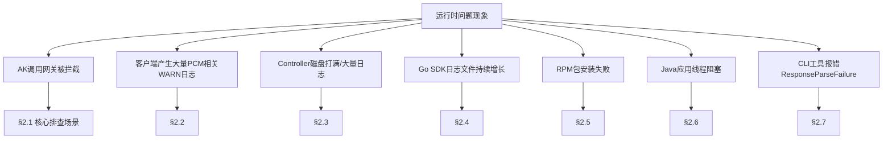
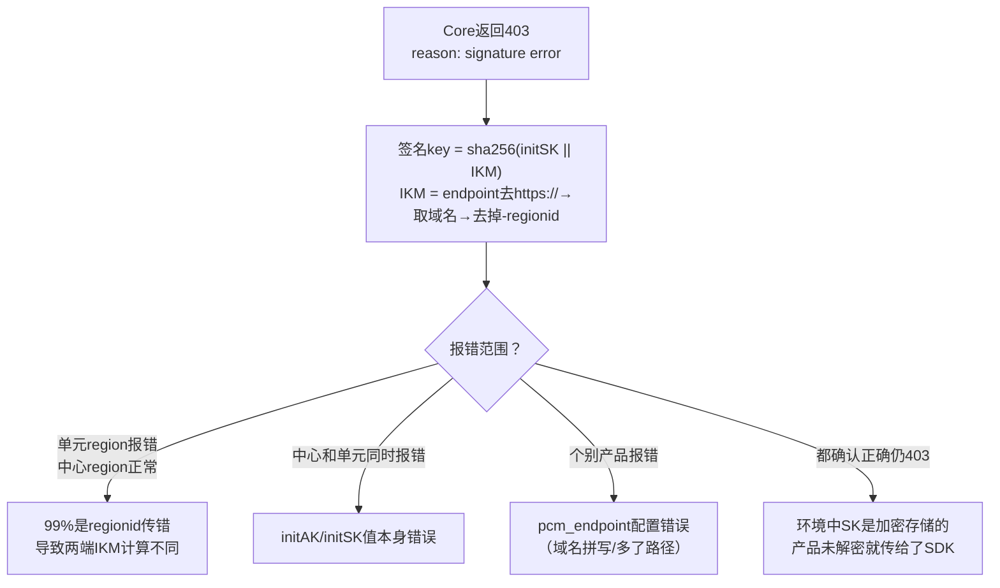

# 典型问题排查解决方案

本文档以**问题现象**作为入口，引导排查思路。



## AK 调用网关被拦截

### 一、问题描述
*   **问题现象**：PCM 接入后最核心的排查场景，产品调用网关时报 AK 被禁用 / AK 无效 / AK 不存在。
*   **适用范围**：所有接入 PCM 的产品调用网关场景。

### 二、排查信息收集
*   **必须收集的信息**：从网关日志中取出被拦截的 AK ID。
*   **检查终态的方法**：在控制台查询是底表 AK 还是派生 AK。
    *   **底表 AK 判定**：可以直接通过控制台查询。
        
    *   **派生 AK 判定**：
        *   控制台仅可以查询每个队列最近 14 把派生 AK。
            
        *   **数据库查询**：
            *   service：`certificate-lifecycle-manager-server`
            *   db实例：`clm_db`
            *   数据库：`pcm_db`
            *   进入 `clm_db` 实例数据库后切换到 `pcm_db`：
                ```sql
                use pcm_db;
                ```
            *   在派生 AK 数据库中检查是否存在：
                ```sql
                select * from ak_info where access_key_id='****';
                ```

### 三、解决步骤

#### 场景一：底表 AK 被拦截
*   **适用条件**：产品在使用底表 AK，说明 SDK 没有成功获取派生 AK，走了降级逻辑或使用底表 AK 未适配。排查方向是**为什么 SDK 没拿到派生 AK**。
*   **实施步骤**：
    1.  **先恢复**：在 PCM 控制台启用该底表 AK，恢复业务。
    2.  **查 SDK 日志 code**：确认是哪种降级场景，参见下方“Core 错误码与 HTTP 状态码排查”。

#### 场景二：派生 AK 被拦截
*   **适用条件**：产品已经在使用派生 AK，但这把派生 AK 已被轮转禁用。最可能原因为仅获取一次，未持续轮转。排查方向是**为什么产品没有及时更新到最新的派生 AK**。
*   **实施步骤**：
    1.  **重启服务**：通常重启服务会刷新 AK 导致可用，然后停止该队列的轮转。
        
    2.  **启用 AK**：若无法重启服务，需要手动启用 AK，参见 PCM应急处置。
    3.  **查 SDK 报错**：如果有 SDK 报错，参见下方“Core 错误码与 HTTP 状态码排查”。

## 客户端产生大量 PCM 相关 WARN 日志

### 一、问题描述
*   **问题现象**：产品日志中大量出现 `Failed to refresh credential, pcm server is xxx`。
*   **影响范围**：这类 WARN 日志**不影响业务**（SDK 已降级返回原始凭证），主要影响是客户端告警监控被触发。

### 二、排查信息收集
*   **排查方向**：确认环境中 PCM 服务（Core）是否部署或可达。当无服务端时，SDK 无法生成缓存，仍然会按配置的间隔持续尝试连接，每次失败产生 WARN 级别日志。
*   **版本排查**：2507 版本 PCM 服务端尚未部署，或产品升级至 3186-2510 及以上版本但 `baseServiceAll` 未升级，均可能出现此问题。

### 三、解决步骤
*   **实施步骤**：确认 PCM 服务端状态，若未部署则忽略告警或部署服务端；若 `baseServiceAll` 未升级则进行升级。

## PCM Controller 磁盘打满 / 产生大量日志

### 一、问题描述
*   **问题现象**：Controller 日志目录 `/home/admin/pcm_controller/logs/api/logs/` 下出现超大文件，磁盘空间不足。
*   **EOCC 参考**：https://eocc.aliyun-inc.com/kbscene/emergencyDetail/EC9EE9AE20?Jump=2

### 二、排查信息收集
*   **检查终态的方法**：登录 Controller 主机。
*   **排查步骤**：
    1.  确认磁盘使用情况：`df -h`
    2.  查看日志目录大小：`du -sh /home/admin/pcm_controller/logs/api/logs/`

### 三、解决步骤
*   **实施步骤**：
    1.  清理历史日志文件（保留最近日志）。
    2.  排查产生大量日志的原因：是否有大量异常请求持续打到 Controller，或是否有定时任务异常导致循环报错。
    3.  确认日志轮转配置是否正常。

## Go SDK 日志文件持续增长

### 一、问题描述
*   **问题现象**：Go SDK 产生的日志文件不断增大，未按预期轮转，可能导致磁盘打满。
*   **原因**：Go SDK 在 2512 之前版本存在日志轮转 Bug。

### 二、排查信息收集
*   **排查步骤**：检查当前使用的 Go SDK 版本是否低于 2512。

### 三、解决步骤
*   **实施步骤**：
    1.  **彻底解决**：升级 Go SDK 至 2512 及以上版本。
    2.  **临时处理**：使用 `> logfile` 截断日志文件（**注意**：不要 `rm` 正在写入的文件）。

## Python SDK RPM 包安装失败

### 一、问题描述
*   **问题现象**：安装 `pcm-python2-sdk-rpm-with-no-six` 报错。
*   **关键字**：`pytz/zoneinfo`、`cpio: File from package already exists as a directory`。
*   **原因**：系统已有 `/home/tops/lib/python2.7/site-packages/pytz/` 目录，与 RPM 包冲突。

### 二、排查信息收集
*   **排查步骤**：检查系统是否存在冲突目录 `/home/tops/lib/python2.7/site-packages/pytz/`。

### 三、解决步骤
*   **实施步骤**：
    ```bash
    mv /home/tops/lib/python2.7/site-packages/pytz /home/tops/lib/python2.7/site-packages/pytz_bak
    sudo yum install pcm-python2-sdk-rpm-with-no-six -y
    ```

## Java 应用线程阻塞

### 一、问题描述
*   **问题现象**：线程 dump 中出现阻塞堆栈：
    ```plaintext
    java.lang.Thread.State: BLOCKED (on object monitor)
      at sun.security.provider.NativePRNG$RandomIO.implNextBytes(NativePRNG.java:543)
      at ...PcmSecretCredentialManager.persistCredentials(...)
    ```
*   **原因**：SDK 默认使用 `/dev/random` 阻塞模式获取随机数，系统熵值低（< 100）时线程被卡住。

### 二、排查信息收集
*   **排查步骤**：检查系统熵值是否低于 100。

### 三、解决步骤
*   **实施步骤**：
    1.  **彻底解决**：升级 SDK 至 `credprovider.plugin >= 1.0.8`。
    2.  **临时规避**：添加 JVM 参数 `-Djava.security.egd=file:/dev/./urandom`。

## CLI 工具报错 ResponseParseFailure

### 一、问题描述
*   **问题现象**：返回 `{"code": "ResponseParseFailure", "data": "", "message": "xxxxxxx"}`。
*   **原因**：`pcm_endpoint` 地址不对，该地址响应 200 但格式非预期，CLI 解析失败且未走降级。

### 二、排查信息收集
*   **排查步骤**：确认 CLI 的 `pcm_endpoint` 配置，手动 `curl` 确认返回格式。

### 三、解决步骤
*   **实施步骤**：确认 CLI 的 `pcm_endpoint` 指向正确的 PCM Core 地址。
*   **结果验证**：后续版本已优化解析异常的降级处理，升级至最新版本（2025-12-23及之后更新）可解决。

## Core 错误码与 HTTP 状态码排查

### 一、问题描述
*   **问题现象**：SDK 或客户端调用 PCM Core 时返回 HTTP 400、403、502 等状态码及具体错误信息。

### 二、排查信息收集
*   **HTTP 400 请求参数错误排查映射**：

    | 返回 Msg | 报错原因 | 排查方向 |
    | --- | --- | --- |
    | `SecretName or x_acs_bearer_token is nil` | SecretName 或 token 为空 | SDK 侧 initakid 和 pcm_endpoint 是否正确 |
    | `SecretName parse fail, SecretName:xxxx` | SecretName 格式错误 | appName 是否正确以 `:` 分隔 |
    | `The access key (AK) is not administered by the PCM service, AK:xxxx` | akid 非底表 AK | initakid 是否填写正确的底表 akid |
    | `genJwtKey fail` | 计算 token_key 失败 | Core 内部问题，与 SDK 无关 |
    | `Error in AK rotation led to unsuccessful request to the controller...` | 请求 Controller 派生失败 | 1. 派生 AK 容量达上限<br>2. IAMID 非法且关闭了非标开关 |

*   **HTTP 403 认证失败排查映射**：

    | 返回 Msg | 报错原因 | 排查方向 |
    | --- | --- | --- |
    | `reason: signature error` | 签名验证失败 | 见下方 signature error 排查 |
    | `reason: "nbf" claim not valid until` | 时钟不同步 | 见下方 nbf 时钟偏差 |
    | `token_arn not same with arn...` | ARN 不一致 | SDK 内部问题，基本不出现 |

### 三、解决步骤

#### 场景一：signature error 排查
*   **适用条件**：返回 `reason: signature error`。签名 key = sha256(initSK || IKM)，IKM = endpoint去https://→取域名→去掉-regionid。
*   **实施步骤**：根据报错范围判断：
    *   **单元 region 报错，中心 region 正常**：99% 是 regionid 传错导致两端 IKM 计算不同。
    *   **中心和单元同时报错**：initAK/initSK 值本身错误。
    *   **个别产品报错**：pcm_endpoint 配置错误（域名拼写/多了路径）。
    *   **都确认正确仍 403**：环境中 SK 是加密存储的，产品未解密就传给了 SDK（见场景三）。



#### 场景二：nbf 时钟偏差
*   **适用条件**：返回 `reason: "nbf" claim not valid until`。
*   **实施步骤**：SDK 生成 JWT 的 `nbf` 使用客户端 `time.Now()`。版本 3186-2605 / 320-2607 后已增加 5 分钟容错。若仍出现，检查 SDK 所在机器 NTP 同步状态。

#### 场景三：SK 加密未解密导致 403
*   **适用条件**：部分环境中底表 SK 是加密存储的。
*   **实施步骤**：产品未解密就传给 SDK 会导致签名 key 两端不一致，必然 403。确认产品侧调用 SDK 前已解密 SK。

#### 场景四：HTTP 502 限流
*   **适用条件**：大概率触发限流。
*   **实施步骤**：
    1.  检查 access.log 中 `limit_req_status` 字段。
    2.  `tsar -l -i 1 --nginx` 查看 QPS。
    3.  调整限流配置：`/services/platform-credential-management/user/pcm_conf/pcm_core.json`。
    4.  阈值参考（单核）：x86=200r/s, aarch64=189r/s, sw64=80r/s。

## 其他已知问题、潜在风险与 FAQ

### 已知问题

| 问题 | 说明 | 处理 |
| --- | --- | --- |
| SDK 超时日志毫秒数为 null | 未设置 `PCM_TASK_DELAY` 时默认 1s 超时，日志字段显示 null | 已知日志格式问题，不影响功能 |
| Core 返回 502 | 大概率限流 | 见上方 HTTP 502 限流排查 |

### 潜在风险清单

*   **Core 限流基于 IP，存在误伤可能**：PCM Core 的限流策略基于客户端 IP。当同一台机器上运行多个产品组件，一个高频产品的请求可能耗尽该 IP 的限流配额，导致同 IP 下其他产品被连带返回 502。
*   **链路增加延迟，对时间敏感业务有影响**：接入 PCM 后可导致部分时间敏感服务延迟加大，且网络可能出现延迟。对于时间敏感服务，增加了 1s 超时策略（1.13-SNAPSHOT / 20250908 版本起支持 `PCM_TASK_DELAY` 环境变量，用于设置访问 PCM 最大超时时间，单位是 ms，默认 1000ms 即 1s）。
*   **半轮转模式首次获取失败导致后续持续异常**：部分产品采用半自动轮转模式（仅在启动时获取一次派生 AK，后续不再主动刷新）。如果该唯一一次获取请求恰好失败（Core 限流、网络抖动、服务未就绪），产品将持续使用底表 AK 或无有效凭据运行，且不会自动恢复。
*   **底表禁用后 PCM 可用性和禁用状态联动**：底表 AK 被 PCM 禁用后，产品的凭据供给完全依赖 PCM 链路（Core + Controller）。对于本地有缓存的运行中服务暂时无影响，但重启的服务如果此时 PCM 不可用，将拿不到任何有效凭据（底表已禁、派生获取失败、本地无缓存），业务直接中断。
*   **部分 SDK 未打印关键日志，排查困难**：Java WARN 过多，部分产品屏蔽了报错日志，无请求 PCM 的 requestid 等信息，增加排查难度。
*   **已知问题已修复但环境中存量版本旧**：

    | 问题 | 修复版本 | 风险 |
    | --- | --- | --- |
    | CLI 服务端返回异常不降级（ResponseParseFailure） | 2025-12-23更新 | CLI 直接不可用 |
    | Java SDK 线程阻塞（/dev/random 熵值问题） | credprovider.plugin >= 1.0.8 | 应用线程卡死 |
    | Go SDK 日志文件不轮转 | SDK >= 2512版本 | 磁盘打满 |

### 高频问题 FAQ

1.  **接入 PCM 后出现大量报错日志，是否有影响？**
    2507 版本 PCM 服务端尚未部署，部分适配了 PCM 的产品可能访问 PCM 报错，但因降级返回了原始底表 AK，不影响业务调用。如果调用非常频繁，可能产生大量错误日志。部分产品升级至 3186-2510 及以上版本，`baseServiceAll` 未升级，可能同样出现以上问题。
2.  **如何判断底表 AK 是否禁用？**
    在运维手册 PCM运维手册 中查询。
3.  **如何判断派生 AK 禁用？**
    当前输出版本 3186、320 默认均不禁用派生 AK。