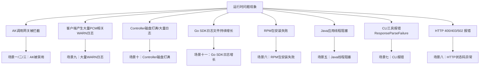

# 典型问题排查解决方案

应急操作优先建议控制台白屏操作，当白屏无法访问时，采用在容器中执行脚本（调用服务接口），当容器无法访问时，直接在数据库中执行SQL。
操作优先级：**控制台白屏 > 调用接口（容器脚本） > 数据库执行SQL**



## 场景一：initAK（底表AK）被禁用影响业务 / AK调用网关被拦截

### 一、问题描述
1. **问题现象**：产品调用网关时报 AK 被禁用/AK 无效/AK 不存在，网关拦截请求。确认因为某把 initAK（底表AK）被禁用而影响业务调用。说明 SDK 没有成功获取派生 AK 走了降级逻辑，或者产品使用底表 AK 未适配。
2. **适用范围**：[[PCM/平台凭证管理服务/index|平台凭证管理服务]](PCM)，影响依赖该 initAK 的业务。

### 二、排查信息收集
1. **必须收集的信息**：被禁用的 initAK 的 AK ID（`access_id`）。
2. **检查终态的方法**：
   - 第一步：从网关日志中取出被拦截的 AK ID。
   - 第二步：在 PCM 控制台白屏查询该 AK。若控制台能直接查到，则判定为底表 AK。
   - 或登录 UMMAK 数据库查询 `accesskey_table` 表中的 `enabled_flag` 字段。

### 三、解决步骤
1. **方法1：白屏操作（优先推荐）**
   - **适用条件**：PCM 控制台白屏可正常访问。
   - **实施步骤**：通过 PCM 控制台的 initAK 管理功能查询特定 AK，并在操作中点击“启用”该 AK。
   - **结果验证**：白屏页面显示该 AK 状态为“已启用”。
2. **方法2：调用接口（容器中执行脚本）**
   - **适用条件**：白屏不可用，但容器可访问。
   - **实施步骤**：登录 `PcmController` 容器，使用“底表AK黑屏操作工具”执行启用命令（将 `{akid}` 替换为实际的 AK ID）：
     ```bash
     python3 manage_ak_status.py enable --ak {akid}
     ```
   - **结果验证**：工具返回“已启用”，业务恢复正常。
3. **方法3：数据库操作**
   - **适用条件**：白屏、容器均不可用时。
   - **实施步骤**：
     - 进入 UMMAK 数据库（service：`baseService-umm-ak`，db实例：`ummak`，数据库：`ummak`）。
     - 执行 SQL 启用 AK（将 `{akid}` 替换为实际的 `access_id`）：
       ```sql
       update accesskey_table set enabled_flag=1 where access_id = '{akid}';
       ```
   - **结果验证**：查询 `accesskey_table` 表，确认对应 `access_id` 的 `enabled_flag` 为 1。
4. **应急替代方案：白屏创建临时AK**
   - **适用条件**：原 AK 无法立即恢复，且业务急需使用 AK 登录或调用。
   - **实施步骤**：
     - 进入 PCM 控制台白屏的“派生AK管理”标签页，点击“创建临时AK”。
     - 输入申请者（IAMID，如 `集群:sr`，若已存在可拼接任意字符串）、initAKID（托管到 PCM 的底表 AK）、有效天数（1~365天）及申请原因。
     - 申请成功后，**立即复制并保存**弹窗中展示的 AK（accessKeyId）和 SK（accessKeySecret）明文（关闭弹窗后无法再次查看）。
   - **结果验证**：使用新创建的临时 AK/SK 替换业务配置，业务恢复正常。

### 四、后续排查方向
1. 业务恢复后，需查 SDK 日志 code，确认是哪种降级场景（参考 Core 错误码快速定位），排查为什么 SDK 没拿到派生 AK。

## 场景二：全量底表AK被禁用影响业务

### 一、问题描述
1. **问题现象**：环境内存在被底表 AK 禁用而影响业务，涉及多把底表 AK 或无法确认具体是哪把底表 AK。
2. **适用范围**：平台凭证管理服务(PCM)，影响依赖底表 AK 的业务。

### 二、排查信息收集
1. **必须收集的信息**：环境信息、受影响的业务模块。
2. **检查终态的方法**：登录 PCM 数据库查询 `init_ak_info` 表中 `umm_ak_status` 为 0 的记录。
3. **注意事项**：暂不支持通过白屏解禁全量 AK。

### 三、解决步骤
1. **方法1：调用接口（容器中执行脚本）**
   - **适用条件**：容器可访问。
   - **实施步骤**：登录 `PcmController` 容器，使用“底表AK黑屏操作工具”执行全量启用命令：
     ```bash
     python3 manage_ak_status.py enable-all
     ```
   - **结果验证**：工具返回启用成功的数量（如 `启用完成: x/x`），业务恢复正常。
2. **方法2：数据库操作**
   - **适用条件**：容器不可访问时。
   - **实施步骤**：
     - 获取全量底表 AK（PCM 托管的底表 AK 存储在 clm_db 实例的 pcm 数据库中，service：`certificate-lifecycle-manager-server`，db实例：`clm_db`，数据库：`pcm_db`）：
       ```sql
       use pcm_db;
       select access_key_id from init_ak_info where umm_ak_status = 0;
       ```
     - 启用全量底表 AK（在 UMMAK 数据库中操作，service：`baseService-umm-ak`，db实例：`ummak`，数据库：`ummak`），将 `access_id` 字段参数改成上述检索到的底表 AK 信息：
       ```sql
       update accesskey_table set enabled_flag=1 where access_id in ('qNNm2yFXF70Zy6Hx','qNNm2yFXF70Zy6Hx2','qNNm2yFXF70Zy6Hx3');
       ```
   - **结果验证**：查询 `accesskey_table` 表，确认对应底表 AK 的 `enabled_flag` 为 1。

## 场景三：派生AK被禁用影响业务 / AK调用网关被拦截

### 一、问题描述
1. **问题现象**：产品调用网关时报 AK 被禁用/AK 无效/AK 不存在。确认某把派生 AK 被禁用影响业务（产品已经在使用派生 AK，但这把派生 AK 已被轮转禁用）。
2. **适用范围**：平台凭证管理服务(PCM)。

### 二、排查信息收集
1. **必须收集的信息**：被禁用的派生 AK ID（`access_id`）。
2. **检查终态的方法**：
   - 第一步：从网关日志取出被拦截的 AK ID。
   - 第二步：通过白屏查询派生 AK 状态。**注意：控制台仅可以查询每个队列最近14把派生 AK**。
   - 第三步：如果超过14把 AK，会在 ummak 侧执行删除操作，但 pcm 数据库会保留记录。当通过白屏未查询到该 AK 时，有可能是14天前派生的 AK，需通过 pcm 数据库进行查询：
     ```sql
     use pcm_db;
     select * from ak_info where access_key_id='****';
     ```

### 三、解决步骤
1. **方法1：重启服务或白屏操作**
   - **适用条件**：白屏可访问且 AK 是最近14天内派生的，或允许重启业务服务。
   - **实施步骤**：
     - 通常重启服务会刷新 AK 导致可用，然后停止该队列的轮转。
     - 或在白屏查询派生 AK，查询后通过“启用”操作恢复。
   - **结果验证**：白屏显示 AK 状态为已启用，或业务恢复正常。
2. **方法2：数据库操作**
   - **适用条件**：白屏不可用，或 AK 是14天前派生的（白屏查不到），且无法重启服务。
   - **实施步骤**：
     - 查询派生 AK（若白屏查不到，进入 `certificate-lifecycle-manager-server` 服务的 `clm_db` 实例，切换至 `pcm_db` 数据库）。
     - 在 UMMAK 中启用或重建 AK（进入 `baseService-umm-ak` 服务的 `ummak` 实例）：
       - **情况A：如果 AK 在 UMMAK 中存在**，直接更新启用状态：
         ```sql
         update accesskey_table set enabled_flag=1, hidden_flag=0, deleted_flag=0 where access_id='qNNm2yFXF70Zy6Hx';
         ```
       - **情况B：如果 AK 在 UMMAK 中已经删除**，需重新创建 AK（`access_id` 为 akid，`access_key` 为 sk，`user_id` 为账号）：
         ```sql
         INSERT INTO `ummak`.`accesskey_table` (`access_id`, `access_key`, `user_id`) VALUES ('000cFXr3DBPZHxML11', 'XE5sP5dF6asjJsCkxL4QYifS7rRU11', '999999999');
         ```
   - **结果验证**：查询 `accesskey_table` 表，确认 AK 存在且 `enabled_flag` 为 1，`deleted_flag` 为 0。
3. **应急替代方案：白屏创建临时AK**
   - **适用条件**：原 AK 无法立即恢复，且业务急需使用 AK 登录或调用。
   - **实施步骤**：参考场景一中的“应急替代方案：白屏创建临时AK”步骤，使用对应的 initAKID 创建临时 AK 并替换业务配置。

### 四、后续排查方向
1. 排查为什么产品没有及时更新到最新的派生 AK（最可能原因为仅获取一次，未持续轮转）。如果有 SDK 报错，参见 Core 错误码快速定位。
2. 若在“AK申请详情”中发现轮转状态为“已停止”，需排查以下原因：
   - IAMID 中包含 `CLOSE_AUTO_ROTATE` 状态，表示该队列默认不轮转。
   - 使用该产品的队列中，有产品未及时更新 PCM SDK。
   - 使用该队列的产品中，有产品仍停留在第 7 把 AK（未消费最新 AK）。

## 场景四：AK容量告警（单UID达到上限导致派生失败）

### 一、问题描述
1. **问题现象**：派生 AK 失败，系统可能出现容量告警。UMMAK 侧每个 uid 下最大1000把有效 AK，当达到1000把以后会出现派生失败的情况。
2. **适用范围**：平台凭证管理服务(PCM)，影响特定 UID 下的 AK 派生。

### 二、排查信息收集
1. **必须收集的信息**：报错的 UID（`user_id`）。
2. **检查终态的方法**：登录 UMMAK 数据库，查询该 UID 下的 AK 数量是否达到或超过1000。

### 三、解决步骤
1. **步骤1：查询AK数量**
   - **实施步骤**：
     - 进入 UMMAK 数据库（service：`baseService-umm-ak`，db实例：`ummak`，数据库：`ummak`）。
     - 检查特定 uid 下的 AK 数量：
       ```sql
       SELECT user_id, COUNT(access_id) AS access_count FROM accesskey_table where user_id = '1000000047' GROUP BY user_id;
       ```
     - 查询是否有 uid 下的 AK 超过1000：
       ```sql
       SELECT user_id, COUNT(access_id) AS access_count FROM accesskey_table GROUP BY user_id HAVING access_count >= 1000;
       ```
   - **结果验证**：确认目标 UID 的 `access_count` 是否 >= 1000。
2. **步骤2：清理无用AK**
   - **实施步骤**：
     - 分析出环境内已经无用的 AK。
     - 在 UMMAK 数据库中将无用 AK 置成删除状态（将 `'xxxxx'` 替换为实际需要清理的 `access_id` 列表）：
       ```sql
       update accesskey_table set enabled_flag = 0, deleted_flag = 1 , modified_time = UNIX_TIMESTAMP() where access_id in ('xxxxx');
       ```
   - **结果验证**：再次执行步骤1的查询 SQL，确认该 UID 下的有效 AK 数量已降至1000以下，重新尝试派生 AK 成功。

## 场景五：Java 应用线程阻塞

### 一、问题描述
1. **问题现象**：线程 dump 中出现阻塞堆栈：
   ```plaintext
   java.lang.Thread.State: BLOCKED (on object monitor)
     at sun.security.provider.NativePRNG$RandomIO.implNextBytes(NativePRNG.java:543)
     at ...PcmSecretCredentialManager.persistCredentials(...)
   ```
2. **适用范围**：使用 PCM Java SDK 的应用，系统熵值低（< 100）时触发。

### 二、排查信息收集
1. **必须收集的信息**：线程 dump 堆栈信息、系统熵值、SDK 版本。
2. **检查终态的方法**：检查系统熵值，确认 SDK 默认使用 `/dev/random` 阻塞模式获取随机数导致线程卡住。

### 三、解决步骤
1. **实施步骤**：
   - **根本解决**：升级 SDK 至 `credprovider.plugin >= 1.0.8`。
   - **临时规避**：在 JVM 启动参数中添加 `-Djava.security.egd=file:/dev/./urandom`。
2. **结果验证**：线程 dump 中不再出现 `NativePRNG` 相关的 BLOCKED 状态。

## 场景六：Python SDK RPM 包安装失败

### 一、问题描述
1. **问题现象**：安装 `pcm-python2-sdk-rpm-with-no-six` 报错。
2. **关键字**：`pytz/zoneinfo`、`cpio: File from package already exists as a directory`。
3. **适用范围**：使用 Python 2 SDK RPM 包部署的环境。

### 二、排查信息收集
1. **必须收集的信息**：报错日志。
2. **检查终态的方法**：检查系统是否已有 `/home/tops/lib/python2.7/site-packages/pytz/` 目录，该目录与 RPM 包冲突。

### 三、解决步骤
1. **实施步骤**：
   - 备份冲突目录并重新安装：
     ```bash
     mv /home/tops/lib/python2.7/site-packages/pytz /home/tops/lib/python2.7/site-packages/pytz_bak
     sudo yum install pcm-python2-sdk-rpm-with-no-six -y
     ```
2. **结果验证**：RPM 包安装成功，无冲突报错。

## 场景七：CLI 工具报错 ResponseParseFailure

### 一、问题描述
1. **问题现象**：CLI 工具返回如下错误：
   ```json
   {"code": "ResponseParseFailure", "data": "", "message": "xxxxxxx"}
   ```
2. **适用范围**：使用 PCM CLI 工具的环境。

### 二、排查信息收集
1. **必须收集的信息**：CLI 配置的 `pcm_endpoint` 地址。
2. **检查终态的方法**：确认 `pcm_endpoint` 地址是否正确。该地址可能响应 200 但格式非预期，导致 CLI 解析失败且未走降级。手动 `curl` 确认返回格式。

### 三、解决步骤
1. **实施步骤**：
   - 修正 CLI 的 `pcm_endpoint` 指向正确的 PCM Core 地址。
   - **注**：后续版本会优化解析异常的降级处理，已解决此问题。
2. **结果验证**：CLI 工具正常返回预期数据。

## 场景八：HTTP 400/403/502 状态码异常报错

### 一、问题描述
1. **问题现象**：调用 PCM Core 接口时返回 HTTP 400、403 或 502 状态码。
2. **适用范围**：所有通过 SDK 或 HTTP 调用 PCM Core 的客户端。

### 二、排查信息收集
1. **必须收集的信息**：HTTP 状态码及返回的 Msg 信息。

### 三、解决步骤

#### 子场景 8.1：HTTP 400 — 请求参数错误
- **排查方向映射表**：

| 返回 Msg | 报错原因 | 排查方向 |
| --- | --- | --- |
| `SecretName or x_acs_bearer_token is nil` | SecretName 或 token 为空 | SDK 侧 initakid 和 pcm_endpoint 是否正确 |
| `SecretName parse fail, SecretName:xxxx` | SecretName 格式错误 | appName 是否正确以 `:` 分隔 |
| `The access key (AK) is not administered by the PCM service, AK:xxxx` | akid 非底表 AK | initakid 是否填写正确的底表 akid |
| `genJwtKey fail` | 计算 token_key 失败 | Core 内部问题，与 SDK 无关 |
| `Error in AK rotation led to unsuccessful request to the controller...` | 请求 Controller 派生失败 | 1. 派生 AK 容量达上限<br>2. IAMID 非法且关闭了非标开关 |

#### 子场景 8.2：HTTP 403 — 认证失败
- **排查方向映射表**：

| 返回 Msg | 报错原因 | 排查方向 |
| --- | --- | --- |
| `reason: signature error` | 签名验证失败 | 见下方 signature error 排查流程图 |
| `reason: "nbf" claim not valid until` | 时钟不同步 | 检查 SDK 所在机器 NTP 同步状态（版本 3186-2605 / 320-2607 后已增加 5 分钟容错） |
| `token_arn not same with arn...` | ARN 不一致 | SDK 内部问题，基本不出现 |

- **signature error 排查流程图**：
  ```mermaid
  graph TD
      S["Core返回403<br/>reason: signature error"] --> INFO["签名key = sha256(initSK || IKM)<br/>IKM = endpoint去https://→取域名→去掉-regionid"]
      INFO --> Q1{报错范围？}
      Q1 -->|单元region报错<br/>中心region正常| R1["99%是regionid传错<br/>导致两端IKM计算不同"]
      Q1 -->|中心和单元同时报错| R2[initAK/initSK值本身错误]
      Q1 -->|个别产品报错| R3["pcm_endpoint配置错误<br/>（域名拼写/多了路径）"]
      Q1 -->|都确认正确仍403| R4["环境中SK是加密存储的<br/>产品未解密就传给了SDK"]
  ```
- **SK 加密未解密导致 403**：部分环境中底表 SK 是加密存储的。产品未解密就传给 SDK → 签名 key 两端不一致 → 必然 403。需确认产品侧调用 SDK 前已解密 SK。

#### 子场景 8.3：HTTP 502 — 限流触发
- **实施步骤**：
  1. 检查 access.log 中 `limit_req_status` 字段。
  2. 使用 `tsar -l -i 1 --nginx` 查看 QPS。
  3. 调整限流配置：`/services/platform-credential-management/user/pcm_conf/pcm_core.json`。
  4. 阈值参考（单核）：x86=200r/s, aarch64=189r/s, sw64=80r/s。

## 场景九：客户端产生大量 PCM 相关 WARN 日志

### 一、问题描述
1. **问题现象**：产品日志中大量出现 `Failed to refresh credential, pcm server is xxx`。
2. **适用范围**：接入 PCM 但服务端未部署或不可达的环境。

### 二、排查信息收集
1. **必须收集的信息**：WARN 日志内容、环境 PCM 服务状态。
2. **检查终态的方法**：确认环境中 PCM 服务（Core）是否已部署且可达。2507版本 PCM 服务端尚未部署，或 baseServiceAll 未升级时可能出现此问题。

### 三、解决步骤
1. **实施步骤**：
   - **关键判断**：这类 WARN 日志**不影响业务**（SDK 已降级返回原始底表凭证），主要影响是客户端告警监控被触发。
   - 若环境确实无 PCM 服务，可忽略该告警或调整监控阈值；若应有服务，需排查 PCM Core 的可用性。
2. **结果验证**：业务调用正常，告警消除或降级处理。

## 场景十：PCM Controller 磁盘打满 / 产生大量日志

### 一、问题描述
1. **问题现象**：Controller 日志目录 `/home/admin/pcm_controller/logs/api/logs/` 下出现超大文件，磁盘空间不足。
2. **适用范围**：部署了 PCM Controller 的主机。

### 二、排查信息收集
1. **必须收集的信息**：磁盘使用率、日志目录大小。
2. **检查终态的方法**：
   - 确认磁盘使用情况：`df -h`
   - 查看日志目录大小：`du -sh /home/admin/pcm_controller/logs/api/logs/`

### 三、解决步骤
1. **实施步骤**：
   - 清理历史日志文件（保留最近日志）。
   - 排查产生大量日志的原因：是否有大量异常请求持续打到 Controller，或是否有定时任务异常导致循环报错。
   - 确认日志轮转配置是否正常。
2. **结果验证**：磁盘空间释放，日志文件大小恢复正常轮转。

## 场景十一：Go SDK 日志文件持续增长

### 一、问题描述
1. **问题现象**：Go SDK 产生的日志文件不断增大，未按预期轮转，可能导致磁盘打满。
2. **适用范围**：使用 Go SDK 2512 之前版本的应用。

### 二、排查信息收集
1. **必须收集的信息**：Go SDK 版本。
2. **检查终态的方法**：确认 SDK 版本是否低于 2512（存在日志轮转 Bug）。

### 三、解决步骤
1. **实施步骤**：
   - **根本解决**：升级 Go SDK 至 2512 及以上版本。
   - **临时处理**：使用 `> logfile` 截断日志文件（**注意：不要 rm 正在写入的文件**）。
2. **结果验证**：日志文件按预期轮转，不再无限增长。

## Core 错误码快速定位与已知问题

### 核心错误码辅助定位
当排查过程中从 SDK 报错信息中拿到了具体错误码，可参考以下说明辅助定位：
- **nbf 时钟偏差**：SDK 生成 JWT 的 `nbf` 使用客户端 `time.Now()`。版本 3186-2605 / 320-2607 后已增加 5 分钟容错，若仍出现则检查 SDK 所在机器 NTP 同步状态。
- **SK 加密未解密导致 403**：部分环境中底表 SK 是加密存储的，产品未解密就传给 SDK 会导致签名 key 两端不一致，必然 403。需确认产品侧调用 SDK 前已解密 SK。
- **HTTP 502**：大概率限流触发，参见场景八中的限流排查步骤。

### 其他已知问题
| 问题 | 说明 | 处理 |
| --- | --- | --- |
| SDK 超时日志毫秒数为 null | 未设置 `PCM_TASK_DELAY` 时默认 1s 超时，日志字段显示 null | 已知日志格式问题，不影响功能 |
| Core 返回 502 | 大概率限流 | 见场景八限流排查 |

## 高频问题 FAQ

1. **接入 PCM 后出现大量报错日志，是否有影响？**
   - 2507版本 PCM 服务端尚未部署，部分适配了 PCM 的产品可能访问 PCM 报错，但因降级返回了原始底表 AK，**不影响业务调用**。如果调用非常频繁，可能产生大量错误日志。部分产品升级至 3186-2510 及以上版本，但 baseServiceAll 未升级，可能同样出现以上问题。
2. **如何判断底表 AK 是否禁用？**
   - 可通过 PCM 控制台白屏或参考运维手册《PCM运维手册》中查询。
3. **如何判断派生 AK 禁用？**
   - 当前输出版本 3186、320 默认均不禁用派生 AK。
4. **时间敏感服务延迟加大如何处理？**
   - 接入 PCM 后可能导致部分时间敏感服务延迟加大，且网络可能出现延迟。对于时间敏感服务，增加了 1s 超时策略。
   - 支持 `PCM_TASK_DELAY` 环境变量（1.13-SNAPSHOT 20250908 版本起），用于设置访问 PCM 最大超时时间，单位是 ms。默认 1000ms（即 1s）。

## 潜在风险清单

1. **Core 限流基于 IP，存在误伤可能**
   - PCM Core 的限流策略基于客户端 IP。当同一台机器上运行多个产品组件，一个高频产品的请求可能耗尽该 IP 的限流配额，导致同 IP 下其他产品被连带返回 502。
2. **链路增加延迟，对时间敏感业务有影响**
   - 凭证获取和轮转链路会增加一定的网络和处理延迟，需评估对时间敏感业务的影响。
3. **无服务端时 SDK 频繁调用产生大量日志**
   - 当环境中 PCM 服务（Core）未部署或不可达时，SDK 无法生成缓存，仍然会按配置的间隔持续尝试连接，每次失败产生 WARN 级别日志。
4. **部分 SDK 未打印关键日志，排查困难**
   - Java WARN 过多，部分产品屏蔽了报错日志，无请求 PCM 的 requestid 等信息，增加排查难度。
5. **已知问题已修复但环境中存量版本旧**

| 问题 | 修复版本 | 风险 |
| --- | --- | --- |
| CLI 服务端返回异常不降级（ResponseParseFailure） | **2025-12-23更新** | CLI 直接不可用 |
| Java SDK 线程阻塞（/dev/random 熵值问题） | credprovider.plugin >= 1.0.8 | 应用线程卡死 |
| Go SDK 日志文件不轮转 | SDK >= 2512版本 | 磁盘打满 |

6. **半轮转模式首次获取失败导致后续持续异常**
   - 部分产品采用半自动轮转模式——仅在启动时获取一次派生 AK，后续不再主动刷新。如果该唯一一次获取请求恰好失败（Core 限流、网络抖动、服务未就绪），产品将持续使用底表 AK 或无有效凭据运行，且不会自动恢复。
7. **底表禁用后 PCM 可用性和禁用状态联动**
   - 底表 AK 被 PCM 禁用后，产品的凭据供给完全依赖 PCM 链路（Core + Controller）。对于本地有缓存的运行中服务暂时无影响，但重启的服务如果此时 PCM 不可用，将拿不到任何有效凭据（底表已禁、派生获取失败、本地无缓存），导致业务直接中断。