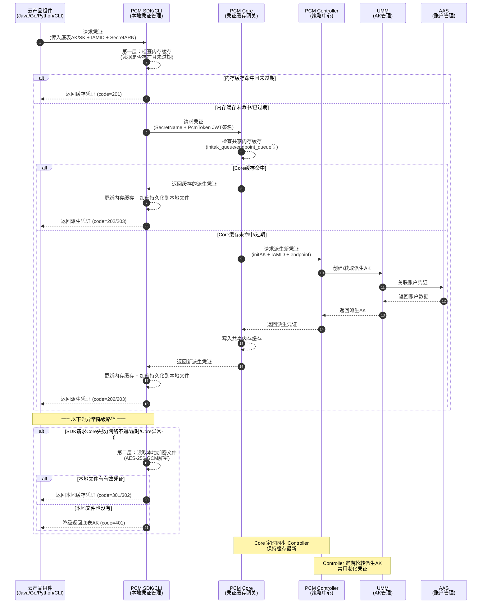

# 典型问题排查解决方案

### 调用时序图



### 核心组件职责

#### PCM SDK / CLI — 凭证获取端
**职责**：为云产品应用提供接入能力，直接与 PCM 服务交互获取新凭证，支持多种容错策略。

**安全特性**：
| 特性 | 说明 |
| --- | --- |
| **多级缓存** | 在本地内存、磁盘均有缓存 |
| **容错降级** | PCM 初始化服务异常或报错时，将入参作为凭证返回；如果有缓存，将返回最近一次从服务端获取的凭证 |

#### PCM Core — 缓存中间网关
**职责**：SDK 与 Controller 之间的访问中间网关，缓存 Controller 最新凭证数据，为 SDK 提供 API 获取最新凭证，缓解 Controller 访问压力，提高 SDK 访问响应速度。

**安全特性**：
| 特性 | 说明 |
| --- | --- |
| **本地缓存 + 定时同步** | 本地缓存 & 定时同步 PCM Controller 的最新凭证信息，减少直接访问 Controller 的频率 |
| **缓存隔离** | 缓存数据仅服务于已认证的 SDK 请求，不对外暴露 |
| **降级保护** | Core 宕机后，末期过期老凭证行为暂停，SDK 返回上次获得的老凭证（未在窗口期末尾），依然可以使用 |
| **压力缓解** | 作为中间层，避免所有 SDK 请求直接打到 Controller，防止策略大脑被击穿 |

### 队列轮转保护机制

派生 AK 队列会持续轮转（定期创建新 AK、禁用老 AK），但在以下情况下会暂停轮转，以保护正在使用中的凭证：

*   **保护一：产品最新派生 AK 保护**
    当要禁用队列里最早的那把 AK 时，系统会检查这把 AK 是否是某个产品获取的最新派生 AK。如果产品 A 拿到这把 AK 后就没再获取过新 AK，那这把就是产品 A 的"最新"，队列就会停止轮转，保持当前状态。直到后续其他产品都获取了更新的派生 AK，队列才会继续轮转。这样保证不会因为轮转把某个产品正在用的 AK 给禁掉。
*   **保护二：平台 AK 访问日志不可行（当前状态）**
    当不可行时，PCM 无法确认即将禁用的派生 AK 是否仍有产品在调用，将在第一把队列即将禁用时停止轮转。
*   **保护三：平台 AK 访问日志可信时的保护**
    平台 AK 访问日志用于检查底表 AK 和派生 AK 是否在网关中有调用记录。在准备禁用某把派生 AK 前，系统会检查平台 AK 访问日志，确认这把 AK 当前是否还在被使用。如果日志显示还有产品在用这把 AK，也会停止轮转。

### 管控模式与兼容策略

#### 三种管控模式

| 模式 | 含义 | 行为 | 适用场景 | 版本 |
| --- | --- | --- | --- | --- |
| **None（默认）** | 不受 PCM 管理 | AK 正常使用，PCM 不介入 | 尚未改造的存量凭证 | / |
| **CompatibilityMode（兼容模式）** | 部分完成改造 | 提供轮换能力，但不对旧 AK 禁用 | 改造中的过渡态 | v3182-2510 |
| **StrictMode（严格模式）** | 使用方改造完成 | 新部署严格托管；热升级/扩等场景自动降级为兼容模式 | 存量改造完成后的目标终态 | v3182-2515以后 |
| **initStrictMode（初始严格模式）** | 新建凭证即完成改造 | 任何场景都开启严格处理 | 新增收口凭证 | v320 |

#### 热升级兼容策略

*   **新部署项目**：根据 `restrict` 取值禁用原始通用能力，应用使用凭证进入定时轮换状态。
*   **热升级项目**：原始凭证**不禁用**其通用能力，进入定时轮换状态；如需禁用老凭证，通过观测日志在运维控制台灰度进行。
*   **非 PCM 托管凭证**：一切照旧；若使用了 PCM SDK/CLI 但未被托管，将入参 initAK 返回让应用接着使用。

### 高可用与容错逻辑

| 场景 | SDK 行为 | 业务影响 |
| --- | --- | --- |
| 新部署时 PCM Core 还未 ready | 将入参作为返回 | 无影响（Core 未禁用老 AK） |
| 运行时 PCM Core 挂了 | 返回上次获取的老凭证（未在窗口期末尾） | 无影响 |
| 产品独立升级，PCM 未 ready | 将入参作为返回 | 无影响 |
| PCM 和应用都挂了需重拉（SDK 缓存未丢失） | 返回上次获取的老凭证 | 无影响 |
| PCM 和应用都挂了需重拉（SDK 缓存丢失） | **需先恢复 PCM 或使用老凭证应急脚本** | **业务中断** |

---

## 排查基础信息

### PCM 服务位置

*   **所属产品**：`baseServiceAll`
*   **部署集群**：`StandardCloudCluster-A-xx`
*   **所属 service**：`platform-credential-management`
*   **核心组件**：`PCM Core`、`PCM Controller`


### PCM 控制台

**访问路径**：ASO —> 安全管理 —> 账户安全 —> 平台凭据管理 PCM


---

## 凭证排查与管理

### 底表 AK 排查与管理

1.  可查询底表 AK 禁用状态。
2.  启用底表 AK。

> **注意**：未提供白屏底表 AK 禁用能力，底表 AK 禁用请详见变更文档。


### 派生 AK 排查与解决

#### 派生 AK 状态查询
可在控制台直接查询派生 AK 的当前状态及轮转情况。

#### 手动创建派生 AK
**适用场景**：当某个应用需要使用临时 AK 登录，或者使用的 initAK 被禁用时，可以创建临时 AK 使用。

*   **步骤一**：进入派生 AK 管理标签页，点击“创建临时AK”按钮。
    

*   **步骤二**：输入申请者、initAKID、有效天数、申请派生 AK 原因等相关信息创建临时 AK。
    
    
    **参数填写注意事项**：
    1.  `initAKID` 是托管到 PCM 的基线或底表 AK（要与所使用账号的原始 AK 对应）。
    2.  申请者 ID 即为 IAMID，是服务的身份标识（常规为 `集群 + : + sr` 拼接而成，如：`StandardCloudCluster-A-20250906-00bf:PcmController`。如果系统中提示已经存在，可以在后面拼接任意字符串）。
    3.  AK 类型默认使用“临时”类型。
    4.  有效天数范围限制在 1~365 天。
    5.  申请者类型分为：`ApsaraStackProduct`、`Other`。
    6.  `CloudID`、`ProductName`、`ClusterName`、`ServiceName` 分别为使用该 AK 的应用归属的 CloudID、产品名称、集群名称、service 名称（虽然不是必填，但能准确填写请准确填写，以便于更准确地判断该临时 AK 使用方）。

*   **步骤三**：复制 AK、SK 保存使用。
    
    > **重要提示**：该 AK 对应的 SK 明文**只会在创建成功后弹窗内展示**，关闭弹窗后系统内不再显示。创建成功后请立即复制保存，如果不慎关闭弹窗，则需要重新创建临时 AK，系统不对外提供 SK 明文信息能力。
    
    **返回示例**：
    ```json
    {"accessKeyId":"ZbuIneIC04TElIFW","accessKeySecret":"cnyDzeHzmZWTGcs7ZLbZEHzagQj9jn"}
    ```
    *注：`accessKeyId` 对应 AK，`accessKeySecret` 对应 SK。*

#### AK 申请详情排查
**适用场景**：用于查看派生 AK 申请记录及状态异常排查。

*   **认证状态失败**：仅表示 IAMID 不规范，但不会对申请结果有任何影响。
    
*   **轮转状态已停止**：
    
    可能原因：
    1.  IAMID 中有 `CLOSE_AUTO_ROTATE` 状态，表示该队列默认不轮转。
    2.  使用该产品的队列，有产品未及时更新。参考：[《[[PCM/平台凭证管理服务/index|平台凭证管理服务]]（PCM）介绍》](https://alidocs.dingtalk.com/i/nodes/r1R7q3QmWew5lo02fZRn00oKJxkXOEP2?utm_scene=team_space&iframeQuery=anchorId%3Duu_mo8et3bkdnbpoxrkv3)
    3.  使用该队列的产品中，有产品仍在第 7 把 AK。参考：[《平台凭证管理服务（PCM）介绍》](https://alidocs.dingtalk.com/i/nodes/r1R7q3QmWew5lo02fZRn00oKJxkXOEP2?utm_scene=team_space&iframeQuery=anchorId%3Duu_mo8et3bliy39hgdhkpq)

---

## 日志排查指南

### AK 申请日志
**说明**：记录每个 IAMID 申请派生 AK 记录，通过 pcm-core 获取。pcm-core 中针对每个 IAMID 的底表 secretARN 的缓存时间为 12 小时，对于一直在用派生 AK 的产品，理论上每 12 小时会有一条记录。


### 平台 AK 访问日志
> **说明**：当前不完整，可作为辅助查询手段。在网关侧记录使用底表 AK 的使用情况。

**示例**：底表 AK `Khz7a1kmKMZDCBXj`


### PCM Core 日志排查
> **注意**：PCM 部署在两个 docker 上，日志排查需**两个 docker 都去查询**。


#### 排查 Error 日志（确定是否 pcm-core 报错返回）
*   **如果有具体 requestid**，可直接查询对应日期的 error 日志：
    ```bash
    grep -rn "0ae6084f17767043979091019e659c" /opt/tengine/logs/error.2026-04-20.log
    ```
    

*   **如果没有具体 requestid**，可根据 akid、iamid 和时间段进行复合筛选，直接查询对应日期的 error 日志：
    ```bash
    grep "eMG9sv4bKvToGKKR" /opt/tengine/logs/error.2026-04-20.log | grep "yundun-oem" | awk '$1 >= "2026/04/20" && $2 >= "23:59:57" && $2 <= "23:59:58"'
    ```
    

#### 排查 Access 日志（确定是否 pcm-core 接收到请求）
*   **如果有具体 requestid**，可直接查询对应日期的 access 日志：
    ```bash
    grep -rn "0ae6084f17767043992011025e659c" /opt/tengine/logs/access.2026-04-20.log
    ```
    

*   **如果没有具体 requestid**，可根据 akid、iamid 和时间段进行复合筛选：
    ```bash
    grep -E '"time_local": "(20/Apr/2026:22:59|20/Apr/2026:03:0[0-1])' /opt/tengine/logs/access.2026-04-20.log | grep "UFskQ84ZitYgBacU"
    
    grep "UFskQ84ZitYgBacU" /opt/tengine/logs/access.2026-04-20.log | grep -E '"time_local": "20/Apr/2026:23:59:5[8-9]'
    ```

#### Access 日志参数说明


| 参数名称 | 参数含义 |
| --- | --- |
| `remote_addr` | 请求源地址 |
| `Gateway-POP-Tunnel-ID` | tunnel-id |
| `X-Aliyun-Vpc-Id` | vpc-id |
| `remote_port` | 请求端口 |
| `time_local` | 请求完成的时间 |
| `request_uri` | 请求的 uri，包含 iamid、secretname、endpoint 等信息 |
| `request_method` | 请求方法 |
| `status` | http 返回码 |
| `http_user_agent` | 请求代理客户端信息 |
| `request_time` | tengine 收到请求到发完响应的总耗时 |
| `SecretName` | secretname，包含 initakid 和 pcm_endpoint 信息 |
| `IamId` | 表示请求服务身份，对应 sdk 填写的 appname，当 http 报错时可能会为空 |
| `x_acs_bearer_token` | 请求发送 jwt |
| `x_sdk_client` | pcm-sdk 版本 |
| `limit_req_status` | 限流状态，未限流显示 "PASSED"，限流显示 "-" |
| `eagleeye_traceid` | 即 requestid，可根据此查询对应 error_log 是否有错误日志 |

---

## 常见问题与应急处置参考

*   [《PCM排查思路&常见问题》](https://alidocs.dingtalk.com/i/nodes/m9bN7RYPWdyrPBREckdQ5joEVZd1wyK0)
*   [《PCM应急处置》](https://alidocs.dingtalk.com/i/nodes/MNDoBb60VLYDGNPytBomBqkPJlemrZQ3)