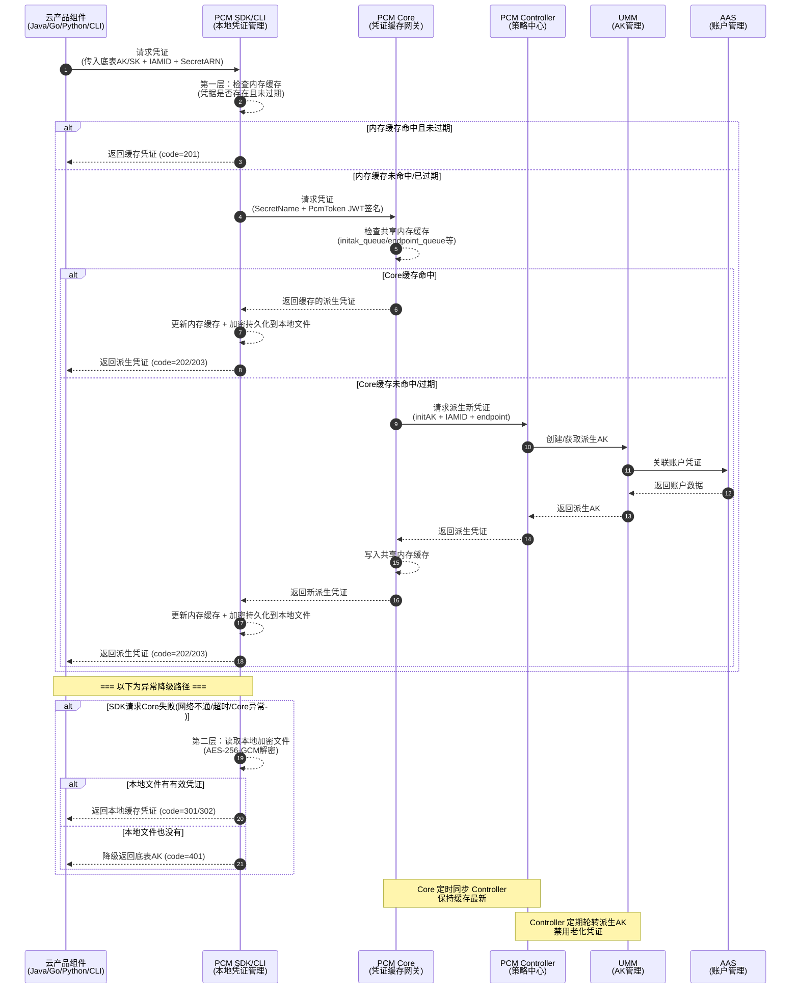

# 典型问题排查解决方案

#### 调用时序图

#### 调用时序图

#### 队列轮转保护机制

派生 AK 队列会持续轮转（定期创建新 AK、禁用老 AK），但在以下两种情况下会暂停轮转，以保护正在使用中的凭证：

*   保护一：产品最新派生 AK 保护
    
当要禁用队列里最早的那把 AK 时，系统会检查这把 AK 是否是某个产品获取的最新派生 AK。如果产品 A 拿到这把 AK 后就没再获取过新 AK，那这把就是产品 A 的"最新"，队列就会停止轮转，保持当前状态。直到后续其他产品都获取了更新的派生 AK，队列才会继续轮转。这样保证不会因为轮转把某个产品正在用的 AK 给禁掉。

*   保护二：平台 AK 访问日志不可行（当前状态）
    
当不可行时，PCM无法确认即将禁用的派生AK是否仍产品在调用，将在第一把队列即将禁用时停止轮转。

*   保护三：平台 AK 访问日志可信时：平台 AK 访问日志保护
    
平台 AK 访问日用于检查底表AK和派生AK是否在网关中有调用记录

在准备禁用某把派生 AK 前，系统会检查平台 AK 访问日志，确认这把 AK 当前是否还在被使用。如果日志显示还有产品在用这把 AK，也会停止轮转。

#### 三种管控模式

| 模式 | 含义 | 行为 | 适用场景 | 版本 |
| --- | --- | --- | --- | --- |
| **None（默认）** | 不受 PCM 管理 | AK 正常使用，PCM 不介入 | 尚未改造的存量凭证 | / |
| **CompatibilityMode（兼容模式）** | 部分完成改造 | 提供轮换能力，但不对旧 AK 禁用 | 改造中的过渡态 | v3182-2510 |
| **StrictMode（严格模式）** | 使用方改造完成 | 新部署严格托管；热升级/扩等场景自动降级为兼容模式 | 存量改造完成后的目标终态 | v3182-2515以后 |
| **initStrictMode（初始严格模式）** | 新建凭证即完成改造 | 任何场景都开启严格处理 | 新增收口凭证 | v320 |

#### 热升级兼容策略

*   **新部署项目**：根据 `restrict` 取值禁用原始通用能力，应用使用凭证进入定时轮换状态
    
*   **热升级项目**：原始凭证**不禁用**其通用能力，进入定时轮换状态；如需禁用老凭证，通过观测日志在运维控制台灰度进行
    
*   **非 PCM 托管凭证**：一切照旧；若使用了 PCM SDK/CLI 但未被托管，将入参 initAK 返回让应用接着使用

#### PCM SDK / CLI — 凭证获取端

**职责**：为云产品应用提供接入能力，直接与 PCM 服务交互获取新凭证，支持多种容错策略。

**安全特性**：

| 特性 | 说明 |
| --- | --- |
| **多级缓存** | 在本地内存、磁盘均有缓存 |
| **容错降级** | PCM 初始化服务异常或报错时，将入参作为凭证返回；如果有缓存，将返回最近一次从服务端获取的凭证 |

####  PCM Core — 缓存中间网关

**职责**：SDK 与 Controller 之间的访问中间网关，缓存 Controller 最新凭证数据，为 SDK 提供 API 获取最新凭证，缓解 Controller 访问压力，提高 SDK 访问响应速度。

**安全特性**：

| 特性 | 说明 |
| --- | --- |
| **本地缓存 + 定时同步** | 本地缓存 & 定时同步 PCM Controller 的最新凭证信息，减少直接访问 Controller 的频率 |
| **缓存隔离** | 缓存数据仅服务于已认证的 SDK 请求，不对外暴露 |
| **降级保护** | Core 宕机后，末期过期老凭证行为暂停，SDK 返回上次获得的老凭证（未在窗口期末尾），依然可以使用 |
| **压力缓解** | 作为中间层，避免所有 SDK 请求直接打到 Controller，防止策略大脑被击穿 |

#### 高可用 / 容错逻辑

| 场景 | SDK 行为 | 业务影响 |
| --- | --- | --- |
| 新部署时 PCM Core 还未 ready | 将入参作为返回 | 无影响（Core 未禁用老 AK） |
| 运行时 PCM Core 挂了 | 返回上次获取的老凭证（未在窗口期末尾） | 无影响 |
| 产品独立升级，PCM 未 ready | 将入参作为返回 | 无影响 |
| PCM 和应用都挂了需重拉（SDK 缓存未丢失） | 返回上次获取的老凭证 | 无影响 |
| PCM 和应用都挂了需重拉（SDK 缓存丢失） | **需先恢复 PCM 或使用老凭证应急脚本** | **业务中断** |