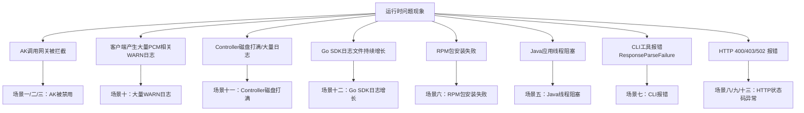

# 典型问题排查解决方案

应急操作优先建议控制台白屏操作，当白屏无法访问时，采用在容器中执行脚本（调用服务接口），当容器无法访问时，直接在数据库中执行SQL。
操作优先级：**控制台白屏 > 调用接口（容器脚本） > 数据库执行SQL**



## 场景一：initAK（底表AK）被禁用影响业务 / AK调用网关被拦截

### 一、问题描述
1. **问题现象**：产品调用网关时报 AK 被禁用/AK 无效/AK 不存在，网关拦截请求。确认因为某把 initAK（底表AK）被禁用而影响业务调用。说明 SDK 没有成功获取派生 AK 走了降级逻辑，或者产品使用底表 AK 未适配。
2. **适用范围**：[[PCM/平台凭证管理服务/index|平台凭证管理服务]](PCM)，影响依赖该 initAK 的业务。

### 二、排查信息收集
1. **必须收集的信息**：被禁用的 initAK 的 AK ID（`access_id`）。
2. **检查终态的方法**：
   - 从网关日志中取出被拦截的 AK ID。
   - 登录 PCM 控制台白屏查看 AK 状态，若控制台能直接查到，则判定为底表 AK。
   - 或登录 UMMAK 数据库查询 `accesskey_table` 表中的 `enabled_flag` 字段。

### 三、解决步骤
1. **方法1：白屏操作（优先推荐）**
   - **适用条件**：PCM 控制台白屏可正常访问。
   - **实施步骤**：通过 PCM 控制台的 initAK 管理功能查询特定 AK，并在操作中点击“启用”该 AK。
   - **结果验证**：白屏页面显示该 AK 状态为“已启用”。
2. **方法2：调用接口（容器中执行脚本）**
   - **适用条件**：白屏不可用，但容器可访问。
   - **实施步骤**：登录 `PcmController` 容器，使用“底表AK黑屏操作工具”执行启用命令（将 `{akid}` 替换为实际的 AK ID）：
     ```bash
     python3 manage_ak_status.py enable --ak {akid}
     ```
   - **结果验证**：工具返回“已启用”，业务恢复正常。
3. **方法3：数据库操作**
   - **适用条件**：白屏、容器均不可用时。
   - **实施步骤**：
     - 进入 UMMAK 数据库（service：`baseService-umm-ak`，db实例：`ummak`，数据库：`ummak`）。
     - 执行 SQL 启用 AK（将 `{akid}` 替换为实际的 `access_id`）：
       ```sql
       update accesskey_table set enabled_flag=1 where access_id = '{akid}';
       ```
   - **结果验证**：查询 `accesskey_table` 表，确认对应 `access_id` 的 `enabled_flag` 为 1。
4. **应急替代方案：白屏创建临时AK**
   - **适用条件**：原 AK 无法立即恢复，且业务急需使用 AK 登录或调用。
   - **实施步骤**：
     - 进入 PCM 控制台白屏的“派生AK管理”标签页，点击“创建临时AK”。
     - 输入申请者（IAMID，如 `集群:sr`，若已存在可拼接任意字符串）、initAKID（托管到 PCM 的底表 AK）、有效天数（1~365天）及申请原因。
     - 申请成功后，**立即复制并保存**弹窗中展示的 AK（accessKeyId）和 SK（accessKeySecret）明文（关闭弹窗后无法再次查看）。
   - **结果验证**：使用新创建的临时 AK/SK 替换业务配置，业务恢复正常。

### 四、后续排查方向
1. 业务恢复后，需查 SDK 日志 code，确认是哪种降级场景（参考 Core 错误码快速定位），排查为什么 SDK 没拿到派生 AK。

## 场景二：全量底表AK被禁用影响业务

### 一、问题描述
1. **问题现象**：环境内存在被底表 AK 禁用而影响业务，涉及多把底表 AK 或无法确认具体是哪把底表 AK。
2. **适用范围**：平台凭证管理服务(PCM)，影响依赖底表 AK 的业务。

### 二、排查信息收集
1. **必须收集的信息**：环境信息、受影响的业务模块。
2. **检查终态的方法**：登录 PCM 数据库查询 `init_ak_info` 表中 `umm_ak_status` 为 0 的记录。
3. **注意事项**：暂不支持通过白屏解禁全量 AK。

### 三、解决步骤
1. **方法1：调用接口（容器中执行脚本）**
   - **适用条件**：容器可访问。
   - **实施步骤**：登录 `PcmController` 容器，使用“底表AK黑屏操作工具”执行全量启用命令：
     ```bash
     python3 manage_ak_status.py enable-all
     ```
   - **结果验证**：工具返回启用成功的数量（如 `启用完成: x/x`），业务恢复正常。
2. **方法2：数据库操作**
   - **适用条件**：容器不可访问时。
   - **实施步骤**：
     - 获取全量底表 AK（PCM 托管的底表 AK 存储在 clm_db 实例的 pcm 数据库中，service：`certificate-lifecycle-manager-server`，db实例：`clm_db`，数据库：`pcm_db`）：
       ```sql
       use pcm_db;
       select access_key_id from init_ak_info where umm_ak_status = 0;
       ```
     - 启用全量底表 AK（在 UMMAK 数据库中操作，service：`baseService-umm-ak`，db实例：`ummak`，数据库：`ummak`），将 `access_id` 字段参数改成上述检索到的底表 AK 信息：
       ```sql
       update accesskey_table set enabled_flag=1 where access_id in ('qNNm2yFXF70Zy6Hx','qNNm2yFXF70Zy6Hx2','qNNm2yFXF70Zy6Hx3');
       ```
   - **结果验证**：查询 `accesskey_table` 表，确认对应底表 AK 的 `enabled_flag` 为 1。

## 场景三：派生AK被禁用影响业务 / AK调用网关被拦截

### 一、问题描述
1. **问题现象**：产品调用网关时报 AK 被禁用/AK 无效/AK 不存在。确认某把派生 AK 被禁用影响业务（产品已经在使用派生 AK，但这把派生 AK 已被轮转禁用）。
2. **适用范围**：平台凭证管理服务(PCM)。

### 二、排查信息收集
1. **必须收集的信息**：被禁用的派生 AK ID（`access_id`）。
2. **检查终态的方法**：
   - 从网关日志取出 AK ID。通过白屏查询派生 AK 状态，或通过 PCM 数据库查询。
   - **注意**：每个派生队列中通过白屏仅可以查询最近14把派生 AK。如果超过14把 AK 后，会在 ummak 侧执行删除操作，但 pcm 数据库会保留派生 AK 记录。当通过白屏未查询到该 AK 时，有可能是14天前派生的 AK，需通过 pcm 数据库进行查询：
     ```sql
     use pcm_db;
     select * from ak_info where access_key_id='****';
     ```

### 三、解决步骤
1. **方法1：重启服务或白屏操作**
   - **适用条件**：白屏可访问且 AK 是最近14天内派生的，或允许重启业务服务。
   - **实施步骤**：
     - 通常重启服务会刷新 AK 导致可用，然后停止该队列的轮转。
     - 或在白屏查询派生 AK，查询后通过“启用”操作恢复。
   - **结果验证**：白屏显示 AK 状态为已启用，或业务恢复正常。
2. **方法2：数据库操作**
   - **适用条件**：白屏不可用，或 AK 是14天前派生的（白屏查不到），且无法重启服务。
   - **实施步骤**：
     - 查询派生 AK（若白屏查不到，进入 `certificate-lifecycle-manager-server` 服务的 `clm_db` 实例，切换至 `pcm_db` 数据库）。
     - 在 UMMAK 中启用或重建 AK（进入 `baseService-umm-ak` 服务的 `ummak` 实例）：
       - **情况A：如果 AK 在 UMMAK 中存在**，直接更新启用状态：
         ```sql
         update accesskey_table set enabled_flag=1, hidden_flag=0, deleted_flag=0 where access_id='qNNm2yFXF70Zy6Hx';
         ```
       - **情况B：如果 AK 在 UMMAK 中已经删除**，需重新创建 AK（`access_id` 为 akid，`access_key` 为 sk，`user_id` 为账号）：
         ```sql
         INSERT INTO `ummak`.`accesskey_table` (`access_id`, `access_key`, `user_id`) VALUES ('000cFXr3DBPZHxML11', 'XE5sP5dF6asjJsCkxL4QYifS7rRU11', '999999999');
         ```
   - **结果验证**：查询 `accesskey_table` 表，确认 AK 存在且 `enabled_flag` 为 1，`deleted_flag` 为 0。
3. **应急替代方案：白屏创建临时AK**
   - **适用条件**：原 AK 无法立即恢复，且业务急需使用 AK 登录或调用。
   - **实施步骤**：参考场景一中的“应急替代方案：白屏创建临时AK”步骤，使用对应的 initAKID 创建临时 AK 并替换业务配置。

### 四、后续排查方向
1. 排查为什么产品没有及时更新到最新的派生 AK（最可能原因为仅获取一次，未持续轮转）。如果有 SDK 报错，参见 Core 错误码快速定位。
2. 若在“AK申请详情”中发现轮转状态为“已停止”，需排查以下原因：
   - IAMID 中包含 `CLOSE_AUTO_ROTATE` 状态，表示该队列默认不轮转。
   - 使用该产品的队列中，有产品未及时更新 PCM SDK。
   - 使用该队列的产品中，有产品仍停留在第 7 把 AK（未消费最新 AK）。

## 场景四：AK容量告警（单UID达到上限导致派生失败）

### 一、问题描述
1. **问题现象**：派生 AK 失败，系统可能出现容量告警。UMMAK 侧每个 uid 下最大1000把有效 AK，当达到1000把以后会出现派生失败的情况。
2. **适用范围**：平台凭证管理服务(PCM)，影响特定 UID 下的 AK 派生。

### 二、排查信息收集
1. **必须收集的信息**：报错的 UID（`user_id`）。
2. **检查终态的方法**：登录 UMMAK 数据库，查询该 UID 下的 AK 数量是否达到或超过1000。

### 三、解决步骤
1. **步骤1：查询AK数量**
   - **实施步骤**：
     - 进入 UMMAK 数据库（service：`baseService-umm-ak`，db实例：`ummak`，数据库：`ummak`）。
     - 检查特定 uid 下的 AK 数量：
       ```sql
       SELECT user_id, COUNT(access_id) AS access_count FROM accesskey_table where user_id = '1000000047' GROUP BY user_id;
       ```
     - 查询是否有 uid 下的 AK 超过1000：
       ```sql
       SELECT user_id, COUNT(access_id) AS access_count FROM accesskey_table GROUP BY user_id HAVING access_count >= 1000;
       ```
   - **结果验证**：确认目标 UID 的 `access_count` 是否 >= 1000。
2. **步骤2：清理无用AK**
   - **实施步骤**：
     - 分析出环境内已经无用的 AK。
     - 在 UMMAK 数据库中将无用 AK 置成删除状态（将 `'xxxxx'` 替换为实际需要清理的 `access_id` 列表）：
       ```sql
       update accesskey_table set enabled_flag = 0, deleted_flag = 1 , modified_time = UNIX_TIMESTAMP() where access_id in ('xxxxx');
       ```
   - **结果验证**：再次执行步骤1的查询 SQL，确认该 UID 下的有效 AK 数量已降至1000以下，重新尝试派生 AK 成功。

## 场景五：Java 应用线程阻塞

### 一、问题描述
1. **问题现象**：线程 dump 中出现阻塞堆栈：
   ```plaintext
   java.lang.Thread.State: BLOCKED (on object monitor)
     at sun.security.provider.NativePRNG$RandomIO.implNextBytes(NativePRNG.java:543)
     at ...PcmSecretCredentialManager.persistCredentials(...)
   ```
2. **适用范围**：使用 PCM Java SDK 的应用，系统熵值低时触发。

### 二、排查信息收集
1. **必须收集的信息**：线程 dump 堆栈信息、系统熵值（是否 < 100）、SDK 版本。
2. **检查终态的方法**：检查系统熵值，确认 SDK 默认使用 `/dev/random` 阻塞模式获取随机数导致线程卡住。

### 三、解决步骤
1. **实施步骤**：
   - **根本解决**：升级 SDK 至 `credprovider.plugin >= 1.0.8`。
   - **临时规避**：在 JVM 启动参数中添加 `-Djava.security.egd=file:/dev/./urandom`。
2. **结果验证**：线程 dump 中不再出现 `NativePRNG` 相关的 BLOCKED 状态。

## 场景六：Python SDK RPM 包安装失败

### 一、问题描述
1. **问题现象**：安装 `pcm-python2-sdk-rpm-with-no-six` 报错，关键字包含 `pytz/zoneinfo`、`cpio: File from package already exists as a directory`。
2. **适用范围**：使用 Python 2 SDK RPM 包部署的环境。

### 二、排查信息收集
1. **必须收集的信息**：报错日志。
2. **检查终态的方法**：检查系统是否已有 `/home/tops/lib/python2.7/site-packages/pytz/` 目录，与 RPM 包产生冲突。

### 三、解决步骤
1. **实施步骤**：备份并移动冲突目录，重新执行安装：
   ```bash
   mv /home/tops/lib/python2.7/site-packages/pytz /home/tops/lib/python2.7/site-packages/pytz_bak
   sudo yum install pcm-python2-sdk-rpm-with-no-six -y
   ```
2. **结果验证**：RPM 包安装成功，无冲突报错。

## 场景七：CLI 工具报错 ResponseParseFailure

### 一、问题描述
1. **问题现象**：CLI 工具返回 `{"code": "ResponseParseFailure", "data": "", "message": "xxxxxxx"}`。
2. **适用范围**：使用 PCM CLI 工具的环境。

### 二、排查信息收集
1. **必须收集的信息**：CLI 配置的 `pcm_endpoint` 地址。
2. **检查终态的方法**：
   - 确认 `pcm_endpoint` 指向是否正确。
   - 手动 `curl` 确认返回格式（地址响应 200 但格式非预期，CLI 解析失败且未走降级）。

### 三、解决步骤
1. **修正 Endpoint 配置**
   - **适用条件**：确认 `pcm_endpoint` 配置错误或指向了非 PCM 标准接口。
   - **实施步骤**：修改 CLI 配置文件中的 `pcm_endpoint` 地址，确保其指向正确的 PCM 服务端点。
   - **结果验证**：重新执行 CLI 命令，成功解析响应，不再报 `ResponseParseFailure` 错误。

## 通用日志排查与分析

在排查 PCM 相关问题时，日志是定位问题的核心依据。PCM 部署在两个 Docker 容器上，**日志排查需同时查询两个 Docker**。

### 1. AK 申请日志
- **说明**：记录每个 IAMID 申请派生 AK 的记录，通过 `pcm-core` 获取。`pcm-core` 中针对每个 IAMID 的底表 `secretARN` 的缓存时间为 12 小时，对于一直在用派生 AK 的产品，理论上每 12 小时会有一条记录。
- **排查方法**：通过 PCM 控制台白屏的“AK申请日志”或“AK申请详情”页面查看。

### 2. 平台 AK 访问日志
- **说明**：在网关侧记录使用底表 AK 的使用情况（当前不完整，可作为辅助查询手段）。
- **排查方法**：通过网关日志查询特定底表 AK 的访问记录。

### 3. PCM Core 日志排查

#### 排查 Error 日志（确定是否 pcm-core 报错返回）
- **有具体 RequestID**：直接查询对应日期的 error 日志。
  ```bash
  grep -rn "{request_id}" /opt/tengine/logs/error.{date}.log
  ```
- **无具体 RequestID**：根据 AKID、IAMID 和时间段进行复合筛选。
  ```bash
  grep "{ak_id}" /opt/tengine/logs/error.{date}.log | grep "{iam_id}" | awk '$1 >= "{start_date}" && $2 >= "{start_time}" && $2 <= "{end_time}"'
  ```

#### 排查 Access 日志（确定是否 pcm-core 接收到请求）
- **有具体 RequestID**：直接查询对应日期的 access 日志。
  ```bash
  grep -rn "{request_id}" /opt/tengine/logs/access.{date}.log
  ```
- **无具体 RequestID**：根据 AKID 和时间段进行复合筛选。
  ```bash
  grep -E '"time_local": "({date_hour_pattern})"' /opt/tengine/logs/access.{date}.log | grep "{ak_id}"
  ```

#### Access 日志关键参数说明

| 参数名称 | 参数含义 |
| --- | --- |
| remote_addr | 请求源地址 |
| Gateway-POP-Tunnel-ID | tunnel-id |
| X-Aliyun-Vpc-Id | vpc-id |
| remote_port | 请求端口 |
| time_local | 请求完成的时间 |
| request_uri | 请求的 URI，包含 IAMID、SecretName、Endpoint 等信息 |
| request_method | 请求方法 |
| status | HTTP 返回码 |
| http_user_agent | 请求代理客户端信息 |
| request_time | Tengine 收到请求到发完响应的总耗时 |
| SecretName | SecretName，包含 initAKID 和 pcm_endpoint 信息 |
| IamId | 表示请求服务身份，对应 SDK 填写的 appname（HTTP 报错时可能为空） |
| x_acs_bearer_token | 请求发送的 JWT |
| x_sdk_client | PCM SDK 版本 |
| limit_req_status | 限流状态，未限流显示 "PASSED"，限流显示 "-" |
| eagleeye_traceid | 即 RequestID，可根据此查询对应 error_log 是否有错误日志 |