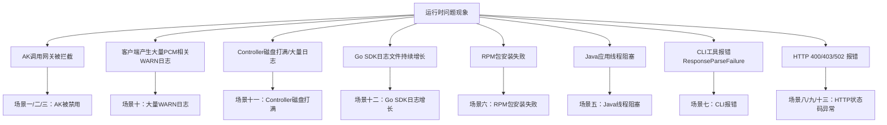

# 典型问题排查解决方案

应急操作优先建议控制台白屏操作，当白屏无法访问时，采用在容器中执行脚本（调用服务接口），当容器无法访问时，直接在数据库中执行SQL。
操作优先级：**控制台白屏 > 调用接口（容器脚本） > 数据库执行SQL**



## 场景一：initAK（底表AK）被禁用影响业务 / AK调用网关被拦截

### 一、问题描述
- **问题现象**：产品调用网关时报 AK 被禁用/AK 无效/AK 不存在，网关拦截请求。确认因为某把 initAK（底表AK）被禁用而影响业务调用。说明 SDK 没有成功获取派生 AK 走了降级逻辑，或者产品使用底表 AK 未适配。
- **适用范围**：[[PCM/平台凭证管理服务/index|平台凭证管理服务]](PCM)，影响依赖该 initAK 的业务。

### 二、排查信息收集
- **必须收集的信息**：被禁用的 initAK 的 AK ID（`access_id`）。
- **检查终态的方法**：
  1. 从网关日志中取出被拦截的 AK ID。
  2. 登录 PCM 控制台白屏查看 AK 状态，若控制台能直接查到，则判定为底表 AK。
  3. 或登录 UMMAK 数据库查询 `accesskey_table` 表中的 `enabled_flag` 字段。

### 三、解决步骤

**方法1：白屏操作（优先推荐）**
- **适用条件**：PCM 控制台白屏可正常访问。
- **实施步骤**：通过 PCM 控制台的 initAK 管理功能查询特定 AK，并在操作中点击“启用”该 AK。
- **结果验证**：白屏页面显示该 AK 状态为“已启用”。

**方法2：调用接口（容器中执行脚本）**
- **适用条件**：白屏不可用，但容器可访问。
- **实施步骤**：登录 `PcmController` 容器，使用“底表AK黑屏操作工具”执行启用命令（将 `{akid}` 替换为实际的 AK ID）：
  ```bash
  python3 manage_ak_status.py enable --ak {akid}
  ```
- **结果验证**：工具返回“已启用”，业务恢复正常。

**方法3：数据库操作**
- **适用条件**：白屏、容器均不可用时。
- **实施步骤**：
  1. 进入 UMMAK 数据库：
     - service：`baseService-umm-ak`
     - db实例：`ummak`
     - 数据库：`ummak`
  2. 执行 SQL 启用 AK（将 `{akid}` 替换为实际的 `access_id`）：
     ```sql
     update accesskey_table set enabled_flag=1 where access_id = '{akid}';
     ```
- **结果验证**：查询 `accesskey_table` 表，确认对应 `access_id` 的 `enabled_flag` 为 1。

**后续排查方向**
- 业务恢复后，需查 SDK 日志 code，确认是哪种降级场景（参考 Core 错误码快速定位），排查为什么 SDK 没拿到派生 AK。

## 场景二：全量底表AK被禁用影响业务

### 一、问题描述
- **问题现象**：环境内存在被底表 AK 禁用而影响业务，涉及多把底表 AK 或无法确认具体是哪把底表 AK。
- **适用范围**：平台凭证管理服务(PCM)，影响依赖底表 AK 的业务。

### 二、排查信息收集
- **必须收集的信息**：环境信息、受影响的业务模块。
- **检查终态的方法**：登录 PCM 数据库查询 `init_ak_info` 表中 `umm_ak_status` 为 0 的记录。
- **注意事项**：暂不支持通过白屏解禁全量 AK。

### 三、解决步骤

**方法1：调用接口（容器中执行脚本）**
- **适用条件**：容器可访问。
- **实施步骤**：登录 `PcmController` 容器，使用“底表AK黑屏操作工具”执行全量启用命令：
  ```bash
  python3 manage_ak_status.py enable-all
  ```
- **结果验证**：工具返回启用成功的数量（如 `启用完成: x/x`），业务恢复正常。

**方法2：数据库操作**
- **适用条件**：容器不可访问时。
- **实施步骤**：
  1. 获取全量底表 AK（PCM 托管的底表 AK 存储在 clm_db 实例的 pcm 数据库中）：
     - service：`certificate-lifecycle-manager-server`
     - db实例：`clm_db`
     - 数据库：`pcm_db`
     - 进入实例后切换数据库：
       ```sql
       use pcm_db;
       ```
     - 检索已经禁用的 initAK：
       ```sql
       select access_key_id from init_ak_info where umm_ak_status = 0;
       ```
  2. 启用全量底表 AK（在 UMMAK 数据库中操作）：
     - service：`baseService-umm-ak`
     - db实例：`ummak`
     - 数据库：`ummak`
     - 执行 SQL（将 `access_id` 字段参数改成步骤1中检索到的底表 AK 信息）：
       ```sql
       update accesskey_table set enabled_flag=1 where access_id in ('qNNm2yFXF70Zy6Hx','qNNm2yFXF70Zy6Hx2','qNNm2yFXF70Zy6Hx3');
       ```
- **结果验证**：查询 `accesskey_table` 表，确认对应底表 AK 的 `enabled_flag` 为 1。

## 场景三：派生AK被禁用影响业务 / AK调用网关被拦截

### 一、问题描述
- **问题现象**：产品调用网关时报 AK 被禁用/AK 无效/AK 不存在。确认某把派生 AK 被禁用影响业务（产品已经在使用派生 AK，但这把派生 AK 已被轮转禁用）。
- **适用范围**：平台凭证管理服务(PCM)。

### 二、排查信息收集
- **必须收集的信息**：被禁用的派生 AK ID（`access_id`）。
- **检查终态的方法**：从网关日志取出 AK ID。通过白屏查询派生 AK 状态，或通过 PCM 数据库查询。
  - **注意**：每个派生队列中通过白屏仅可以查询最近14把派生 AK。如果超过14把 AK 后，会在 ummak 侧执行删除操作，但 pcm 数据库会保留派生 AK 记录。当通过白屏未查询到该 AK 时，有可能是14天前派生的 AK，需通过 pcm 数据库进行查询：
    ```sql
    use pcm_db;
    select * from ak_info where access_key_id='****';
    ```

### 三、解决步骤

**方法1：重启服务或白屏操作**
- **适用条件**：白屏可访问且 AK 是最近14天内派生的，或允许重启业务服务。
- **实施步骤**：
  - 通常重启服务会刷新 AK 导致可用，然后停止该队列的轮转。
  - 或在白屏查询派生 AK，查询后通过“启用”操作恢复。
- **结果验证**：白屏显示 AK 状态为已启用，或业务恢复正常。

**方法2：数据库操作**
- **适用条件**：白屏不可用，或 AK 是14天前派生的（白屏查不到），且无法重启服务。
- **实施步骤**：
  1. 查询派生 AK（若白屏查不到）：
     - service：`certificate-lifecycle-manager-server`
     - db实例：`clm_db`
     - 数据库：`pcm_db`
     - 进入实例后切换数据库：
       ```sql
       use pcm_db;
       ```
  2. 在 UMMAK 中启用或重建 AK：
     - service：`baseService-umm-ak`
     - db实例：`ummak`
     - 数据库：`ummak`
     - **情况A：如果 AK 在 UMMAK 中存在**，直接更新启用状态：
       ```sql
       update accesskey_table set enabled_flag=1, hidden_flag=0, deleted_flag=0 where access_id='qNNm2yFXF70Zy6Hx';
       ```
     - **情况B：如果 AK 在 UMMAK 中已经删除**，需重新创建 AK（`access_id` 为 akid，`access_key` 为 sk，`user_id` 为账号）：
       ```sql
       INSERT INTO `ummak`.`accesskey_table` (`access_id`, `access_key`, `user_id`) VALUES ('000cFXr3DBPZHxML11', 'XE5sP5dF6asjJsCkxL4QYifS7rRU11', '999999999');
       ```
- **结果验证**：查询 `accesskey_table` 表，确认 AK 存在且 `enabled_flag` 为 1，`deleted_flag` 为 0。

**后续排查方向**
- 排查为什么产品没有及时更新到最新的派生 AK（最可能原因为仅获取一次，未持续轮转）。如果有 SDK 报错，参见 Core 错误码快速定位。

## 场景四：AK容量告警（单UID达到上限导致派生失败）

### 一、问题描述
- **问题现象**：派生 AK 失败，系统可能出现容量告警。UMMAK 侧每个 uid 下最大1000把有效 AK，当达到1000把以后会出现派生失败的情况。
- **适用范围**：平台凭证管理服务(PCM)，影响特定 UID 下的 AK 派生。

### 二、排查信息收集
- **必须收集的信息**：报错的 UID（`user_id`）。
- **检查终态的方法**：登录 UMMAK 数据库，查询该 UID 下的 AK 数量是否达到或超过1000。

### 三、解决步骤

**步骤1：查询AK数量**
- **实施步骤**：
  1. 进入 UMMAK 数据库（service：`baseService-umm-ak`，db实例：`ummak`，数据库：`ummak`）。
  2. 检查特定 uid 下的 AK 数量：
     ```sql
     SELECT user_id, COUNT(access_id) AS access_count FROM accesskey_table where user_id = '1000000047' GROUP BY user_id;
     ```
  3. 查询是否有 uid 下的 AK 超过1000：
     ```sql
     SELECT user_id, COUNT(access_id) AS access_count FROM accesskey_table GROUP BY user_id HAVING access_count >= 1000;
     ```
- **结果验证**：确认目标 UID 的 `access_count` 是否 >= 1000。

**步骤2：清理无用AK**
- **实施步骤**：
  1. 分析出环境内已经无用的 AK。
  2. 在 UMMAK 数据库中将无用 AK 置成删除状态（将 `'xxxxx'` 替换为实际需要清理的 `access_id` 列表）：
     ```sql
     update accesskey_table set enabled_flag = 0, deleted_flag = 1 , modified_time = UNIX_TIMESTAMP() where access_id in ('xxxxx');
     ```
- **结果验证**：再次执行步骤1的查询 SQL，确认该 UID 下的有效 AK 数量已降至1000以下，重新尝试派生 AK 成功。

## 场景五：Java 应用线程阻塞

### 一、问题描述
- **问题现象**：线程 dump 中出现阻塞堆栈：
  ```plaintext
  java.lang.Thread.State: BLOCKED (on object monitor)
    at sun.security.provider.NativePRNG$RandomIO.implNextBytes(NativePRNG.java:543)
    at ...PcmSecretCredentialManager.persistCredentials(...)
  ```
- **适用范围**：使用 PCM Java SDK 的应用，系统熵值低时触发。

### 二、排查信息收集
- **必须收集的信息**：线程 dump 堆栈信息、系统熵值（是否 < 100）、SDK 版本。
- **检查终态的方法**：检查系统熵值，确认 SDK 默认使用 `/dev/random` 阻塞模式获取随机数导致线程卡住。

### 三、解决步骤
- **实施步骤**：
  1. **根本解决**：升级 SDK 至 `credprovider.plugin >= 1.0.8`。
  2. **临时规避**：在 JVM 启动参数中添加 `-Djava.security.egd=file:/dev/./urandom`。
- **结果验证**：线程 dump 中不再出现 `NativePRNG` 相关的 BLOCKED 状态。

## 场景六：Python SDK RPM 包安装失败

### 一、问题描述
- **问题现象**：安装 `pcm-python2-sdk-rpm-with-no-six` 报错，关键字包含 `pytz/zoneinfo`、`cpio: File from package already exists as a directory`。
- **适用范围**：使用 Python 2 SDK RPM 包部署的环境。

### 二、排查信息收集
- **必须收集的信息**：报错日志。
- **检查终态的方法**：检查系统是否已有 `/home/tops/lib/python2.7/site-packages/pytz/` 目录，与 RPM 包产生冲突。

### 三、解决步骤
- **实施步骤**：备份并移动冲突目录，重新执行安装：
  ```bash
  mv /home/tops/lib/python2.7/site-packages/pytz /home/tops/lib/python2.7/site-packages/pytz_bak
  sudo yum install pcm-python2-sdk-rpm-with-no-six -y
  ```
- **结果验证**：RPM 包安装成功，无冲突报错。

## 场景七：CLI 工具报错 ResponseParseFailure

### 一、问题描述
- **问题现象**：CLI 工具返回 `{"code": "ResponseParseFailure", "data": "", "message": "xxxxxxx"}`。
- **适用范围**：使用 PCM CLI 工具的环境。

### 二、排查信息收集
- **必须收集的信息**：CLI 配置的 `pcm_endpoint` 地址。
- **检查终态的方法**：确认 `pcm_endpoint` 指向是否正确，手动 curl 确认返回格式（地址响应 200 但格式非预期，CLI 解析失败且未走降级）。

### 三、解决步骤
- **实施步骤**：修改 CLI 配置文件，将 `pcm_endpoint` 修正为正确的 PCM 服务地址，确保该地址能返回预期的标准 JSON 格式。
- **结果验证**：重新执行 CLI 命令，不再报 `ResponseParseFailure` 错误。

## 常见网关AK拦截日志特征与示例（辅助排查）

当遇到访问报错，怀疑是PCM禁用AK导致的，优先通过拦截日志判定，提取日志中的请求AK，并通过PCM服务查询AK状态。如果已经禁用，采用应急处置方案进行处置，并反馈研发侧排查原因。

下面是常见网关AK被禁用时的拦截日志特征及示例，可供参考：

### OSS
- **拦截特征**：
  - `"error_code": "InvalidAccessKeyId"`
  - `"status": "403"`
- **日志示例**：
  ```json
  {
    "__tag__:__hostname__": "c25g07018.cloud.g07.amtest17",
    "__tag__:__path__": "/apsara/module_logs/oss_tengine/access_log.2026042415",
    "access_id": "5hN1RkUhRn43iNfw",
    "bucketname": "cn-wulan-env17e-d01-as-console-cdn",
    "error_code": "InvalidAccessKeyId",
    "host": "cn-wulan-env17e-d01-as-console-cdn.oss-cn-wulan-env17e-d01-a.intra.env17e.shuguang.com",
    "ip": "10.17.46.36",
    "method": "GET",
    "operation": "GetBucketAcl",
    "owner": "999999999",
    "request_id": "69EB1A0A3E6DA93539F3A4CE",
    "status": "403",
    "time": "24/Apr/2026:15:21:46",
    "url": "/?acl"
  }
  ```

### SLS_INNER
- **拦截特征**：
  - `"Status": "401"`
- **日志示例**：
  ```json
  {
    "APIVersion": "0.6.0",
    "AccessKeyId": "cmchJQg057pBelHD",
    "ClientIP": "10.17.160.103",
    "LogStore": "big_data_event",
    "Method": "GetConsumerGroupCheckPoint",
    "ProjectName": "k8sblink",
    "RequestId": "69EB0C444B76F491098A2F35",
    "Status": "401",
    "UserAgent": "aliyun-log-sdk-java-0.6.64/1.8.0_412",
    "__tag__:__hostname__": "c25h05123.cloud.h06.amtest17",
    "__tag__:__path__": "/apsara/fcgi_agent/ols_operation_2.LOG"
  }
  ```

### SLSPUB
- **拦截特征**：
  - `"Status": "401"`
  - `"ErrorCode": "Unauthorized"`
  - `"ErrorMsg": "AccessKeyId is disabled: <AK_ID>"`
- **日志示例**：
  ```json
  {
    "AccessKeyId": "Khz7a1kmKMZDCBXj",
    "ClientIP": "10.17.31.30",
    "ErrorCode": "Unauthorized",
    "ErrorMsg": "AccessKeyId is disabled: Khz7a1kmKMZDCBXj",
    "Method": "ListShards",
    "ProjectName": "ali-cdsslshybridcluster-a-20260323-015f-sls-admin",
    "RequestId": "69D6169B34510383396636E7",
    "Status": "401",
    "UserAgent": "aliyun-log-sdk-java-0.6.64/1.8.0_352",
    "__tag__:__hostname__": "c25g09017.cloud.g09.amtest17",
    "__tag__:__path__": "/apsara/sls/fcgi_agent/ols_operation.LOG"
  }
  ```

### ASAPI
- **拦截特征**：
  - `"errorCode": "asapi.server.request.parameter.accesskeyid.error"`
  - `"errorMessage": "The specified AccessKey ID (<AK_ID>) is invalid. Details: (The Access Key is disabled.)."`
  - `"status": "failed"`
- **日志示例**：
  ```json
  {
    "EagleeyeTraceId": "0a11243f17770122001463084d0062",
    "__tag__:__hostname__": "vm010017036063",
    "__tag__:__path__": "/apsara/cloud/data/asapi/ApiServer#/api-server/logs/asapi-logger/audit.log",
    "accessKeyId": "VidKjhddRaas4tMA",
    "apiName": "ListAllLevel1Orgs",
    "callerIp": "10.17.32.38",
    "errorCode": "asapi.server.request.parameter.accesskeyid.error",
    "errorMessage": "The specified AccessKey ID (VidKjhddRaas4tMA) is invalid. Details: (The Access Key is disabled.).",
    "errorSuggestion": "Check whether the AccessKey pair exists and is enabled.",
    "errorTitle": "The AccessKey pair in the request is invalid.",
    "errorType": "Business",
    "httpMethod": "POST",
    "productName": "ascm",
    "requestId": "0a11243f17770122001463084d0062",
    "status": "failed",
    "time": "2026-04-24 14:30:00:296"
  }
  ```

### KMS
- **拦截特征**：
  - `"error_code": "Forbidden.AccessKey"`
  - `"error_message": "This AccessKey is not enabled."`
  - `"status_code": "403"`
- **日志示例**：
  ```json
  {
    "URL": "ListKeys",
    "__tag__:__hostname__": "c25h09107.cloud.h10.amtest17",
    "__tag__:__path__": "/cloud/log/kms/KmsHost#/kms_host/audit.log",
    "accessuid": "1000000056",
    "api_name": "ListKeys",
    "error_code": "Forbidden.AccessKey",
    "error_message": "This AccessKey is not enabled.",
    "expected_code": "403",
    "failed_status_code": "4XX",
    "ip": "10.17.4.31",
    "request_id": "0efdb6f6-ae55-445e-b1e9-f514351d287b",
    "status_code": "403",
    "utc_time": "2026-04-24T07:50:38Z"
  }
  ```

### ODPS
- **拦截特征**：日志中主要记录请求元数据，无直接明确的禁用错误码，需结合具体业务报错或提取 `metadata` 中的 `access_id` 进行关联排查。
- **日志示例**：
  ```json
  {
    "__tag__:__hostname__": "vm010017037223",
    "__tag__:__path__": "/cloud/log/odps-service-frontend/FrontendServer#/frontend_server/tengine/logs/aggregated_log.log",
    "execution_end_time": "2026-04-24T06:37:03.348203",
    "execution_start_time": "2026-04-24T06:37:01.586769",
    "metadata": "{\"access_id\":\"fXWvhmRkMeER5QI6\",\"network_client_ip\":\"10.17.37.83\",\"vpc_id\":\"0\"}",
    "requests": "{\"url\":[\"/api/logview/host?curr_project=admin_task_project\",\"/api/projects?expectmarker=true&curr_project=admin_task_project\"]}"
  }
  ```