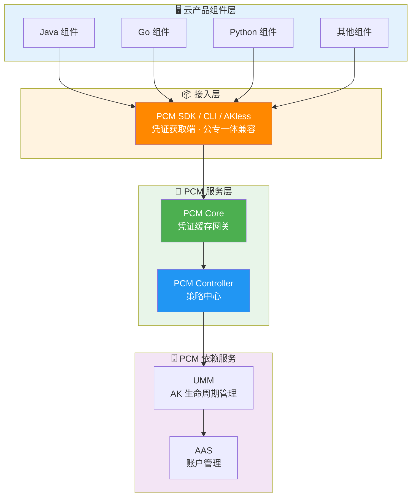
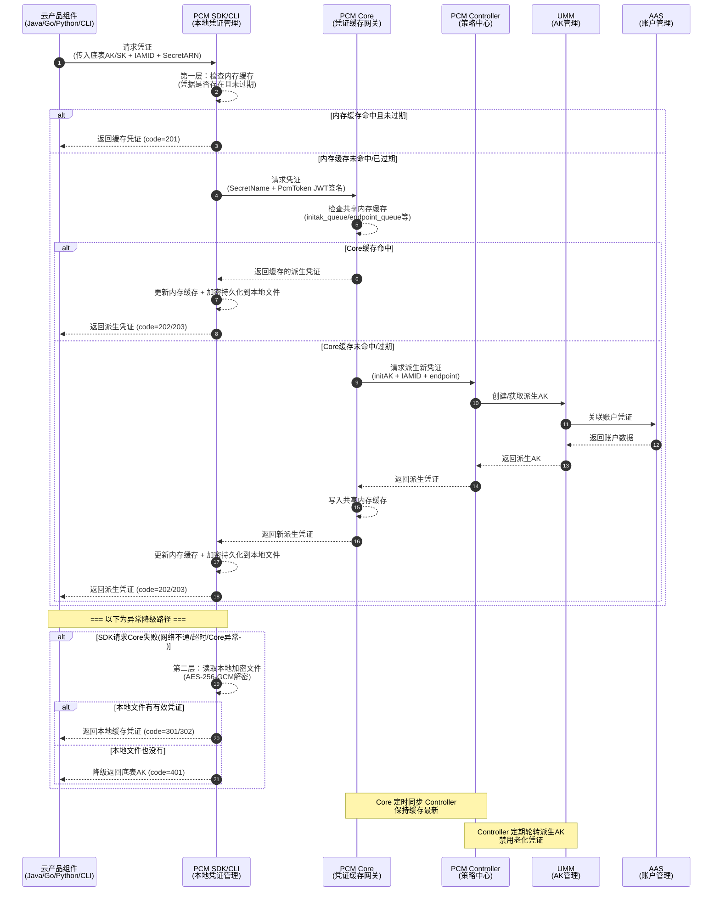
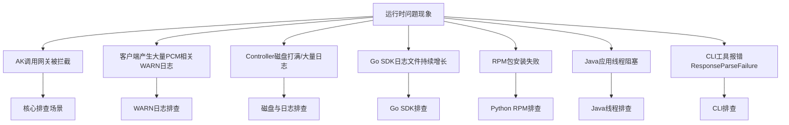
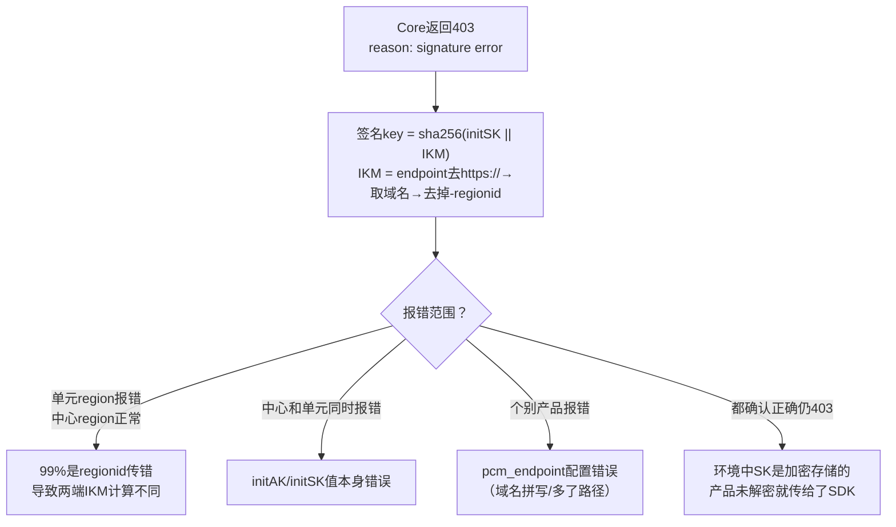

# 横向研发文档

### 服务简介
云产品应用（Java、Go、Python 等组件）通过集成 **PCM SDK / CLI / AKless** 凭证获取端接入[[PCM/平台凭证管理服务/index|平台凭证管理服务]]（PCM）。接入后，应用不再直接使用原始底表 AK，而是通过 SDK 向 PCM 服务请求动态轮换的派生 AK。

### 核心概念与标识范围
在对接时，需明确以下核心标识的范围与格式：
*   **底表 AK**：通过全局变量方式声明、云平台初始化时自动创建的 AK。
*   **IAMID（申请者 ID）**：产品申请派生时的服务身份标识。
    *   **常规格式**：`集群名称: sr名称`（例如：`StandardCloudCluster-A-20250906-00bf:PcmController`），PaaS 格式为 `{{ .Values.productName }}:{{ .Release.Name }}`。
    *   **配置说明**：在 SDK 中配置的 `appname` 将作为 `IamId` 传递给服务端。若系统提示 IAMID 已存在，可在末尾拼接任意字符串。认证状态失败仅表示 IAMID 格式不规范，不会影响 AK 申请结果。
*   **secretARN**：凭证目标资源标识。格式为 `apsara:pcm:akid:<accessKeyId>:dst_endpoint:<GatewayCode>:sk:<accessKeySecret>`。
*   **GatewayCode**：服务的认证网关 code，用于区分 AK 私用网关和标准 AK 认证网关（当前版本仅标准 AK 认证网关支持使用底表 AK）。

## 接入指引与 SDK 配置

### SDK 接入与核心配置
产品接入 PCM 需通过对应的 SDK 或 CLI 工具，核心配置参数包括：
*   **`pcm_endpoint`**：PCM Core 服务地址，需确保指向正确的 PCM Core 域名，避免拼写错误或多余路径导致 `ResponseParseFailure`。
*   **`initakid` / `initSK`**：底表 AK/SK，用于初始认证和派生 AK 计算。若环境中 SK 为加密存储，产品侧需在调用 SDK 前完成解密。
*   **`SecretName`**：格式需正确，通常以 `:` 分隔 `appName`。
*   **`PCM_TASK_DELAY`**：环境变量，用于设置访问 PCM 的最大超时时间（单位 ms），默认 1000ms（即 1s）。

### 时间敏感服务接入建议
接入 PCM 后，凭证获取链路会增加一定延迟。对于时间敏感服务，建议：
*   升级 SDK 至支持 `PCM_TASK_DELAY` 的版本（如 Java SDK 1.13-SNAPSHOT 20250908 及以上）。
*   合理设置超时时间，避免因网络抖动或 PCM 服务延迟导致业务阻塞。

### 临时 AK 接入场景
当某个应用需要使用临时 AK 登录，或者使用的 initAK 被禁用时，可通过控制台手动创建临时派生 AK 完成接入（详见后文“派生 AK 创建与使用流程”）。

## 管控模式与兼容策略

### 管控模式选择
在接入和改造过程中，需根据产品的改造进度选择合适的管控模式：

| 模式 | 含义 | 行为 | 适用场景 | 版本 |
| --- | --- | --- | --- | --- |
| **None（默认）** | 不受 PCM 管理 | AK 正常使用，PCM 不介入 | 尚未改造的存量凭证 | / |
| **CompatibilityMode（兼容模式）** | 部分完成改造 | 提供轮换能力，但不对旧 AK 禁用 | 改造中的过渡态 | v3182-2510 |
| **StrictMode（严格模式）** | 使用方改造完成 | 新部署严格托管；热升级/扩等场景自动降级为兼容模式 | 存量改造完成后的目标终态 | v3182-2515以后 |
| **initStrictMode（初始严格模式）** | 新建凭证即完成改造 | 任何场景都开启严格处理 | 新增收口凭证 | v320 |

### 热升级兼容策略
* **新部署项目**：根据 `restrict` 取值禁用原始通用能力，应用使用凭证进入定时轮换状态。
* **热升级项目**：原始凭证**不禁用**其通用能力，进入定时轮换状态；如需禁用老凭证，通过观测日志在运维控制台灰度进行。
* **非 PCM 托管凭证**：一切照旧；若使用了 PCM SDK/CLI 但未被托管，将入参 initAK 返回让应用接着使用。

## 产品对接方案与架构细节

### 架构与组件调用关系

**整体调用架构**

**凭证获取调用时序**

### 派生 AK 队列与轮转机制
PCM 接管底层分配的凭证后，会为对应凭证创建**主动过期的凭证队列**，并定期清洗禁用老化的派生凭证。

**队列基本概念**
底表在生成派生 AK 时，每个派生 AK 会关联一个派生 AK 队列。队列默认维持 **7 把**有效派生 AK，每把派生 AK 有效期 **24 小时**。因此，一把派生 AK 从创建到默认过期需要 7 天。

**队列级别配置**

| 级别 | 划分方式 | 说明 | 推荐程度 |
| --- | --- | --- | --- |
| **initAK 级别（默认）** | 一个底表 AK 对应一个派生 AK 队列，全局共享 | 默认配置，也是推荐的选择 | ✅ 推荐 |
| **ClusterName 级别** | 按集群划分，同一集群内一个底表 AK 对应一个派生 AK 队列 | 多集群会为同一个底表 AK 创建多个队列，叠加后可能把 UMM 账户的 AK 上限打满 | ⚠️ 有风险，不推荐 |

> **注意**：不推荐 ClusterName 级别是因为 UMM AK 管理中每个账户对应的 AK 数量有上限。按集群划分多集群叠加可能打满上限，导致无法创建新的派生 AK。

**队列轮转保护与停止机制**
派生 AK 队列会持续轮转，但在以下情况会暂停或停止轮转：
1. **产品最新派生 AK 保护**：禁用队列最早 AK 前，检查其是否为某产品获取的“最新”派生 AK。若是，则停止轮转，直到该产品获取了更新的 AK。
2. **平台 AK 访问日志不可行保护**：当访问日志不可行时，PCM 无法确认即将禁用的 AK 是否仍被调用，将在第一把队列即将禁用时停止轮转。
3. **平台 AK 访问日志可信保护**：准备禁用某把派生 AK 前，检查平台 AK 访问日志。若日志显示仍有产品在调用该 AK，则停止轮转。
4. **控制台显示“轮转状态已停止”的常见原因**（需研发侧配合排查）：
   * IAMID 中包含 `CLOSE_AUTO_ROTATE` 标识，表示该队列默认不轮转。
   * 使用该队列的产品未及时更新适配（详见 平台凭证管理服务（PCM）介绍）。
   * 使用该队列的产品中，仍有产品停留在使用第 7 把 AK 的旧逻辑。

### 凭证轮转与降级机制
* **底表 AK 与派生 AK**：产品调用网关时，应使用 SDK 获取的派生 AK。若网关拦截并提示 AK 无效，需首先判断是底表 AK 还是派生 AK。使用底表 AK 说明 SDK 走了降级逻辑或未适配。
* **轮转模式**：
  * **持续轮转**：SDK 持续在后台刷新派生 AK，推荐使用。
  * **半轮转模式**：仅在启动时获取一次派生 AK。若首次获取失败（如限流、网络抖动），产品将持续使用底表 AK 或无有效凭据，且不会自动恢复。
* **降级逻辑**：当 PCM 服务端未部署、不可达或获取派生 AK 失败时，SDK 会降级返回原始底表 AK。此机制可保障业务不中断，但会产生大量 WARN 日志。

### 高可用与容错逻辑
在对接过程中，PCM 提供了完善的高可用与容错降级机制，确保业务连续性：

| 场景 | SDK 行为 | 业务影响 |
| --- | --- | --- |
| 新部署时 PCM Core 还未 ready | 将入参作为返回 | 无影响（Core 未禁用老 AK） |
| 运行时 PCM Core 挂了 | 返回上次获取的老凭证（未在窗口期末尾） | 无影响 |
| 产品独立升级，PCM 未 ready | 将入参作为返回 | 无影响 |
| PCM 和应用都挂了需重拉（SDK 缓存未丢失） | 返回上次获取的老凭证 | 无影响 |
| PCM 和应用都挂了需重拉（SDK 缓存丢失） | **需先恢复 PCM 或使用老凭证应急脚本** | **业务中断** |

**各组件对接安全特性**
* **PCM SDK / CLI（凭证获取端）**：提供多级缓存（内存+磁盘），具备容错降级能力。初始化异常时返回入参或最近一次缓存凭证。
* **PCM Core（缓存中间网关）**：提供本地缓存与定时同步，缓存数据仅服务于已认证 SDK 请求。宕机时触发降级保护，暂停末期过期老凭证行为。
* **PCM Controller（策略中心）**：执行凭证生命周期管理，支持 PKM 白屏管控。模式从松到紧变更时不自动生效，需人工处理防误操作；支持灰度禁用老凭证。

### 认证、签名与限流策略
* **签名计算**：签名 Key = `sha256(initSK || IKM)`，其中 IKM 为 `pcm_endpoint` 去掉 `https://` 和 `-regionid` 后的域名。
* **时钟同步（nbf 偏差）**：SDK 生成 JWT 的 `nbf` 使用客户端时间。新版本 SDK（3186-2605 / 320-2607 后）已增加 5 分钟容错，若仍报 `nbf claim not valid`，需检查客户端机器 NTP 同步状态。
* **限流策略**：PCM Core 限流基于客户端 IP。单核 QPS 阈值参考：x86=200r/s, aarch64=189r/s, sw64=80r/s。排查时检查 `access.log` 中 `limit_req_status`，使用 `tsar -l -i 1 --nginx` 查看 QPS。必要时调整 `/services/platform-credential-management/user/pcm_conf/pcm_core.json` 中的限流配置。

### 派生 AK 创建与使用流程（控制台）
当需要手动创建临时派生 AK 时，请遵循以下流程：
1.  进入控制台“派生AK管理”标签页，点击“创建临时AK”。
2.  填写关键信息：申请者（IAMID）、initAKID（托管到 PCM 的基线或底表 AK，需与账号原始 AK 对应）、有效天数（限制在 1~365 天）、申请原因等。
3.  补充应用归属信息（CloudID、ProductName、ClusterName、ServiceName），以便准确判断临时 AK 使用方。
4.  创建成功后，**必须立即复制并保存 AK 和 SK 明文**。SK 明文仅在创建成功的弹窗内展示一次，关闭后系统不再提供。

## 日志、监控与审计对接

### 请求日志与监控参数
接入后，PCM Core 的 `access` 日志会记录详细的对接参数，可用于研发侧的问题排查：

| 参数名称 | 参数含义 |
| --- | --- |
| remote\_addr | 请求源地址 |
| Gateway-POP-Tunnel-ID | tunnel-id |
| X-Aliyun-Vpc-Id | vpc-id |
| remote\_port | 请求端口 |
| time\_local | 请求完成的时间 |
| request\_uri | 请求的uri，包含imaid、secretname、endpoint等信息 |
| request\_method | 请求方法 |
| status | http返回码 |
| http\_user\_agent | 请求代理客户端信息 |
| request\_time | tengine 收到请求到发完响应的总耗时 |
| SecretName | secretname，包含initakid和pcm\_endpoint信息 |
| IamId | 表示请求服务身份，对应sdk填写的appname，当http报错时可能会为空 |
| x\_acs\_bearer\_token | 请求发送jwt |
| x\_sdk\_client | pcm-sdk版本 |
| limit\_req\_status | 限流状态，未限流显示"PASSED"，限流显示"-" |
| eagleeye\_traceid | 即requestid，可根据此查询对应error\_log是否有错误日志 |

### 日志与审计能力
*   **AK 申请日志**：记录每个 IAMID 申请派生 AK 的记录（PCM Core 针对每个 IAMID 的底表 secretARN 缓存时间为 12 小时，持续使用的产品理论上每 12 小时产生一条记录）。
*   **平台 AK 访问日志**：在网关侧记录底表 AK 的使用情况。
*   **PCM Core 运行日志**：提供 access 和 error 日志，支持通过 requestid、akid、iamid 及时间段进行复合筛选排查（注：PCM 部署在两个 docker 上，日志排查需同时查询两个 docker）。

## 异常排查与错误码指引

### 异常排查与处置总体流程
当业务系统或网关遇到访问报错，怀疑是由于 PCM 禁用 AK 导致时，请按照以下指引进行排查与处置：
1. **日志判定**：优先查看对应网关的拦截日志，提取日志中的请求 AK（AccessKeyId）。
2. **状态查询**：通过 PCM 服务查询提取到的 AK 当前状态。
3. **应急处置**：若查询确认该 AK 已被禁用，请立即采用应急处置方案进行恢复或业务降级处理。
4. **原因排查**：处置完成后，将问题反馈至研发侧，排查 AK 被禁用的具体原因。

### 核心错误码与排查指引
当 SDK 报错或网关拦截时，可参考以下排查思路与错误码定位：

**HTTP 400 — 请求参数错误**

| 返回 Msg | 报错原因 | 排查方向 |
| --- | --- | --- |
| `SecretName or x_acs_bearer_token is nil` | SecretName 或 token 为空 | SDK 侧 initakid 和 pcm_endpoint 是否正确 |
| `SecretName parse fail, SecretName:xxxx` | SecretName 格式错误 | appName 是否正确以 `:` 分隔 |
| `The access key (AK) is not administered by the PCM service, AK:xxxx` | akid 非底表 AK | initakid 是否填写正确的底表 akid |
| `genJwtKey fail` | 计算 token_key 失败 | Core 内部问题，与 SDK 无关 |
| `Error in AK rotation led to unsuccessful request to the controller...` | 请求 Controller 派生失败 | 1. 派生 AK 容量达上限 2. IAMID 非法且关闭了非标开关 |

**HTTP 403 — 认证失败**

| 返回 Msg | 报错原因 | 排查方向 |
| --- | --- | --- |
| `reason: signature error` | 签名验证失败 | 见下方签名错误排查图 |
| `reason: "nbf" claim not valid until` | 时钟不同步 | 检查客户端 NTP 同步状态 |
| `token_arn not same with arn...` | ARN 不一致 | SDK 内部问题，基本不出现 |

### Signature Error 排查思路

### 网关拦截特征与错误码
PCM 服务与各网关对接后，当使用被禁用的 AK 发起请求时，各网关会进行拦截并返回特定的错误码与日志特征：

| 对接网关 | HTTP状态码 | 错误码 (Error Code) | 核心日志特征与错误信息 (Error Message) |
| --- | --- | --- | --- |
| **OSS** | 403 | `InvalidAccessKeyId` | `"error_code": "InvalidAccessKeyId"` |
| **SLS_INNER** | 401 | - | `"Status": "401"` |
| **SLSPUB** | 401 | `Unauthorized` | `"ErrorMsg": "AccessKeyId is disabled: {AccessKeyId}"` |
| **ASAPI** | 500 / 0 | `asapi.server.request.parameter.accesskeyid.error` | `"errorMessage": "The specified AccessKey ID ({AccessKeyId}) is invalid. Details: (The Access Key is disabled.)"` |

> *注：ASAPI 网关在拦截时，外层 `httpCode` 可能记录为 `0` 且 `status` 为 `failed`，内部响应体中的 `status` 为 `500`，具体错误提示包含 `The Access Key is disabled.`。*

## 运维工具接入与使用

### 网关日志查询工具
**接入与配置**
1. **获取工具**：获取网关日志查询 CLI 工具及源码。
2. **环境准备**：将工具上传至 OPS1 服务运行，或部署在可以解析 `slsinner` 的网络环境中。
3. **配置说明**：在工具同级目录下创建配置文件，完成以下核心配置：
   * **SLS 访问凭证**：此处未自动适配 PCM 轮转，需直接填写 PCM 轮转后的派生 AK（通过 PCM 控制台手动获取）。包括 `sls` 和 `defaultUser` 的 `access_key_id` 与 `access_key_secret`。
   * **Endpoint 配置**：配置 `inner_endpoint` (slsinner) 和 `pub_endpoint` (slspub)。
   * **扫描与输出配置**：设置扫描周期（`hours_back`）、分页大小（`page_size`）、并发数（`max_workers`）以及输出路径和格式（支持 print, json, csv, all）。

**使用细节**
工具支持通过命令行参数执行不同模式的操作：
* **运行模式**：`scan`（全量扫描底表 AK 使用情况）、`query`（根据网关和关键字查询日志）。
* **常用参数**：
  * `--config`：指定配置文件路径。
  * `--gateway`：查询模式下的网关代码（如 OSS）。
  * `--keyword`：查询模式下的关键字（如事件 ID 或 AK）。
  * `--hours`：指定查询的时间范围（小时）。
  * `--format`：指定输出格式（print, json, csv, all）。
* **典型使用场景**：
  * **根据事件 ID 查询使用 AK**：执行 `./main query --gateway OSS --keyword "事件ID"`。
  * **遍历网关中底表 AK 调用记录**：执行 `./main scan`，扫描记录将自动存储在相对路径的 `output/scan_result_{时间戳}.csv` 中。

### 底表 AK 黑屏操作工具
**接入与配置**
1. **获取源码**：获取底表 AK 黑屏操作的 Python 脚本源码。
2. **环境依赖**：确保运行环境安装了 `requests` 等基础 Python 依赖库。
3. **环境变量配置**：在运行环境中配置以下关键环境变量，用于接口请求与签名：
   * `pcm_ctrl_domain`：PCM Controller 服务的域名或 IP。
   * `pcm_rs`：用于生成请求签名的密钥。

**对接与使用细节**
该工具通过调用 PCM Controller 内部接口实现 AK 状态管理：
1. **接口签名机制**：
   * 获取当前毫秒级时间戳。
   * 拼接字符串：`{pcm_rs}§{毫秒时间戳}`。
   * 计算 MD5 摘要作为签名。
   * 将签名和时间戳放入 HTTP Header：`X-ASO-Inner-Request-Signature` 和 `X-ASO-Inner-Request-Timestamp`。
2. **核心对接接口**：
   * **更新 AK 状态**：`GET /pcm/controller/operation/updateAkStatus`，参数包含 `akId` 和 `status` (true/false)。
   * **查询底表 AK 列表**：`POST /pcm/controller/initAK/queryInitAkList`，用于获取全量底表 AK 或根据 `accountId` 过滤查询。
3. **命令行操作参数**：
   * `enable` / `disable`：启用或禁用指定 AK（需配合 `--ak` 参数）。
   * `enable-all` / `disable-all`：批量启用或禁用全量底表 AK。
   * `query`：查询指定账号的 AK（需配合 `--account-id` 参数）。

## 产品对接范围与组件依赖

### 覆盖的核心网关与产品服务
当前 PCM 凭证禁用拦截能力已对接并覆盖以下核心网关与产品服务：
* **OSS**（对象存储服务，包含常规 OSS 网关及 OSS_OCM_INNER）
* **SLS**（日志服务，包含 SLS_INNER 内部网关与 SLSPUB 公共网关）
* **ASAPI**（专有云 API 网关）
* **KMS**（密钥管理服务）

### 凭证认证类型对接范围
PCM 针对不同的 AK 认证场景提供差异化的对接方案：

| 类型 | 说明 | 对接现状 |
| --- | --- | --- |
| **标准 AK 认证** | AK 生命周期在 UMM 中保管，标准网关通过对接 UMM 进行 AK 签名校验（如 POP、OpenAPI、OSS）。 | 当前访问标准 AK 认证服务的云产品**均已适配完成**。 |
| **AK 私用场景** | 服务不接或无法接 UMM，直接把 AK 参数记录到本地配置文件/数据库中，请求过来时用本地配置校验。 | 当前访问 AK 私用服务的云产品**尚未强制要求适配**，已适配的产品通过 PCM 服务兑换出原始底表 AK。 |

### 控制台管理能力
* **底表 AK 管理**：支持查询底表 AK 禁用状态、启用底表 AK（注：未提供白屏禁用能力，底表 AK 禁用需走变更流程）。
* **派生 AK 管理**：支持派生 AK 状态查询、手动创建临时派生 AK、查看 AK 申请详情（含认证状态与轮转状态）。

### 依赖服务与对接组件
* **服务端组件**：
  * **PCM Core**：负责凭证分发、缓存与限流。
  * **PCM Controller**：负责派生 AK 生成、生命周期管理与日志管理。
  * **UMM（AK 生命周期管理）**：PCM 核心依赖服务，负责 AK 的底层存储，接收 Controller 指令执行凭证轮换和禁用操作。
  * **AAS（账户管理服务）**：负责平台账户统一管理，与 UMM 联动形成账户-凭证关联关系。
* **客户端 SDK/工具**：Java SDK、Go SDK、Python SDK（RPM 包）、CLI 工具。

### 源码仓库
* **PCM-core**：[https://code.alibaba-inc.com/aliyunas_sectech/pcm-core](https://code.alibaba-inc.com/aliyunas_sectech/pcm-core)
* **PCM-controller**：[https://code.alibaba-inc.com/aliyunas_sectech/pcm-controller](https://code.alibaba-inc.com/aliyunas_sectech/pcm-controller)

## 已知问题、潜在风险与修复

### 已知问题与修复版本

| 问题 | 修复版本/处理方案 | 风险与影响 |
| --- | --- | --- |
| CLI 服务端返回异常不降级（ResponseParseFailure） | 2025-12-23 更新版本 | CLI 直接不可用，需确认 pcm_endpoint 正确 |
| Java SDK 线程阻塞（/dev/random 熵值问题） | credprovider.plugin >= 1.0.8 | 应用线程卡死，临时规避加 JVM 参数 `-Djava.security.egd=file:/dev/./urandom` |
| Go SDK 日志文件不轮转 | SDK >= 2512 版本 | 磁盘打满，临时处理使用 `> logfile` 截断（勿 rm） |
| Python SDK RPM 包安装失败 | 备份冲突的 pytz 目录后重装 | 安装报错，与系统已有 pytz 目录冲突 |
| SDK 超时日志毫秒数为 null | 已知日志格式问题 | 未设置 `PCM_TASK_DELAY` 时默认 1s 超时，不影响功能 |

### 潜在风险清单
* **Core 限流基于 IP 存在误伤**：同一机器运行多个组件时，高频产品可能耗尽 IP 限流配额，导致同 IP 下其他产品被连带返回 502。
* **链路增加延迟**：对时间敏感业务有影响，需合理配置 `PCM_TASK_DELAY`。
* **无服务端时 SDK 频繁调用产生大量日志**：PCM 服务不可达时，SDK 持续尝试连接会产生大量 WARN 日志，可能触发告警或导致 Controller 磁盘打满。
* **部分 SDK 未打印关键日志**：Java WARN 过多导致部分产品屏蔽报错日志，缺失 requestid 等信息，增加排查难度。
* **半轮转模式首次获取失败**：导致后续持续异常，产品持续使用底表 AK 或无有效凭据。
* **底表禁用后 PCM 可用性联动**：底表 AK 被 PCM 禁用后，若 PCM 链路不可用且本地无缓存，重启的服务将拿不到任何有效凭据，导致业务直接中断。详细处置可参考 PCM应急处置 与 PCM运维手册。