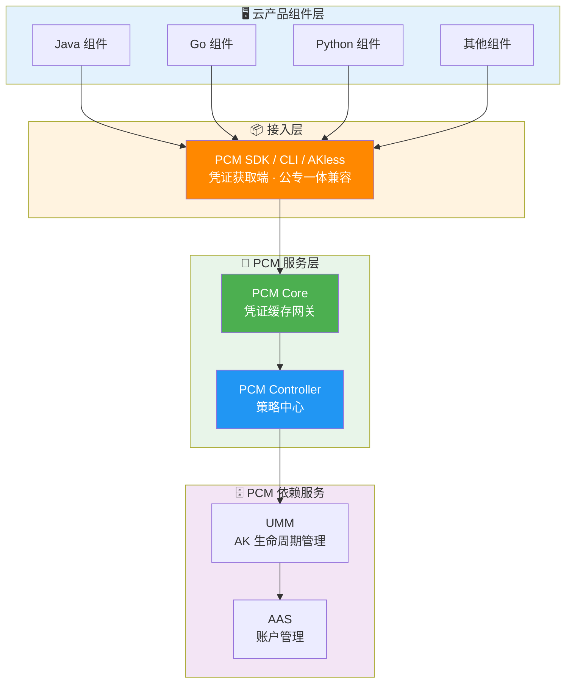
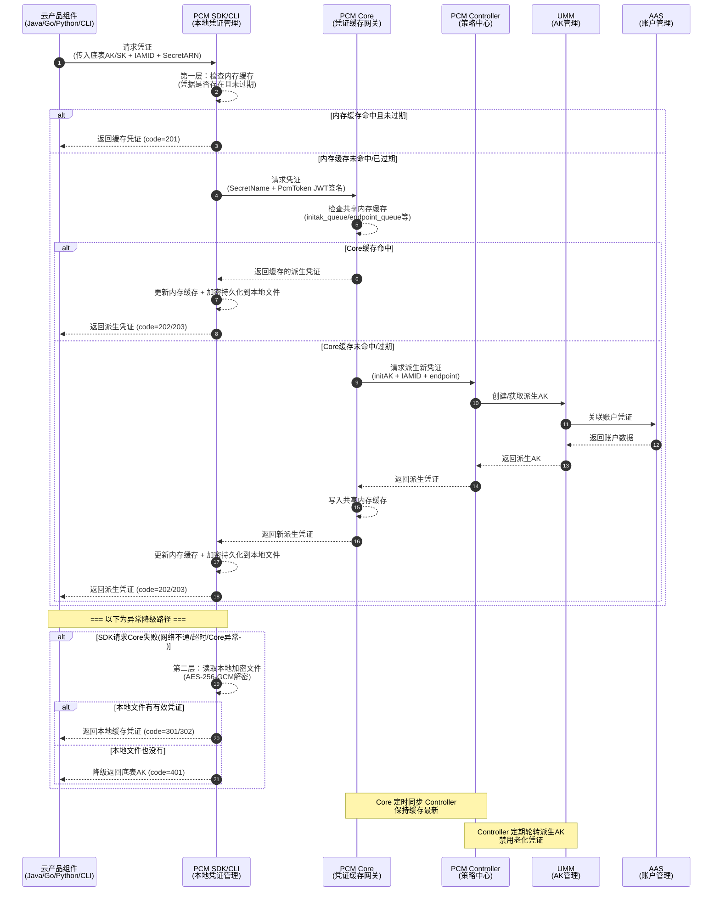

# 横向研发文档

**接入后对比示意图**

**调用 PCM 服务（获取派生 AK）架构**

**调用时序图**

## 高可用与容错降级机制

| 场景 | SDK 行为 | 业务影响 |
| --- | --- | --- |
| 新部署时 PCM Core 还未 ready | 将入参作为返回 | 无影响（Core 未禁用老 AK） |
| 运行时 PCM Core 挂了 | 返回上次获取的老凭证（未在窗口期末尾） | 无影响 |
| 产品独立升级，PCM 未 ready | 将入参作为返回 | 无影响 |
| PCM 和应用都挂了需重拉（SDK 缓存未丢失） | 返回上次获取的老凭证 | 无影响 |
| PCM 和应用都挂了需重拉（SDK 缓存丢失） | **需先恢复 PCM 或使用老凭证应急脚本** | **业务中断** |

## 产品对接方案细节

### 对接核心概念

| 概念 | 说明 |
| --- | --- |
| **底表 AK** | 通过全局变量方式声明、云平台初始化时自动创建的 AK |
| **IAMID** | 产品申请派生时身份标识：格式为 `${CLUSTERNAME}:<serverrole名称>`，PaaS 格式为 `{{ .Values.productName }}:{{ .Release.Name }}`（当前未强校验格式）。*注：若控制台提示认证状态失败，仅表示 IAMID 不规范，不会对申请结果产生实质影响。* |
| **secretARN** | 凭证目标资源标识，格式为 `apsara:pcm:akid:<accessKeyId>:dst_endpoint:<GatewayCode>:sk:<accessKeySecret>` |
| **GatewayCode** | 服务的认证网关 code，用于区分 AK 私用网关和标准 AK 认证网关（当前版本仅标准 AK 认证网关支持使用底表 AK） |
| **initAK** | 原始底表 AK，PCM 改造前应用直接使用的凭证 |

### 凭证生命周期与队列机制

PCM 接管底层分配的凭证，为对应凭证创建**主动过期的凭证队列**，并定期清洗禁用老化的派生凭证。

**队列基本概念**
底表在生成派生 AK 时，每个派生 AK 会关联一个派生 AK 队列。队列默认维持 7 把有效派生 AK，每把派生 AK 有效期 24 小时。因此，一把派生 AK 从创建到默认过期需要 7 天。

**队列级别**

| 级别 | 划分方式 | 说明 | 推荐程度 |
| --- | --- | --- | --- |
| initAK 级别（默认） | 一个底表 AK 对应一个派生 AK 队列，全局共享 | 默认配置，也是推荐的选择 | ✅ 推荐 |
| ClusterName 级别 | 按集群划分，同一集群内一个底表 AK 对应一个派生 AK 队列 | 多集群会为同一个底表 AK 创建多个队列，叠加后可能把 UMM 账户的 AK 上限打满 | ⚠️ 有风险，不推荐 |

> *注：不推荐 ClusterName 级别是因为 UMM AK 管理中每个账户（UID）对应的有效 AK 数量有上限（最大 1000 把）。按 ClusterName 级别，多集群叠加极易把账户的 AK 上限打满，导致派生失败。*

**队列轮转保护机制**
派生 AK 队列会持续轮转（定期创建新 AK、禁用老 AK），但在以下情况下会暂停轮转，以保护正在使用中的凭证：
1. **产品最新派生 AK 保护**：当要禁用队列里最早的 AK 时，系统会检查该 AK 是否是某个产品获取的最新派生 AK。如果是，队列停止轮转，直到后续其他产品都获取了更新的派生 AK。
2. **平台 AK 访问日志不可行（当前状态）**：当不可行时，PCM 无法确认即将禁用的派生 AK 是否仍有产品在调用，将在第一把队列即将禁用时停止轮转。
3. **平台 AK 访问日志保护（日志可信时）**：在准备禁用某把派生 AK 前，系统检查平台 AK 访问日志（用于检查底表 AK 和派生 AK 是否在网关中有调用记录）。如果日志显示还有产品在用，则停止轮转。

**控制台显示“轮转状态已停止”的常见原因**：
- IAMID 中包含 `CLOSE_AUTO_ROTATE` 状态，表示该队列默认不轮转。
- 使用该产品的队列中，有产品未及时更新（未获取最新派生 AK）。
- 使用该队列的产品中，有产品仍在使用第 7 把 AK（即触发了上述“最新派生 AK 保护”机制）。

### 管控模式与热升级兼容策略

**三种管控模式**

| 模式 | 含义 | 行为 | 适用场景 | 版本 |
| --- | --- | --- | --- | --- |
| **None（默认）** | 不受 PCM 管理 | AK 正常使用，PCM 不介入 | 尚未改造的存量凭证 | / |
| **CompatibilityMode（兼容模式）** | 部分完成改造 | 提供轮换能力，但不对旧 AK 禁用 | 改造中的过渡态 | v3182-2510 |
| **StrictMode（严格模式）** | 使用方改造完成 | 新部署严格托管；热升级/扩等场景自动降级为兼容模式 | 存量改造完成后的目标终态 | v3182-2515以后 |
| **initStrictMode（初始严格模式）** | 新建凭证即完成改造 | 任何场景都开启严格处理 | 新增收口凭证 | v320 |

**热升级兼容策略**
- **新部署项目**：根据 `restrict` 取值禁用原始通用能力，应用使用凭证进入定时轮换状态。
- **热升级项目**：原始凭证**不禁用**其通用能力，进入定时轮换状态；如需禁用老凭证，通过观测日志在运维控制台灰度进行。
- **非 PCM 托管凭证**：一切照旧；若使用了 PCM SDK/CLI 但未被托管，将入参 initAK 返回让应用接着使用。

### 组件职责与安全特性

**PCM Core（缓存中间网关）**
- **职责**：SDK 与 Controller 之间的访问中间网关，缓存 Controller 最新凭证数据，缓解 Controller 访问压力，提高 SDK 访问响应速度。
- **安全特性**：
  - **本地缓存 + 定时同步**：减少直接访问 Controller 的频率。
  - **缓存隔离**：缓存数据仅服务于已认证的 SDK 请求，不对外暴露。
  - **降级保护**：Core 宕机后，末期过期老凭证行为暂停，SDK 返回上次获得的老凭证依然可以使用。
  - **压力缓解**：避免所有 SDK 请求直接打到 Controller，防止策略大脑被击穿。

**PCM Controller（策略中心）**
- **职责**：PCM 凭证管控核心，执行凭证生命周期管理，提供 PKM 白屏管控、日志查询关联、状态管理能力。
- **安全特性**：
  - **凭证队列管理**：为每个被托管凭证创建主动过期的凭证队列，定期清洗禁用老化派生凭证。
  - **模式管控**：根据 `controlByPcm` 配置执行不同模式。
  - **松→紧变更不自动生效**：模式从松到紧变更时不自动生效，需 ASO 页面提示人工处理，防止误操作。
  - **灰度禁用**：支持热升级后以运维变更方式逐步禁用老凭证。
  - **白屏管控（PKM）**：提供可视化的凭证管理界面。
  - **日志查询关联**：关联 AK 使用记录，判断是否可以安全禁用。
  - **状态管理**：管理每个凭证的当前状态（轮换中/已禁用/正常等）。

**依赖服务**
- **UMM（AK 生命周期管理）**：负责 AK 的存储与生命周期管理，接收 Controller 指令执行凭证轮换和禁用操作。
- **AAS（账户管理服务）**：负责平台账户统一管理，与 UMM 联动形成账户-凭证关联关系。

### 控制台与凭证管理操作

**PCM 服务与控制台入口**
- **服务位置**：所属产品 `baseServiceAll`，部署集群 `StandardCloudCluster-A-xx`，所属 service `platform-credential-management`，核心组件为 `PCM Core` 和 `PCM Controller`。
- **控制台入口**：ASO -> 安全管理 -> 账户安全 -> 平台凭据管理 PCM。

**底表 AK 管理**
- 支持查询底表 AK 禁用状态、启用底表 AK。
- *注：控制台未提供白屏底表 AK 禁用能力，底表 AK 禁用需通过标准变更流程执行。*

**派生 AK 管理（手动创建临时 AK）**
- **适用场景**：当某个应用需要使用临时 AK 登录，或者使用的 initAK 被禁用时，可创建临时 AK 应急使用。
- **操作步骤**：
  1. 进入“派生 AK 管理”标签页，点击“创建临时 AK”按钮。
  2. 输入申请者、initAKID、有效天数、申请原因等信息。
  3. 创建成功后，**立即复制 AK 和 SK 保存**（SK 明文仅在成功弹窗内展示，关闭后系统不再显示，若不慎关闭需重新创建）。
- **核心参数说明**：
  - `initAKID`：托管到 PCM 的基线或底表 AK（必须与所使用账号的原始 AK 对应）。
  - `申请者 (IAMID)`：服务的身份标识，常规为 `集群:SR名称`（如 `StandardCloudCluster-A-xx:PcmController`）。若系统提示已存在，可在后缀拼接任意字符串。
  - `有效天数`：范围限制在 1~365 天。
  - `申请者类型`：分为 ApsaraStackProduct、Other。
  - `归属信息`：CloudID、ProductName、ClusterName、ServiceName 虽非必填，但建议准确填写以便追溯临时 AK 使用方。

## 产品对接范围

### 标准 AK 认证 vs AK 私用场景

| 类型 | 说明 |
| --- | --- |
| **标准 AK 认证** | AK 生命周期在 UMM 中保管，标准网关通过对接 UMM 进行 AK 签名校验（如 POP、OpenAPI、OSS）。当前访问标准 AK 认证服务的云产品均已适配完成。 |
| **AK 私用场景** | 服务不接或无法接 UMM，直接把 AK 参数记录到本地配置文件/数据库中，请求过来时用本地配置校验。当前访问 AK 私用服务的云产品尚未强制要求适配，已适配的产品通过 PCM 服务将兑换出原始底表 AK。 |

## 接入注意事项与潜在风险

在研发对接与架构设计阶段，需重点关注以下潜在风险与配置建议，以确保凭证管理的稳定性与业务连续性。

### 架构与部署风险

- **Core 限流基于 IP，存在误伤可能**：PCM Core 的限流策略基于客户端 IP。当同一台机器上运行多个产品组件时，一个高频产品的请求可能耗尽该 IP 的限流配额，导致同 IP 下其他产品被连带返回 502。研发在部署时需评估单机多组件的 QPS 叠加情况。
- **底表禁用后 PCM 可用性和禁用状态联动**：底表 AK 被 PCM 禁用后，产品的凭据供给完全依赖 PCM 链路（Core + Controller）。对于本地有缓存的运行中服务暂时无影响，但重启的服务如果此时 PCM 不可用，将拿不到任何有效凭据（底表已禁、派生获取失败、本地无缓存），导致业务直接中断。

### 业务与性能影响

- **链路增加延迟，对时间敏感业务有影响**：接入 PCM 后可能导致部分时间敏感服务延迟加大，且网络可能出现延迟。
  - **超时策略配置**：对于时间敏感服务，SDK 增加了超时策略。支持通过 `PCM_TASK_DELAY` 环境变量设置访问 PCM 的最大超时时间（单位：ms）。默认 1000ms（即 1s）。研发可根据业务容忍度进行调整（需使用 1.13-SNAPSHOT / 20250908 及以上版本 SDK）。
- **无服务端时 SDK 频繁调用产生大量日志**：当环境中 PCM 服务（Core）未部署或不可达时，SDK 无法生成缓存，仍会按配置的间隔持续尝试连接，每次失败产生 WARN 级别日志。如果调用非常频繁，可能产生大量错误日志，研发需做好日志监控与过滤。

### 接入模式与 SDK 版本要求

- **半轮转模式首次获取失败导致后续持续异常**：部分产品采用半自动轮转模式（仅在启动时获取一次派生 AK，后续不再主动刷新）。如果该唯一一次获取请求恰好失败（如 Core 限流、网络抖动、服务未就绪），产品将持续使用底表 AK 或无有效凭据运行，且不会自动恢复。建议研发优先采用持续轮转模式。
- **部分 SDK 未打印关键日志，排查困难**：部分产品因 Java WARN 日志过多而屏蔽了报错日志，导致无请求 PCM 的 RequestID 等关键信息，增加排查难度。建议研发在日志配置中保留 PCM 相关的核心错误日志。
- **已知问题已修复但环境中存量版本旧**：研发在对接时需确保使用修复了已知问题的 SDK 版本，避免引入存量 Bug：
  - **CLI 服务端返回异常不降级（ResponseParseFailure）**：需使用 **2025-12-23 更新**及以上版本，否则 CLI 直接不可用。
  - **Java SDK 线程阻塞（/dev/random 熵值问题）**：需使用 `credprovider.plugin >= 1.0.8`，否则系统熵值低时应用线程会卡死。
  - **Go SDK 日志文件不轮转**：需使用修复该问题的版本。

## 日志排查与应急支持

### 日志查询说明

- **AK 申请日志**：记录每个 IAMID 申请派生 AK 的记录。通过 pcm-core 获取，针对每个 IAMID 的底表 secretARN 缓存时间为 12 小时。对于持续使用派生 AK 的产品，理论上每 12 小时会有一条申请记录。
- **平台 AK 访问日志**：在网关侧记录底表 AK 的使用情况（当前数据可能不完整，可作为辅助查询手段）。

### PCM Core 日志排查指南

**注意事项**：PCM 部署在两个 Docker 容器上，日志排查需**同时查询两个 Docker** 的日志。

- **排查 Error 日志（确定是否 pcm-core 报错返回）**
  - 有具体 RequestID：
    `grep -rn "<requestid>" /opt/tengine/logs/error.<date>.log`
  - 无具体 RequestID（根据 akid、iamid 和时间段复合筛选）：
    `grep "<akid>" /opt/tengine/logs/error.<date>.log | grep "<iamid>" | awk '$1 >= "<start_time>" && $2 <= "<end_time>"'`

- **排查 Access 日志（确定是否 pcm-core 接收到请求）**
  - 有具体 RequestID：
    `grep -rn "<requestid>" /opt/tengine/logs/access.<date>.log`
  - 无具体 RequestID（根据 akid 和时间段复合筛选）：
    `grep "<akid>" /opt/tengine/logs/access.<date>.log | grep -E '"time_local": "<time_range>"'`

**Access 日志核心参数说明**

| 参数名称 | 参数含义 |
| --- | --- |
| remote_addr | 请求源地址 |
| Gateway-POP-Tunnel-ID | tunnel-id |
| X-Aliyun-Vpc-Id | vpc-id |
| remote_port | 请求端口 |
| time_local | 请求完成的时间 |
| request_uri | 请求的 uri，包含 iamid、secretname、endpoint 等信息 |
| request_method | 请求方法 |
| status | http 返回码 |
| http_user_agent | 请求代理客户端信息 |
| request_time | tengine 收到请求到发完响应的总耗时 |
| SecretName | secretname，包含 initakid 和 pcm_endpoint 信息 |
| IamId | 表示请求服务身份，对应 sdk 填写的 appname（当 http 报错时可能为空） |
| x_acs_bearer_token | 请求发送 jwt |
| x_sdk_client | pcm-sdk 版本 |
| limit_req_status | 限流状态，未限流显示 "PASSED"，限流显示 "-" |
| eagleeye_traceid | 即 requestid，可根据此查询对应 error_log 是否有错误日志 |

### 应急与常见问题支持

- **常见问题排查**：参考 [《PCM排查思路&常见问题》](https://alidocs.dingtalk.com/i/nodes/m9bN7RYPWdyrPBREckdQ5joEVZd1wyK0)
- **应急处置**：参考 [《PCM应急处置》](https://alidocs.dingtalk.com/i/nodes/MNDoBb60VLYDGNPytBomBqkPJlemrZQ3)