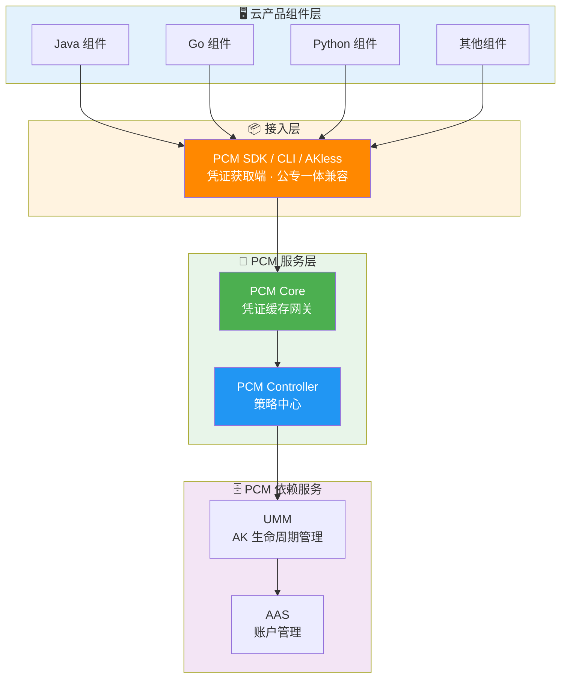
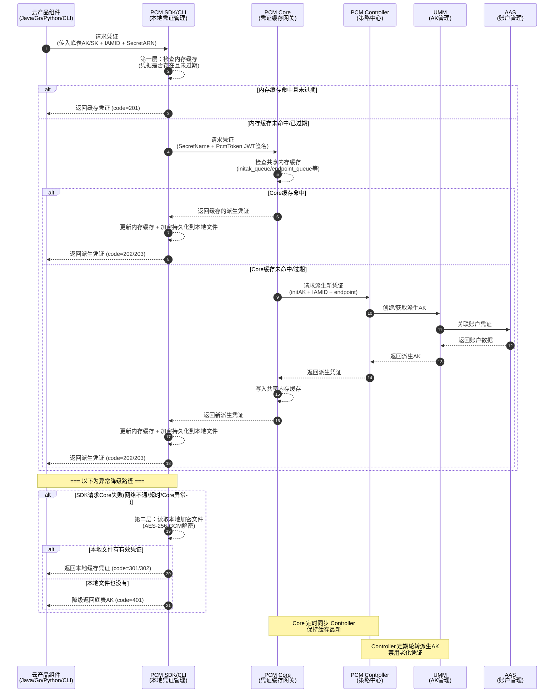

# 横向研发文档

云产品应用通过 PCM SDK / CLI / AKless 接入，直接与 PCM 服务交互获取新凭证。

**安全与容错特性**：
- **多级缓存**：在本地内存、磁盘均有缓存。
- **容错降级**：PCM 初始化服务异常或报错时，将入参作为凭证返回；如果有缓存，将返回最近一次从服务端获取的凭证。

## 接入后架构与调用关系

**接入后对比示意图**


**调用 PCM 服务（获取派生 AK）架构**



**调用时序图**



## 高可用与容错降级机制

| 场景 | SDK 行为 | 业务影响 |
| --- | --- | --- |
| 新部署时 PCM Core 还未 ready | 将入参作为返回 | 无影响（Core 未禁用老 AK） |
| 运行时 PCM Core 挂了 | 返回上次获取的老凭证（未在窗口期末尾） | 无影响 |
| 产品独立升级，PCM 未 ready | 将入参作为返回 | 无影响 |
| PCM 和应用都挂了需重拉（SDK 缓存未丢失） | 返回上次获取的老凭证 | 无影响 |
| PCM 和应用都挂了需重拉（SDK 缓存丢失） | **需先恢复 PCM 或使用老凭证应急脚本** | **业务中断** |

## 产品对接方案细节

### 对接核心概念

| 概念 | 说明 |
| --- | --- |
| **底表 AK** | 通过全局变量方式声明、云平台初始化时自动创建的 AK |
| **IAMID** | 产品申请派生时身份标识：格式为 `${CLUSTERNAME}:<serverrole名称>`，PaaS 格式为 `{{ .Values.productName }}:{{ .Release.Name }}`（当前未强校验格式） |
| **secretARN** | 凭证目标资源标识，格式为 `apsara:pcm:akid:<accessKeyId>:dst_endpoint:<GatewayCode>:sk:<accessKeySecret>` |
| **GatewayCode** | 服务的认证网关 code，用于区分 AK 私用网关和标准 AK 认证网关（当前版本仅标准 AK 认证网关支持使用底表 AK） |
| **initAK** | 原始底表 AK，PCM 改造前应用直接使用的凭证 |

### 凭证生命周期与队列机制

PCM 接管底层分配的凭证，为对应凭证创建**主动过期的凭证队列**，并定期清洗禁用老化的派生凭证。

**队列基本概念**
底表在生成派生 AK 时，每个派生 AK 会关联一个派生 AK 队列。队列默认维持 7 把有效派生 AK，每把派生 AK 有效期 24 小时。因此，一把派生 AK 从创建到默认过期需要 7 天。

**队列级别**

| 级别 | 划分方式 | 说明 | 推荐程度 |
| --- | --- | --- | --- |
| initAK 级别（默认） | 一个底表 AK 对应一个派生 AK 队列，全局共享 | 默认配置，也是推荐的选择 | ✅ 推荐 |
| ClusterName 级别 | 按集群划分，同一集群内一个底表 AK 对应一个派生 AK 队列 | 多集群会为同一个底表 AK 创建多个队列，叠加后可能把 UMM 账户的 AK 上限打满 | ⚠️ 有风险，不推荐 |

> *注：不推荐 ClusterName 级别是因为 UMM AK 管理中每个账户（UID）对应的有效 AK 数量有上限（最大 1000 把）。按 ClusterName 级别，多集群叠加极易把账户的 AK 上限打满，导致派生失败。*

**队列轮转保护机制**
派生 AK 队列会持续轮转（定期创建新 AK、禁用老 AK），但在以下情况下会暂停轮转，以保护正在使用中的凭证：
1. **产品最新派生 AK 保护**：当要禁用队列里最早的 AK 时，系统会检查该 AK 是否是某个产品获取的最新派生 AK。如果是，队列停止轮转，直到后续其他产品都获取了更新的派生 AK。
2. **平台 AK 访问日志不可行（当前状态）**：当不可行时，PCM 无法确认即将禁用的派生 AK 是否仍有产品在调用，将在第一把队列即将禁用时停止轮转。
3. **平台 AK 访问日志保护（日志可信时）**：在准备禁用某把派生 AK 前，系统检查平台 AK 访问日志（用于检查底表 AK 和派生 AK 是否在网关中有调用记录）。如果日志显示还有产品在用，则停止轮转。

### 管控模式与热升级兼容策略

**三种管控模式**

| 模式 | 含义 | 行为 | 适用场景 | 版本 |
| --- | --- | --- | --- | --- |
| **None（默认）** | 不受 PCM 管理 | AK 正常使用，PCM 不介入 | 尚未改造的存量凭证 | / |
| **CompatibilityMode（兼容模式）** | 部分完成改造 | 提供轮换能力，但不对旧 AK 禁用 | 改造中的过渡态 | v3182-2510 |
| **StrictMode（严格模式）** | 使用方改造完成 | 新部署严格托管；热升级/扩等场景自动降级为兼容模式 | 存量改造完成后的目标终态 | v3182-2515以后 |
| **initStrictMode（初始严格模式）** | 新建凭证即完成改造 | 任何场景都开启严格处理 | 新增收口凭证 | v320 |

**热升级兼容策略**
- **新部署项目**：根据 `restrict` 取值禁用原始通用能力，应用使用凭证进入定时轮换状态。
- **热升级项目**：原始凭证**不禁用**其通用能力，进入定时轮换状态；如需禁用老凭证，通过观测日志在运维控制台灰度进行。
- **非 PCM 托管凭证**：一切照旧；若使用了 PCM SDK/CLI 但未被托管，将入参 initAK 返回让应用接着使用。

### 组件职责与安全特性

**PCM Core（缓存中间网关）**
- **职责**：SDK 与 Controller 之间的访问中间网关，缓存 Controller 最新凭证数据，缓解 Controller 访问压力，提高 SDK 访问响应速度。
- **安全特性**：
  - **本地缓存 + 定时同步**：减少直接访问 Controller 的频率。
  - **缓存隔离**：缓存数据仅服务于已认证的 SDK 请求，不对外暴露。
  - **降级保护**：Core 宕机后，末期过期老凭证行为暂停，SDK 返回上次获得的老凭证依然可以使用。
  - **压力缓解**：避免所有 SDK 请求直接打到 Controller，防止策略大脑被击穿。

**PCM Controller（策略中心）**
- **职责**：PCM 凭证管控核心，执行凭证生命周期管理，提供 PKM 白屏管控、日志查询关联、状态管理能力。
- **安全特性**：
  - **凭证队列管理**：为每个被托管凭证创建主动过期的凭证队列，定期清洗禁用老化派生凭证。
  - **模式管控**：根据 `controlByPcm` 配置执行不同模式。
  - **松→紧变更不自动生效**：模式从松到紧变更时不自动生效，需 ASO 页面提示人工处理，防止误操作。
  - **灰度禁用**：支持热升级后以运维变更方式逐步禁用老凭证。
  - **白屏管控（PKM）**：提供可视化的凭证管理界面。
  - **日志查询关联**：关联 AK 使用记录，判断是否可以安全禁用。
  - **状态管理**：管理每个凭证的当前状态（轮换中/已禁用/正常等）。

**依赖服务**
- **UMM（AK 生命周期管理）**：负责 AK 的存储与生命周期管理，接收 Controller 指令执行凭证轮换和禁用操作。
- **AAS（账户管理服务）**：负责平台账户统一管理，与 UMM 联动形成账户-凭证关联关系。

## 产品对接范围

### 标准 AK 认证 vs AK 私用场景

| 类型 | 说明 |
| --- | --- |
| **标准 AK 认证** | AK 生命周期在 UMM 中保管，标准网关通过对接 UMM 进行 AK 签名校验（如 POP、OpenAPI、OSS）。当前访问标准 AK 认证服务的云产品均已适配完成。 |
| **AK 私用场景** | 服务不接或无法接 UMM，直接把 AK 参数记录到本地配置文件/数据库中，请求过来时用本地配置校验。当前访问 AK 私用服务的云产品尚未强制要求适配，已适配的产品通过 PCM 服务将兑换出原始底表 AK。 |

## 接入注意事项与潜在风险

在研发对接与架构设计阶段，需重点关注以下潜在风险与配置建议，以确保凭证管理的稳定性与业务连续性。

### 架构与部署风险

- **Core 限流基于 IP，存在误伤可能**：PCM Core 的限流策略基于客户端 IP。当同一台机器上运行多个产品组件时，一个高频产品的请求可能耗尽该 IP 的限流配额，导致同 IP 下其他产品被连带返回 502。研发在部署时需评估单机多组件的 QPS 叠加情况。
- **底表禁用后 PCM 可用性和禁用状态联动**：底表 AK 被 PCM 禁用后，产品的凭据供给完全依赖 PCM 链路（Core + Controller）。对于本地有缓存的运行中服务暂时无影响，但重启的服务如果此时 PCM 不可用，将拿不到任何有效凭据（底表已禁、派生获取失败、本地无缓存），导致业务直接中断。

### 业务与性能影响

- **链路增加延迟，对时间敏感业务有影响**：接入 PCM 后可能导致部分时间敏感服务延迟加大，且网络可能出现延迟。
  - **超时策略配置**：对于时间敏感服务，SDK 增加了超时策略。支持通过 `PCM_TASK_DELAY` 环境变量设置访问 PCM 的最大超时时间（单位：ms）。默认 1000ms（即 1s）。研发可根据业务容忍度进行调整（需使用 1.13-SNAPSHOT / 20250908 及以上版本 SDK）。
- **无服务端时 SDK 频繁调用产生大量日志**：当环境中 PCM 服务（Core）未部署或不可达时，SDK 无法生成缓存，仍会按配置的间隔持续尝试连接，每次失败产生 WARN 级别日志。如果调用非常频繁，可能产生大量错误日志，研发需做好日志监控与过滤。

### 接入模式与 SDK 版本要求

- **半轮转模式首次获取失败导致后续持续异常**：部分产品采用半自动轮转模式（仅在启动时获取一次派生 AK，后续不再主动刷新）。如果该唯一一次获取请求恰好失败（如 Core 限流、网络抖动、服务未就绪），产品将持续使用底表 AK 或无有效凭据运行，且不会自动恢复。建议研发优先采用持续轮转模式。
- **部分 SDK 未打印关键日志，排查困难**：部分产品因 Java WARN 日志过多而屏蔽了报错日志，导致无请求 PCM 的 RequestID 等关键信息，增加排查难度。建议研发在日志配置中保留 PCM 相关的核心错误日志。
- **已知问题已修复但环境中存量版本旧**：研发在对接时需确保使用修复了已知问题的 SDK 版本，避免引入存量 Bug：
  - **CLI 服务端返回异常不降级（ResponseParseFailure）**：需使用 **2025-12-23 更新**及以上版本，否则 CLI 直接不可用。
  - **Java SDK 线程阻塞（/dev/random 熵值问题）**：需使用 `credprovider.plugin >= 1.0.8`，否则系统熵值低时应用线程会卡死。
  - **Go SDK 日志文件不轮转**：需使用修复该问题的最新版本。

## 常见网关拦截日志排查指引

当遇到访问报错，怀疑是 PCM 禁用 AK 导致时，优先通过拦截日志判定。提取日志中的请求 AK，并通过 PCM 服务查询 AK 状态，如果已经禁用，采用应急处置方案进行处置，并反馈研发侧排查原因。

以下是常见网关 AK 被禁用时的拦截日志特征及示例：

### OSS 拦截

**特征**：
- `"error_code": "InvalidAccessKeyId"`
- `"status": "403"`

**日志示例**：
```json
{"__tag__:__hostname__": "c25g07018.cloud.g07.amtest17", "__tag__:__pack_id__": "B06A0AF67C8DC2DB-1EF", "__tag__:__path__": "/apsara/module_logs/oss_tengine/access_log.2026042415", "__topic__": "", "acc_src_oms_region": "-", "access_id": "5hN1RkUhRn43iNfw", "bucket_enable": "-", "bucket_storage_type": "standard", "bucket_version": "1774332774", "bucketname": "cn-wulan-env17e-d01-as-console-cdn", "content_length_in": "-", "content_length_out": "476", "delta": "-", "error_code": "InvalidAccessKeyId", "host": "cn-wulan-env17e-d01-as-console-cdn.oss-cn-wulan-env17e-d01-a.intra.env17e.shuguang.com", "http_referer": "-", "in_length": "335", "ip": "10.17.46.36", "length": "476", "method": "GET", "objectname": "-", "objectsize": "-", "operation": "GetBucketAcl", "oss_acc_linetype": "-", "oss_data_location": "-", "oss_location": "oss-cn-wulan-env17e-d01-a", "oss_request_type": "-", "owner": "999999999", "process_type": "-", "ref_url": "aliyun-sdk-java/3.8.0(Linux/4.19.91-007.ali4000.alios7.x86_64/amd64;1.8.0_172)", "remote_port": "58066", "remote_user": "-", "request_id": "69EB1A0A3E6DA93539F3A4CE", "request_payer_account": "-", "requester": "-", "response_time": "0", "scheme": "http", "select_real_ip": "-", "sign_type": "-", "status": "403", "sync_direction": "-", "sync_source_bucket": "-", "sync_transfer_type": "-", "target_object_storage_class": "-", "time": "24/Apr/2026:15:21:46", "turn_around_time": "0", "url": "/?acl", "vpcaddr": "978325770", "vpcid": "0"}
```

### SLS_INNER

**日志示例**：
```json
{"APIVersion": "0.6.0", "AccessKeyId": "cmchJQg057pBelHD", "Acl": "0", "AliUid": "", "CallerType": "Parent", "ClientIP": "10.17.160.103", "ConsumerGroup": "suspicous_group", "ExOutFlow": "0", "InFlow": "0", "Latency": "292", "Lines": "0", "LogStore": "big_data_event", "Method": "GetConsumerGroupCheckPoint", "NetFlow": "0", "OutFlow": "88", "ProjectId": "136", "ProjectName": "k8sblink", "RequestId": "69EB0C444B76F491098A2F35", "Source": "10.17.160.103", "Status": "401", "TunnelId": "0", "UserAgent": "aliyun-log-sdk-java-0.6.64/1.8.0_412", "UserId": "-2", "__THREAD__": "2418", "__tag__:__hostname__": "c25h05123.cloud.h06.amtest17", "__tag__:__pack_id__": "8ADDDFFBE647F7C-5", "__tag__:__path__": "/apsara/fcgi_agent/ols_operation_2.LOG", "__topic__": "", "microtime": "1777011780130296"}
```

### SLS_PUB

**日志示例**：
```json
{"__THREAD__": "80679", "Method": "ListShards", "Status": "401", "ClientIP": "10.17.31.30", "Latency": "70", "TunnelId": "", "NetFlow": "0", "UserId": "-2", "AliUid": "", "Acl": "0", "AccessKeyId": "Khz7a1kmKMZDCBXj", "Owner": "1000000004", "CallerType": "Parent", "ProjectName": "ali-cdsslshybridcluster-a-20260323-015f-sls-admin", "ProjectId": "2", "UserAgent": "aliyun-log-sdk-java-0.6.64/1.8.0_352", "APIVersion": "0.6.0", "RequestId": "69D6169B34510383396636E7", "Source": "10.17.31.30", "OutFlow": "87", "ExOutFlow": "0", "NetworkType": "intranet", "InFlow": "0", "LogStore": "sls_operation_agg_log", "RequestType": "unknown", "ErrorCode": "Unauthorized", "ErrorMsg": "AccessKeyId is disabled: Khz7a1kmKMZDCBXj", "microtime": "1775638171568514", "__topic__": "", "__tag__:__hostname__": "c25g09017.cloud.g09.amtest17", "__tag__:__path__": "/apsara/sls/fcgi_agent/ols_operation.LOG", "__tag__:__pack_id__": "6C68CE91F5F727CA-12A"}
```

### ASAPI

**日志示例**：
```json
{"EagleeyeRpcId": "0.1.1", "EagleeyeTraceId": "0a11243f17770122001463084d0062", "LocalIp": "10.17.36.63", "__tag__:__hostname__": "vm010017036063", "__tag__:__pack_id__": "890EE1DC2FE689D1-774", "__tag__:__path__": "/apsara/cloud/data/asapi/ApiServer#/api-server/logs/asapi-logger/audit.log", "__topic__": "", "accessKeyId": "VidKjhddRaas4tMA", "apiId": "", "apiName": "ListAllLevel1Orgs", "apiVersion": "2019-05-10", "app": "api-server", "asapiHandleTime": "2026-04-24T06:30:00Z", "callerIp": "10.17.32.38", "callerRequestTime": "2026-04-24T06:30:00Z", "callerSource": "aso-ecsops", "category": "PassThrough", "cost": "148ms", "costMs": "148", "doForward": "", "domain": "internal.asapi.cn-wulan-env17e-d01.intra.env17e.shuguang.com", "endTime": "1777012200296", "errorCode": "asapi.server.request.parameter.accesskeyid.error", "errorMessage": "The specified AccessKey ID (VidKjhddRaas4tMA) is invalid. Details: (The Access Key is disabled.).", "errorSuggestion": "Check whether the AccessKey pair exists and is enabled.", "errorTitle": "The AccessKey pair in the request is invalid.", "errorType": "Business", "headers": "{\"x-acs-caller-sdk-language\":\"java\",\"x-acs-caller-sdk-version\":\"1.0.7.3-RELEASE\",\"User-Agent\":\"AlibabaCloud (Linux; amd64) Java/1.8.0_412-b0 Core/1.0.7.3-RELEASE\",\"Host\":\"internal.asapi.cn-wulan-env17e-d01.intra.env17e.shuguang.com\",\"Accept-Encoding\":\"gzip,deflate\",\"X-Tunnel-Id\":\"0\",\"x-acs-caller-sdk-source\":\"aso-ecsops\",\"x-acs-caller-ip\":\"10.17.32.38\",\"Version\":\"2019-05-10\",\"Signature\":\"yYR8ABsJ0HdFvrIP+cR+3aMhh2pIgA3Pdxjt1kTrBYU=\",\"X-Forwarded-For\":\"10.17.32.38\",\"request-source-domain\":\"internal.asapi.cn-wulan-env17e-d01.intra.env17e.shuguang.com\",\"request-source-type\":\"internal\",\"Content-Length\":\"284\",\"x-acs-content-sha256\":\"9f65af4562de665feb8671613e202f7657ed96edcdc13ca89bba634602a467a6\",\"eagleeye-rpcid\":\"0.1\",\"X-Real-IP\":\"10.17.32.38\",\"Content-Type\":\"application/json; charset=UTF-8\"}", "httpCode": "0", "httpMethod": "POST", "isPublic": "true", "language": "-", "message": "Failed to invoke ListAllLevel1Orgs/2019-05-10/ascm ", "organizationId": "1", "organizationTreeParse": "0.1.", "parameters": "{\"SignatureVersion\":\"2.1\",\"Action\":\"ListAllLevel1Orgs\",\"SignatureNonce\":\"9ad7af25-91d9-4bbd-af00-b49a1b715fc9\",\"Version\":\"2019-05-10\",\"AccessKeyId\":\"VidKjhddRaas4tMA\",\"Product\":\"ascm\",\"SignatureMethod\":\"HMAC-SHA256\",\"RegionId\":\"cn-wulan-env17e-d01\",\"Timestamp\":\"2026-04-24T06:30:00Z\"}", "passthroughMode": "", "productName": "ascm", "realIp": "10.17.32.38", "regionId": "cn-wulan-env17e-d01", "requestId": "0a11243f17770122001463084d0062", "requestSourceDomain": "internal.asapi.cn-wulan-env17e-d01.intra.env17e.shuguang.com", "response": "{\"openapiFullResult\":{\"data\":{\"eagleEyeTraceId\":\"0a11243f17770122001463084d0062\",\"asapiSuccess\":false,\"product\":\"ascm\",\"code\":\"asapi.server.request.parameter.accesskeyid.error\",\"cost\":0,\"errorType\":\"Business\",\"dynamicMessages\":[\"VidKjhddRaas4tMA\",\"The Access Key is disabled.\"],\"suggestion\":\"Check whether the AccessKey pair exists and is enabled.\",\"errorCode\":\"asapi.server.request.parameter.accesskeyid.error\",\"asapiVersion\":\"v4\",\"message\":\"The specified AccessKey ID (VidKjhddRaas4tMA) is invalid. Details: (The Access Key is disabled.).\",\"extInfo\":{\"exArgs\":[\"VidKjhddRaas4tMA\",\"The Access Key is disabled.\"]},\"serverRole\":\"asapi.ApiServer#\",\"asapiRequestId\":\"0a11243f17770122001463084d0062\",\"innerCall\":true,\"success\":false,\"domain\":\"internal.asapi.cn-wulan-env17e-d01.intra.env17e.shuguang.com\",\"asapiErrorMessage\":\"The AccessKey pair in the request is invalid.\",\"diagnose\":\"\",\"api\":\"ascm:ListAllLevel1Orgs:2019-05-10\",\"asapiErrorCode\":\"asapi.server.request.parameter.accesskeyid.error\"},\"success\":false,\"host\":\"internal.asapi.cn-wulan-env17e-d01.intra.env17e.shuguang.com\",\"asapiRequestId\":\"0a11243f17770122001463084d0062\",\"status\":500}}", "roleId": "", "serverRole": "asapi.ApiServer#", "sourceIp": "10.17.32.38", "starTime": "1777012200148", "status": "failed", "time": "2026-04-24 14:30:00:296", "userName": "NotAscmUser"}
```

### KMS

**日志示例**：
```json
{"URL": "ListKeys", "__FILE__": "logger.(*LoggerWrapper).Infof.func1", "__LEVEL__": "INFO", "__tag__:__hostname__": "c25h09107.cloud.h10.amtest17", "__tag__:__pack_id__": "328CDB3A9762DD42-BD9F", "__tag__:__path__": "/cloud/log/kms/KmsHost#/kms_host/audit.log", "__topic__": "", "accessroot": "1000000056", "accessuid": "1000000056", "action_trail": "{\"event_source\":\"kms-intranet.cn-wulan-env17e-d01.intra.env17e.shuguang.com\",\"useragent\":\"Python-urllib/3.6\",\"accesskeyid\":\"bpzC7chEgkHAFlsn\",\"callertype\":\"customer\",\"calleruid\":\"1000000056\",\"ip\":\"10.17.4.31\"}", "alias_name": "", "api_name": "ListKeys", "api_version": "2016-01-20", "cluster": "KmsCluster-A-20260323-018b", "cmkid": "", "cost": "7", "dest_alias_name": "", "dest_cmkid": "", "dest_encrypt_context": "", "dest_key_state": "", "dest_keyowner": "", "domain_id": "", "domain_type": "Intranet", "duration": "7678", "encrypt_context": "", "error_code": "Forbidden.AccessKey", "error_message": "This AccessKey is not enabled.", "expected_code": "403", "failed_status_code": "4XX", "host": "c25h09107.cloud.h10.amtest17", "host_0": "c25h09107.cloud.h10.amtest17", "initiatior_ip": "10.17.1.1", "ip": "10.17.4.31", "key_state": "", "keyowner": "", "log_type": "opr_log", "microtime": "1777017038585372", "protocol_version": "Ipv4", "protocol_vpc_id": "", "region_id": "cn-wulan-env17e-d01", "request": "{\"PageNumber\":\"1\",\"PageSize\":\"100\"}", "request_id": "0efdb6f6-ae55-445e-b1e9-f514351d287b", "response": "", "role": "customer", "server_type": "Nginx", "serverrole": "kms.KmsHost#", "status_code": "403", "tengine_conn_id": "681701", "tengine_tunnel_id": "0", "tls_cipher_suite": "ECDHE-RSA-AES128-GCM-SHA256", "tls_version": "TLSv1.2", "user_bid": "26842", "user_player": "", "user_type": "customer", "utc_time": "2026-04-24T07:50:38Z"}
```

### ODPS

**日志示例**：
```json
{"__tag__:__hostname__": "vm010017037223", "__tag__:__pack_id__": "C36006E9E9CCCA0B-26F", "__tag__:__path__": "/cloud/log/odps-service-frontend/FrontendServer#/frontend_server/tengine/logs/aggregated_log.log", "__topic__": "", "count": "2", "execution_end_time": "2026-04-24T06:37:03.348203", "execution_start_time": "2026-04-24T06:37:01.586769", "log_earliest_time": "2026-04-24T06:35:00+08:00", "log_latest_time": "2026-04-24T06:35:00+08:00", "metadata": "{\"access_id\":\"fXWvhmRkMeER5QI6\",\"network_client_ip\":\"10.17.37.83\",\"vpc_id\":\"0\"}", "requests": "{\"url\":[\"/api/logview/host?curr_project=admin_task_project\",\"/api/projects?expectmarker=true&curr_project=admin_task_project\"]}"}
```