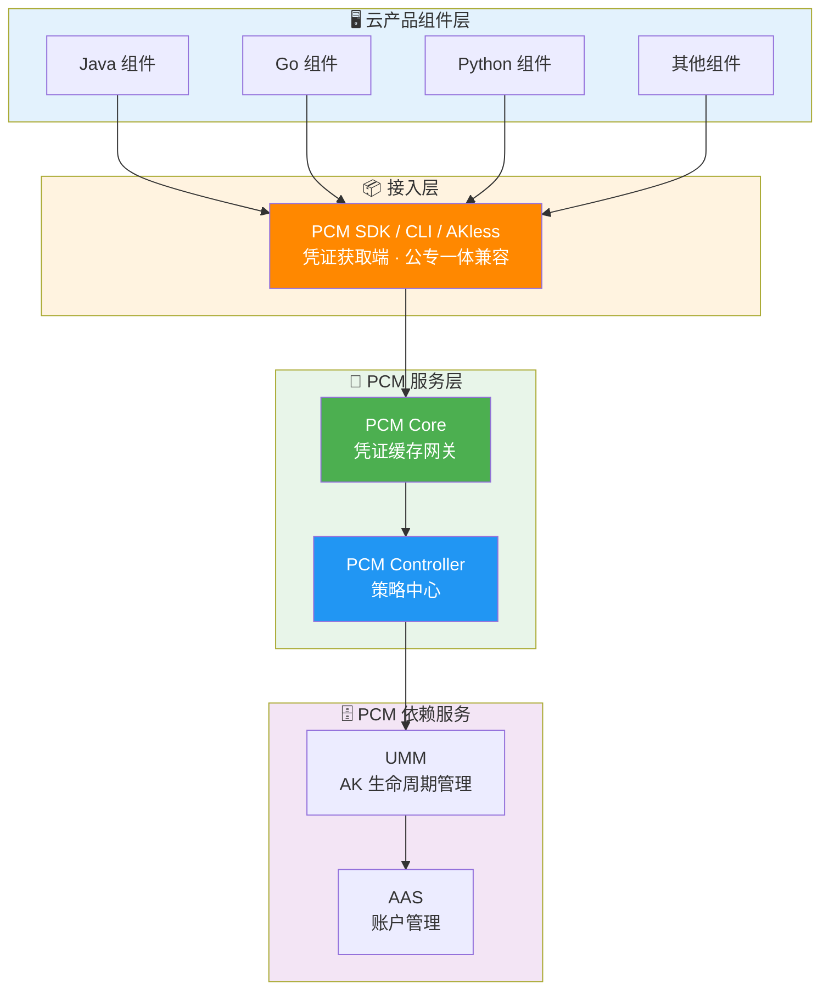
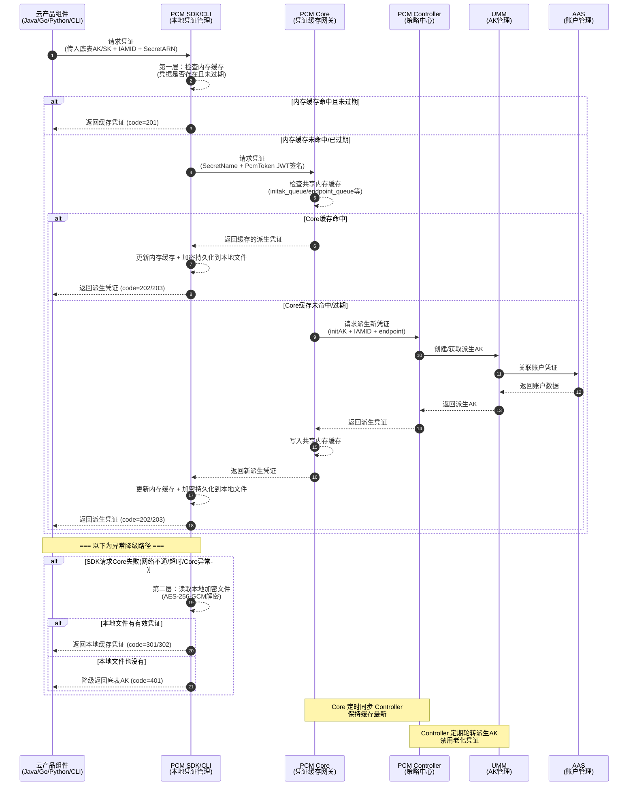

# 横向研发文档

### 接入方式
云产品应用（Java、Go、Python 等组件）通过集成 **PCM SDK / CLI / AKless** 凭证获取端接入[[PCM/平台凭证管理服务/index|平台凭证管理服务]]（PCM）。接入后，应用不再直接使用原始底表 AK，而是通过 SDK 向 PCM 服务请求动态轮换的派生 AK。

### 异常排查与处置指引
当业务系统或网关遇到访问报错，怀疑是由于 PCM 禁用 AK 导致时，请按照以下指引进行排查与处置：
1. **日志判定**：优先查看对应网关的拦截日志，提取日志中的请求 AK（AccessKeyId）。
2. **状态查询**：通过 PCM 服务查询提取到的 AK 当前状态。
3. **应急处置**：若查询确认该 AK 已被禁用，请立即采用应急处置方案进行恢复或业务降级处理。
4. **原因排查**：处置完成后，将问题反馈至研发侧，排查 AK 被禁用的具体原因。

### 网关日志查询工具接入
1. **获取工具**：获取网关日志查询 CLI 工具及源码。
2. **环境准备**：将工具上传至 OPS1 服务运行，或部署在可以解析 `slsinner` 的网络环境中。
3. **配置说明**：在工具同级目录下创建配置文件，完成以下核心配置：
   - **SLS 访问凭证**：此处未自动适配 PCM 轮转，需直接填写 PCM 轮转后的派生 AK（通过 PCM 控制台手动获取）。包括 `sls` 和 `defaultUser` 的 `access_key_id` 与 `access_key_secret`。
   - **Endpoint 配置**：配置 `inner_endpoint` (slsinner) 和 `pub_endpoint` (slspub)。
   - **扫描与输出配置**：设置扫描周期（`hours_back`）、分页大小（`page_size`）、并发数（`max_workers`）以及输出路径和格式（支持 print, json, csv, all）。

### 底表 AK 黑屏操作工具接入
1. **获取源码**：获取底表 AK 黑屏操作的 Python 脚本源码。
2. **环境依赖**：确保运行环境安装了 `requests` 等基础 Python 依赖库。
3. **环境变量配置**：在运行环境中配置以下关键环境变量，用于接口请求与签名：
   - `pcm_ctrl_domain`：PCM Controller 服务的域名或 IP。
   - `pcm_rs`：用于生成请求签名的密钥。

## 管控模式与兼容策略

### 管控模式选择
在接入和改造过程中，需根据产品的改造进度选择合适的管控模式：

| 模式 | 含义 | 行为 | 适用场景 | 版本 |
| --- | --- | --- | --- | --- |
| **None（默认）** | 不受 PCM 管理 | AK 正常使用，PCM 不介入 | 尚未改造的存量凭证 | / |
| **CompatibilityMode（兼容模式）** | 部分完成改造 | 提供轮换能力，但不对旧 AK 禁用 | 改造中的过渡态 | v3182-2510 |
| **StrictMode（严格模式）** | 使用方改造完成 | 新部署严格托管；热升级/扩等场景自动降级为兼容模式 | 存量改造完成后的目标终态 | v3182-2515以后 |
| **initStrictMode（初始严格模式）** | 新建凭证即完成改造 | 任何场景都开启严格处理 | 新增收口凭证 | v320 |

### 热升级兼容策略
* **新部署项目**：根据 `restrict` 取值禁用原始通用能力，应用使用凭证进入定时轮换状态。
* **热升级项目**：原始凭证**不禁用**其通用能力，进入定时轮换状态；如需禁用老凭证，通过观测日志在运维控制台灰度进行。
* **非 PCM 托管凭证**：一切照旧；若使用了 PCM SDK/CLI 但未被托管，将入参 initAK 返回让应用接着使用。

## 产品对接方案细节

### 派生 AK 队列机制
PCM 接管底层分配的凭证后，会为对应凭证创建**主动过期的凭证队列**，并定期清洗禁用老化的派生凭证。

**队列基本概念**
底表在生成派生 AK 时，每个派生 AK 会关联一个派生 AK 队列。队列默认维持 **7 把**有效派生 AK，每把派生 AK 有效期 **24 小时**。因此，一把派生 AK 从创建到默认过期需要 7 天。

**队列级别配置**

| 级别 | 划分方式 | 说明 | 推荐程度 |
| --- | --- | --- | --- |
| **initAK 级别（默认）** | 一个底表 AK 对应一个派生 AK 队列，全局共享 | 默认配置，也是推荐的选择 | ✅ 推荐 |
| **ClusterName 级别** | 按集群划分，同一集群内一个底表 AK 对应一个派生 AK 队列 | 多集群会为同一个底表 AK 创建多个队列，叠加后可能把 UMM 账户的 AK 上限打满 | ⚠️ 有风险，不推荐 |

> **注意**：不推荐 ClusterName 级别是因为 UMM AK 管理中每个账户对应的 AK 数量有上限。按集群划分多集群叠加可能打满上限，导致无法创建新的派生 AK。

**队列轮转保护机制**
派生 AK 队列会持续轮转，但在以下情况会暂停轮转以保护正在使用中的凭证：
1. **产品最新派生 AK 保护**：禁用队列最早 AK 前，检查其是否为某产品获取的“最新”派生 AK。若是，则停止轮转，直到该产品获取了更新的 AK。
2. **平台 AK 访问日志不可行保护**：当访问日志不可行时，PCM 无法确认即将禁用的 AK 是否仍被调用，将在第一把队列即将禁用时停止轮转。
3. **平台 AK 访问日志可信保护**：准备禁用某把派生 AK 前，检查平台 AK 访问日志。若日志显示仍有产品在调用该 AK，则停止轮转。

### 架构与组件调用关系

**整体调用架构**

**凭证获取调用时序**

### 高可用与容错逻辑
在对接过程中，PCM 提供了完善的高可用与容错降级机制，确保业务连续性：

| 场景 | SDK 行为 | 业务影响 |
| --- | --- | --- |
| 新部署时 PCM Core 还未 ready | 将入参作为返回 | 无影响（Core 未禁用老 AK） |
| 运行时 PCM Core 挂了 | 返回上次获取的老凭证（未在窗口期末尾） | 无影响 |
| 产品独立升级，PCM 未 ready | 将入参作为返回 | 无影响 |
| PCM 和应用都挂了需重拉（SDK 缓存未丢失） | 返回上次获取的老凭证 | 无影响 |
| PCM 和应用都挂了需重拉（SDK 缓存丢失） | **需先恢复 PCM 或使用老凭证应急脚本** | **业务中断** |

### 各组件对接安全特性
* **PCM SDK / CLI（凭证获取端）**：提供多级缓存（内存+磁盘），具备容错降级能力。初始化异常时返回入参或最近一次缓存凭证。
* **PCM Core（缓存中间网关）**：提供本地缓存与定时同步，缓存数据仅服务于已认证 SDK 请求。宕机时触发降级保护，暂停末期过期老凭证行为。
* **PCM Controller（策略中心）**：执行凭证生命周期管理，支持 PKM 白屏管控。模式从松到紧变更时不自动生效，需人工处理防误操作；支持灰度禁用老凭证。

### 网关拦截特征与错误码
PCM 服务与各网关对接后，当使用被禁用的 AK 发起请求时，各网关会进行拦截并返回特定的错误码与日志特征。研发与运维人员可通过以下细节特征进行精准定位：

| 对接网关 | HTTP状态码 | 错误码 (Error Code) | 核心日志特征与错误信息 (Error Message) |
| --- | --- | --- | --- |
| **OSS** | 403 | `InvalidAccessKeyId` | `"error_code": "InvalidAccessKeyId"` |
| **SLS_INNER** | 401 | - | `"Status": "401"` |
| **SLSPUB** | 401 | `Unauthorized` | `"ErrorMsg": "AccessKeyId is disabled: {AccessKeyId}"` |
| **ASAPI** | 500 / 0 | `asapi.server.request.parameter.accesskeyid.error` | `"errorMessage": "The specified AccessKey ID ({AccessKeyId}) is invalid. Details: (The Access Key is disabled.)"` |

> *注：ASAPI 网关在拦截时，外层 `httpCode` 可能记录为 `0` 且 `status` 为 `failed`，内部响应体中的 `status` 为 `500`，具体错误提示包含 `The Access Key is disabled.`。*

### 网关日志查询工具使用细节
工具支持通过命令行参数执行不同模式的操作：
- **运行模式**：`scan`（全量扫描底表 AK 使用情况）、`query`（根据网关和关键字查询日志）。
- **常用参数**：
  - `--config`：指定配置文件路径。
  - `--gateway`：查询模式下的网关代码（如 OSS）。
  - `--keyword`：查询模式下的关键字（如事件 ID 或 AK）。
  - `--hours`：指定查询的时间范围（小时）。
  - `--format`：指定输出格式（print, json, csv, all）。
- **典型使用场景**：
  - **根据事件 ID 查询使用 AK**：执行 `./main query --gateway OSS --keyword "事件ID"`。
  - **遍历网关中底表 AK 调用记录**：执行 `./main scan`，扫描记录将自动存储在相对路径的 `output/scan_result_{时间戳}.csv` 中。

### 底表 AK 黑屏操作工具对接细节
该工具通过调用 PCM Controller 内部接口实现 AK 状态管理，对接细节如下：
1. **接口签名机制**：
   - 获取当前毫秒级时间戳。
   - 拼接字符串：`{pcm_rs}§{毫秒时间戳}`。
   - 计算 MD5 摘要作为签名。
   - 将签名和时间戳放入 HTTP Header：`X-ASO-Inner-Request-Signature` 和 `X-ASO-Inner-Request-Timestamp`。
2. **核心对接接口**：
   - **更新 AK 状态**：`GET /pcm/controller/operation/updateAkStatus`，参数包含 `akId` 和 `status` (true/false)。
   - **查询底表 AK 列表**：`POST /pcm/controller/initAK/queryInitAkList`，用于获取全量底表 AK 或根据 `accountId` 过滤查询。
3. **命令行操作参数**：
   - `enable` / `disable`：启用或禁用指定 AK（需配合 `--ak` 参数）。
   - `enable-all` / `disable-all`：批量启用或禁用全量底表 AK。
   - `query`：查询指定账号的 AK（需配合 `--account-id` 参数）。

## 产品对接范围

### 覆盖的核心网关与产品服务
当前 PCM 凭证禁用拦截能力已对接并覆盖以下核心网关与产品服务：
* **OSS**（对象存储服务，包含常规 OSS 网关及 OSS_OCM_INNER）
* **SLS**（日志服务，包含 SLS_INNER 内部网关与 SLSPUB 公共网关）
* **ASAPI**（专有云 API 网关）
* **KMS**（密钥管理服务）

### 凭证认证类型对接范围
PCM 针对不同的 AK 认证场景提供差异化的对接方案：

| 类型 | 说明 | 对接现状 |
| --- | --- | --- |
| **标准 AK 认证** | AK 生命周期在 UMM 中保管，标准网关通过对接 UMM 进行 AK 签名校验（如 POP、OpenAPI、OSS）。 | 当前访问标准 AK 认证服务的云产品**均已适配完成**。 |
| **AK 私用场景** | 服务不接或无法接 UMM，直接把 AK 参数记录到本地配置文件/数据库中，请求过来时用本地配置校验。 | 当前访问 AK 私用服务的云产品**尚未强制要求适配**，已适配的产品通过 PCM 服务兑换出原始底表 AK。 |

### 依赖服务对接
* **UMM（AK 生命周期管理）**：PCM 核心依赖服务，负责 AK 的底层存储与生命周期管理，接收 Controller 指令执行凭证轮换和禁用操作。
* **AAS（账户管理服务）**：负责平台账户统一管理，与 UMM 联动形成账户-凭证关联关系。

### 核心概念与标识范围
在对接时，需明确以下核心标识的范围与格式：
* **底表 AK**：通过全局变量方式声明、云平台初始化时自动创建的 AK。
* **IAMID**：产品申请派生时身份标识。格式为 `${CLUSTERNAME}:<serverrole名称>`，PaaS 格式为 `{{ .Values.productName }}:{{ .Release.Name }}`（当前未强校验格式）。
* **secretARN**：凭证目标资源标识。格式为 `apsara:pcm:akid:<accessKeyId>:dst_endpoint:<GatewayCode>:sk:<accessKeySecret>`。
* **GatewayCode**：服务的认证网关 code，用于区分 AK 私用网关和标准 AK 认证网关（当前版本仅标准 AK 认证网关支持使用底表 AK）。

### 运维工具支持范围

#### 网关日志查询范围
- **日志检索**：支持通过指定网关类型（如 OSS）和事件 ID/关键字，精准查询网关日志详细信息。
- **AK 使用扫描**：支持在设定的时间周期内，全量扫描网关日志中底表 AK 的调用与使用情况，并支持导出为 CSV/JSON 格式的分析报表。

#### AK 黑屏操作范围
- **单点控制**：支持对指定的单个底表 AK 进行启用或禁用操作。
- **批量控制**：支持一键启用或禁用系统内的全量底表 AK。
- **信息检索**：支持通过账号 ID（Account ID）反查其关联的底表 AK 信息。

### 源码仓库
* **PCM-core**：[https://code.alibaba-inc.com/aliyunas_sectech/pcm-core](https://code.alibaba-inc.com/aliyunas_sectech/pcm-core)
* **PCM-controller**：[https://code.alibaba-inc.com/aliyunas_sectech/pcm-controller](https://code.alibaba-inc.com/aliyunas_sectech/pcm-controller)