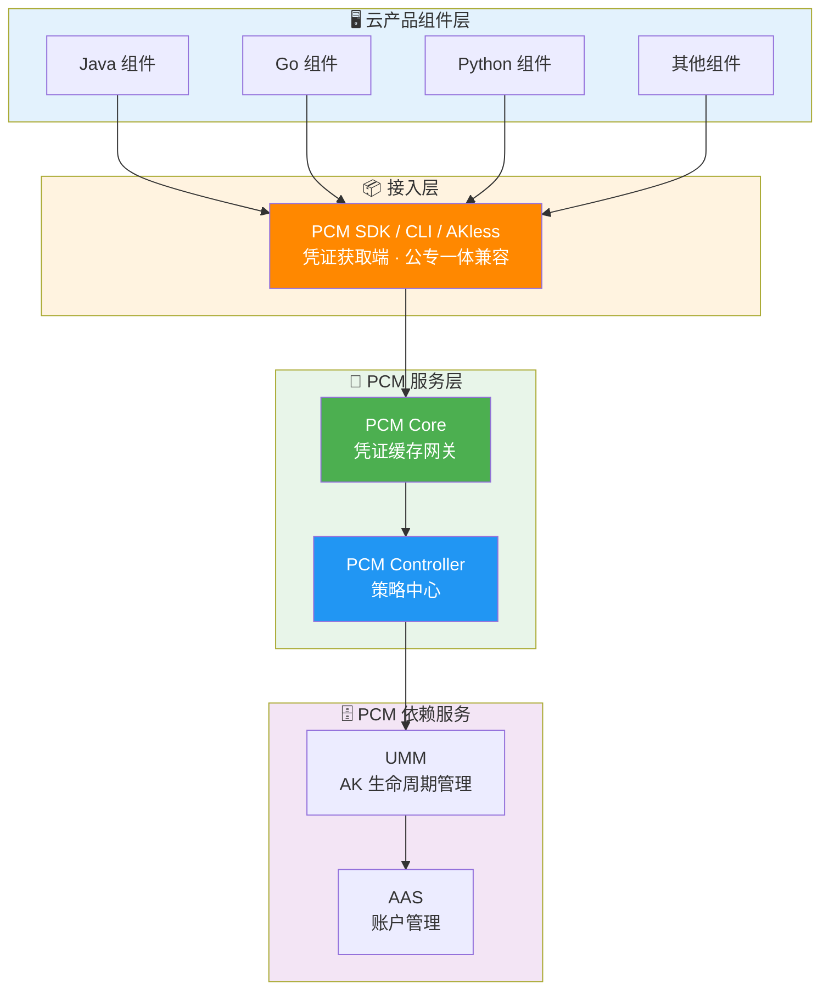
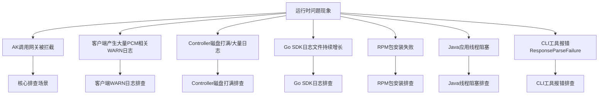
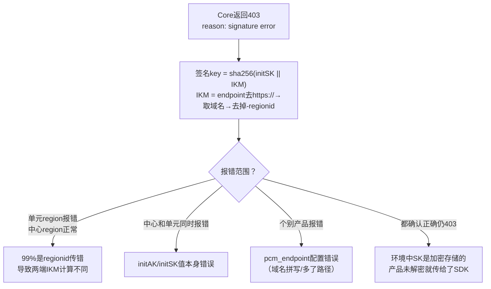

# 横向研发文档

**接入后对比示意图**


**调用 PCM 服务（获取派生 AK）架构**



**调用时序图**

```mermaid
sequenceDiagram
    autonumber
    participant App as 云产品组件<br/>(Java/Go/Python/CLI)
    participant SDK as PCM SDK/CLI<br/>(本地凭证管理)
    participant Core as PCM Core<br/>(凭证缓存网关)
    participant Ctrl as PCM Controller<br/>(策略中心)
    participant UMM as UMM<br/>(AK管理)
    participant AAS as AAS<br/>(账户管理)

    App->>SDK: 请求凭证<br/>(传入底表AK/SK + IAMID + SecretARN)

    SDK-->>SDK: 第一层：检查内存缓存<br/>(凭据是否存在且未过期)

    alt 内存缓存命中且未过期
        SDK-->>App: 返回缓存凭证 (code=201)
    else 内存缓存未命中/已过期
        SDK->>Core: 请求凭证<br/>(SecretName + PcmToken JWT签名)
        Core-->>Core: 检查共享内存缓存<br/>(initak_queue/endpoint_queue等)

        alt Core缓存命中
            Core-->>SDK: 返回缓存的派生凭证
            SDK-->>SDK: 更新内存缓存 + 加密持久化到本地文件
            SDK-->>App: 返回派生凭证 (code=202/203)
        else Core缓存未命中/过期
            Core->>Ctrl: 请求派生新凭证<br/>(initAK + IAMID + endpoint)
            Ctrl->>UMM: 创建/获取派生AK
            UMM->>AAS: 关联账户凭证
            AAS-->>UMM: 返回账户数据
            UMM-->>Ctrl: 返回派生AK
            Ctrl-->>Core: 返回派生凭证
            Core-->>Core: 写入共享内存缓存
            Core-->>SDK: 返回新派生凭证
            SDK-->>SDK: 更新内存缓存 + 加密持久化到本地文件
            SDK-->>App: 返回派生凭证 (code=202/203)
        end
    end

    Note over App,SDK: === 以下为异常降级路径 ===

    alt SDK请求Core失败(网络不通/超时/Core异常)
        SDK-->>SDK: 第二层：读取本地加密文件<br/>(AES-256-GCM解密)
        alt 本地文件有有效凭证
            SDK-->>App: 返回本地缓存凭证 (code=301/302)
        else 本地文件也没有
            SDK-->>App: 降级返回底表AK (code=401)
        end
    end

    Note over Core,Ctrl: Core 定时同步 Controller<br/>保持缓存最新
    Note over Ctrl,UMM: Controller 定期轮转派生AK<br/>禁用老化凭证
```



## 高可用与容错降级机制

| 场景 | SDK 行为 | 业务影响 |
| --- | --- | --- |
| 新部署时 PCM Core 还未 ready | 将入参作为返回 | 无影响（Core 未禁用老 AK） |
| 运行时 PCM Core 挂了 | 返回上次获取的老凭证（未在窗口期末尾） | 无影响 |
| 产品独立升级，PCM 未 ready | 将入参作为返回 | 无影响 |
| PCM 和应用都挂了需重拉（SDK 缓存未丢失） | 返回上次获取的老凭证 | 无影响 |
| PCM 和应用都挂了需重拉（SDK 缓存丢失） | **需先恢复 PCM 或使用老凭证应急脚本** | **业务中断** |

## 产品对接方案细节

### 对接核心概念

| 概念 | 说明 |
| --- | --- |
| **底表 AK** | 通过全局变量方式声明、云平台初始化时自动创建的 AK |
| **IAMID** | 产品申请派生时身份标识：格式为 `${CLUSTERNAME}:<serverrole名称>`，PaaS 格式为 `{{ .Values.productName }}:{{ .Release.Name }}`（当前未强校验格式）。*注：若控制台提示认证状态失败，仅表示 IAMID 不规范，不会对申请结果产生实质影响。* |
| **secretARN** | 凭证目标资源标识，格式为 `apsara:pcm:akid:<accessKeyId>:dst_endpoint:<GatewayCode>:sk:<accessKeySecret>` |
| **GatewayCode** | 服务的认证网关 code，用于区分 AK 私用网关和标准 AK 认证网关（当前版本仅标准 AK 认证网关支持使用底表 AK） |
| **initAK** | 原始底表 AK，PCM 改造前应用直接使用的凭证 |

### 凭证生命周期与队列机制

PCM 接管底层分配的凭证，为对应凭证创建**主动过期的凭证队列**，并定期清洗禁用老化的派生凭证。

**队列基本概念**
底表在生成派生 AK 时，每个派生 AK 会关联一个派生 AK 队列。队列默认维持 7 把有效派生 AK，每把派生 AK 有效期 24 小时。因此，一把派生 AK 从创建到默认过期需要 7 天。

**队列级别**

| 级别 | 划分方式 | 说明 | 推荐程度 |
| --- | --- | --- | --- |
| initAK 级别（默认） | 一个底表 AK 对应一个派生 AK 队列，全局共享 | 默认配置，也是推荐的选择 | ✅ 推荐 |
| ClusterName 级别 | 按集群划分，同一集群内一个底表 AK 对应一个派生 AK 队列 | 多集群会为同一个底表 AK 创建多个队列，叠加后可能把 UMM 账户的 AK 上限打满 | ⚠️ 有风险，不推荐 |

> *注：不推荐 ClusterName 级别是因为 UMM AK 管理中每个账户（UID）对应的有效 AK 数量有上限（最大 1000 把）。按 ClusterName 级别，多集群叠加极易把账户的 AK 上限打满，导致派生失败。*

**队列轮转保护机制**
派生 AK 队列会持续轮转（定期创建新 AK、禁用老 AK），但在以下情况下会暂停轮转，以保护正在使用中的凭证：
1. **产品最新派生 AK 保护**：当要禁用队列里最早的 AK 时，系统会检查该 AK 是否是某个产品获取的最新派生 AK。如果是，队列停止轮转，直到后续其他产品都获取了更新的派生 AK。
2. **平台 AK 访问日志不可行（当前状态）**：当不可行时，PCM 无法确认即将禁用的派生 AK 是否仍有产品在调用，将在第一把队列即将禁用时停止轮转。
3. **平台 AK 访问日志保护（日志可信时）**：在准备禁用某把派生 AK 前，系统检查平台 AK 访问日志（用于检查底表 AK 和派生 AK 是否在网关中有调用记录）。如果日志显示还有产品在用，则停止轮转。

**控制台显示“轮转状态已停止”的常见原因**：
- IAMID 中包含 `CLOSE_AUTO_ROTATE` 状态，表示该队列默认不轮转。
- 使用该产品的队列中，有产品未及时更新（未获取最新派生 AK）。
- 使用该队列的产品中，有产品仍在使用第 7 把 AK（即触发了上述“最新派生 AK 保护”机制）。

### 管控模式与热升级兼容策略

**三种管控模式**

| 模式 | 含义 | 行为 | 适用场景 | 版本 |
| --- | --- | --- | --- | --- |
| **None（默认）** | 不受 PCM 管理 | AK 正常使用，PCM 不介入 | 尚未改造的存量凭证 | / |
| **CompatibilityMode（兼容模式）** | 部分完成改造 | 提供轮换能力，但不对旧 AK 禁用 | 改造中的过渡态 | v3182-2510 |
| **StrictMode（严格模式）** | 使用方改造完成 | 新部署严格托管；热升级/扩等场景自动降级为兼容模式 | 存量改造完成后的目标终态 | v3182-2515以后 |
| **initStrictMode（初始严格模式）** | 新建凭证即完成改造 | 任何场景都开启严格处理 | 新增收口凭证 | v320 |

**热升级兼容策略**
- **新部署项目**：根据 `restrict` 取值禁用原始通用能力，应用使用凭证进入定时轮换状态。
- **热升级项目**：原始凭证**不禁用**其通用能力，进入定时轮换状态；如需禁用老凭证，通过观测日志在运维控制台灰度进行。
- **非 PCM 托管凭证**：一切照旧；若使用了 PCM SDK/CLI 但未被托管，将入参 initAK 返回让应用接着使用。

### 组件职责与安全特性

**PCM Core（缓存中间网关）**
- **职责**：SDK 与 Controller 之间的访问中间网关，缓存 Controller 最新凭证数据，缓解 Controller 访问压力，提高 SDK 访问响应速度。
- **安全特性**：
  - **本地缓存 + 定时同步**：减少直接访问 Controller 的频率。
  - **缓存隔离**：缓存数据仅服务于已认证的 SDK 请求，不对外暴露。
  - **降级保护**：Core 宕机后，末期过期老凭证行为暂停，SDK 返回上次获得的老凭证依然可以使用。
  - **压力缓解**：避免所有 SDK 请求直接打到 Controller，防止策略大脑被击穿。

**PCM Controller（策略中心）**
- **职责**：PCM 凭证管控核心，执行凭证生命周期管理，提供 PKM 白屏管控、日志查询关联、状态管理能力。
- **安全特性**：
  - **凭证队列管理**：为每个被托管凭证创建主动过期的凭证队列，定期清洗禁用老化派生凭证。
  - **模式管控**：根据 `controlByPcm` 配置执行不同模式。
  - **松→紧变更不自动生效**：模式从松到紧变更时不自动生效，需 ASO 页面提示人工处理，防止误操作。
  - **灰度禁用**：支持热升级后以运维变更方式逐步禁用老凭证。
  - **白屏管控（PKM）**：提供可视化的凭证管理界面。
  - **日志查询关联**：关联 AK 使用记录，判断是否可以安全禁用。
  - **状态管理**：管理每个凭证的当前状态（轮换中/已禁用/正常等）。

**依赖服务**
- **UMM（AK 生命周期管理）**：负责 AK 的存储与生命周期管理，接收 Controller 指令执行凭证轮换和禁用操作。
- **AAS（账户管理服务）**：负责平台账户统一管理，与 UMM 联动形成账户-凭证关联关系。

### 控制台与凭证管理操作

**PCM 服务与控制台入口**
- **服务位置**：所属产品 `baseServiceAll`，部署集群 `StandardCloudCluster-A-xx`，所属 service `platform-credential-management`，核心组件为 `PCM Core` 和 `PCM Controller`。
- **控制台入口**：ASO -> 安全管理 -> 账户安全 -> 平台凭据管理 PCM。

**底表 AK 管理**
- 支持查询底表 AK 禁用状态、启用底表 AK。
- *注：控制台未提供白屏底表 AK 禁用能力，底表 AK 禁用需通过标准变更流程执行。*

**派生 AK 管理（手动创建临时 AK）**
- **适用场景**：当某个应用需要使用临时 AK 登录，或者使用的 initAK 被禁用时，可创建临时 AK 应急使用。
- **操作步骤**：
  1. 进入“派生 AK 管理”标签页，点击“创建临时 AK”按钮。
  2. 输入申请者、initAKID、有效天数、申请原因等信息。
  3. 创建成功后，**立即复制 AK 和 SK 保存**（SK 明文仅在成功弹窗内展示，关闭后系统不再显示，若不慎关闭需重新创建）。
- **核心参数说明**：
  - `initAKID`：托管到 PCM 的基线或底表 AK（必须与所使用账号的原始 AK 对应）。
  - `申请者 (IAMID)`：服务的身份标识，常规为 `集群:SR名称`（如 `StandardCloudCluster-A-xx:PcmController`）。若系统提示已存在，可在后缀拼接任意字符串。
  - `有效天数`：范围限制在 1~365 天。
  - `申请者类型`：分为 ApsaraStackProduct、Other。
  - `归属信息`：CloudID、ProductName、ClusterName、ServiceName 虽非必填，但建议准确填写以便追溯临时 AK 使用方。

## 产品对接范围

### 标准 AK 认证 vs AK 私用场景

| 类型 | 说明 |
| --- | --- |
| **标准 AK 认证** | AK 生命周期在 UMM 中保管，标准网关通过对接 UMM 进行 AK 签名校验（如 POP、OpenAPI、OSS）。当前访问标准 AK 认证服务的云产品均已适配完成。 |
| **AK 私用场景** | 服务不接或无法接 UMM，直接把 AK 参数记录到本地配置文件/数据库中，请求过来时用本地配置校验。当前访问 AK 私用服务的云产品尚未强制要求适配，已适配的产品通过 PCM 服务将兑换出原始底表 AK。 |

## 接入指引与常见问题排查

### 排查总览



### 已知问题与排查

#### AK 调用网关被拦截
这是 PCM 接入后最核心的排查场景，首先需判断是否是 PCM 禁用 AK 导致，产品调用网关时可能报 AK 被禁用/AK 无效/AK 不存在。主要分为两种情况：底表被禁用、派生 AK 被禁用。

**第一步：从网关日志中取出被拦截的 AK ID，在控制台查询是底表 AK 还是派生 AK。**

- **底表 AK 判定**：可以直接通过控制台查询。
  
- **派生 AK 判定**：
  - 控制台仅可以查询每个队列最近 14 把派生 AK。
    
  - 数据库查询：
    - service：`certificate-lifecycle-manager-server`
    - db实例：`clm_db`
    - 数据库：`pcm_db`
    
    进入 `clm_db` 实例数据库后切换到 `pcm_db`：
    ```sql
    use pcm_db;
    ```
    在派生 AK 数据库中检查是否存在：
    ```sql
    select * from ak_info where access_key_id='****';
    ```

**分支一：底表 AK 被拦截**
- **核心判断**：产品在使用底表 AK，说明 SDK 没有成功获取派生 AK，走了降级逻辑（排查方向是**为什么 SDK 没拿到派生 AK**），或者使用底表 AK 未适配。
- **排查步骤**：
  1. **先恢复**：在 PCM 控制台启用该底表 AK，恢复业务。
  2. **查 SDK 日志 code**：确认是哪种降级场景，参见下方“Core 错误码快速定位”。

**分支二：派生 AK 被拦截**
- **核心判断**：产品已经在使用派生 AK，但这把派生 AK 已被轮转禁用。排查方向是**为什么产品没有及时更新到最新的派生 AK**（最可能原因为：仅获取一次，未持续轮转）。
- **恢复步骤**：
  1. 通常重启服务会刷新 AK 导致可用，然后停止该队列的轮转。
     
  2. 若无法重启服务，需要手动启用 AK，参见 [《PCM应急处置》](https://alidocs.dingtalk.com/i/nodes/MNDoBb60VLYDGNPytBomBqkPJlemrZQ3?utm_scene=team_space&iframeQuery=anchorId%3Duu_mogmd4kosy5jbbqysjf)。
- **排查步骤**：如果有 SDK 报错，参见下方“Core 错误码快速定位”。

#### 客户端产生大量 PCM 相关 WARN 日志
- **现象**：产品日志中大量 `Failed to refresh credential, pcm server is xxx`。
- **关键判断**：这类 WARN 日志**不影响业务**（SDK 已降级返回原始凭证），主要影响是客户端告警监控被触发。

#### PCM Controller 磁盘打满 / 产生大量日志
- **现象**：Controller 日志目录 `/home/admin/pcm_controller/logs/api/logs/` 下出现超大文件，磁盘空间不足。
- **EOCC 参考**：[EC9EE9AE20](https://eocc.aliyun-inc.com/kbscene/emergencyDetail/EC9EE9AE20?Jump=2)
- **处理方式**：
  1. 确认磁盘使用情况：`df -h`
  2. 查看日志目录大小：`du -sh /home/admin/pcm_controller/logs/api/logs/`
  3. 清理历史日志文件（保留最近日志）
  4. 排查产生大量日志的原因：是否有大量异常请求持续打到 Controller，或是否有定时任务异常导致循环报错。
  5. 确认日志轮转配置是否正常。

#### Go SDK 日志文件持续增长
- **现象**：Go SDK 产生的日志文件不断增大，未按预期轮转。
- **原因**：Go SDK 在 2512 之前版本存在日志轮转 Bug。
- **解决方案**：升级 Go SDK 至 2512 及以上版本。
- **临时处理**：`> logfile` 截断日志文件（不要 rm 正在写入的文件）。

#### Python SDK RPM 包安装失败
- **现象**：安装 `pcm-python2-sdk-rpm-with-no-six` 报错。
- **关键字**：`pytz/zoneinfo`、`cpio: File from package already exists as a directory`。
- **原因**：系统已有 `/home/tops/lib/python2.7/site-packages/pytz/` 目录，与 RPM 包冲突。
- **解决方式**：
  ```bash
  mv /home/tops/lib/python2.7/site-packages/pytz /home/tops/lib/python2.7/site-packages/pytz_bak
  sudo yum install pcm-python2-sdk-rpm-with-no-six -y
  ```

#### Java 应用线程阻塞
- **现象**：线程 dump 中出现阻塞堆栈：
  ```plaintext
  java.lang.Thread.State: BLOCKED (on object monitor)
    at sun.security.provider.NativePRNG$RandomIO.implNextBytes(NativePRNG.java:543)
    at ...PcmSecretCredentialManager.persistCredentials(...)
  ```
- **原因**：SDK 默认使用 `/dev/random` 阻塞模式获取随机数，系统熵值低（< 100）时线程被卡住。
- **解决方案**：
  - 升级 SDK 至 `credprovider.plugin >= 1.0.8`。
  - 临时规避：JVM 参数增加 `-Djava.security.egd=file:/dev/./urandom`。

#### CLI 工具报错 ResponseParseFailure
- **现象**：`{"code": "ResponseParseFailure", "data": "", "message": "xxxxxxx"}`
- **原因**：`pcm_endpoint` 地址不对，该地址响应 200 但格式非预期，CLI 解析失败且未走降级。
- **排查**：确认 CLI 的 `pcm_endpoint` 指向正确的 PCM Core 地址，手动 curl 确认返回格式（后续版本已优化解析异常的降级处理）。

### Core 错误码快速定位

#### HTTP 400 — 请求参数错误

| 返回 Msg | 报错原因 | 排查方向 |
| --- | --- | --- |
| `SecretName or x_acs_bearer_token is nil` | SecretName 或 token 为空 | SDK 侧 initakid 和 pcm_endpoint 是否正确 |
| `SecretName parse fail, SecretName:xxxx` | SecretName 格式错误 | appName 是否正确以 `:` 分隔 |
| `The access key (AK) is not administered by the PCM service, AK:xxxx` | akid 非底表 AK | initakid 是否填写正确的底表 akid |
| `genJwtKey fail` | 计算 token_key 失败 | Core 内部问题，与 SDK 无关 |
| `Error in AK rotation led to unsuccessful request to the controller...` | 请求 Controller 派生失败 | 1. 派生 AK 容量达上限<br>2. IAMID 非法且关闭了非标开关 |

#### HTTP 403 — 认证失败

| 返回 Msg | 报错原因 | 排查方向 |
| --- | --- | --- |
| `reason: signature error` | 签名验证失败 | 见下方 signature error 排查 |
| `reason: "nbf" claim not valid until` | 时钟不同步 | 见下方 nbf 时钟偏差 |
| `token_arn not same with arn...` | ARN 不一致 | SDK 内部问题，基本不出现 |

#### signature error 排查



#### nbf 时钟偏差
- SDK 生成 JWT 的 `nbf` 使用客户端 `time.Now()`。
- 版本 3186-2605 / 320-2607 后已增加 5 分钟容错。
- 仍出现则检查 SDK 所在机器 NTP 同步状态。

#### SK 加密未解密导致 403
部分环境中底表 SK 是加密存储的。产品未解密就传给 SDK → 签名 key 两端不一致 → 必然 403。需确认产品侧调用 SDK 前已解密 SK。

#### HTTP 502 与限流排查
大概率限流触发。
- **限流排查步骤**：
  1. 检查 access.log 中 `limit_req_status` 字段。
  2. `tsar -l -i 1 --nginx` 查看 QPS。
  3. 调整限流配置：`/services/platform-credential-management/user/pcm_conf/pcm_core.json`。
  4. 阈值参考（单核）：x86=200r/s, aarch64=189r/s, sw64=80r/s。

### 其他已知问题

| 问题 | 说明 | 处理 |
| --- | --- | --- |
| SDK 超时日志毫秒数为 null | 未设置 `PCM_TASK_DELAY` 时默认 1s 超时，日志字段显示 null | 已知日志格式问题，不影响功能 |
| Core 返回 502 | 大概率限流 | 见上方限流相关说明 |

### 高频问题 FAQ

1. **接入 PCM 后出现大量报错日志，是否有影响？**
   - 2507 版本 PCM 服务端尚未部署，部分适配了 PCM 的产品可能访问 PCM 报错，但因降级返回了原始底表 AK，不影响业务调用。如果调用非常频繁，可能产生大量错误日志。
   - 部分产品升级至 3186-2510 及以上版本，baseServiceAll 未升级，可能同样出现以上问题。
2. **如何判断底表 AK 是否禁用？**
   - 参考运维手册 [《PCM运维手册》](https://alidocs.dingtalk.com/i/nodes/amweZ92PV6DbOdgzUK4on0qD8xEKBD6p?utm_scene=team_space&iframeQuery=anchorId%3Duu_mo8cms9ciyzk8jo83x) 中查询。
3. **如何判断派生 AK 禁用？**
   - 当前输出版本 3186、320 默认均不禁用派生 AK。
4. **时间敏感服务延迟问题**
   - 接入 PCM 后可导致部分时间敏感服务延迟加大，且网络可能出现延迟。对于时间敏感服务，增加了超时策略。
   - 在 `1.13-SNAPSHOT (20250908)` 及之后版本中，支持 `PCM_TASK_DELAY` 环境变量，用于设置访问 PCM 最大超时时间，单位是 ms。默认 1000ms，即 1s。

## 潜在风险分析

- **Core 限流基于 IP，存在误伤可能**：PCM Core 的限流策略基于客户端 IP。当同一台机器上运行多个产品组件，一个高频产品的请求可能耗尽该 IP 的限流配额，导致同 IP 下其他产品被连带返回 502。
- **链路增加延迟，对时间敏感业务有影响**：接入 PCM 后凭证获取链路增加，可能对时间敏感型业务造成延迟影响（可通过 `PCM_TASK_DELAY` 缓解）。
- **无服务端时 SDK 频繁调用产生大量日志**：当环境中 PCM 服务（Core）未部署或不可达时，SDK 无法生成缓存，仍然会按配置的间隔持续尝试连接，每次失败产生 WARN 级别日志。
- **部分 SDK 未打印关键日志，排查困难**：Java WARN 过多，部分产品屏蔽了报错日志，无请求 PCM 的 requestid 等信息，增加排查难度。
- **已知问题已修复但环境中存量版本旧**：

| 问题 | 修复版本 | 风险 |
| --- | --- | --- |
| CLI 服务端返回异常不降级（ResponseParseFailure） | 2025-12-23更新 | CLI 直接不可用 |
| Java SDK 线程阻塞（/dev/random 熵值问题） | credprovider.plugin >= 1.0.8 | 应用线程卡死 |
| Go SDK 日志文件不轮转 | SDK >= 2512版本 | 磁盘打满 |

- **半轮转模式首次获取失败导致后续持续异常**：部分产品采用半自动轮转模式（仅在启动时获取一次派生 AK，后续不再主动刷新）。如果该唯一一次获取请求恰好失败（Core 限流、网络抖动、服务未就绪），产品将持续使用底表 AK 或无有效凭据运行，且不会自动恢复。
- **底表禁用后 PCM 可用性和禁用状态联动**：底表 AK 被 PCM 禁用后，产品的凭据供给完全依赖 PCM 链路（Core + Controller）。对于本地有缓存的运行中服务暂时无影响，但重启的服务如果此时 PCM 不可用，将拿不到任何有效凭据（底表已禁、派生获取失败、本地无缓存），导致业务直接中断。