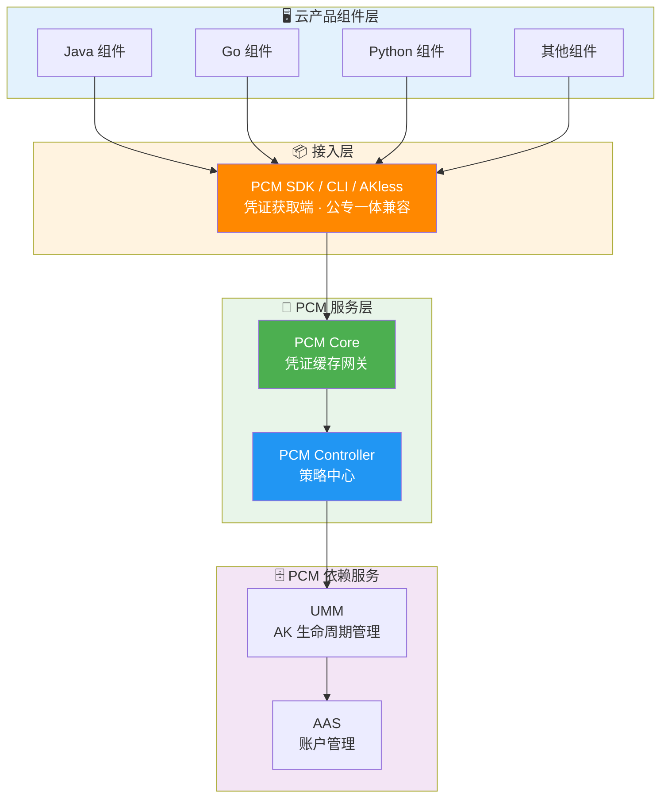
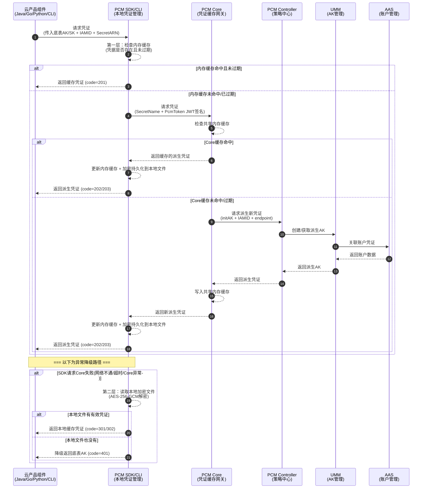

# 横向研发文档

**基本概念**
| 概念 | 说明 |
| --- | --- |
| **底表 AK** | 通过全局变量方式声明、云平台初始化时自动创建的 AK |
| **IAMID** | 产品申请派生时身份标识：格式为 `${CLUSTERNAME}:<serverrole名称>`，PaaS 格式为 `{{ .Values.productName }}:{{ .Release.Name }}`（当前未强校验格式） |
| **secretARN** | 凭证目标资源标识，格式为 `apsara:pcm:akid:<accessKeyId>:dst_endpoint:<GatewayCode>:sk:<accessKeySecret>` |
| **GatewayCode** | 服务的认证网关 code，用于区分 AK 私用网关和标准 AK 认证网关（当前版本仅标准 AK 认证网关支持使用底表 AK） |
| **initAK** | 原始底表 AK，PCM 改造前应用直接使用的凭证 |

**接入方式与组件调用**
云产品组件（Java/Go/Python/CLI 等）通过接入 **PCM SDK / CLI / AKless** 凭证获取端来实现与平台凭证管理服务（PCM）的对接。整体调用架构如下：

**凭证获取调用时序**
应用通过 SDK 请求凭证时，SDK 会优先检查本地内存和磁盘缓存，若未命中则向 PCM Core 请求，Core 未命中时由 PCM Controller 向 UMM/AAS 申请派生 AK。同时具备完善的异常降级路径。

**热升级兼容策略**
*   **新部署项目**：根据 `restrict` 取值禁用原始通用能力，应用使用凭证进入定时轮换状态。
*   **热升级项目**：原始凭证**不禁用**其通用能力，进入定时轮换状态；如需禁用老凭证，通过观测日志在运维控制台灰度进行。
*   **非 PCM 托管凭证**：一切照旧；若使用了 PCM SDK/CLI 但未被托管，将入参 initAK 返回让应用接着使用。

## 产品对接方案细节

**派生 AK 队列机制**
底表在生成派生 AK 时，每个派生 AK 会关联一个派生 AK 队列。队列默认维持 7 把有效派生 AK，每把有效期 24 小时（从创建到默认过期需 7 天）。

*队列级别划分*：
| 级别 | 划分方式 | 说明 | 推荐程度 |
| --- | --- | --- | --- |
| initAK 级别（默认） | 一个底表 AK 对应一个派生 AK 队列，全局共享 | 默认配置，也是推荐的选择 | ✅ 推荐 |
| ClusterName 级别 | 按集群划分，同一集群内一个底表 AK 对应一个派生 AK 队列 | 多集群会为同一个底表 AK 创建多个队列，叠加后可能把 UMM 账户的 AK 上限打满 | ⚠️ 有风险，不推荐 |

*队列轮转保护机制*：
派生 AK 队列持续轮转，但在以下情况会暂停轮转以保护使用中的凭证：
1.  **产品最新派生 AK 保护**：禁用最早 AK 前，检查其是否为某产品获取的最新派生 AK。若是，则停止轮转，直到其他产品获取更新凭证。
2.  **平台 AK 访问日志不可行保护**：PCM 无法确认即将禁用的派生 AK 是否仍被调用时，将在第一把队列即将禁用时停止轮转。
3.  **平台 AK 访问日志可信保护**：准备禁用前检查访问日志，若显示仍有产品在使用该 AK，则停止轮转。

**凭证管控模式**
| 模式 | 含义 | 行为 | 适用场景 | 版本 |
| --- | --- | --- | --- | --- |
| **None（默认）** | 不受 PCM 管理 | AK 正常使用，PCM 不介入 | 尚未改造的存量凭证 | / |
| **CompatibilityMode** | 部分完成改造 | 提供轮换能力，但不对旧 AK 禁用 | 改造中的过渡态 | v3182-2510 |
| **StrictMode** | 使用方改造完成 | 新部署严格托管；热升级/扩等场景自动降级为兼容模式 | 存量改造完成后的目标终态 | v3182-2515以后 |
| **initStrictMode** | 新建凭证即完成改造 | 任何场景都开启严格处理 | 新增收口凭证 | v320 |

**各组件对接安全特性**
*   **PCM SDK / CLI（凭证获取端）**：提供多级缓存（内存+磁盘），具备容错降级能力（服务异常时返回入参或最近一次缓存凭证）。
*   **PCM Core（缓存中间网关）**：提供本地缓存与定时同步，缓存数据仅服务于已认证 SDK 请求（缓存隔离）。具备降级保护（Core 宕机时 SDK 返回老凭证）并缓解 Controller 压力。
*   **PCM Controller（策略中心）**：执行凭证队列管理与模式管控。支持松→紧变更不自动生效（需人工处理防误操作）、灰度禁用老凭证，并提供 PKM 白屏管控与日志查询关联能力。

## 产品对接范围

**认证场景对接范围**
| 类型 | 说明与对接现状 |
| --- | --- |
| **标准 AK 认证** | AK 生命周期在 UMM 中保管，标准网关通过对接 UMM 进行 AK 签名校验（如 POP、OpenAPI、OSS）。**当前访问标准 AK 认证服务的云产品均已适配完成。** |
| **AK 私用场景** | 服务不接或无法接 UMM，直接把 AK 参数记录到本地配置文件/数据库中校验。**当前尚未强制要求适配**，已适配的产品通过 PCM 服务兑换出原始底表 AK。 |

**高可用与容错对接范围**
在对接过程中，SDK 针对不同异常场景提供了明确的容错逻辑，保障业务连续性：

| 场景 | SDK 行为 | 业务影响 |
| --- | --- | --- |
| 新部署时 PCM Core 还未 ready | 将入参作为返回 | 无影响（Core 未禁用老 AK） |
| 运行时 PCM Core 挂了 | 返回上次获取的老凭证（未在窗口期末尾） | 无影响 |
| 产品独立升级，PCM 未 ready | 将入参作为返回 | 无影响 |
| PCM 和应用都挂了需重拉（SDK 缓存未丢失） | 返回上次获取的老凭证 | 无影响 |
| PCM 和应用都挂了需重拉（SDK 缓存丢失） | **需先恢复 PCM 或使用老凭证应急脚本** | **业务中断** |