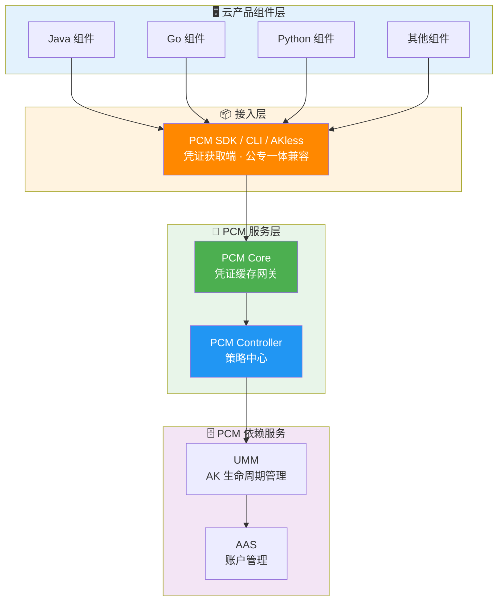
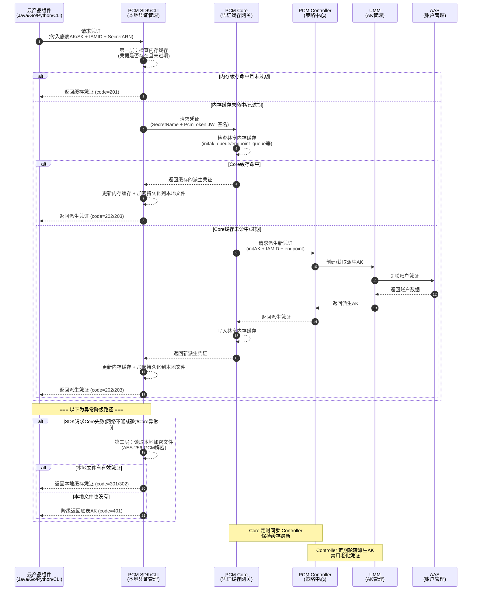

# 横向研发文档

云产品应用通过 PCM SDK / CLI / AKless 接入，直接与 PCM 服务交互获取新凭证。

**安全与容错特性**：
- **多级缓存**：在本地内存、磁盘均有缓存。
- **容错降级**：PCM 初始化服务异常或报错时，将入参作为凭证返回；如果有缓存，将返回最近一次从服务端获取的凭证。

## 接入后架构与调用关系

**接入后对比示意图**


**调用 PCM 服务（获取派生 AK）架构**



**调用时序图**



## 高可用与容错降级机制

| 场景 | SDK 行为 | 业务影响 |
| --- | --- | --- |
| 新部署时 PCM Core 还未 ready | 将入参作为返回 | 无影响（Core 未禁用老 AK） |
| 运行时 PCM Core 挂了 | 返回上次获取的老凭证（未在窗口期末尾） | 无影响 |
| 产品独立升级，PCM 未 ready | 将入参作为返回 | 无影响 |
| PCM 和应用都挂了需重拉（SDK 缓存未丢失） | 返回上次获取的老凭证 | 无影响 |
| PCM 和应用都挂了需重拉（SDK 缓存丢失） | **需先恢复 PCM 或使用老凭证应急脚本** | **业务中断** |

## 产品对接方案细节

### 对接核心概念

| 概念 | 说明 |
| --- | --- |
| **底表 AK** | 通过全局变量方式声明、云平台初始化时自动创建的 AK |
| **IAMID** | 产品申请派生时身份标识：格式为 `${CLUSTERNAME}:<serverrole名称>`，PaaS 格式为 `{{ .Values.productName }}:{{ .Release.Name }}`（当前未强校验格式） |
| **secretARN** | 凭证目标资源标识，格式为 `apsara:pcm:akid:<accessKeyId>:dst_endpoint:<GatewayCode>:sk:<accessKeySecret>` |
| **GatewayCode** | 服务的认证网关 code，用于区分 AK 私用网关和标准 AK 认证网关（当前版本仅标准 AK 认证网关支持使用底表 AK） |
| **initAK** | 原始底表 AK，PCM 改造前应用直接使用的凭证 |

### 凭证生命周期与队列机制

PCM 接管底层分配的凭证，为对应凭证创建**主动过期的凭证队列**，并定期清洗禁用老化的派生凭证。

**队列基本概念**
底表在生成派生 AK 时，每个派生 AK 会关联一个派生 AK 队列。队列默认维持 7 把有效派生 AK，每把派生 AK 有效期 24 小时。因此，一把派生 AK 从创建到默认过期需要 7 天。

**队列级别**

| 级别 | 划分方式 | 说明 | 推荐程度 |
| --- | --- | --- | --- |
| initAK 级别（默认） | 一个底表 AK 对应一个派生 AK 队列，全局共享 | 默认配置，也是推荐的选择 | ✅ 推荐 |
| ClusterName 级别 | 按集群划分，同一集群内一个底表 AK 对应一个派生 AK 队列 | 多集群会为同一个底表 AK 创建多个队列，叠加后可能把 UMM 账户的 AK 上限打满 | ⚠️ 有风险，不推荐 |

> *注：不推荐 ClusterName 级别是因为 UMM AK 管理中每个账户（UID）对应的有效 AK 数量有上限（最大 1000 把）。按 ClusterName 级别，多集群叠加极易把账户的 AK 上限打满，导致派生失败。*

**队列轮转保护机制**
派生 AK 队列会持续轮转（定期创建新 AK、禁用老 AK），但在以下情况下会暂停轮转，以保护正在使用中的凭证：
1. **产品最新派生 AK 保护**：当要禁用队列里最早的 AK 时，系统会检查该 AK 是否是某个产品获取的最新派生 AK。如果是，队列停止轮转，直到后续其他产品都获取了更新的派生 AK。
2. **平台 AK 访问日志不可行（当前状态）**：当不可行时，PCM 无法确认即将禁用的派生 AK 是否仍有产品在调用，将在第一把队列即将禁用时停止轮转。
3. **平台 AK 访问日志保护（日志可信时）**：在准备禁用某把派生 AK 前，系统检查平台 AK 访问日志（用于检查底表 AK 和派生 AK 是否在网关中有调用记录）。如果日志显示还有产品在用，则停止轮转。

### 管控模式与热升级兼容策略

**三种管控模式**

| 模式 | 含义 | 行为 | 适用场景 | 版本 |
| --- | --- | --- | --- | --- |
| **None（默认）** | 不受 PCM 管理 | AK 正常使用，PCM 不介入 | 尚未改造的存量凭证 | / |
| **CompatibilityMode（兼容模式）** | 部分完成改造 | 提供轮换能力，但不对旧 AK 禁用 | 改造中的过渡态 | v3182-2510 |
| **StrictMode（严格模式）** | 使用方改造完成 | 新部署严格托管；热升级/扩等场景自动降级为兼容模式 | 存量改造完成后的目标终态 | v3182-2515以后 |
| **initStrictMode（初始严格模式）** | 新建凭证即完成改造 | 任何场景都开启严格处理 | 新增收口凭证 | v320 |

**热升级兼容策略**
- **新部署项目**：根据 `restrict` 取值禁用原始通用能力，应用使用凭证进入定时轮换状态。
- **热升级项目**：原始凭证**不禁用**其通用能力，进入定时轮换状态；如需禁用老凭证，通过观测日志在运维控制台灰度进行。
- **非 PCM 托管凭证**：一切照旧；若使用了 PCM SDK/CLI 但未被托管，将入参 initAK 返回让应用接着使用。

### 组件职责与安全特性

**PCM Core（缓存中间网关）**
- **职责**：SDK 与 Controller 之间的访问中间网关，缓存 Controller 最新凭证数据，缓解 Controller 访问压力，提高 SDK 访问响应速度。
- **安全特性**：
  - **本地缓存 + 定时同步**：减少直接访问 Controller 的频率。
  - **缓存隔离**：缓存数据仅服务于已认证的 SDK 请求，不对外暴露。
  - **降级保护**：Core 宕机后，末期过期老凭证行为暂停，SDK 返回上次获得的老凭证依然可以使用。
  - **压力缓解**：避免所有 SDK 请求直接打到 Controller，防止策略大脑被击穿。

**PCM Controller（策略中心）**
- **职责**：PCM 凭证管控核心，执行凭证生命周期管理，提供 PKM 白屏管控、日志查询关联、状态管理能力。
- **安全特性**：
  - **凭证队列管理**：为每个被托管凭证创建主动过期的凭证队列，定期清洗禁用老化派生凭证。
  - **模式管控**：根据 `controlByPcm` 配置执行不同模式。
  - **松→紧变更不自动生效**：模式从松到紧变更时不自动生效，需 ASO 页面提示人工处理，防止误操作。
  - **灰度禁用**：支持热升级后以运维变更方式逐步禁用老凭证。
  - **白屏管控（PKM）**：提供可视化的凭证管理界面。
  - **日志查询关联**：关联 AK 使用记录，判断是否可以安全禁用。
  - **状态管理**：管理每个凭证的当前状态（轮换中/已禁用/正常等）。

**依赖服务**
- **UMM（AK 生命周期管理）**：负责 AK 的存储与生命周期管理，接收 Controller 指令执行凭证轮换和禁用操作。
- **AAS（账户管理服务）**：负责平台账户统一管理，与 UMM 联动形成账户-凭证关联关系。

## 产品对接范围

### 标准 AK 认证 vs AK 私用场景

| 类型 | 说明 |
| --- | --- |
| **标准 AK 认证** | AK 生命周期在 UMM 中保管，标准网关通过对接 UMM 进行 AK 签名校验（如 POP、OpenAPI、OSS）。当前访问标准 AK 认证服务的云产品均已适配完成。 |
| **AK 私用场景** | 服务不接或无法接 UMM，直接把 AK 参数记录到本地配置文件/数据库中，请求过来时用本地配置校验。当前访问 AK 私用服务的云产品尚未强制要求适配，已适配的产品通过 PCM 服务将兑换出原始底表 AK。 |

## 研发与运维辅助工具

在研发对接、调试及日常运维过程中，可使用以下辅助工具进行日志排查与底表 AK 状态管理。

### 网关日志查询工具

#### 基本介绍
- 支持通过网关+事件ID，查询日志详细信息。
- 支持在网关日志中扫描底表 AK 使用情况。

#### 配置说明
默认配置文件与 CLI 工具放在相同目录下即可。

```yaml
# 服务端简化配置
sls:
  # 访问凭证（此处未自动适配pcm轮转，直接填 PCM 轮转后的 AK，通过pcm控制台手动获取派生AK）
  credentials:
    sls:   #test1000000004@aliyun.com 对应的派生AK                  
      access_key_id: "RONVzQyJJR2kRoLP" 
      access_key_secret: "hvZ8oi0vWJXjWERK9VVe3j3qm2IYwK" 
    defaultUser:  #aliyuntest 对应的派生ak           
      access_key_id: "beF7AyHhnIjY3eGy"  
      access_key_secret: "2R838QLvk0wjkGxL9mTPMlL1xWFX4q"

  # Endpoint 配置
  inner_endpoint: "data.cn-wulan-env17e-d01.sls.inter.env17e.shuguang.com"        # slsinner
  pub_endpoint: "data.cn-wulan-env17e-d01.sls-pub.inter.env17e.shuguang.com"      # slspub

scan:
  hours_back: 10       # 扫描周期
  page_size: 1000      # 默认 可不修改
  max_workers: 20      # 默认 可不修改 
  auto_create_index: false  # 发现无索引时是否自动创建（true=自动创建，false=跳过）

output:
  path: "./output"
  format: "all"  # 可选: print, json, csv, all
```

#### 使用指南

**运行环境**
上传到 OPS1 服务运行（或可以解析 slsinner 的环境）。

**命令行参数说明**
```bash
# ./main -h
usage: main [-h] [--config CONFIG] [--ak-file AK_FILE] [--gateway GATEWAY] [--keyword KEYWORD] [--hours HOURS] [--format {print,json,csv,all}] {scan,query}

服务端 AK 扫描工具

positional arguments:
  {scan,query}          运行模式: scan=全量扫描, query=关键字查询

options:
  -h, --help            show this help message and exit
  --config CONFIG       配置文件路径
  --ak-file AK_FILE     AK 列表文件路径
  --gateway GATEWAY     查询模式：网关代码
  --keyword KEYWORD     查询模式：关键字
  --hours HOURS         时间范围（小时）
  --format {print,json,csv,all}
                        输出格式
```

**根据事件ID查询使用AK**
```bash
./main query --gateway OSS --keyword "tzRzgmefjFjXBC4C"
```


**遍历网关中底表AK调用记录**
```bash
./main scan
```
扫描记录将自动存储在相对路径的 `output/scan_result_{时间戳}.csv`。


*CSV 输出示例：*


*JSON 输出示例：*


### 底表AK黑屏操作工具

#### 基本介绍
- 支持启用/禁用指定 AK。
- 支持启用/禁用全量 AK。

#### 运行环境与依赖
- **运行位置**：PcmController 容器（Product: baseServiceAll → sn: platform-credential-management → sr：PcmController#），进入任意一台容器操作即可。

- **环境变量**：需通过 PcmController 服务注册变量或环境中的 env 获取 `pcm_ctrl_domain` 和 `pcm_rs`。

#### 使用指南
```bash
# 启用单个
python3 manage_ak_status.py enable --ak LTAI5txxxxxx

# 禁用单个
python3 manage_ak_status.py disable --ak LTAI5txxxxxx

# 启用全部
python3 manage_ak_status.py enable-all

# 禁用全部
python3 manage_ak_status.py disable-all
```

#### 工具源码参考
```python
import time
import hashlib
import requests
import os
import sys
import argparse
import logging

logging.basicConfig(
    level=logging.INFO,
    format='%(message)s'
)
logger = logging.getLogger(__name__)

# 通过PcmController服务注册变量或环境中的env中获取
pcm_ctrl_domain = os.getenv('pcm_ctrl_domain')
pcm_rs = os.getenv('pcm_rs')

def get_pcm_headers():
    """获取签名headers"""
    millis_timestamp = int(time.time() * 1000)
    raw_str = f"{pcm_rs}\u00a7{millis_timestamp}"
    md5_signature = hashlib.md5(raw_str.encode('utf-8')).hexdigest()
    headers = {
        "X-ASO-Inner-Request-Signature": md5_signature,
        "X-ASO-Inner-Request-Timestamp": str(millis_timestamp)
    }
    return headers

def update_ak_status(ak_id, status, headers):
    """更新单个 AK 状态"""
    status_str = 'true' if status else 'false'
    action = '启用' if status else '禁用'
    url = f'http://{pcm_ctrl_domain}:8093/pcm/controller/operation/updateAkStatus?akId={ak_id}&status={status_str}'
    try:
        resp = requests.get(url, headers=headers)
        result = resp.json()
        code = result.get('code', '')
        if str(code) == '200':
            print(f"{ak_id} 已{action}")
        else:
            print(f"{ak_id} {action}失败: {result.get('message', resp.text)}")
        return str(code) == '200'
    except Exception as e:
        print(f"{ak_id} {action}异常: {e}")
        return False

def get_default_keys(headers):
    """从 PCM 获取全部底表 AK 列表"""
    ak_list = []
    url = f"http://{pcm_ctrl_domain}:8093/pcm/controller/initAK/queryInitAkList"
    data = {"pageNum": 1, "pageSize": 200}
    try:
        response = requests.post(url, json=data, headers=headers)
        response.raise_for_status()
        result = response.json()
        code = result.get('code', 0)
        if str(code) == '200':
            resp_data = result.get('data', {})
            ak_info_list = resp_data.get('list', [])
            for ak in ak_info_list:
                if ak.get('akType', 0) == 0:
                    accessKeyId = ak.get('accessKeyId', '')
                    if accessKeyId:
                        ak_list.append(accessKeyId)
            print(f"获取到底表 AK 共 {len(ak_list)} 个")
        else:
            logger.error(f"获取底表 AK 列表失败: {result}")
    except Exception as e:
        logger.error(f"获取底表 AK 列表异常: {e}")
    return ak_list

def get_accountid_keys(accountid, headers):
    """通过账号ID获取 AK"""
    url = f"http://{pcm_ctrl_domain}:8093/pcm/controller/initAK/queryInitAkList"
    data = {"pageNum": 1, "pageSize": 200}
    try:
        response = requests.post(url, json=data, headers=headers)
        response.raise_for_status()
        result = response.json()
        code = result.get('code', 0)
        if str(code) == '200':
            resp_data = result.get('data', {})
            ak_info_list = resp_data.get('list', [])
            for ak in ak_info_list:
                if accountid == ak.get('accountId', ''):
                    return ak.get('accessKeyId', '')
            print(f"未找到账号 {accountid} 对应的 AK")
            return None
        else:
            logger.error(f"查询失败: {result}")
            return None
    except Exception as e:
        logger.error(f"查询异常: {e}")
        return None

def main():
    parser = argparse.ArgumentParser(description='AK 状态管理工具')
    parser.add_argument('action', choices=['enable', 'disable', 'enable-all', 'disable-all', 'query'],
                        help='操作: enable=启用AK, disable=禁用AK, enable-all=启用全部, disable-all=禁用全部, query=查询账号AK')
    parser.add_argument('--ak', help='指定 AK ID（enable/disable 时必填）')
    parser.add_argument('--account-id', help='指定账号ID（query 时必填）')

    args = parser.parse_args()

    if not pcm_ctrl_domain or not pcm_rs:
        print("错误: 缺少环境变量 pcm_ctrl_domain 和 pcm_rs")
        return 1

    headers = get_pcm_headers()

    if args.action in ('enable', 'disable'):
        if not args.ak:
            parser.error(f"{args.action} 操作必须指定 --ak")
        status = args.action == 'enable'
        update_ak_status(args.ak, status, headers)

    elif args.action == 'enable-all':
        ak_list = get_default_keys(headers)
        if not ak_list:
            print("无 AK 需要启用")
            return 0
        success = 0
        for ak in ak_list:
            if update_ak_status(ak, True, headers):
                success += 1
        print(f"启用完成: {success}/{len(ak_list)}")

    elif args.action == 'disable-all':
        ak_list = get_default_keys(headers)
        if not ak_list:
            print("无 AK 需要禁用")
            return 0
        success = 0
        for ak in ak_list:
            if update_ak_status(ak, False, headers):
                success += 1
        print(f"禁用完成: {success}/{len(ak_list)}")

    elif args.action == 'query':
        if not args.account_id:
            parser.error("query 操作必须指定 --account-id")
        ak = get_accountid_keys(args.account_id, headers)
        if ak:
            print(f"账号 {args.account_id} 的 AK: {ak}")
        else:
            print(f"未找到账号 {args.account_id} 的 AK")

    return 0

if __name__ == '__main__':
    sys.exit(main())
```

## 研发源码

- **PCM-core**：[https://code.alibaba-inc.com/aliyunas_sectech/pcm-core](https://code.alibaba-inc.com/aliyunas_sectech/pcm-core)
- **PCM-controller**：[https://code.alibaba-inc.com/aliyunas_sectech/pcm-controller](https://code.alibaba-inc.com/aliyunas_sectech/pcm-controller)