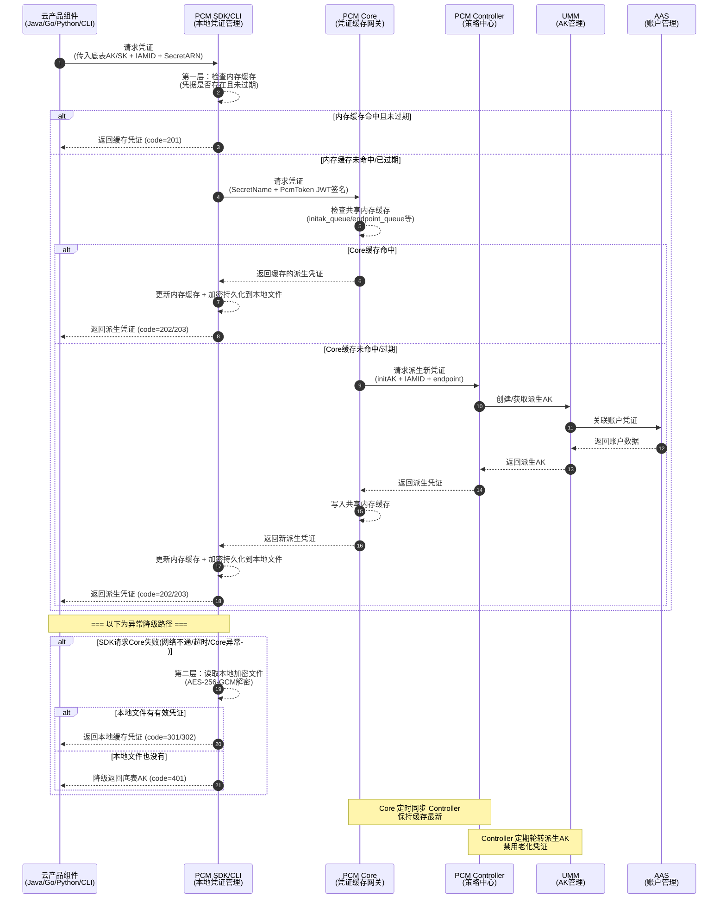

# 紧急场景止血与恢复手册

派生 AK 队列会持续轮转（定期创建新 AK、禁用老 AK），但在以下情况下会暂停轮转，以保护正在使用中的凭证：

*   **保护一：产品最新派生 AK 保护**
    当要禁用队列里最早的那把 AK 时，系统会检查这把 AK 是否是某个产品获取的最新派生 AK。如果产品 A 拿到这把 AK 后就没再获取过新 AK，那这把就是产品 A 的"最新"，队列就会停止轮转，保持当前状态。直到后续其他产品都获取了更新的派生 AK，队列才会继续轮转。这样保证不会因为轮转把某个产品正在用的 AK 给禁掉。
*   **保护二：平台 AK 访问日志不可行（当前状态）**
    当不可行时，PCM 无法确认即将禁用的派生 AK 是否仍有产品在调用，将在第一把队列即将禁用时停止轮转。
*   **保护三：平台 AK 访问日志保护（日志可信时）**
    平台 AK 访问日志用于检查底表 AK 和派生 AK 是否在网关中有调用记录。在准备禁用某把派生 AK 前，系统会检查平台 AK 访问日志，确认这把 AK 当前是否还在被使用。如果日志显示还有产品在用这把 AK，也会停止轮转。

## 热升级兼容策略

*   **新部署项目**：根据 `restrict` 取值禁用原始通用能力，应用使用凭证进入定时轮换状态。
*   **热升级项目**：原始凭证**不禁用**其通用能力，进入定时轮换状态；如需禁用老凭证，通过观测日志在运维控制台灰度进行。
*   **非 PCM 托管凭证**：一切照旧；若使用了 PCM SDK/CLI 但未被托管，将入参 initAK 返回让应用接着使用。

## 调用时序图



## 各组件内部安全特性（容错与降级）

### PCM SDK / CLI — 凭证获取端

**安全特性**：

| 特性 | 说明 |
| --- | --- |
| **容错降级** | PCM 初始化服务异常或报错时，将入参作为凭证返回；如果有缓存，将返回最近一次从服务端获取的凭证 |

### PCM Core — 缓存中间网关

**安全特性**：

| 特性 | 说明 |
| --- | --- |
| **降级保护** | Core 宕机后，末期过期老凭证行为暂停，SDK 返回上次获得的老凭证（未在窗口期末尾），依然可以使用 |

### PCM Controller — 策略中心

**安全特性**：

| 特性 | 说明 |
| --- | --- |
| **松→紧变更不自动生效** | 模式从松到紧变更时不自动生效，需 ASO 页面提示人工处理，防止误操作 |
| **灰度禁用** | 支持热升级后以运维变更方式逐步禁用老凭证，而非一刀切 |

## 高可用与容错逻辑

| 场景 | SDK 行为 | 业务影响 |
| --- | --- | --- |
| 新部署时 PCM Core 还未 ready | 将入参作为返回 | 无影响（Core 未禁用老 AK） |
| 运行时 PCM Core 挂了 | 返回上次获取的老凭证（未在窗口期末尾） | 无影响 |
| 产品独立升级，PCM 未 ready | 将入参作为返回 | 无影响 |
| PCM 和应用都挂了需重拉（SDK 缓存未丢失） | 返回上次获取的老凭证 | 无影响 |
| PCM 和应用都挂了需重拉（SDK 缓存丢失） | **需先恢复 PCM 或使用老凭证应急脚本** | **业务中断** |

## 应急处置与恢复操作

### 应急处置预案

详细预案请参考：[《PCM应急处置》](https://alidocs.dingtalk.com/i/nodes/MNDoBb60VLYDGNPytBomBqkPJlemrZQ3)

### 应急操作：手动创建派生 AK

**适用场景**：当某个应用需要使用临时 AK 登录，或者使用的 initAK 被禁用时，可以创建临时 AK 使用。

**操作步骤**：

1.  **进入创建页面**：进入派生 AK 管理标签页，点击“创建临时AK”按钮。
    
2.  **填写申请信息**：输入申请者、initAKID、有效天数、申请派生 AK 原因等相关信息创建临时 AK。
    
    
    **注意事项**：
    *   `initAKID` 是托管到 PCM 的基线或底表 AK（要与所使用账号的原始 AK 对应）。
    *   申请者 ID 即为 IAMID，是服务的身份标识（常规为 `集群 + : + sr` 拼接而成，如：`StandardCloudCluster-A-20250906-00bf:PcmController`。如果系统中提示已经存在，可以在后面拼接任意字符串）。
    *   AK 类型默认使用“临时”类型。
    *   有效天数范围限制在 1~365 天。
    *   申请者类型分为：`ApsaraStackProduct`、`Other`。
    *   `CloudID`、`ProductName`、`ClusterName`、`ServiceName` 分别为使用该 AK 的应用归属的 CloudID、产品名称、集群名称、Service 名称（虽然不是必填，但请尽量准确填写，以便于更准确地判断该临时 AK 使用方）。
    
    *填写示例*：
    

3.  **复制并保存 AK/SK**：创建成功后，复制 AK、SK 保存使用。
    
    
    **注意**：该 AK 对应的 SK 明文**只会在创建成功后弹窗内展示**，关闭弹窗后系统内不再显示。创建成功后请立即复制保存，如果不慎关闭弹窗，则需要重新创建临时 AK，系统不对外提供 SK 明文信息能力。
    
    *返回示例*：
    ```json
    {
      "accessKeyId": "ZbuIneIC04TElIFW",
      "accessKeySecret": "cnyDzeHzmZWTGcs7ZLbZEHzagQj9jn"
    }
    ```
    `accessKeyId` 对应 AK，`accessKeySecret` 对应 SK。

### 底表 AK 应急恢复

1.  **查询底表 AK 禁用状态**：可在系统中查询底表 AK 的当前状态。
2.  **启用底表 AK**：对于被禁用的底表 AK，执行启用操作。
    

**注意**：系统未提供白屏底表 AK 禁用能力，底表 AK 禁用操作请详见相关变更文档。