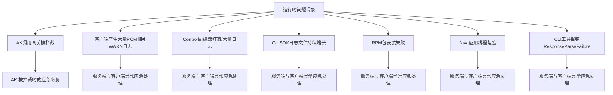
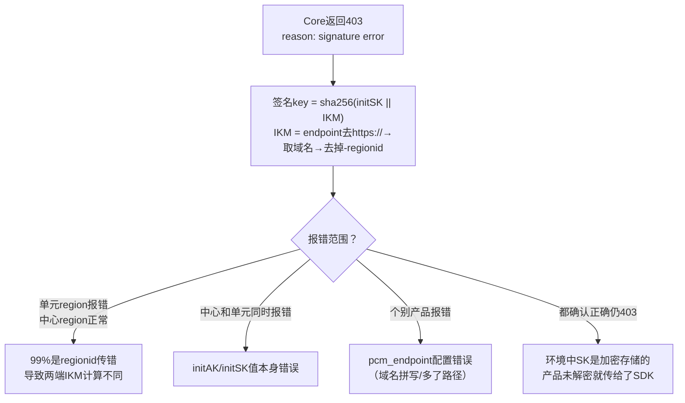

# 紧急场景止血与恢复手册

- **宕机保护**：PCM Core 宕机后，末期过期老凭证的禁用行为将暂停。SDK 会返回上次获得的老凭证（未在窗口期末尾），业务依然可以正常使用该凭证。
- **压力缓解**：Core 作为中间缓存网关，避免所有 SDK 请求直接打到 Controller，防止策略大脑被击穿导致全局故障。

## 应急排查总览

当运行时出现异常，可参考以下排查路径快速定位问题场景：



## 灾难场景应急操作与恢复指南

### 应急操作基本原则
应急操作优先建议控制台白屏操作，当白屏无法访问时，采用在容器中执行脚本（调用服务接口），当容器无法访问时，直接在数据库中执行 SQL。
**优先级：控制台白屏 > 调用接口（容器脚本） > 数据库执行 SQL**

### 关键风险与注意事项
- **底表禁用后的可用性联动风险**：底表 AK 被 PCM 禁用后，产品的凭据供给将完全依赖 PCM 链路（Core + Controller）。对于本地有缓存的运行中服务暂时无影响；但若此时 PCM 不可用且服务发生重启，将导致底表已禁、派生获取失败、本地无缓存，最终拿不到任何有效凭据，造成业务直接中断。在禁用底表 AK 前务必确保 PCM 链路高可用。
- **半轮转模式首次获取失败风险**：部分产品采用半自动轮转模式（仅在启动时获取一次派生 AK，后续不再主动刷新）。如果该唯一一次获取请求恰好失败（如 Core 限流、网络抖动、服务未就绪），产品将持续使用底表 AK 或无有效凭据运行，且不会自动恢复。
- **Core 限流误伤风险**：PCM Core 的限流策略基于客户端 IP。当同一台机器上运行多个产品组件时，一个高频产品的请求可能耗尽该 IP 的限流配额，导致同 IP 下其他产品被连带返回 502 错误。
- **链路延迟对时间敏感业务的影响**：接入 PCM 后可能导致部分时间敏感服务延迟加大，且网络可能出现延迟。
- **无服务端时 SDK 频繁调用产生大量日志**：当环境中 PCM 服务（Core）未部署或不可达时，SDK 无法生成缓存，仍然会按配置的间隔持续尝试连接，每次失败产生 WARN 级别日志，可能触发客户端告警。
- **部分 SDK 未打印关键日志导致排查困难**：Java WARN 日志过多，部分产品屏蔽了报错日志，导致无请求 PCM 的 RequestId 等关键信息，增加排查难度。
- **存量旧版本已知问题风险**：环境中可能存在未升级的旧版本 SDK/CLI，存在以下风险：

| 问题 | 修复版本 | 风险 |
| --- | --- | --- |
| CLI 服务端返回异常不降级（ResponseParseFailure） | **2025-12-23更新** | CLI 直接不可用 |
| Java SDK 线程阻塞（/dev/random 熵值问题） | credprovider.plugin >= 1.0.8 | 应用线程卡死 |
| Go SDK 日志文件不轮转 | SDK >= 2512版本 | 磁盘打满 |

### 常见故障场景与自动恢复
在以下常见故障场景中，系统可通过自动降级实现止血，业务无感知或无影响：

| 故障场景 | SDK 自动止血行为 | 业务影响 |
| --- | --- | --- |
| 新部署时 PCM Core 还未 ready | 将入参（底表 AK）作为返回 | 无影响（Core 未禁用老 AK） |
| 运行时 PCM Core 挂了 | 返回上次获取的老凭证（未在窗口期末尾） | 无影响 |
| 产品独立升级，PCM 未 ready | 将入参作为返回 | 无影响 |
| PCM 和应用都挂了需重拉（SDK 缓存未丢失） | 返回上次获取的老凭证 | 无影响 |
| 客户端产生大量 PCM 相关 WARN 日志（如 `Failed to refresh credential`） | SDK 降级返回原始凭证，不影响业务调用 | 无影响（可能触发客户端告警监控；无服务端时 SDK 会持续尝试连接产生日志） |

### AK 被拦截时的应急恢复
当产品调用网关报错 AK 被禁用/无效/不存在时，需首先从网关日志提取 AK ID，并判断是底表 AK 还是派生 AK，然后采取对应恢复措施。

**AK 类型判定方法**：
- **底表 AK**：直接通过 PCM 控制台查询。
- **派生 AK**：控制台仅可查询每个队列最近 14 把派生 AK。若控制台查不到，可通过数据库查询：
  - 连接 `certificate-lifecycle-manager-server` 服务的 `clm_db` 实例，切换到 `pcm_db` 数据库（`use pcm_db;`）。
  - 执行查询：`select * from ak_info where access_key_id='被拦截的AK_ID';`

#### 底表 AK 被拦截
- **核心判断**：产品在使用底表 AK，说明 SDK 未成功获取派生 AK 走了降级逻辑，或未适配使用底表 AK。
- **应急恢复**：
  1. **先恢复**：在 PCM 控制台**启用该底表 AK**，立即恢复业务。
  2. **后排查**：查 SDK 日志 code，确认是哪种降级场景（参见下方“Core 错误码快速定位”），排查 SDK 未拿到派生 AK 的原因。

#### 派生 AK 被拦截
- **核心判断**：产品已在使用派生 AK，但该 AK 已被轮转禁用，产品未及时更新到最新派生 AK（最可能原因为仅获取一次，未持续轮转）。
- **应急恢复**：
  1. **重启服务**：通常重启服务会刷新 AK 使其可用，然后停止该队列的轮转。
  2. **手动启用**：若无法重启服务，需在控制台或数据库中手动启用该派生 AK。

### 服务端与客户端异常应急处理

#### PCM Controller 磁盘打满 / 产生大量日志
- **现象**：Controller 日志目录 `/home/admin/pcm_controller/logs/api/logs/` 下出现超大文件，导致磁盘空间不足。
- **应急操作**：
  1. 确认磁盘使用情况：`df -h`
  2. 查看日志目录大小：`du -sh /home/admin/pcm_controller/logs/api/logs/`
  3. **清理历史日志文件**（保留最近日志）以释放空间。
  4. 后续排查产生大量日志的原因（是否有大量异常请求持续打到 Controller、是否有定时任务异常导致循环报错）并确认日志轮转配置是否正常。
  - *EOCC 参考*：https://eocc.aliyun-inc.com/kbscene/emergencyDetail/EC9EE9AE20?Jump=2

#### Go SDK 日志文件持续增长
- **现象**：Go SDK 产生的日志文件不断增大，未按预期轮转。
- **原因**：Go SDK 在 2512 之前版本存在日志轮转 Bug。
- **应急操作**：
  - **临时处理**：使用 `> logfile` 命令截断日志文件释放空间。**注意：不要使用 `rm` 删除正在写入的文件**。
  - **彻底解决**：升级 Go SDK 至 2512 及以上版本。

#### Java 应用线程阻塞
- **现象**：线程 dump 中出现阻塞堆栈：
  ```plaintext
  java.lang.Thread.State: BLOCKED (on object monitor)
    at sun.security.provider.NativePRNG$RandomIO.implNextBytes(NativePRNG.java:543)
    at ...PcmSecretCredentialManager.persistCredentials(...)
  ```
- **原因**：SDK 默认使用 `/dev/random` 阻塞模式获取随机数，系统熵值低（< 100）时线程被卡住。
- **应急操作**：
  - **临时规避**：在 JVM 启动参数中添加 `-Djava.security.egd=file:/dev/./urandom`。
  - **彻底解决**：升级 SDK 至 `credprovider.plugin >= 1.0.8` 版本。

#### 客户端产生大量 PCM 相关 WARN 日志
- **现象**：产品日志中大量出现 `Failed to refresh credential, pcm server is xxx`。
- **关键判断**：这类 WARN 日志**不影响业务**（SDK 已降级返回原始凭证），主要影响是客户端告警监控被触发。
- **应急操作**：若确认环境中无 PCM 服务端，可暂时忽略或调整日志级别；若应有服务端，需排查 PCM Core 连通性。

#### Python SDK RPM 包安装失败
- **现象**：安装 `pcm-python2-sdk-rpm-with-no-six` 报错，关键字包含 `pytz/zoneinfo`、`cpio: File from package already exists as a directory`。
- **原因**：系统已有 `/home/tops/lib/python2.7/site-packages/pytz/` 目录，与 RPM 包冲突。
- **应急操作**：
  ```bash
  mv /home/tops/lib/python2.7/site-packages/pytz /home/tops/lib/python2.7/site-packages/pytz_bak
  sudo yum install pcm-python2-sdk-rpm-with-no-six -y
  ```

#### CLI 工具报错 ResponseParseFailure
- **现象**：CLI 工具返回 `{"code": "ResponseParseFailure", "data": "", "message": "xxxxxxx"}`。
- **原因**：`pcm_endpoint` 地址配置错误，该地址响应 200 但格式非预期，CLI 解析失败且旧版本未走降级。
- **应急操作**：确认 CLI 的 `pcm_endpoint` 指向正确的 PCM Core 地址，手动 `curl` 确认返回格式。升级 CLI 至最新版本（已优化解析异常的降级处理）。

#### 时间敏感服务超时与延迟
- **现象**：接入 PCM 后，时间敏感服务出现延迟加大或超时。
- **应急操作**：通过设置环境变量 `PCM_TASK_DELAY` 调整访问 PCM 的最大超时时间（单位：ms）。默认 1000ms（即 1s），可根据业务需求调整（需使用 `1.13-SNAPSHOT` 20250908 及以上版本 SDK）。

### initAK 被禁用时的应急恢复（手动创建临时派生AK）
当某个应用需要使用临时 AK 登录或者使用的 initAK 被禁用时，可通过控制台手动创建临时派生 AK 进行应急恢复。

1. 进入**派生AK管理**标签页，点击**创建临时AK**按钮。
2. 输入申请者、initAKID、有效天数、申请派生 AK 原因等相关信息创建临时 AK。
   - **initAKID**：托管到 PCM 的基线或底表 AK（要与所使用账号的原始 AK 对应）。
   - **申请者ID（IAMID）**：服务的身份标识，常规为 `集群 + : + sr` 拼接而成（如 `StandardCloudCluster-A-20250906-00bf:PcmController`）。若系统提示已存在，可在后面拼接任意字符串。
   - **AK类型**：默认使用临时类型。
   - **有效天数**：范围限制在 1~365 天。
   - **申请者类型**：分为 `ApsaraStackProduct`、`Other`。
   - **归属信息**：CloudID、ProductName、ClusterName、ServiceName 分别为使用该 AK 的应用归属信息（非必填，但建议准确填写以便判断使用方）。
3. 复制 AK、SK 保存使用。
   - **注意**：该 AK 对应的 SK 明文只会在创建成功后弹窗内展示，关闭弹窗后系统内不再显示。创建成功后请立即复制保存，若不慎关闭弹窗则需重新创建，系统不对外提供 SK 明文信息查询能力。

## 网关拦截日志排查与定位
当遇到访问报错，怀疑是 PCM 禁用 AK 导致时，优先通过拦截日志进行判定。提取日志中的请求 AK，并通过 PCM 服务查询 AK 状态。如果确认已被禁用，则采用应急处置方案进行处置，并反馈研发侧排查原因。

以下是常见网关 AK 被禁用时的拦截日志特征及示例：

### OSS 拦截
- **特征**：
  - `"error_code": "InvalidAccessKeyId"`
  - `"status": "403"`
- **日志示例**：
  ```json
  {"__tag__:__hostname__": "c25g07018.cloud.g07.amtest17", "__tag__:__pack_id__": "B06A0AF67C8DC2DB-1EF", "__tag__:__path__": "/apsara/module_logs/oss_tengine/access_log.2026042415", "__topic__": "", "acc_src_oms_region": "-", "access_id": "5hN1RkUhRn43iNfw", "bucket_enable": "-", "bucket_storage_type": "standard", "bucket_version": "1774332774", "bucketname": "cn-wulan-env17e-d01-as-console-cdn", "content_length_in": "-", "content_length_out": "476", "delta": "-", "error_code": "InvalidAccessKeyId", "host": "cn-wulan-env17e-d01-as-console-cdn.oss-cn-wulan-env17e-d01-a.intra.env17e.shuguang.com", "http_referer": "-", "in_length": "335", "ip": "10.17.46.36", "length": "476", "method": "GET", "objectname": "-", "objectsize": "-", "operation": "GetBucketAcl", "oss_acc_linetype": "-", "oss_data_location": "-", "oss_location": "oss-cn-wulan-env17e-d01-a", "oss_request_type": "-", "owner": "999999999", "process_type": "-", "ref_url": "aliyun-sdk-java/3.8.0(Linux/4.19.91-007.ali4000.alios7.x86_64/amd64;1.8.0_172)", "remote_port": "58066", "remote_user": "-", "request_id": "69EB1A0A3E6DA93539F3A4CE", "request_payer_account": "-", "requester": "-", "response_time": "0", "scheme": "http", "select_real_ip": "-", "sign_type": "-", "status": "403", "sync_direction": "-", "sync_source_bucket": "-", "sync_transfer_type": "-", "target_object_storage_class": "-", "time": "24/Apr/2026:15:21:46", "turn_around_time": "0", "url": "/?acl", "vpcaddr": "978325770", "vpcid": "0"}
  ```

### SLS_INNER 拦截
- **特征**：
  - `"Status": "401"`
- **日志示例**：
  ```json
  {"APIVersion": "0.6.0", "AccessKeyId": "cmchJQg057pBelHD", "Acl": "0", "AliUid": "", "CallerType": "Parent", "ClientIP": "10.17.160.103", "ConsumerGroup": "suspicous_group", "ExOutFlow": "0", "InFlow": "0", "Latency": "292", "Lines": "0", "LogStore": "big_data_event", "Method": "GetConsumerGroupCheckPoint", "NetFlow": "0", "OutFlow": "88", "ProjectId": "136", "ProjectName": "k8sblink", "RequestId": "69EB0C444B76F491098A2F35", "Source": "10.17.160.103", "Status": "401", "TunnelId": "0", "UserAgent": "aliyun-log-sdk-java-0.6.64/1.8.0_412", "UserId": "-2", "__THREAD__": "2418", "__tag__:__hostname__": "c25h05123.cloud.h06.amtest17", "__tag__:__pack_id__": "8ADDDFFBE647F7C-5", "__tag__:__path__": "/apsara/fcgi_agent/ols_operation_2.LOG", "__topic__": "", "microtime": "1777011780130296"}
  ```

### SLS_PUB 拦截
- **特征**：
  - `"Status": "401"`
  - `"ErrorCode": "Unauthorized"`
  - `"ErrorMsg": "AccessKeyId is disabled: {AK_ID}"`
- **日志示例**：
  ```json
  {"__THREAD__": "80679", "Method": "ListShards", "Status": "401", "ClientIP": "10.17.31.30", "Latency": "70", "TunnelId": "", "NetFlow": "0", "UserId": "-2", "AliUid": "", "Acl": "0", "AccessKeyId": "Khz7a1kmKMZDCBXj", "Owner": "1000000004", "CallerType": "Parent", "ProjectName": "ali-cdsslshybridcluster-a-20260323-015f-sls-admin", "ProjectId": "2", "UserAgent": "aliyun-log-sdk-java-0.6.64/1.8.0_352", "APIVersion": "0.6.0", "RequestId": "69D6169B34510383396636E7", "Source": "10.17.31.30", "OutFlow": "87", "ExOutFlow": "0", "NetworkType": "intranet", "InFlow": "0", "LogStore": "sls_operation_agg_log", "RequestType": "unknown", "ErrorCode": "Unauthorized", "ErrorMsg": "AccessKeyId is disabled: Khz7a1kmKMZDCBXj", "microtime": "1775638171568514", "__topic__": "", "__tag__:__hostname__": "c25g09017.cloud.g09.amtest17", "__tag__:__path__": "/apsara/sls/fcgi_agent/ols_operation.LOG", "__tag__:__pack_id__": "6C68CE91F5F727CA-12A"}
  ```

### ASAPI 拦截
- **特征**：
  - `"errorCode": "asapi.server.request.parameter.accesskeyid.error"`
  - `"errorMessage": "The specified AccessKey ID ({AK_ID}) is invalid. Details: (The Access Key is disabled.)."`
- **日志示例**：
  ```json
  {
    "EagleeyeRpcId": "0.1.1",
    "EagleeyeTraceId": "0a11243f17770122001463084d0062",
    "LocalIp": "10.17.36.63",
    "__tag__:__hostname__": "vm010017036063",
    "__tag__:__pack_id__": "890EE1DC2FE689D1-774",
    "__tag__:__path__": "/apsara/cloud/data/asapi/ApiServer#/api-server/logs/asapi-..."
  }
  ```

## 应急排查辅助：Core 错误码与限流定位

当排查过程中从 SDK 报错信息中拿到了具体错误码，可按以下表格辅助定位并恢复：

### HTTP 400 — 请求参数错误

| 返回 Msg | 报错原因 | 排查方向 |
| --- | --- | --- |
| `SecretName or x_acs_bearer_token is nil` | SecretName 或 token 为空 | SDK 侧 initakid 和 pcm_endpoint 是否正确 |
| `SecretName parse fail, SecretName:xxxx` | SecretName 格式错误 | appName 是否正确以 `:` 分隔 |
| `The access key (AK) is not administered by the PCM service, AK:xxxx` | akid 非底表 AK | initakid 是否填写正确的底表 akid |
| `genJwtKey fail` | 计算 token_key 失败 | Core 内部问题，与 SDK 无关 |
| `Error in AK rotation led to unsuccessful request to the controller...` | 请求 Controller 派生失败 | 1. 派生 AK 容量达上限<br>2. IAMID 非法且关闭了非标开关 |

### HTTP 403 — 认证失败

| 返回 Msg | 报错原因 | 排查方向 |
| --- | --- | --- |
| `reason: signature error` | 签名验证失败 | 见下方 signature error 排查 |
| `reason: "nbf" claim not valid until` | 时钟不同步 | 检查 SDK 所在机器 NTP 同步状态（新版本已增加 5 分钟容错） |
| `token_arn not same with arn...` | ARN 不一致 | SDK 内部问题，基本不出现 |

#### signature error 排查指南



- **SK 加密未解密导致 403**：部分环境中底表 SK 是加密存储的。产品未解密就传给 SDK → 签名 key 两端不一致 → 必然 403。需确认产品侧调用 SDK 前已解密 SK。

### HTTP 502 — 限流触发

- **现象**：Core 返回 502，大概率触发限流。
- **排查与恢复**：
  1. 检查 access.log 中 `limit_req_status` 字段。
  2. 使用 `tsar -l -i 1 --nginx` 查看 QPS。
  3. 调整限流配置：`/services/platform-credential-management/user/pcm_conf/pcm_core.json`。
  4. 阈值参考（单核）：x86=200r/s, aarch64=189r/s, sw64=80r/s。