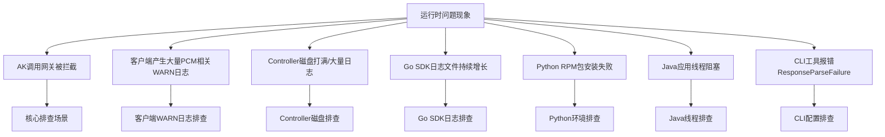

# 运维指导-运维手册

- **所属产品**：`baseServiceAll`
- **部署集群**：`StandardCloudCluster-A-xx`
- **所属 Service**：`platform-credential-management`
- **核心组件**：`PCM Core`、`PCM Controller`

## 数据库与常用表

### UMMAK 数据库
- **服务与实例信息**：
  - service：`baseService-umm-ak`
  - db实例：`ummak`
  - 数据库：`ummak`
- **常用表**：
  - `accesskey_table`：存储 AK 的基础信息与状态（包括 `access_id`、`access_key`、`user_id`、`enabled_flag`、`hidden_flag`、`deleted_flag` 等字段）。

### PCM 数据库
- **服务与实例信息**：
  - service：`certificate-lifecycle-manager-server`
  - db实例：`clm_db`
  - 数据库：`pcm_db`
- **常用表**：
  - `init_ak_info`：存储 PCM 托管的底表 AK 信息（如 `umm_ak_status` 状态字段）。
  - `ak_info`：存储派生 AK 信息（如 `access_key_id` 等），用于查询派生 AK 是否存在及状态。

## 控制台操作指南

### 控制台入口
- **访问路径**：ASO -> 安全管理 -> 账户安全 -> 平台凭据管理 PCM

### 底表 AK 管理
- **支持操作**：查询底表 AK 禁用状态、启用底表 AK。
- **限制说明**：未提供白屏底表 AK 禁用能力，底表 AK 禁用请详见相关变更文档。

### 派生 AK 管理

#### 派生 AK 状态查询
- 支持在控制台查询派生 AK 的当前状态及轮转情况。

#### 手动创建临时派生 AK
- **适用场景**：当某个应用需要使用临时 AK 登录，或者使用的 initAK 被禁用时，可创建临时 AK 使用。
- **操作步骤**：
  1. 进入“派生 AK 管理”标签页，点击“创建临时 AK”按钮。
  2. 输入相关信息创建临时 AK：
     - **申请者 ID (IAM ID)**：服务的身份标识，常规为 `集群 + : + sr` 拼接而成（如 `StandardCloudCluster-A-20250906-00bf:PcmController`）。若系统提示已存在，可在后面拼接任意字符串。
     - **initAKID**：托管到 PCM 的基线或底表 AK（需与所使用账号的原始 AK 对应）。
     - **AK 类型**：默认使用“临时”类型。
     - **有效天数**：范围限制在 1~365 天。
     - **申请者类型**：分为 `ApsaraStackProduct`、`Other`。
     - **归属信息**：CloudID、ProductName、ClusterName、ServiceName（非必填，但准确填写有助于判断临时 AK 使用方）。
  3. 创建成功后，立即复制 AK 和 SK 保存使用。
     - **注意**：SK 明文仅在创建成功后的弹窗内展示，关闭弹窗后系统不再显示。若不慎关闭，需重新创建，系统不对外提供 SK 明文信息查询能力。

### AK 申请详情查询
- **适用场景**：用于查看派生 AK 申请记录。
- **状态说明**：
  - **认证状态失败**：仅表示 IAM ID 不规范，不会对申请结果有任何影响。
  - **轮转状态已停止**：可能原因包括：
    1. IAM ID 中包含 `CLOSE_AUTO_ROTATE` 状态，表示该队列默认不轮转。
    2. 使用该队列的产品未及时更新（参考 平台凭证管理服务（PCM）介绍）。
    3. 使用该队列的产品中，有产品仍在使用第 7 把 AK。

## 关键日志路径与排查策略

### PCM Controller 日志
- **组件**：PCM Controller
- **日志路径**：`/home/admin/pcm_controller/logs/api/logs/`
- **内容与轮转策略**：记录 Controller 的 API 请求与处理日志。需确认日志轮转配置是否正常，若未正常轮转或存在大量异常请求/定时任务循环报错，会导致日志文件超大并打满磁盘。

### PCM Core 日志
- **组件**：PCM Core (Nginx/Tengine)
- **部署说明**：PCM 部署在两个 Docker 容器上，日志排查时需**同时查询两个 Docker**。
- **日志路径**：
  - Error 日志：`/opt/tengine/logs/error.{date}.log`
  - Access 日志：`/opt/tengine/logs/access.{date}.log`
- **排查方法与命令**：
  - **排查 Error 日志（确定是否 PCM Core 报错返回）**：
    - 有具体 Request ID：
      ```bash
      grep -rn "{requestid}" /opt/tengine/logs/error.{date}.log
      ```
    - 无具体 Request ID（根据 AK ID、IAM ID 和时间段复合筛选）：
      ```bash
      grep "{akid}" /opt/tengine/logs/error.{date}.log | grep "{iamid}" | awk '$1 >= "{start_time}" && $2 <= "{end_time}"'
      ```
  - **排查 Access 日志（确定是否 PCM Core 接收到请求）**：
    - 有具体 Request ID：
      ```bash
      grep -rn "{requestid}" /opt/tengine/logs/access.{date}.log
      ```
    - 无具体 Request ID（根据 AK ID 和时间段复合筛选）：
      ```bash
      grep -E '"time_local": "{time_range}"' /opt/tengine/logs/access.{date}.log | grep "{akid}"
      ```
- **Access 日志参数说明**：

| 参数名称 | 参数含义 |
| --- | --- |
| remote_addr | 请求源地址 |
| Gateway-POP-Tunnel-ID | tunnel-id |
| X-Aliyun-Vpc-Id | vpc-id |
| remote_port | 请求端口 |
| time_local | 请求完成的时间 |
| request_uri | 请求的 URI，包含 IAM ID、SecretName、Endpoint 等信息 |
| request_method | 请求方法 |
| status | HTTP 返回码 |
| http_user_agent | 请求代理客户端信息 |
| request_time | Tengine 收到请求到发完响应的总耗时 |
| SecretName | SecretName，包含 initAKID 和 PCM Endpoint 信息 |
| IamId | 表示请求服务身份，对应 SDK 填写的 appName，当 HTTP 报错时可能为空 |
| x_acs_bearer_token | 请求发送 JWT |
| x_sdk_client | PCM SDK 版本 |
| limit_req_status | 限流状态，未限流显示 "PASSED"，限流显示 "-" |
| eagleeye_traceid | 即 Request ID，可根据此查询对应 error_log 是否有错误日志 |

### AK 申请与访问日志
- **AK 申请日志**：记录每个 IAM ID 申请派生 AK 的记录。通过 PCM Core 获取，PCM Core 中针对每个 IAM ID 的底表 SecretARN 缓存时间为 12 小时。对于一直在用派生 AK 的产品，理论上每 12 小时会有一条记录。
- **平台 AK 访问日志**：在网关侧记录使用底表 AK 的使用情况（当前不完整，可作为辅助查询手段）。

### SDK 日志
- **Go SDK**：2512 之前版本存在日志轮转 Bug，会导致日志文件持续增长未按预期轮转。
- **Java SDK**：WARN 级别日志较多，部分产品可能会屏蔽报错日志，导致缺少请求 PCM 的 RequestId 等关键信息。

## 问题排查与应急处置 SOP

### 应急操作优先级原则
应急操作优先建议控制台白屏操作，当白屏无法访问时，采用在容器中执行脚本（调用服务接口），当容器无法访问时，直接在数据库中执行 SQL。
**优先级：控制台白屏 > 调用接口（容器脚本） > 数据库执行 SQL**

### 场景一：启用某个已经禁用的 initAK
**适用场景**：确认因为某把 initAK 被禁用而影响业务。

1. **白屏操作**：通过 PCM 控制台的 initAK 管理功能查询特定 AK，并在操作中启用该 AK。
2. **调用接口（容器中执行脚本）**：当白屏不可用时，采用此方案。在 PcmController 容器中使用底表AK黑屏操作工具执行启用命令：
   ```bash
   python3 manage_ak_status.py enable --ak {akid}
   ```
3. **数据库操作**：当白屏、容器均不可用时，采用此方案。
   - 进入 UMMAK 数据库（`ummak`）。
   - 执行 SQL 启用 AK：
     ```sql
     UPDATE accesskey_table SET enabled_flag=1 WHERE access_id = '{akid}';
     ```

### 场景二：启用全量底表 AK
**适用场景**：环境内存在被底表 AK 禁用而影响业务，涉及多把底表 AK 或无法确认某把底表 AK，可采用启用全量底表 AK。
> **注意**：暂不支持通过白屏解禁全量 AK。

1. **调用接口（容器中执行脚本）**：在 PcmController 容器中使用底表AK黑屏操作工具执行全量启用命令：
   ```bash
   python3 manage_ak_status.py enable-all
   ```
2. **数据库操作**：当容器不可访问时，采用此方案。
   - **步骤 1：获取全量底表 AK**
     - 进入 PCM 数据库（`clm_db` 实例的 `pcm_db` 数据库）。
     - 检索已经禁用的 initAK：
       ```sql
       USE pcm_db;
       SELECT access_key_id FROM init_ak_info WHERE umm_ak_status = 0;
       ```
   - **步骤 2：启用全量底表 AK**
     - 进入 UMMAK 数据库（`ummak` 实例的 `ummak` 数据库）。
     - 执行 SQL（将 `access_id` 字段参数改成步骤一中检索到的底表 AK 信息）：
       ```sql
       UPDATE accesskey_table SET enabled_flag=1 WHERE access_id IN ('akid1', 'akid2', 'akid3');
       ```

### 场景三：启用派生 AK
**适用场景**：确认某把派生 AK 被禁用影响业务。
> **注意事项**：每个派生队列中通过白屏仅可以查询最近 14 把派生 AK，如果超过 14 把 AK 后，会在 UMMAK 侧执行删除操作，但 PCM 数据库会保留派生 AK 记录。当通过白屏未查询到该 AK，有可能是 14 天前派生的 AK，可通过 PCM 数据库进行查询。

1. **白屏操作**：白屏支持查询派生 AK，查询后可通过启用操作恢复。
2. **数据库操作**：
   - **查询派生 AK**：进入 PCM 数据库（`clm_db` 实例的 `pcm_db` 数据库）进行查询。
     ```sql
     USE pcm_db;
     ```
   - **在 UMMAK 中启用**：进入 UMMAK 数据库（`ummak`）。
     - 如果 AK 存在，直接更新启用状态：
       ```sql
       UPDATE accesskey_table SET enabled_flag=1, hidden_flag=0, deleted_flag=0 WHERE access_id='{akid}';
       ```
     - 如果 AK 已经删除，重新创建 AK（需替换 `access_id`、`access_key`、`user_id`）：
       ```sql
       INSERT INTO `ummak`.`accesskey_table` (`access_id`, `access_key`, `user_id`) VALUES ('{akid}', '{sk}', '{uid}');
       ```

### 场景四：容量告警场景（AK 数量超限）
**适用场景**：UMMAK 侧每个 UID 下最大 1000 把有效 AK，当达到 1000 把以后会出现派生失败的情况。

1. **查询排查**：
   - 检查特定 UID 下的 AK 数量：
     ```sql
     SELECT user_id, COUNT(access_id) AS access_count FROM accesskey_table WHERE user_id = '{uid}' GROUP BY user_id;
     ```
   - 查询是否有 UID 下的 AK 超过 1000 把：
     ```sql
     SELECT user_id, COUNT(access_id) AS access_count FROM accesskey_table GROUP BY user_id HAVING access_count >= 1000;
     ```
2. **清理操作**：
   - 分析出环境内已经无用的 AK，在 UMMAK 中置成删除状态：
     ```sql
     UPDATE accesskey_table SET enabled_flag = 0, deleted_flag = 1, modified_time = UNIX_TIMESTAMP() WHERE access_id IN ('{akid1}', '{akid2}');
     ```

- **参考文档**：[《PCM应急处置》](https://alidocs.dingtalk.com/i/nodes/MNDoBb60VLYDGNPytBomBqkPJlemrZQ3)

## 通用场景排查思路与常见问题

### 排查总览
以**问题现象**作为入口，引导排查思路：



### AK 调用网关被拦截
这是 PCM 接入后最核心的排查场景，产品调用网关时可能报 AK 被禁用/AK 无效/AK 不存在。首先需判断是否是 PCM 禁用 AK 导致。

**第一步：从网关日志中取出被拦截的 AK ID，在控制台查询是底表 AK 还是派生 AK。**
- **底表 AK 判定**：可以直接通过 PCM 控制台查询。
- **派生 AK 判定**：
  - 控制台仅可以查询每个队列最近 14 把派生 AK。
  - 数据库查询：进入 `clm_db` 实例的 `pcm_db` 数据库，执行 `select * from ak_info where access_key_id='****';` 检查是否存在。

#### 分支一：底表 AK 被拦截
**核心判断**：产品在使用底表 AK，说明 SDK 没有成功获取派生 AK，走了降级逻辑，或者使用底表 AK 未适配。排查方向是**为什么 SDK 没拿到派生 AK**。
1. **先恢复**：在 PCM 控制台启用该底表 AK，恢复业务。
2. **查 SDK 日志 code**：确认是哪种降级场景，参见下方“Core 错误码快速定位”。

#### 分支二：派生 AK 被拦截
**核心判断**：产品已经在使用派生 AK，但这把派生 AK 已被轮转禁用。排查方向是**为什么产品没有及时更新到最新的派生 AK**（最可能原因为：仅获取一次，未持续轮转）。
1. **恢复步骤**：通常重启服务会刷新 AK 导致可用，然后停止该队列的轮转。若无法重启服务，需手动启用 AK（参见应急处置 SOP）。
2. **排查步骤**：如果有 SDK 报错，参见下方“Core 错误码快速定位”。

#### 常见网关拦截日志特征及示例
当遇到访问报错，怀疑是 PCM 禁用 AK 导致的，优先通过拦截日志判定，提取日志中的请求 AK，并通过 PCM 服务查询 AK 状态。如果已经禁用，采用应急处置方案进行处置，并反馈研发侧排查原因。

##### OSS 拦截
- **特征**：`"error_code": "InvalidAccessKeyId"`，`"status": "403"`
- **日志示例**：
  ```json
  {"__tag__:__hostname__": "c25g07018.cloud.g07.amtest17", "__tag__:__pack_id__": "B06A0AF67C8DC2DB-1EF", "__tag__:__path__": "/apsara/module_logs/oss_tengine/access_log.2026042415", "__topic__": "", "acc_src_oms_region": "-", "access_id": "5hN1RkUhRn43iNfw", "bucket_enable": "-", "bucket_storage_type": "standard", "bucket_version": "1774332774", "bucketname": "cn-wulan-env17e-d01-as-console-cdn", "content_length_in": "-", "content_length_out": "476", "delta": "-", "error_code": "InvalidAccessKeyId", "host": "cn-wulan-env17e-d01-as-console-cdn.oss-cn-wulan-env17e-d01-a.intra.env17e.shuguang.com", "http_referer": "-", "in_length": "335", "ip": "10.17.46.36", "length": "476", "method": "GET", "objectname": "-", "objectsize": "-", "operation": "GetBucketAcl", "oss_acc_linetype": "-", "oss_data_location": "-", "oss_location": "oss-cn-wulan-env17e-d01-a", "oss_request_type": "-", "owner": "999999999", "process_type": "-", "ref_url": "aliyun-sdk-java/3.8.0(Linux/4.19.91-007.ali4000.alios7.x86_64/amd64;1.8.0_172)", "remote_port": "58066", "remote_user": "-", "request_id": "69EB1A0A3E6DA93539F3A4CE", "request_payer_account": "-", "requester": "-", "response_time": "0", "scheme": "http", "select_real_ip": "-", "sign_type": "-", "status": "403", "sync_direction": "-", "sync_source_bucket": "-", "sync_transfer_type": "-", "target_object_storage_class": "-", "time": "24/Apr/2026:15:21:46", "turn_around_time": "0", "url": "/?acl", "vpcaddr": "978325770", "vpcid": "0"}
  ```

##### SLS_INNER 拦截
- **日志示例**：
  ```json
  {"APIVersion": "0.6.0", "AccessKeyId": "cmchJQg057pBelHD", "Acl": "0", "AliUid": "", "CallerType": "Parent", "ClientIP": "10.17.160.103", "ConsumerGroup": "suspicous_group", "ExOutFlow": "0", "InFlow": "0", "Latency": "292", "Lines": "0", "LogStore": "big_data_event", "Method": "GetConsumerGroupCheckPoint", "NetFlow": "0", "OutFlow": "88", "ProjectId": "136", "ProjectName": "k8sblink", "RequestId": "69EB0C444B76F491098A2F35", "Source": "10.17.160.103", "Status": "401", "TunnelId": "0", "UserAgent": "aliyun-log-sdk-java-0.6.64/1.8.0_412", "UserId": "-2", "__THREAD__": "2418", "__tag__:__hostname__": "c25h05123.cloud.h06.amtest17", "__tag__:__pack_id__": "8ADDDFFBE647F7C-5", "__tag__:__path__": "/apsara/fcgi_agent/ols_operation_2.LOG", "__topic__": "", "microtime": "1777011780130296"}
  ```

- **参考文档**：[《PCM排查思路&常见问题》](https://alidocs.dingtalk.com/i/nodes/m9bN7RYPWdyrPBREckdQ5joEVZd1wyK0)